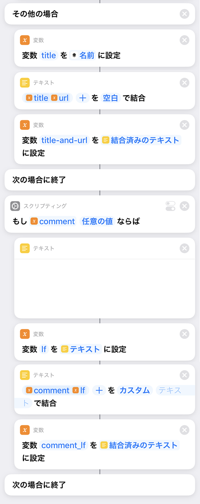
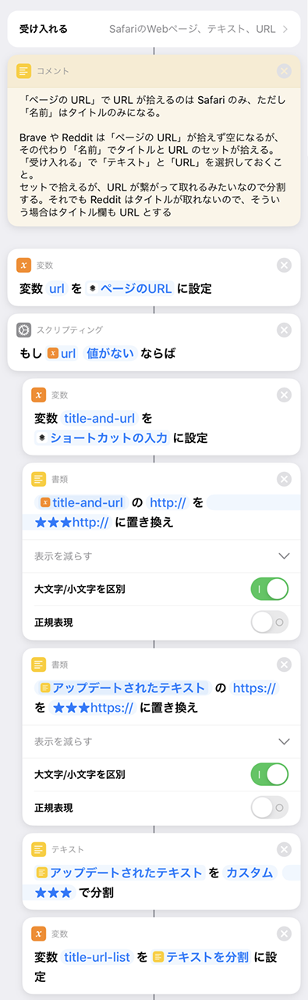

自分が見たウェブページの情報を各種 SNS に同時に一括投稿する、マルチポストを行う _iOS ショートカット_を作ってみた。

## 目次

## 経緯

Twitter をやっていた頃は Twitter アプリに「共有」メニューから流したり、Mastodon なら「Tootle for Mastodon」というアプリを「共有」メニューから呼んだりすれば、見ているページを投稿できた。

最近自分は、

- オレオレマイクロブログ
- Mastodon
- Misskey

の3つを使っていて、1回の操作でこれらにマルチポストしたくなり、iOS ショートカットを作ることにした。

- オレオレマイクロブログへの投稿処理は以下でも説明したことがある。
  - [iOS の「ショートカット」アプリが最強！自作 Web アプリとの通信に使ってみた](/blog/2020/03/04-02.html)
- Mastodon への投稿方法も以前解説済み。
  - [Mastodon API を使って iOS ショートカットからトゥートできるようにしてみる](/blog/2020/04/10-02.html)

というワケで今回はコレの発展型。

## アプリごとに異なる「受け入れる」機能の挙動

iPhone のデフォルトブラウザは Safari だが、自分は普段 Brave ブラウザを使っている。他にも、「Reddit」アプリで見ているページを投稿したいなーと思うことがあったりする。

Safari ブラウザの「共有」メニューから iOS ショートカットを呼んだ時、見ているページの情報を渡すには、_「受け入れる」設定_の中から以下を有効にすれば良い。

- ページのタイトルを拾いたい → 「Safari の Web ページ」→_「ページの URL」_
  - 
- ページの URL を拾いたい → 「Safari の Web ページ」→_「名前」_
  - 

しかし、Brave や Reddit など Safari 以外のアプリから「共有」メニューを呼ぶと、上のとおりだと上手くページのタイトルや URL が拾えない。

しかし、「受け入れる」設定の中で「Safari の Web ページ」とともに**「テキスト」と「URL」**にチェックを入れておくと、

- `ページタイトルURL` (間に何のスペースも入っていない)

という形でテキストを取得できるようになる。この時は「Safari の Web ページ : _デフォルト_」=「ショートカットの入力」でセットの内容が取得できる。


…少々説明が難しいのだが、要するに_「共有」メニューを呼び出すアプリによって、iOS ショートカットのインプットに投げ込んでくれる情報が異なる_ので、**どのアプリから呼んでも同じような結果になるようにするには、iOS ショートカット側で条件分岐が必要**になるワケである。

## 作ったショートカットはこんな感じ

妙な挙動を調べてみた結果、次のようなショートカットを作った。スクショが縦に長くなるので、適度に分割して説明を入れながら書いていく。


↑ まず「受け入れる」を設定。

「尋ねる」スクリプティングで任意コメントをくっつけるようにしている。任意コメントを書かなければ

```
ページタイトル URL
```

のみを投稿し、任意コメントを書けば

```
任意コメント
ページタイトル URL
```

という風に投稿するようにする。冒頭ではひとまず入力結果を変数 _`comment`_ に入れておくだけ。

妙な挙動を「コメント」で記しておいた。「コメント」は何の処理にも影響しないので、好きな場所に自由に書ける。


↑ 「受け入れる」の設定。下3つの「Safari の Web ページ」「テキスト」「URL」の3つをチェックする必要がある。


↑ 「Safari の Web ページ」→_「ページの URL」_を取得し、変数 `url` に設定する。

Safari ブラウザから実行した場合は、コレで変数 `url` にページ URL が入るが、Brave などから呼んだ場合はコレだと URL が取得できず、変数 `url` は空値になる。

そこで、「スクリプティング : if 文」で空かどうかをチェックし、空の場合は Brave ブラウザなど向けの処理として実装を入れている。

前述のとおり、Brave ブラウザから呼んだ場合は

- ショートカットの入力 = 「Safari の Web ページ : _デフォルト_」

で、_ページタイトルと URL が結合された文字列_が取得できる。

URL が繋がっているとリンクとして認識されなかったりするので、`http://` や `https://` という文字列の手前にスペースを入れることにする。

- 書類 → **テキストを置き換え**

を使い、URL プロトコルの手前に半角スペースを挿入している。

こうして調整した文字列を、変数 `title-and-url` に入れている。



↑ 「その他の場合」から始まる `else` 部分は、Safari ブラウザから呼び出された場合。コチラは

- 「Safari の Web ページ」→_「名前」_

でページのタイトルが取得できるので、前述の変数 `url` とともに、スペースを付与して結合し `title-and-url` 変数を作成する。コレでページのタイトルと URL の形式がどのアプリから呼んでも同じ状態にできた。

---

続いて、変数 `comment` に任意コメントが入っている場合は、改行コード LF を使って `title-and-url` の手前に結合する。

「テキスト」に改行文字を入れ、それを変数 `lf` に設定して使っている。


↑ 「テキストを結合」では、_結合する際の区切り文字は空_にしている。コレで

```
任意コメント
ページタイトル URL
```

といった形式になるようにしている。

コメントがない場合は `if` ブロックの中を通っていないため、変数 `comment_lf` は**実質的に未定義、つまり空値として扱われる**ので、最後に「テキストを結合」に組み合わせていても結果は変わらず問題なし。

全てができたら、「URL」と「URL の内容を取得」でリクエストを送信し、作成したテキストを送信すれば良い。上の例はオレオレマイクロブログに POST する例。


↑ コレは Misskey API を使って POST しているモノ。


↑ コチラは Mastodon API を使って POST している。

最後にこれらのリクエストを順に3つ呼んでやれば、3箇所の SNS にマルチポストできるというワケ。

## Safari 以外のアプリから共有した時の「ページタイトル」と「URL」を分けて取得したい

マルチポストする iOS ショートカットとしては、以上のとおり。

ココからは別のショートカットで、今度は「開いたページをオレオレブックマークに登録する」というショートカットを作ろうとした時に、ページタイトルと URL の項目を分けて投げる仕組みを考えてみた。

というのは、前述のとおり、Safari 以外のアプリから「共有」を選ぶと、どうしても「ページタイトル」と「URL」が結合された状態でしか取得できないからだ。

先程のショートカットの中では「テキストを置き換え」を使って、`http://` や `https://` という文字列の手前にスペースを入れるようにしていたが、今度はココに**分割用の区切り文字を設定しておき、「テキストを分割」**を使うと良いだろう。

というワケで次のようなショートカットを作った。



↑ 「受け入れる」と、「変数 `url`」部分、if 文から、「変数 `title-and-url` の宣言」までは同じ。

そこからの文字列置換で、`http://` や `https://` 部分を **`★★★http://` とか `★★★https://`** とかいう風に置換してやる。この `★★★` は、ページタイトルなんかとダブらないような区切り文字であれば何でも良い。

その後、_「テキストを分割」_を使って、区切り文字 `★★★` 部分で分割している。「テキストを分割」すると、結果は配列になるので、一旦 `title-url-list` という変数に設定している。


↑ そしたら、配列から1要素を取得するので、

- スクリプティング → リスト → _リストから項目を取得_

を選んで、

- 最初の項目 = ページタイトル
- 最後の項目 = URL

をそれぞれ取得している。念のため、ページタイトルが取得できていなさそうな場合は URL をタイトル代わりに利用することにしている。

「その他の場合」は、Safari ブラウザ向けにすんなり動いた時の処理。


↑ あとは「オレオレブックマーク」に追加するため、URL エンコードしてぶん投げている。

## 以上

iOS ショートカットの解説は文章化しづらくて難しい…。とりあえずやりたいことはこんな感じで出来ているので、各自動作検証しながら作り込んでみてほしい。
