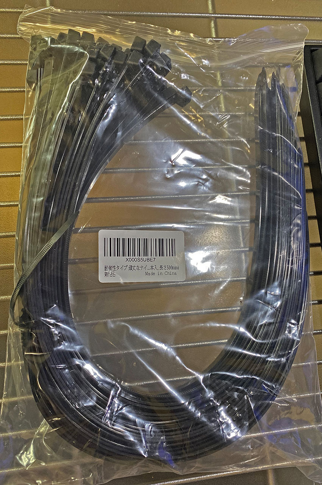
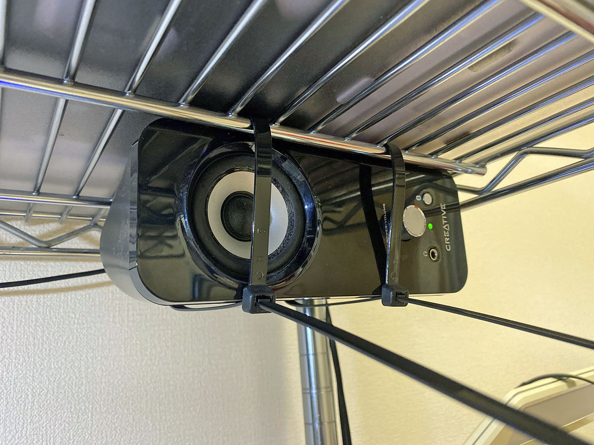
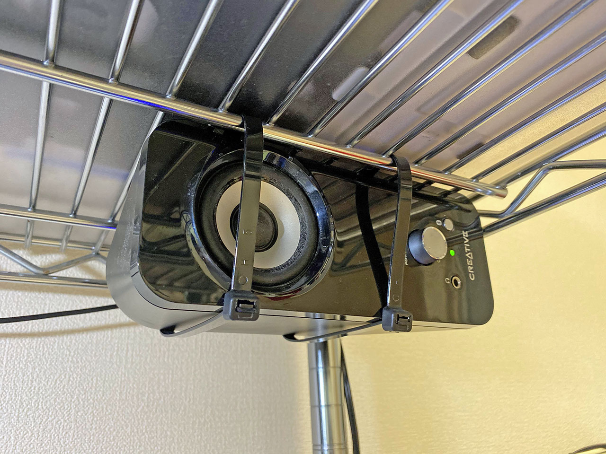
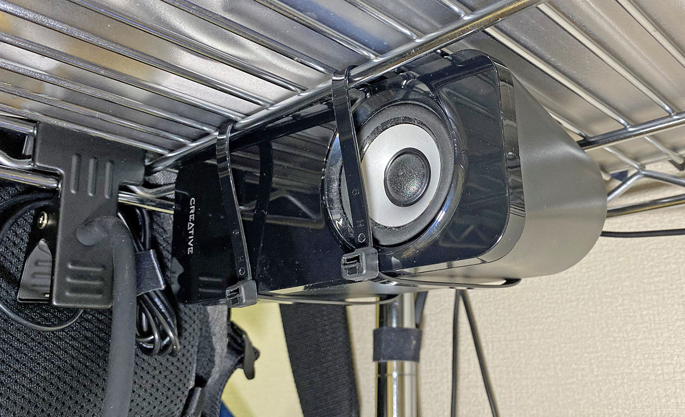
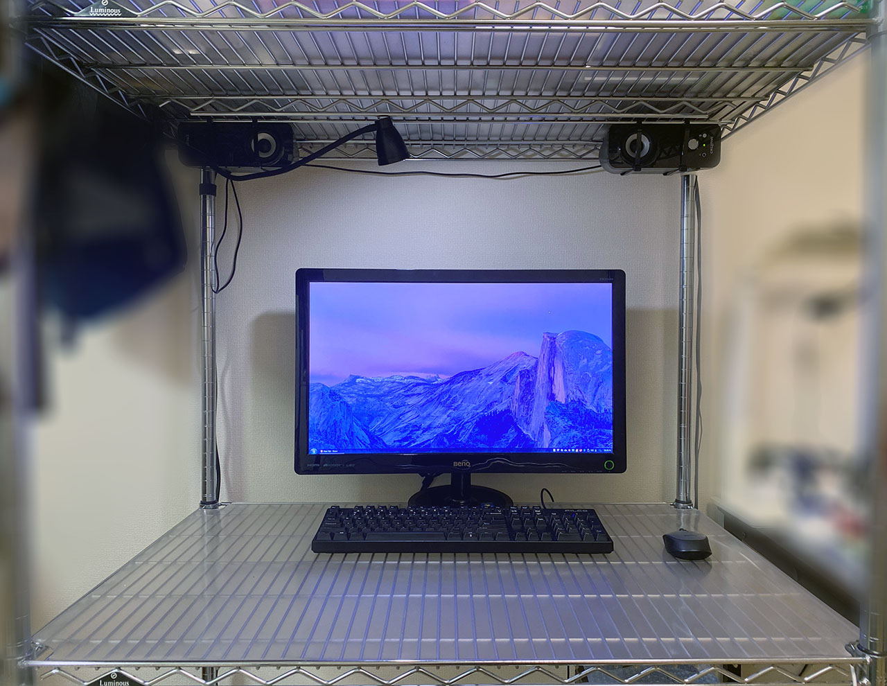

デスクトップ PC に接続している、*Creative T12* というスピーカー。時々左スピーカーからノイズ音が小さく聞こえる症状が発生したり、なんだか左右の音量差があるように感じてきたりしているが、安物を騙し騙し使い続けている。

  

    
  

  

    

      <a href="https://www.amazon.co.jp/dp/B004184YKY?tag=neos21-22&amp;linkCode=osi&amp;th=1&amp;psc=1">Creative T12 Wireless デスクトップ ステレオワイヤレス スピーカーシステム Bluetooth SP-T12W</a>
    

  

  

    
  

  

    

      <a href="https://hb.afl.rakuten.co.jp/hgc/g00tje42.waxycbb0.g00tje42.waxyd39a/?pc=https%3A%2F%2Fitem.rakuten.co.jp%2Fcocohouse%2Fb004184yky%2F&amp;m=http%3A%2F%2Fm.rakuten.co.jp%2Fcocohouse%2Fi%2F10022163%2F">【中古】Creative T12 Wireless デスクトップ ステレオワイヤレス スピーカーシステム Bluetooth SP-T12W</a>
    

    

      <a href="https://hb.afl.rakuten.co.jp/hgc/g00tje42.waxycbb0.g00tje42.waxyd39a/?pc=https%3A%2F%2Fwww.rakuten.co.jp%2Fcocohouse%2F&amp;m=http%3A%2F%2Fm.rakuten.co.jp%2Fcocohouse%2F">COCOHOUSE</a>
    

    
価格 : 16758円

  

ここ数ヶ月ほど、自宅で降るリモート勤務になっており、デスクには会社貸与のノート PC を置くようになった。デスクトップ PC のモニタ、キーボード、マウス、そしてスピーカーが机の上にある中で、15インチのノート PC まで机に置こうとすると、結構スペースが狭くなってしまう。

そこで、スピーカーをメタルラックの上部に吊るすことにした。

どうやるかというと、*長さ 40cm* という長めの**結束バンド**を利用し、縛り上げるだけ。

使用した結束バンドは以下。

スピーカー片方につき2本の結束バンドを使い、メタルラックの上部に通してやる。

縛り上げたらチョキン。

反対側も。

スピーカーが卓上からなくなったことでスペースができ、物を置いたり配置を変えたりしやすくなった。

こんな環境でブログ書いてます。
