自分が母艦として使っている *Galleria XG* に、内蔵 HDD と内蔵 SSD を増設してみた。

- [ドスパラのデスクトップゲーミング PC「Galleria XG」を買った！](/blog/2017/08/08-03.html)

初めて内蔵 HDD・SSD を増設したので、商品の選び方から接続方法・Windows でのセットアップ手順まで丁寧に紹介してみる。

## 目次

## 現状と動機

ガレリアの KT ケースには、5インチベイが5つ、3.5インチベイが5つ用意されている。5インチベイには Blu-ray ドライブがあり、3.5インチベイには SSD (システムドライブ) と HDD が内蔵されていた。

自分はさらに USB 接続の外付け HDD を使用しているのだが、この度これら3台のドライブそれぞれのバックアップを取ろうと思い、内蔵 HDD・SSD の増設に踏み切ることにした。

というワケで今回は、3.5インチベイの空いている残り3段に、

- 2.5インチ SSD (既存のシステムドライブのバックアップ)
- 3.5インチ HDD (既存の内蔵ドライブのバックアップ)
- 3.5インチ HDD (既存の外付けドライブのバックアップ)

この3つのドライブを買って、増設することにした。

## SATA ケーブルと電源ケーブル

自分が使っている外付けドライブは USB で接続し、電源ケーブルも要らないタイプだ。外付けドライブというと、大抵は電源が別途必要なモノが多いだろう。

一方、内蔵ドライブは USB ではなく、**SATA** というケーブルで接続する。それとは別に、*電源ケーブル*も接続する必要がある。この辺のケーブルの規格がよく分かっていなかったので、整理しておく。

まずは SATA の方から整理しよう。SATA ケーブルはマザーボードに接続する。筐体に用意されているドライブベイの数分はポートがあると思うが、念のため、マザーボードにある SATA ポートの空きを確認しておこう。ポート数を増設するコネクタもあるようだが、自分は試していない。ガレリアの KT ケースは6つほど SATA ポートがあった。

*SATA 電源*ケーブルは、電源ユニットからケーブルを取り、HDD 側の SATA ポートの隣にある電源ポートへ接続する。SATA と同様、SATA 電源ポートの規格も決まっているので、ケーブルを迷うことはないだろう。

最近自分は電源ユニットを修理して、コルセア RM750X という電源ユニットに換えた。この電源ユニットは各種ケーブルが取り外し可能になっていて、SATA 電源ケーブルは3本付属していた。そして1本あたり3分岐されているので、3本のケーブルで MAX 9台の SATA 電源を供給できる計算になる。

1本は5インチベイの電源として使われており、もう1本は SSD と HDD に繋がっていた。ドライブを増設する際は、さらにもう1本の付属ケーブルを追加して、2本の電源ケーブルで5台のドライブに電源供給できるようにする。というワケで、電源ケーブルは手持ちだけでまかなえ、追加購入は不要。

一方、SATA ケーブルは手持ちがなかった。内蔵ドライブを買っても SATA ケーブルは付属しないのが普通なので、SATA ケーブルを追加で3本買っておくことにした。

SATA ケーブルにも、USB と同様に転送速度などで規格があるようだ。既存の SATA ケーブルに「**6Gb/s**」という表記があったので、同じ転送速度の表記がある商品を選んで買った。コレは SATA3.0 という規格らしい。ドライブに取り付ける側が L 字になっている方が取り回しが良さそうだったので、その辺も加味して商品を選ぼう。

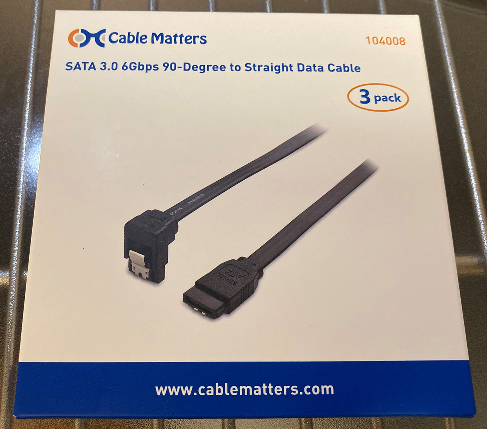

↑ 購入した Cable Matters の SATA3 ケーブル。

  

    
  

  

    

      <a href="https://hb.afl.rakuten.co.jp/hgc/g00tjj42.waxyce0d.g00tjj42.waxydaaf/?pc=https%3A%2F%2Fitem.rakuten.co.jp%2Fsungrowing%2F4918504283984%2F&amp;m=http%3A%2F%2Fm.rakuten.co.jp%2Fsungrowing%2Fi%2F10010194%2F">Cable Matters SATA ケーブル L型 Sata3 シリアル ATA3 ケーブル 3本セット 6 Gbps対応 SSDとHDD増設 45cm ブラック</a>
    

    

      <a href="https://hb.afl.rakuten.co.jp/hgc/g00tjj42.waxyce0d.g00tjj42.waxydaaf/?pc=https%3A%2F%2Fwww.rakuten.co.jp%2Fsungrowing%2F&amp;m=http%3A%2F%2Fm.rakuten.co.jp%2Fsungrowing%2F">SunGrowing</a>
    

    
価格 : 1760円

  

  

    
  

  

    

      <a href="https://www.amazon.co.jp/dp/B00KCS91GY?tag=neos21-22&amp;linkCode=osi&amp;th=1&amp;psc=1">Cable Matters SATA ケーブル L型 Sata3 シリアル ATA3 ケーブル 3本セット 6 Gbps対応 SSDとHDD増設 45cm</a>
    

  

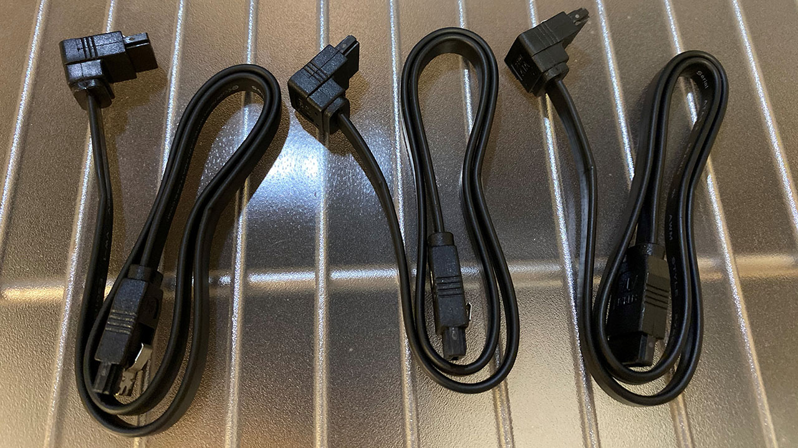

3本入っている。一本あたり 45cm。

## どの内蔵ドライブを買うか

既存の内蔵ドライブは、SSD が Westan Digital、HDD が東芝製だった。

今回、バックアップ用途でドライブを購入するワケだが、一般的には、**同時期に同じメーカーのドライブを複数購入しない方が良い**とされている。似たような製品を選ぶことで、故障するタイミングが被ってしまい、データが全滅するリスクを回避するためだ。

しかし、既存のドライブ類は約3年前に購入したモノ。さらに、バックアップするデータの種類によって選択する容量も違うので、今回は3つとも **Westan Digital の青色シリーズ**を選ぶことにした。青色シリーズは一般的な用途のドライブなので、普通はコレを選んでおけば良い。Westan Digital は値段も安価で、同等の他社製品よりも価格.com での評価が良かったので、コレにした。

一般的な内蔵ドライブは2.5インチ規格と3.5インチ規格がある。SATA や電源の規格は同じで、ドライブのサイズの違いのみだ。SSD はほぼ2.5インチ規格しかないので、3.5インチベイには変換マウンタをかませたりネジ止めしたりして載せる。HDD の方は、3.5インチの方が回転数が高い製品があったりする。今回は変換マウンタを省くために、3.5インチタイプを選ぶことにする。

ということで、購入したのは以下のとおり。

- 500GB 2.5インチ SSD : WDS500G2B0A
- 3TB 3.5インチ HDD : WD30EZRZ-RT
- 4TB 3.5インチ HDD : WD40EZRZ-RT2

…ホントは 2TB の HDD で良かったのだが、Amazon でポチった時に商品を選び間違えていて、3TB の製品が届いてしまった。まぁ多い分には構わんか、と思い、返品せず使うことにする。ｗ

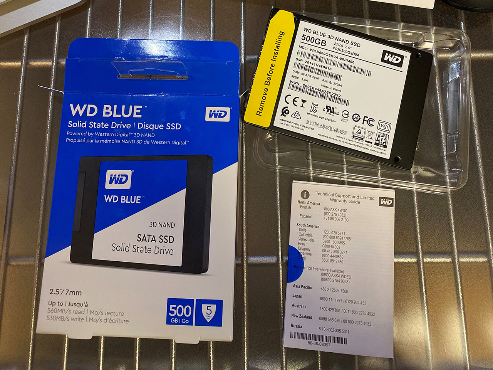

↑ 購入した SSD。

  

    
  

  

    

      <a href="https://www.amazon.co.jp/dp/B07SM7YJ4F?tag=neos21-22&amp;linkCode=osi&amp;th=1&amp;psc=1">Western Digital SSD 500GB WD Blue PC PS4 2.5インチ 内蔵SSD WDS500G2B0A-EC 【国内正規代理店品】</a>
    

  

  

    
  

  

    

      <a href="https://hb.afl.rakuten.co.jp/hgc/g00pyd12.waxycef8.g00pyd12.waxyd0ad/?pc=https%3A%2F%2Fitem.rakuten.co.jp%2Fdtc%2F0718037856308%2F&amp;m=http%3A%2F%2Fm.rakuten.co.jp%2Fdtc%2Fi%2F11329769%2F">Western Digital WD Blue WDS500G2B0A (SSD/2.5インチ/500GB/SATA) [振込不可]</a>
    

    

      <a href="https://hb.afl.rakuten.co.jp/hgc/g00pyd12.waxycef8.g00pyd12.waxyd0ad/?pc=https%3A%2F%2Fwww.rakuten.co.jp%2Fdtc%2F&amp;m=http%3A%2F%2Fm.rakuten.co.jp%2Fdtc%2F">ソフマップ楽天市場店</a>
    

    
価格 : 9860円

  

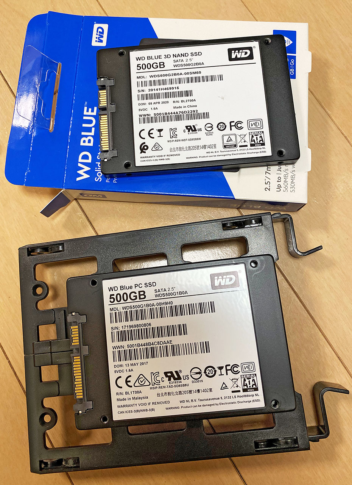

↑ 上が今回購入した方で、下が既存の内蔵 SSD (取り外したモノ)。厳密な型番は異なるがほとんど同じ。製造年月が記載されている。

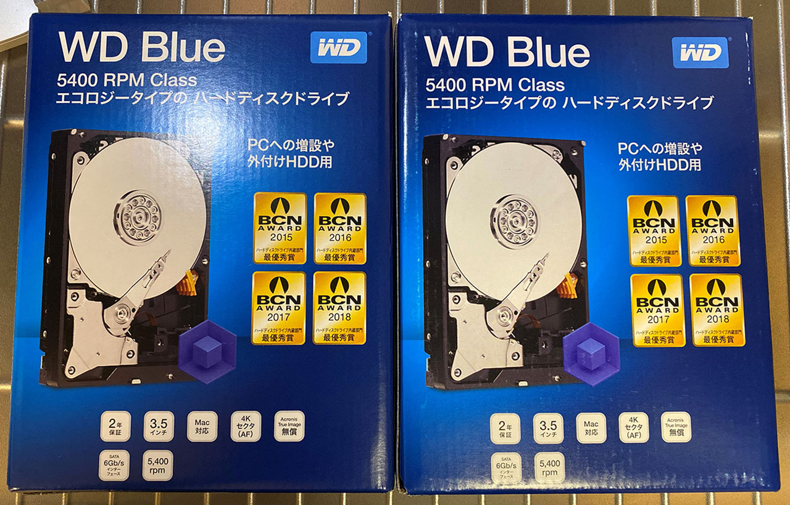

↑ 購入した HDD 2つ。外箱は全く同じ。

  

    
  

  

    

      <a href="https://www.amazon.co.jp/dp/B013HNYV42?tag=neos21-22&amp;linkCode=osi&amp;th=1&amp;psc=1">Western Digital HDD 3TB WD Blue PC 3.5インチ 内蔵HDD WD30EZRZ-RT 【国内正規代理店品】</a>
    

  

  

    
  

  

    

      <a href="https://hb.afl.rakuten.co.jp/hgc/g00q0js2.waxyc573.g00q0js2.waxyd113/?pc=https%3A%2F%2Fitem.rakuten.co.jp%2Fpckoubou%2Fm4s1p574848%2F&amp;m=http%3A%2F%2Fm.rakuten.co.jp%2Fpckoubou%2Fi%2F10263076%2F">Western Digital WD30EZRZ-RT [3TB/3.5インチ内蔵ハードディスク] [5400rpm] WD Blueシリーズ / SATA 6Gb/s接続</a>
    

    

      <a href="https://hb.afl.rakuten.co.jp/hgc/g00q0js2.waxyc573.g00q0js2.waxyd113/?pc=https%3A%2F%2Fwww.rakuten.co.jp%2Fpckoubou%2F&amp;m=http%3A%2F%2Fm.rakuten.co.jp%2Fpckoubou%2F">パソコン工房 楽天市場店</a>
    

    
価格 : 8142円

  

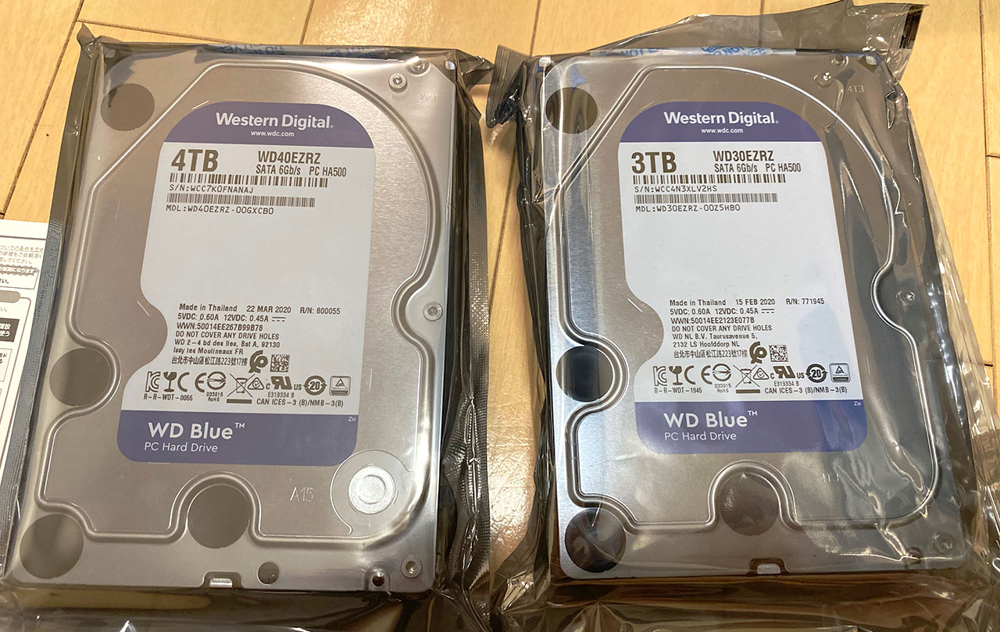

↑ 中を開封。3.5インチは結構大きく見える。

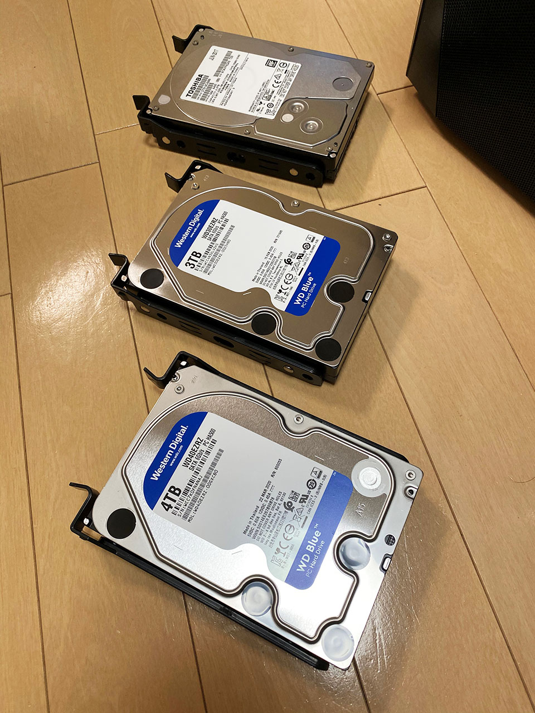

↑ 既存の東芝 HDD を取り出して並べた。

  

    
  

  

    

      <a href="https://www.amazon.co.jp/dp/B01N0LY37N?tag=neos21-22&amp;linkCode=osi&amp;th=1&amp;psc=1">Western Digital HDD 4TB WD Blue PC 3.5インチ 内蔵HDD WD40EZRZ-RT2 【国内正規代理店品】</a>
    

  

  

    
  

  

    

      <a href="https://hb.afl.rakuten.co.jp/hgc/g00rwjt2.waxyc86c.g00rwjt2.waxyda13/?pc=https%3A%2F%2Fitem.rakuten.co.jp%2Fnttxstore%2Fqzx0020106%2F&amp;m=http%3A%2F%2Fm.rakuten.co.jp%2Fnttxstore%2Fi%2F10002393%2F">【送料無料】WESTERN DIGITAL WD Blueシリーズ 3.5インチ内蔵HDD 4TB SATA3（6Gb/s） 5400rpm 64MB WD40EZRZ-RT2 4988755-034838</a>
    

    

      <a href="https://hb.afl.rakuten.co.jp/hgc/g00rwjt2.waxyc86c.g00rwjt2.waxyda13/?pc=https%3A%2F%2Fwww.rakuten.co.jp%2Fnttxstore%2F&amp;m=http%3A%2F%2Fm.rakuten.co.jp%2Fnttxstore%2F">NTT-X Store 楽天市場店</a>
    

    
価格 : 8987円

  

## ドライブ増設作業開始

内蔵ドライブと追加の SATA ケーブルを買ったので、いよいよ内蔵ドライブの増設作業を始めていく。

まずは PC の電源を切る。電源ユニットの電源スイッチを OFF にし、電源ケーブルを外しておこう。

次に、PC 筐体の両面のカバーを外し、既存の SSD・HDD を一旦取り外す。SATA ケーブルや SATA 電源ケーブルは接続部分が割れやすいので、慎重に扱おう。

3.5インチドライブベイを引き出し、仕組みを確認しておく。KT ケースの3.5インチベイは、側面から各段のケースを引き出せるようになっていて、ケースを左右に引っ張ると幅が広がり、ドライブを挟み込んで固定できるようになっている。

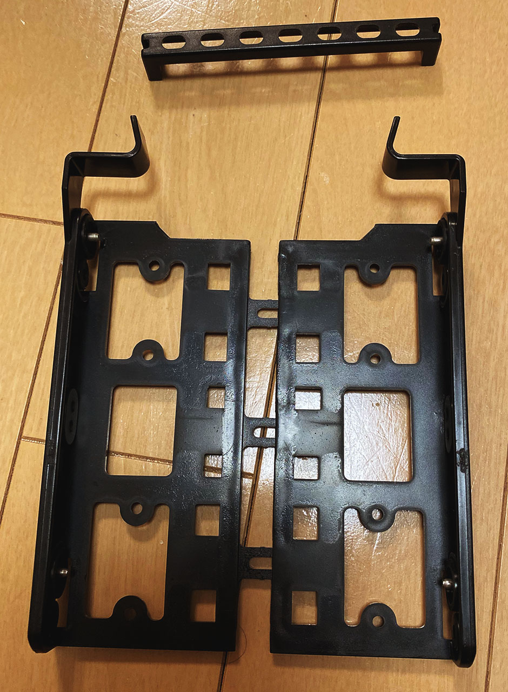

↑ こんな風に隙間が開くので、ココに3.5インチドライブを置いて、左右から挟み直す。

2.5インチドライブを固定するためのネジ穴などもあり、作業がしやすそうだ。

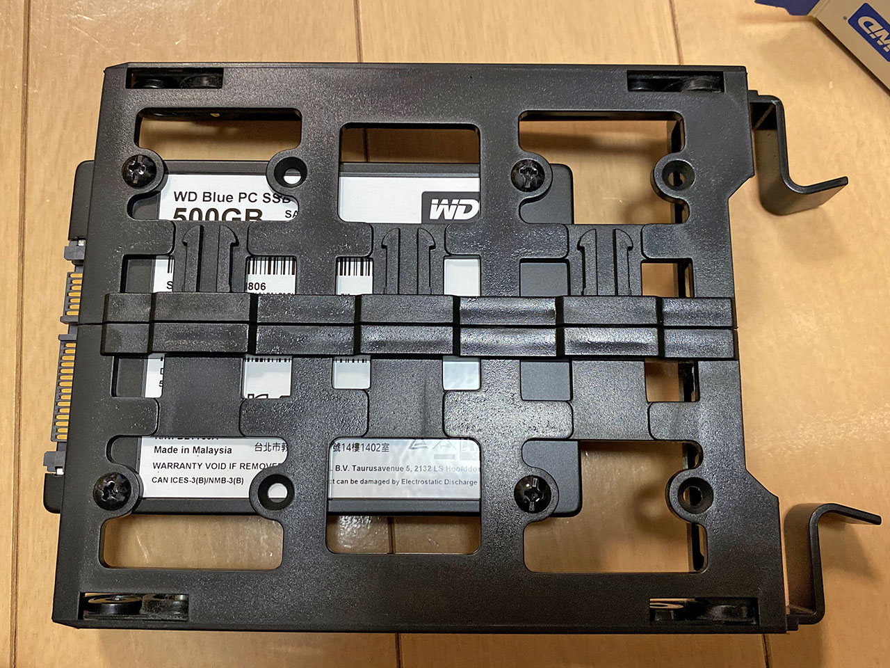

↑ 2.5インチドライブの場合はケース下部にネジ止め。

## 取り付け作業

現状が確認できたので、取り付け作業を行っていく。

まずはコルセア RM750X に、追加で SATA 電源ケーブルを接続する。電源ユニット付属のケーブルは多数あるが、ピンの数やコネクタ部分のサイズが全然違うので、SATA 電源ケーブルかどうかは迷わないはず。

  

    
  

  

    

      <a href="https://hb.afl.rakuten.co.jp/hgc/g00r8mv2.waxyc831.g00r8mv2.waxydde7/?pc=https%3A%2F%2Fitem.rakuten.co.jp%2Fr-kojima%2F3770048%2F&amp;m=http%3A%2F%2Fm.rakuten.co.jp%2Fr-kojima%2Fi%2F10565141%2F">コルセア 750W PC電源 RM750x CP−9020179−JP ［ATX／EPS ／Gold］</a>
    

    

      <a href="https://hb.afl.rakuten.co.jp/hgc/g00r8mv2.waxyc831.g00r8mv2.waxydde7/?pc=https%3A%2F%2Fwww.rakuten.co.jp%2Fr-kojima%2F&amp;m=http%3A%2F%2Fm.rakuten.co.jp%2Fr-kojima%2F">コジマ楽天市場店</a>
    

    
価格 : 14029円

  

  

    
  

  

    

      <a href="https://www.amazon.co.jp/dp/B07BYQFGC3?tag=neos21-22&amp;linkCode=osi&amp;th=1&amp;psc=1">Corsair RM750x -2018-750W PC電源ユニット[80PLUS GOLD] PS794 CP-9020179-JP</a>
    

  

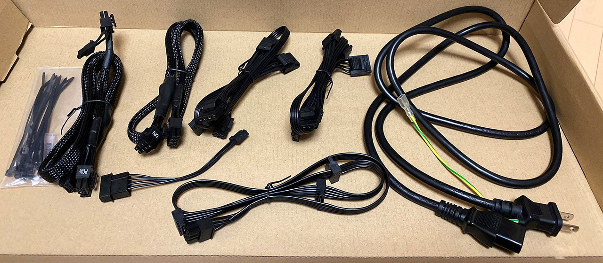

続いて、SATA ケーブルをマザーボードに接続していく。基板上に「SATA 3」「SATA 4」などと順番が書いてあるので、順番に使うことにする。気持ちの問題だけで、基板上に記載の順番は意識しなくても大丈夫だと思われ。抜けないようにするクリップが付いているので、それがカチッと言うまで差し込む。

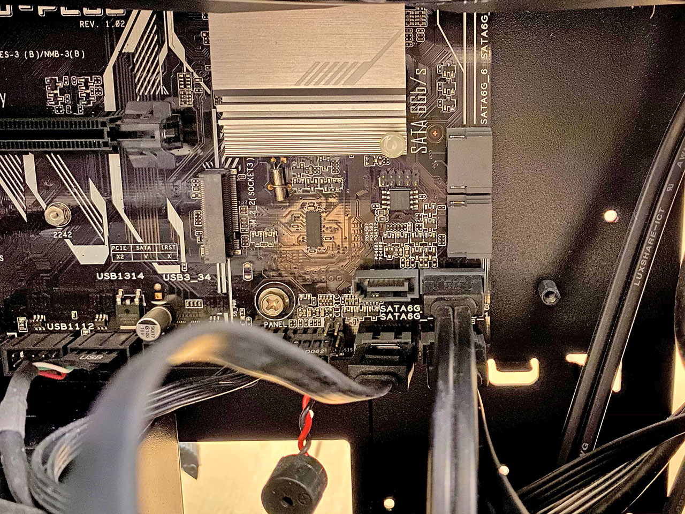

ケーブル類を繋いだら、KT ケースの場合は右側面、ドライブベイを引き出すのとは逆側に引っ張り出しておく。

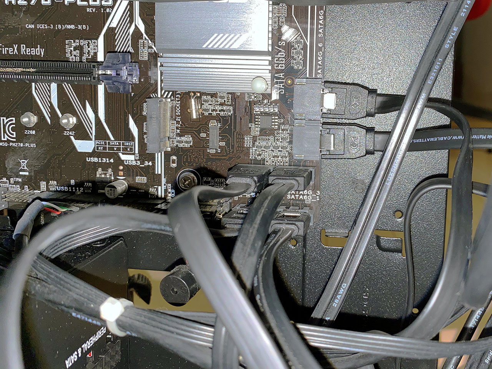

準備が出来たら、ドライブベイのケースを5つとも取り出し、内蔵ドライブを取り付けて行く。前述のとおり、3台の3.5インチ HDD はケースに挟み込むだけで OK。2台の2.5インチ SSD はネジ止めするが、ネジが足りなかったので、既存の SSD から2つネジを拝借し、コネクタ部に近い2ヶ所だけでネジ止めすることにした。雑。ｗ

ケースが取り付けできたら、ドライブベイに差していく。順番は筐体の上から底面に向かって、

- 3TB HDD (今回購入)
- 500GB SSD (今回購入したバックアップ用)
- 2TB HDD (既存の東芝製)
- 500GB SSD (既存のシステムドライブ)
- 4TB HDD (今回購入)

と配置した。間に2.5インチドライブの段を挟むことで空間を開けた方が熱が逃がしやすいかな？と思ってこうしたが、この程度の台数なら別にどう配置しても良いだろう。

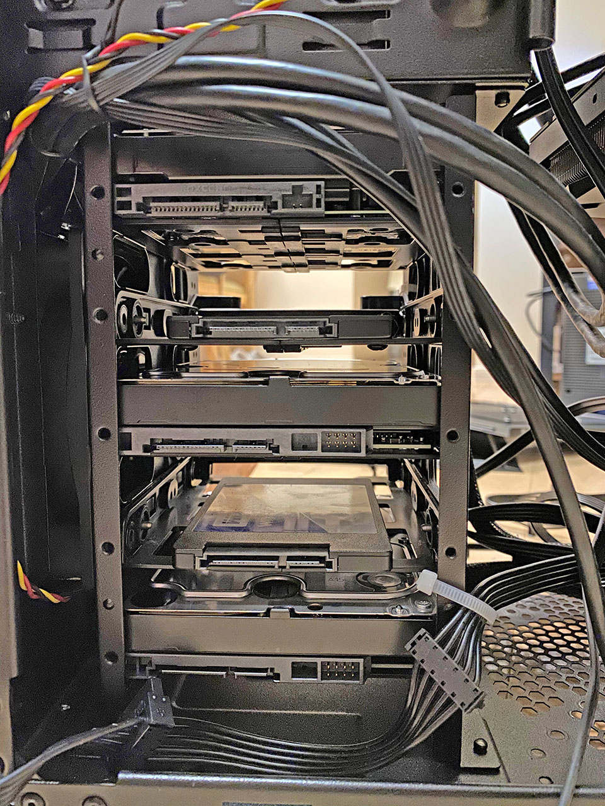

SATA 電源ケーブルは、3分岐 × 2本をうまく互い違いに接続していく。1本で HDD 3台に供給し、もう1本で SSD 2本に供給する感じ。この辺も、どう繋ごうが気にしなくて大丈夫だとは思う。

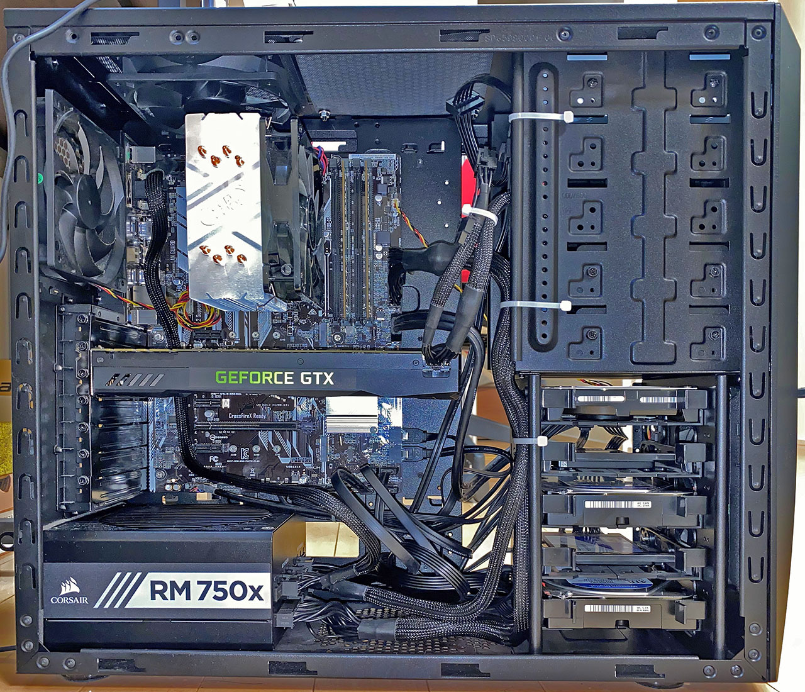

ただ、最終的にケース側面のカバーが閉まるように、ケーブルの整頓 (ケーブル・マネジメント) はしておこう。コネクタが L 字じゃないとキツくなったり、付けづらい位置があったりするので、ケースやパーツの位置を見て、どんなケーブルをどう繋ぐか見極めよう。

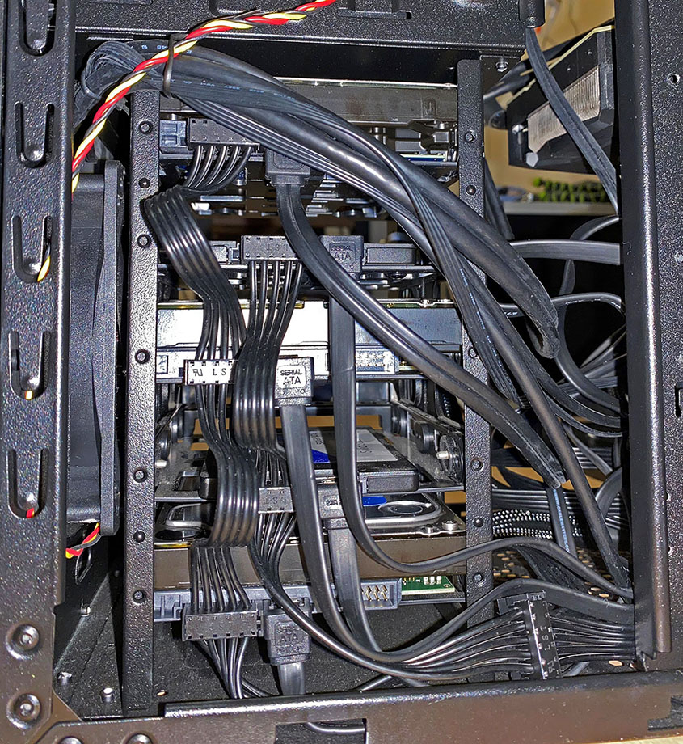

## 取り付け完了・起動してみる

というワケで取り付けが終わった。

- SATA ケーブルでドライブとマザーボードを接続する
- SATA 電源ケーブルでドライブと電源ユニットを接続する

やるべき作業はコレだけ。とても簡単だろう。

ドライブベイへの固定は、ドライブを安定化させる意味合いしかないので、極端な話、どう設置しても別段動作には問題ない。中には PC 筐体に収めず、むき出しで使っている人すらいるほど。配線整理もお好みで。

接続ができたので、PC を起動してみる。無事システムドライブが起動してくれたし、既存の HDD ドライブもエクスプローラで確認できていたので、増設作業によるドライブ破損や接続不良はなさそう。

新たに増設したドライブ3つについては、まだエクスプローラには出ていないが、「管理ツール」から「*ディスクの管理*」を開くと存在が確認できたので、接続自体はうまくいっているようだ。

## 増設したドライブを初期化する

増設したドライブを認識させるため、「管理ツール」から「ディスクの管理」に進む。そこには **「未割り当て」「初期化されていません」** と表示された増設ドライブが見えているので、コレを右クリックして「ディスクの初期化」を選択する。

または、「ディスクの管理」画面に移動した時に「ディスクを初期化する必要があります」というウィンドウが表示される場合もある。ココから3台まとめて初期化を行っても良いだろう。

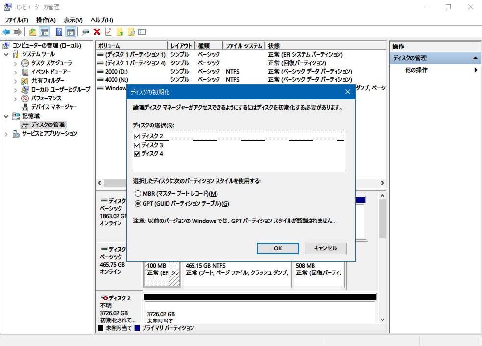

初期化時に選択できる形式は *MBR (マスター・ブート・レコード)* と **GPT (GUID パーティション・テーブル)** の2種類が選べる。既存のドライブを確認すると全て GPT になっていた。後発の規格である GPT を選んで特に問題ないと思うので、GPT を選択する。

初期化自体はすぐ終わるので、続いてパーティションの割り当てとフォーマットを行う。

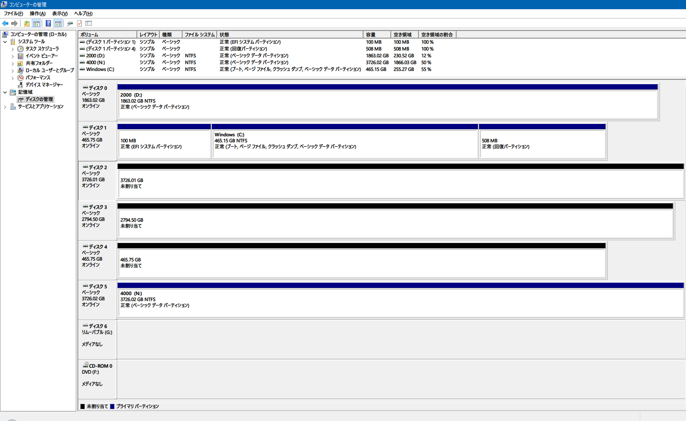

「オンライン」かつ「未割り当て」に変わったドライブの「未割り当て」部分を右クリックし、「*新しいシンプルボリューム*」を選ぶ。

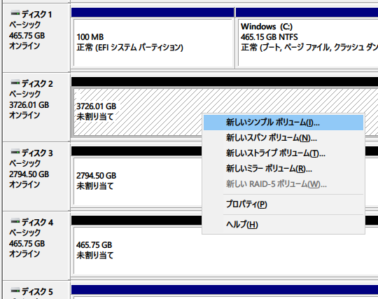

「新しいシンプルボリュームウィザード」が始まるので、続けていく。

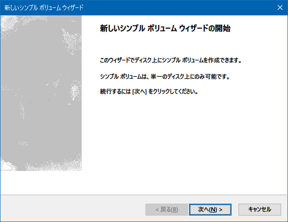

パーティションを区切るつもりはないので、「ボリュームサイズの指定」は「最大ディスク領域」をそのまま指定すれば良い。

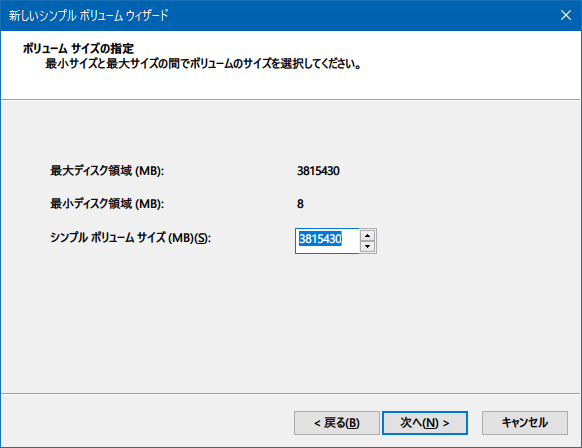

ドライブレターは適当に。

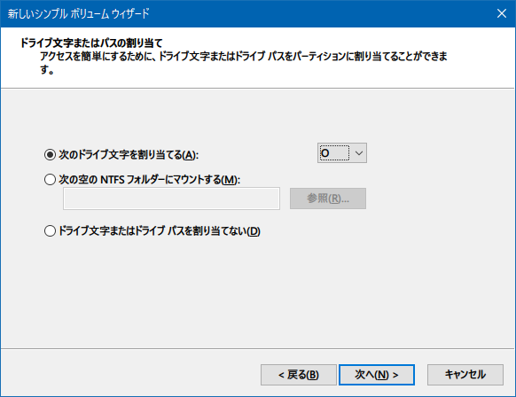

フォーマット形式はお好みで良いが、そのドライブを MacOS や Linux に接続することがなく、Windows 中心での利用なら「*NTFS*」で良いだろう。

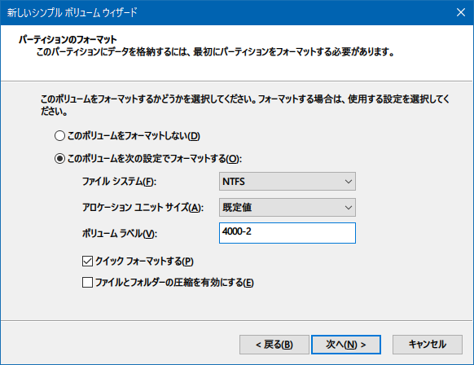

ウィザードを完了すれば、フォーマットも終わる。

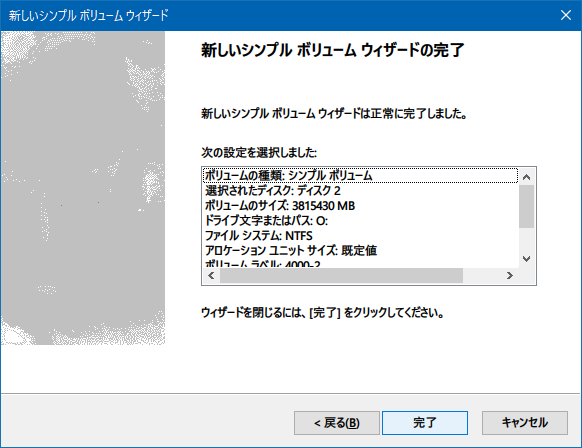

増設したドライブ全てでパーティションとフォーマットを設定したら、次のようになった。

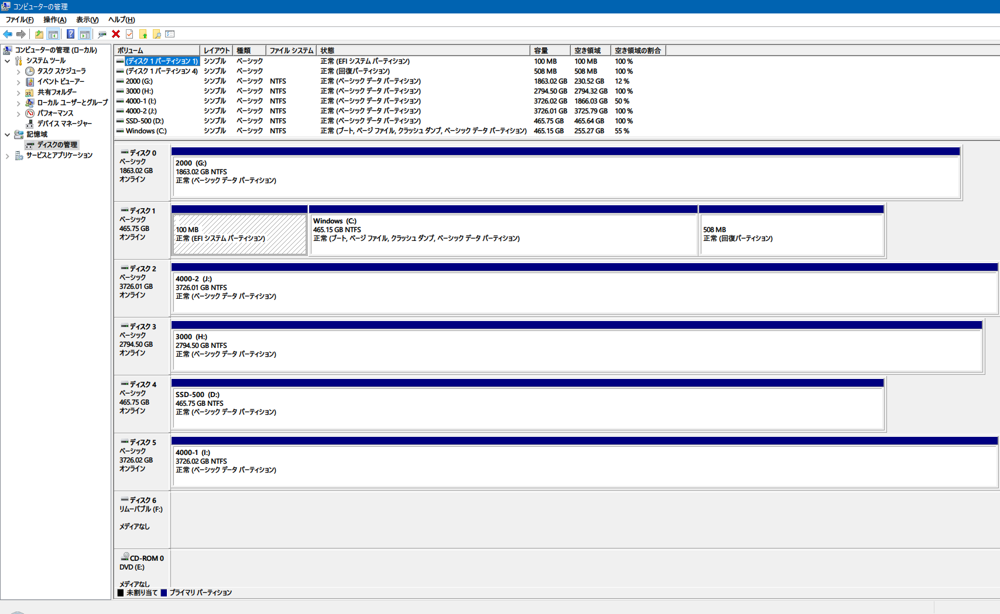

エクスプローラでも増設したドライブが見えるようになった。

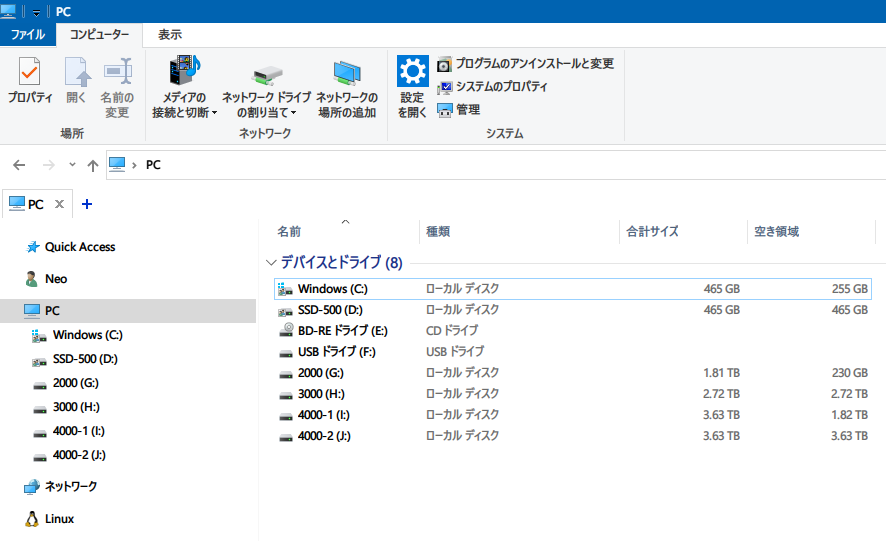

## 以上

今回初めて内蔵ドライブを増設してみたが、SATA ケーブルと SATA 電源のことをよく分かっていなかっただけで、知ってしまえば USB 接続の外付けドライブと大きな差はなかった。

ドスパラ・ガレリアの KT ケースは大型で、余裕を持ってケーブル・マネジメントができた方だと思う。ドライブベイも取り付けが簡単に済むよう工夫されていたので助かる。Windows での初期化処理もウィザード形式で簡単に行えた。

HDD や SSD の増設は初心者でも簡単に出来たので、興味がある方は以下のようなサイトも参考にして、お試しいただきたい。

- 参考 : [HDD 増設の手順（Windows 10） | パソコン工房 NEXMAG](https://www.pc-koubou.jp/magazine/26779/amp#section01-03)
- 参考 : [初心者でも超カンタン！HDDとSSDの増設・交換のやり方 | ヒロシと選ぶゲーミングPC](https://hiroshi-gamepc.com/hdd-ssd-zousetu/)
- 参考 : [HPデスクトップPCのストレージベイにSSD/HDDを増設](https://okiniiripasokon.com/blog-entry-293.html)
- 参考 : [【SSD】増設するよ。それもこれでもかってくらい細かく解説するよ。](https://gamingjisakupc.com/%E8%87%AA%E4%BD%9Cpc/%E3%82%B9%E3%83%88%E3%83%AC%E3%83%BC%E3%82%B8/%E3%80%90ssd%E3%80%91%E5%A2%97%E8%A8%AD%E3%81%99%E3%82%8B%E3%82%88/)
