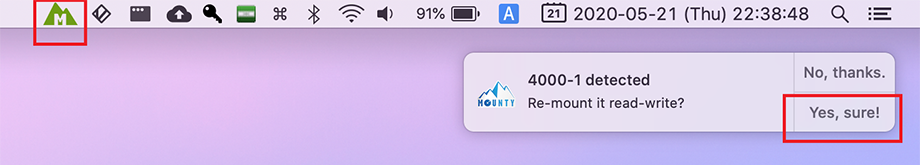

MacOS で NTFS フォーマットの外付け HDD を正しく認識し、ファイルの読み書きをさせるためには一手間必要だ。

- 参考 : [MacOS SierraでNTFS形式の外付けHDDに書き込む - Qiita](https://qiita.com/amaebi/items/25471c4b494a252dfbde)

外付け HDD を繋げるだけなのにコマンドをイチイチ叩くのはめんどくさいので、何とかするツールがないか探してみた。

無料で使えてインストールが簡単そうなツールを探してみたところ、**Mounty** というツールが良さそうだった。

- [Mounty for NTFS](https://mounty.app/)

Homebrew Cask でもインストールできるので、コレを使うのが楽チン。

```bash
$ brew cask install mounty
```

インストール後、Mounty を起動すると、メニューバーに常駐する。

この状態で外付け HDD を USB 接続すると、マウントし直すか通知で問われるので、「Yes, sure!」を選択する。



再マウントに多少時間がかかるが、10数秒待つと次のようにマウントが終わり、Finder で外付け HDD の内容が表示される。


一度マウントができたら、メニューバーから「mount automatically」を選択すれば、次回以降自動的にこの再マウント処理を行ってくれる。

HDD を外す場合は、メニューバーから「unmount」を選択してから取り外すのが良い。同様に、予め Windows マシンから HDD を取り外す際も、「*ハードウェアの安全な取り外し*」で取り外しておかないと、正しく再マウントされないようだ。

安全な取り外しをサボっている人は面倒かもしれないが、大事なデータなのでこのくらいの手間は止むなし。Mounty よきよき。


12インチ MacBook 2017 (MacOS Catalina) に、電源不要の Buffalo HDD + USB-A・USB-C 変換アダプタで接続しても、Mounty で正しく処理できた。
