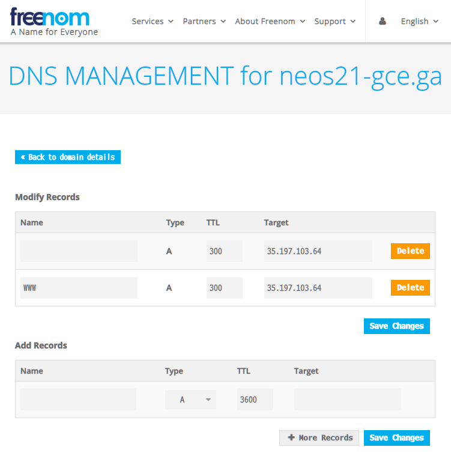

無料枠の GCE (Google Compute Engine) インスタンスを使って、Apache サーバを公開している。コレまでサーバ証明書を用意していなかったので、IP アドレス直打ちの HTTP でしかアクセスできなかった。

- [GCE インスタンスに Apache と PHP をインストールして Web サーバを公開してみた](/blog/2019/12/13-01.html)

今回この環境を、無料で独自ドメインが取得できる __Freenom__ と、無料でサーバ証明書が取得できる __Let's Encrypt__ を使って、完全無料で HTTPS 化することにした。

## 目次

## 前提条件

- GCE インスタンスはグローバル IP を持っていること
- GCE インスタンスは80・443番ポートを開放しており、ファイアウォールで塞がれていないこと (`https` でアクセスしようとすると、証明書エラーになるもののアクセスできる、という状態を前提にする)
- OS は CentOS 7 を前提とする。他のディストリビューションの場合は certbot の導入方法が異なる
- HTTP サーバは Apache を使用している前提とする。nginx などの場合はサーバ証明書の適用方法が異なる

## Freenom でドメイン取得・DNS 設定

まずは Freenom でドメインを取得する。今回は `neos21-gce.ga` というドメインを取った。

- [Freenom - 誰でも利用できる名前](https://www.freenom.com/ja/index.html)
- [独自ドメインを無料で取得できる Freenom を使ってみた](/blog/2018/12/03-01.html)

ドメインを取得する際でも良いし、取得後の画面でも良いが、_Freenom DNS の設定画面_を開く。

- 上部メニュー Services → My Domains → 「Manage Domain」 → 「Manage Freenom DNS」タブ

そしたら次のキャプチャのように設定する。



| Name   | Type | TTL | Target               |
|--------|------|-----|----------------------|
| (空白) | A    | 300 | 【GCE の Public IP】 |
| `www`  | A    | 300 | 【GCE の Public IP】 |

いわゆる「A レコード」を指定している。このドメインはこの IP アドレスに紐付けるぞー、という指定。

設定後、5～10分くらいすると、取得した独自ドメインで GCE に対して HTTP アクセスができるようになっているはず。

- <http://neos21-gce.ga/>
- <http://www.neos21-gce.ga/>

HTTPS でアクセスしようとすると、証明書エラーの警告が出る状態であろう。

## Let's Encrypt でサーバ証明書を取得する

HTTP アクセスができるようになったら、続いてサーバ証明書の取得に移る。

GCE インスタンスに SSH 接続し、次のように叩いていく。

```bash
$ yum install -y epel-release
$ yum install -y certbot python-certbot-apache

# Apache で公開しているディレクトリと、取得したドメイン名を指定する
$ certbot certonly --webroot -w /var/www/html -d neos21-gce.ga
Saving debug log to /var/log/letsencrypt/letsencrypt.log
Plugins selected: Authenticator webroot, Installer None
Starting new HTTPS connection (1): acme-v02.api.letsencrypt.org
Obtaining a new certificate
Performing the following challenges:
http-01 challenge for neos21-gce.ga
Using the webroot path /var/www/html for all unmatched domains.
Waiting for verification...
Cleaning up challenges

IMPORTANT NOTES:
 - Congratulations! Your certificate and chain have been saved at:
   /etc/letsencrypt/live/neos21-gce.ga/fullchain.pem
   Your key file has been saved at:
   /etc/letsencrypt/live/neos21-gce.ga/privkey.pem
   Your cert will expire on 2020-08-25. To obtain a new or tweaked
   version of this certificate in the future, simply run certbot
   again. To non-interactively renew *all* of your certificates, run
   "certbot renew"
 - If you like Certbot, please consider supporting our work by:

   Donating to ISRG / Let's Encrypt:   https://letsencrypt.org/donate
   Donating to EFF:                    https://eff.org/donate-le
```

このように、コマンドを叩くだけで証明書が取得できた。各種ファイルは以下にある。

```bash
$ ls -l /etc/letsencrypt/live/neos21-gce.ga/
合計 4
-rw-r--r-- 1 root root 692 2020-05-27 18:25 README
lrwxrwxrwx 1 root root  37 2020-05-27 18:25 cert.pem -> ../../archive/neos21-gce.ga/cert1.pem
lrwxrwxrwx 1 root root  38 2020-05-27 18:25 chain.pem -> ../../archive/neos21-gce.ga/chain1.pem
lrwxrwxrwx 1 root root  42 2020-05-27 18:25 fullchain.pem -> ../../archive/neos21-gce.ga/fullchain1.pem
lrwxrwxrwx 1 root root  40 2020-05-27 18:25 privkey.pem -> ../../archive/neos21-gce.ga/privkey1.pem
```

## Apache 設定ファイルにサーバ証明書を読み込ませる

コレだけだと Let's Encrypt のサーバ証明書を取得しただけで、Apache サーバがこの証明書を利用していないので、状況が変わらない。

次の設定ファイルを開き、以下の抜粋のとおりに編集する。

```bash
$ vi /etc/httpd/conf.d/ssl.conf
```

元の行と、書き換えた行を記載している。ディレクトリパスなどは各自のモノに読み替えること。

```
#   Server Certificate:
# Point SSLCertificateFile at a PEM encoded certificate.  If
# the certificate is encrypted, then you will be prompted for a
# pass phrase.  Note that a kill -HUP will prompt again.  A new
# certificate can be generated using the genkey(1) command.

# Original
#SSLCertificateFile /etc/pki/tls/certs/localhost.crt
# My Domain
SSLCertificateFile /etc/letsencrypt/live/neos21-gce.ga/cert.pem

#   Server Private Key:
#   If the key is not combined with the certificate, use this
#   directive to point at the key file.  Keep in mind that if
#   you've both a RSA and a DSA private key you can configure
#   both in parallel (to also allow the use of DSA ciphers, etc.)

# Original
#SSLCertificateKeyFile /etc/pki/tls/private/localhost.key
# My Domain
SSLCertificateKeyFile /etc/letsencrypt/live/neos21-gce.ga/privkey.pem

#   Server Certificate Chain:
#   Point SSLCertificateChainFile at a file containing the
#   concatenation of PEM encoded CA certificates which form the
#   certificate chain for the server certificate. Alternatively
#   the referenced file can be the same as SSLCertificateFile
#   when the CA certificates are directly appended to the server
#   certificate for convinience.

# Original (Comment-out)
#SSLCertificateChainFile /etc/pki/tls/certs/server-chain.crt
# My Domain
SSLCertificateChainFile /etc/letsencrypt/live/neos21-gce.ga/chain.pem
```

設定ファイルを書き換えたら、Apache サーバを再起動する。

```bash
$ systemctl restart httpd
```

### なぜか再起動が上手く行かず

当方環境ではなぜか Apache サーバの再起動が上手く行かなくて詰まった。

```bash
# よー分からん
$ systemctl status httpd
● httpd.service - The Apache HTTP Server
   Loaded: loaded (/usr/lib/systemd/system/httpd.service; enabled; vendor preset: disabled)
   Active: failed (Result: exit-code) since 水 2020-05-27 18:44:23 JST; 3min 58s ago
     Docs: man:httpd(8)
           man:apachectl(8)
  Process: 29373 ExecStop=/bin/kill -WINCH ${MAINPID} (code=exited, status=1/FAILURE)
  Process: 21731 ExecReload=/usr/sbin/httpd $OPTIONS -k graceful (code=exited, status=0/SUCCESS)
  Process: 29372 ExecStart=/usr/sbin/httpd $OPTIONS -DFOREGROUND (code=exited, status=0/SUCCESS)
 Main PID: 29372 (code=exited, status=0/SUCCESS)

 5月 27 18:44:23 gce systemd[1]: Starting The Apache HTTP Server...
 5月 27 18:44:23 gce httpd[29372]: httpd (pid 15739) already running
 5月 27 18:44:23 gce kill[29373]: kill: cannot find process ""
 5月 27 18:44:23 gce systemd[1]: httpd.service: control process exited, code=exited status=1
 5月 27 18:44:23 gce systemd[1]: Failed to start The Apache HTTP Server.
 5月 27 18:44:23 gce systemd[1]: Unit httpd.service entered failed state.
 5月 27 18:44:23 gce systemd[1]: httpd.service failed.
 5月 27 18:46:08 gce systemd[1]: Unit httpd.service cannot be reloaded because it is inactive.
 5月 27 18:48:17 gce systemd[1]: Unit httpd.service cannot be reloaded because it is inactive.

# やっぱり分からん
$ journalctl -xe
 5月 27 18:48:44 gce systemd[1]: Starting The Apache HTTP Server...
-- Subject: Unit httpd.service has begun start-up
-- Defined-By: systemd
-- Support: http://lists.freedesktop.org/mailman/listinfo/systemd-devel
--
-- Unit httpd.service has begun starting up.
 5月 27 18:48:44 gce httpd[29789]: httpd (pid 15739) already running
 5月 27 18:48:44 gce kill[29790]: kill: cannot find process ""
 5月 27 18:48:44 gce systemd[1]: httpd.service: control process exited, code=exited status=1
 5月 27 18:48:44 gce systemd[1]: Failed to start The Apache HTTP Server.
-- Subject: Unit httpd.service has failed
-- Defined-By: systemd
-- Support: http://lists.freedesktop.org/mailman/listinfo/systemd-devel
--
-- Unit httpd.service has failed.
--
-- The result is failed.
 5月 27 18:48:44 gce systemd[1]: Unit httpd.service entered failed state.
 5月 27 18:48:44 gce systemd[1]: httpd.service failed.

# こうなってる
$ apachectl
httpd (pid 29997) already running

# 設定ファイルに記述誤りがあるワケではない模様
$ apachectl -t
Syntax OK
```

設定ファイルの書き間違いだとそういう文言がエラーメッセージに出てくるのだが、そうではないようだった。

他に原因が見当たらなかったので、`httpd already running` というところかなと思い、__`$ pkill httpd`__ で一旦強引に全ての `httpd` プロセスを切った。

それから `$ systemctl start httpd` でやり直したら上手くいった。よかった。

## アクセスしてみる

設定が終わったら HTTPS でアクセスしてみる。

- <https://neos21-gce.ga/>
- <https://www.neos21-gce.ga/>

無事アクセスできた。おけおけ。

## サーバ証明書を自動更新する

Let's Encrypt の証明書は3ヶ月ごとに切れるので、毎月ぐらいのペースで

```bash
$ certbot renew && systemctl restart httpd
```

を実行するよう cron を書いておくと良さそう。

```bash
# crontab を編集する
$ crontab -u root -e
no crontab for root - using an empty one
crontab: installing new crontab

# 内容を確認する
$ crontab -u root -l
00 03 01 * * certbot renew && systemctl restart httpd
```

以上。

- 参考：[CentOS 7 + Apache 2.4 に Let\&#8217;s Encrypt の証明書を導入する手順 | WEB ARCH LABO](https://weblabo.oscasierra.net/letsencrypt-2/)
- 参考：[Let\&#8217;s Encrypt の証明書の更新を自動化する手順 (cron) | WEB ARCH LABO](https://weblabo.oscasierra.net/letsencrypt-renew-cron/)
- 参考：[CentOS7 のウェブサーバーを Certbot(Let's encrypt) で SSL 対応する : まだプログラマーですが何か？](http://dotnsf.blog.jp/archives/1075580031.html)
- 参考：[【CentOS 8・7】Certbotのインストール方法【プラグイン対応】 – Hacker's High](https://hackers-high.com/linux/centos-certbot-installation/)
