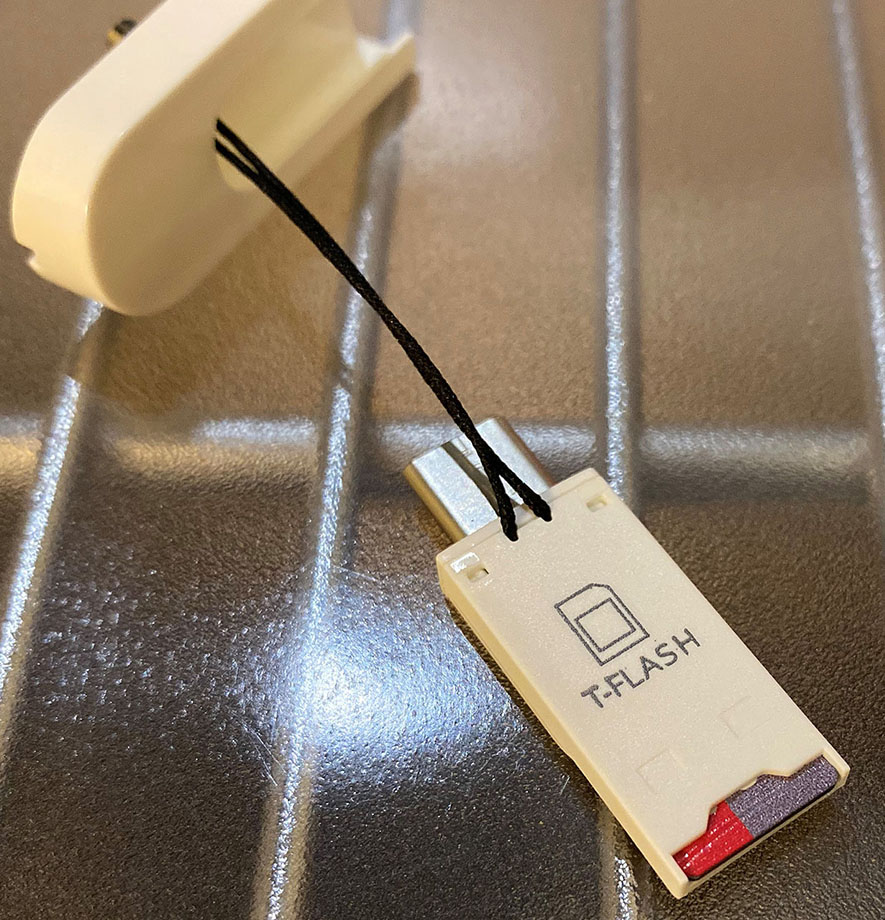
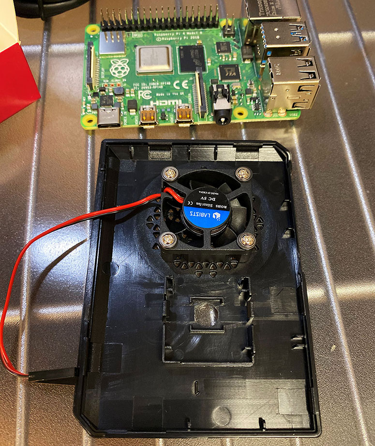

かねてよりラズベリーパイに興味があったので、今回いよいよラズパイ4を買ってみることにした。

対象読者は「ラズパイがどんなモノか概要は知っているが、実際に触ったことはない」というレベルの人を想定して執筆しており、ラズパイの初歩的な説明は省くので、よしなに。

## 目次

## 買ったモノ

今回購入したのは、Labists というところが出している、ラズパイ4のスターターキットだ。

  

    
  

  

    

      <a href="https://www.amazon.co.jp/dp/B082VVJCPT?tag=neos21-22&amp;linkCode=osi&amp;th=1&amp;psc=1">LABISTS Raspberry Pi 4 4GB キット（技適マーク入）MicroSDHCカード32G/Raspbianシステムプリインストール/カードリーダ /5.1V/3A Type-C スイッチ付電源/MicroHDMI-to-HDMIケーブルライン/三つヒートシンク/簡単に取り付けケース/日本語取扱説明書（4GB RAM）</a>
    

  

  

    
  

  

    

      <a href="https://hb.afl.rakuten.co.jp/hgc/g00tau72.waxyc064.g00tau72.waxyd144/?pc=https%3A%2F%2Fitem.rakuten.co.jp%2Fsanei-trade%2F10000016%2F&amp;m=http%3A%2F%2Fm.rakuten.co.jp%2Fsanei-trade%2Fi%2F10000016%2F">LABISTS Raspberry4 4B-64GB（技適マーク入）MicroSDHCカード64G/NOOBSシステムプリインストール/カードリーダ /5.1V/3A Type-C スイッチ付電源/MicroHDMI-to-HDMIケーブルライン/三つヒートシンク/簡単に取り付けケース/日本語取扱説明書/24ヶ月保証</a>
    

    

      <a href="https://hb.afl.rakuten.co.jp/hgc/g00tau72.waxyc064.g00tau72.waxyd144/?pc=https%3A%2F%2Fwww.rakuten.co.jp%2Fsanei-trade%2F&amp;m=http%3A%2F%2Fm.rakuten.co.jp%2Fsanei-trade%2F">三英トレードジャパン</a>
    

    
価格 : 19800円

  

セット内容は以下のとおり。

- **Raspberry Pi 4 Model B 4GB RAM** (本体)
- 専用ケース
- CPU 用ヒートシンク
- RAM 用ヒートシンク
- USB コントローラ用ヒートシンク
- CPU ファン (GPIO 接続)
- microSDHC カード 64GB (_NOOBS Raspian_ インストール済)
- USB カードリーダ (USB-A or USB-C 接続可能)
- Micro HDMI to HDMI ケーブル2本 (1.3m)
- 5.1V・3A USB-C 電源アダプタ (電源スイッチ付き)
- 日本語説明書

最近 RAM 8GB モデルが出たが、購入した時はまだ 4GB モデルしかなかったので…。まぁ RAM は 4GB もあれば良いんじゃないか？

ラズパイ4は CPU が熱をもつので、それ以前の世代よりもヒートシンクやファンが大事になっている (現在はファームウェアアップデートにより、ファンレス運用も問題ないらしいが)。これらが付属していて、専用ケースにしっかり収まるので、基盤剥き出しでの運用が怖い人にもオススメだ。

ラズパイ4から、本体側の HDMI 端子が「Micro HDMI」(しかも2ポートある) に変わったので、変換コネクタもなく Micro HDMI から HDMI に接続できるケーブルが2本付いているのは助かる。

電源スイッチを持たないラズパイ向けに、電源スイッチ機能が付いた電源アダプタが付属しているのも嬉しい。

さらに、付属の MicroSDHC カードには、_NOOBS_ と呼ばれるラズパイ用のインストーラがプリインストールされており、ラズパイ本体にマイクロ SD を挿すだけで Raspbian OS が動作するのだ。NOOBS には Python の IDE や LibreOffice など、よく使うであろう便利ツール類も含まれているので、とりあえず使い始めたい人にはもってこいだ。

- 参考：[NOOBSって何！？Raspbianの違いとは？ | vasco blog](https://vasco-blog.com/blog/2019/07/06/deference-noobs-and-raspbian/)

microSD に自分で OS を書き込んだりする時のために、USB-C か USB-A で接続できるカードリーダも付属していた。ホントに色々揃うな…。

ラズパイのスターターキットは Labists 以外にも多数販売されており、高くても1万5千円程度で全てが揃うので、こうしたスターターキットでとりあえずラズパイを始めてみるというのはアリだろう。

## 本体ケースを組み立てる

さて、それでは組み立てを始めてみよう。Labists 公式にも解説動画があるので、合わせて参考にしてほしい。

- 参考：<https://www.youtube.com/watch?v=1ZD6NaXsK-s>

上のようなケースに、ラズパイ4本体と CPU ファンを取り付けていく。

CPU ファンはこんな感じでネジ留め。ドライバーまで付属しているので作業は簡単。ファンを設置した下にある四角い枠の部分は、別売のカメラレンズを設置できる場所。カメラも後に購入したので、また別途紹介するとしよう。

続いてラズパイ本体。3つのヒートシンクが付属しているので、CPU、RAM、USB コントローラに貼り付ける。ヒートシンク底面に強力な両面テープが付いているので、それで貼り付けるだけ。そしたらケースにネジ留めする。

CPU ファンから出ている赤と黒のケーブルを、ラズパイ本体の **GPIO ピン**に挿す。GPIO とは _General-Purpose Input/Output_の略で、「汎用入出力」と訳される。40本のピンにはそれぞれ役割があるので、デタラメに挿してはいけない。

この CPU ファンの場合、赤い線は基盤左下の1番ピンに挿す。ココは 3.3V の電源を供給する。黒い線はその2つ右・1つ上の6番ピンに挿す。コチラは GND、グランドで、電源のマイナス極となる。1番ピンから 3.3V 電源を供給し、6番ピンからグランドに戻る、っていう流れですな。

- 参考：[Raspberry Pi（ラズパイ）のGPIOピンとは？初心者に向けて丁寧に解説！ | キツネの錬金術｜大学生が豊かに生活するためのサイト](https://robot-workshop.net/raspberry-pi-gpio)
- 参考：[オームの法則覚えてますか？ 電子工作の基礎を身につけ、Raspberry PiでLEDを光らせよう (1/3)：CodeZine（コードジン）](https://codezine.jp/article/detail/9128)
- 参考：[raspberry pi - ラズベリーパイのGPIOやGroundの配置が入り組んでいる理由 - スタック・オーバーフロー](https://ja.stackoverflow.com/questions/7022/%E3%83%A9%E3%82%BA%E3%83%99%E3%83%AA%E3%83%BC%E3%83%91%E3%82%A4%E3%81%AEgpio%E3%82%84ground%E3%81%AE%E9%85%8D%E7%BD%AE%E3%81%8C%E5%85%A5%E3%82%8A%E7%B5%84%E3%82%93%E3%81%A7%E3%81%84%E3%82%8B%E7%90%86%E7%94%B1)
  - なんで40個のピンが不揃いな配置なのかの説明

こんな感じでピンを挿したら、CPU ファンが回るようになる。

最後に、ケース底面からラズパイ本体のマイクロ SD カードスロットにアクセスできるので、付属のマイクロ SD を挿す。前述のとおり、NOOBS で Raspbian OS がインストールされているカードなので、特にプリインストール作業はナシ。

あとは CPU ファンを取り付けたフタ部分と本体部分とを、ケーブルを噛んだりしないよう注意しながら閉じてやれば OK。コレでケースの組み立ては完了だ。

## 各種ケーブルを接続・起動する

ケースが組み立てられたので、各種ケーブルを接続していく。

少々見づらいが、

- ケース左上に、電源となる USB-C ケーブルを挿した
- そのすぐ下、ケースの左側に、ディスプレイと接続するためのマイクロ HDMI ケーブルを挿した
- ケース下部、見づらいが2つ USB を挿している。マウスとキーボードだ

ディスプレイ、マウス、キーボードを接続し、電源ケーブルを挿したら、ケーブルに付いている電源スイッチを ON にしよう。

画面にラズベリーパイのロゴが映った。

少し待つと、デスクトップらしき画面が表示された。ココから初期設定を行っていくことになる。

## 今回はココまで

…というところで、記事が長くなってきたので、今回はココまで。次回はラズパイの初期設定を行っていこう。

ちっちゃくてかわいいっすね！
