Labists というところが出している Raspberry Pi 4 (RAM 4GB) のスターターキットを買った。

付属の 64GB microSDHC には、簡単にラズパイを始められる _NOOBS_ がプリインストールされていた。

今回はこの NOOBS Raspbian OS を初めて起動したところからの初期設定を見ていく。

なお、__Raspbian__ という OS は、最近 4B の 8GB RAM モデルが登場したのを機に、64bit ベースの OS が登場し、名称を _Raspberry Pi OS_ と改めている。今回自分が扱うのは 4GB RAM モデルに同梱されていた Raspbian OS の頃のモノなので、文中の表現は「Raspbian」と記載している。

## 目次

## 初回起動時の設定ウィザード

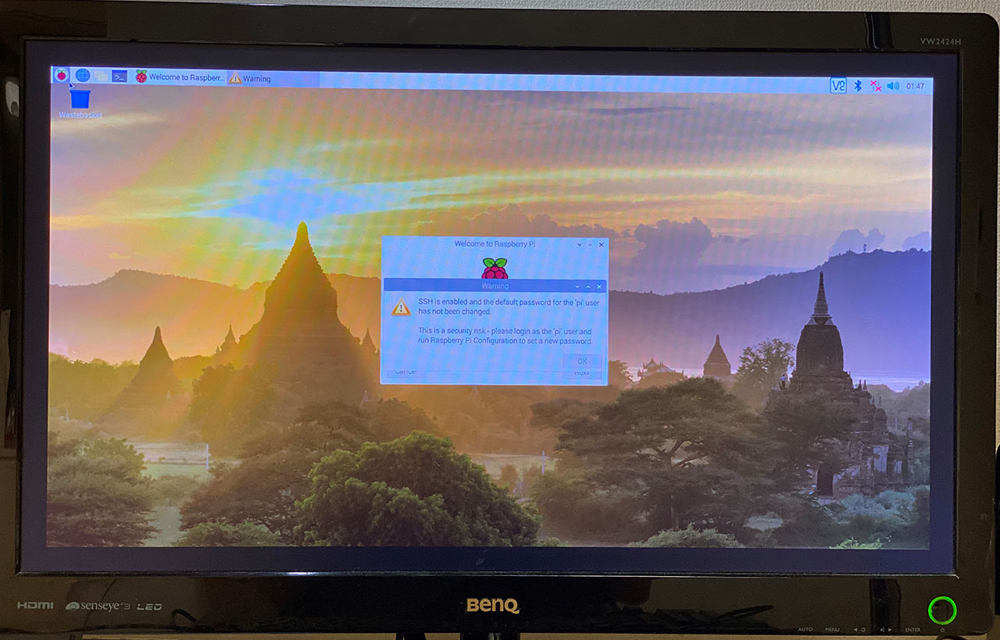

初回起動直後のデスクトップ。なんだか画面四隅に黒い枠が出ていて、表示領域が一回り狭く見える。コレは後で直せる。

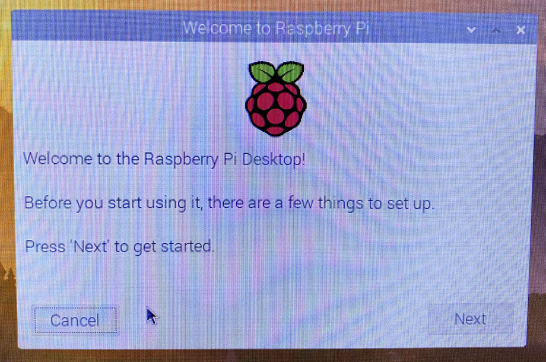

「Welcome to Raspberry Pi」というウィンドウが開いているので、ウィザードを進めていく。

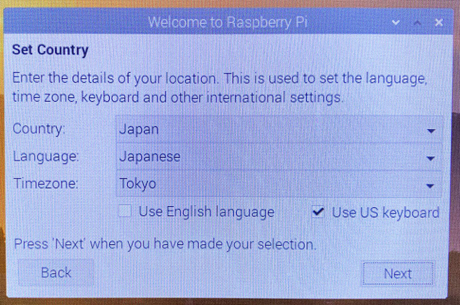

「Set Country」：言語とタイムゾーンを選ぶ。自分は US キーボードを接続しているので「Use US keyboard」にチェックを入れている。

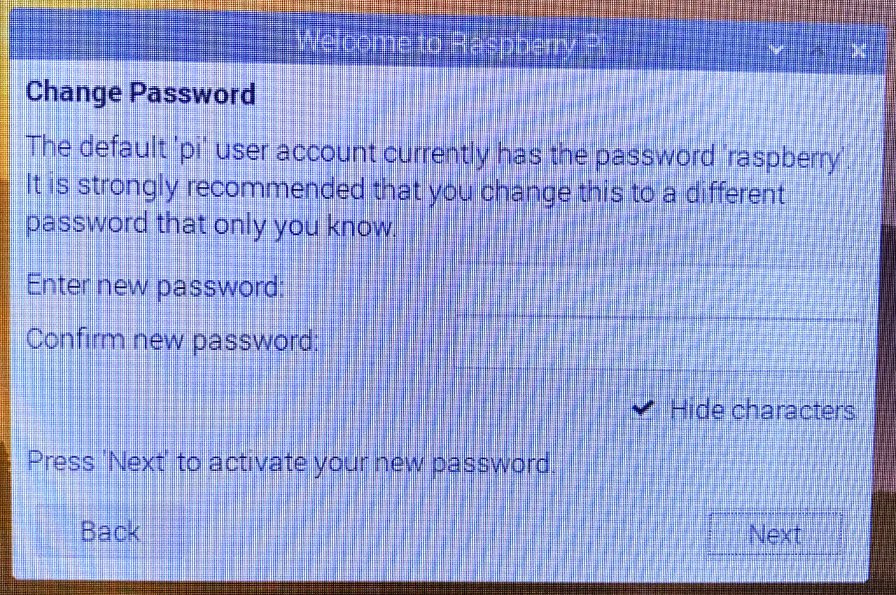

「Change Password」：デフォルトで用意されている「pi」ユーザのパスワードを設定する。

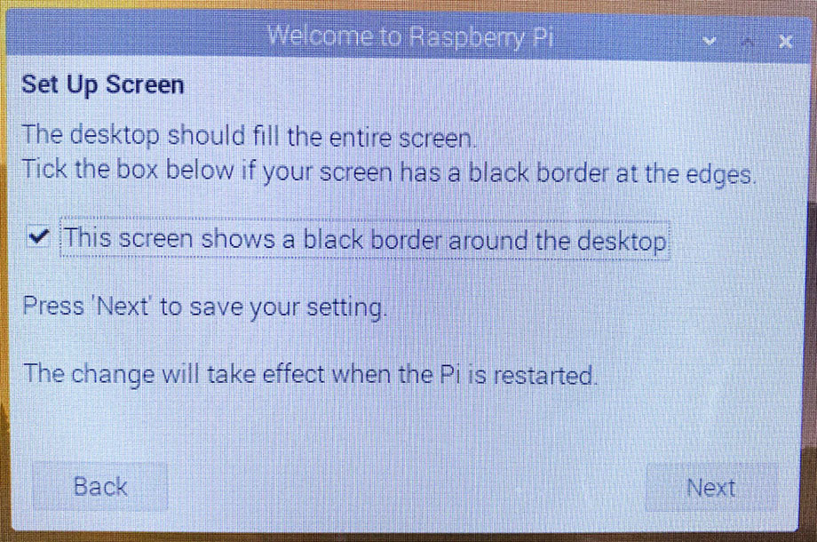

「Set Up Screen」：画面四隅に黒い枠が出ている場合は、「This screen shows a black border around the desktop」にチェックを入れることで解消できる。

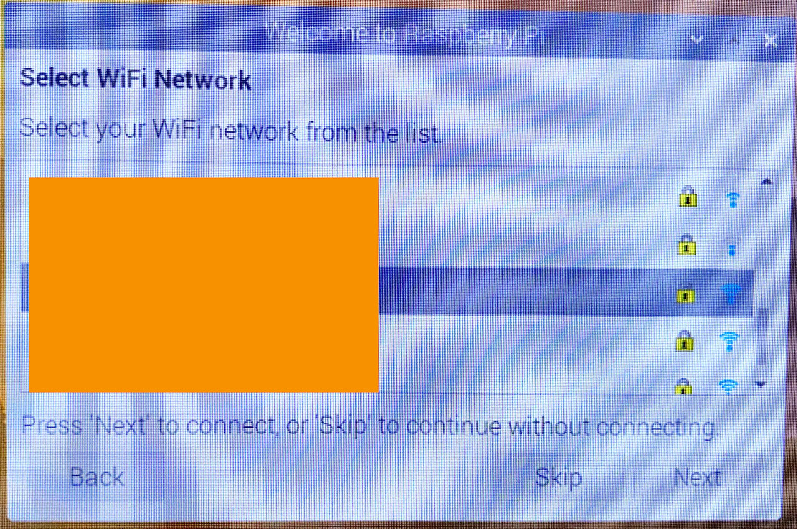

「Select WiFi Network」：Wi-Fi に接続する。任意のアクセスポイントを選択すると、パスワードを入力する「Enter WiFi Password」画面が出るので、パスワードを入れて接続する。

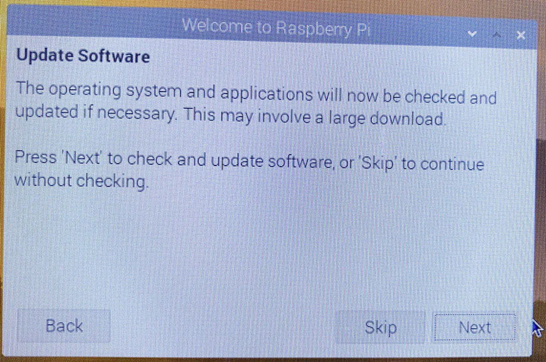

「Update Software」：簡単にいうと `apt update` と `apt upgrade` が実行されるイメージ。実行すると少々時間がかかるが、行っておく。

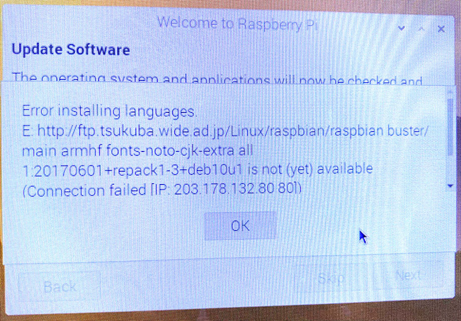

しばらく待つと、`fonts-noto-cjk-extra` 周りのアップデートでエラーが出てしまった。後で調整することにして進める。

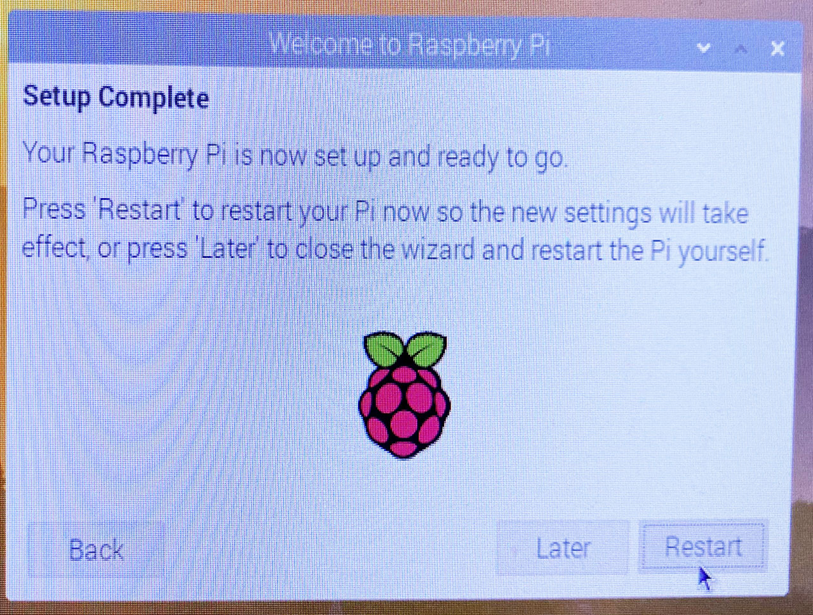

「Setup Complete」：初期設定が終わったので、「Restart」ボタンから再起動する。

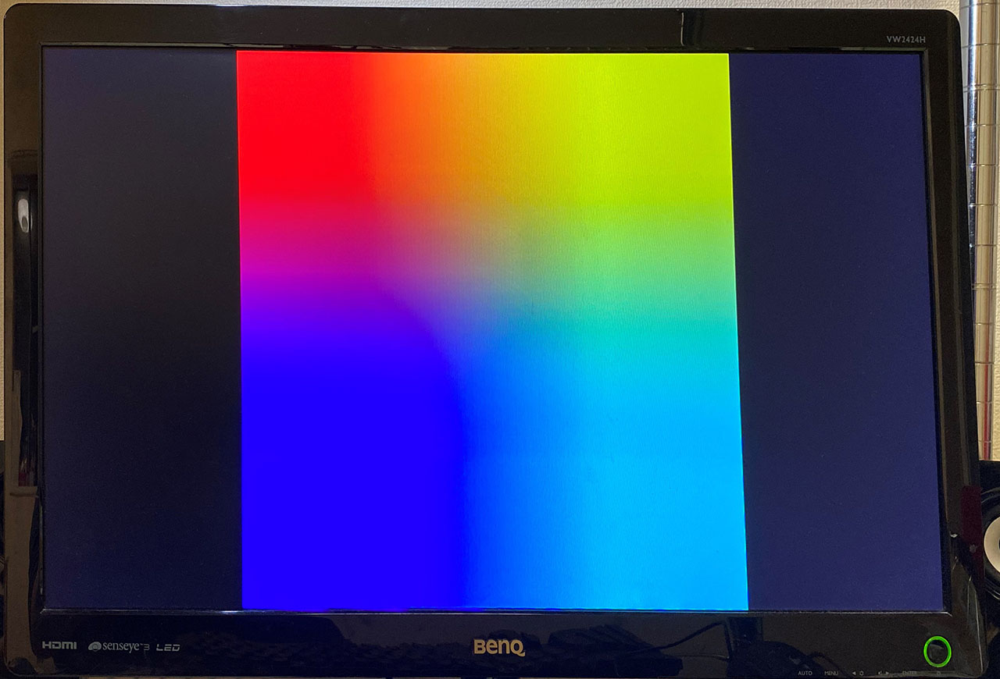

以後、起動時はスプラッシュスクリーンとして上のような虹色の画面が一瞬映る。

再起動直後。デスクトップが表示された。

## Noto Fonts CJK 周りのエラーを確認する

初期設定中に Noto Fonts CJK 関連でアップデートに失敗していたので、その部分を見ておく。

Raspbian OS は、Ubuntu の源流と同じ Debian OS がベースなので、ターミナルから `apt` コマンドでパッケージの管理をしても良い。だが今回は、Raspbian OS に同梱されている GUI アプリ__「Add / Remove Software」__を使用してみる。

画面左下のラズパイアイコンを押下し、メニューを開いたら、「設定」→「Add / Remove Software」を選ぶ。

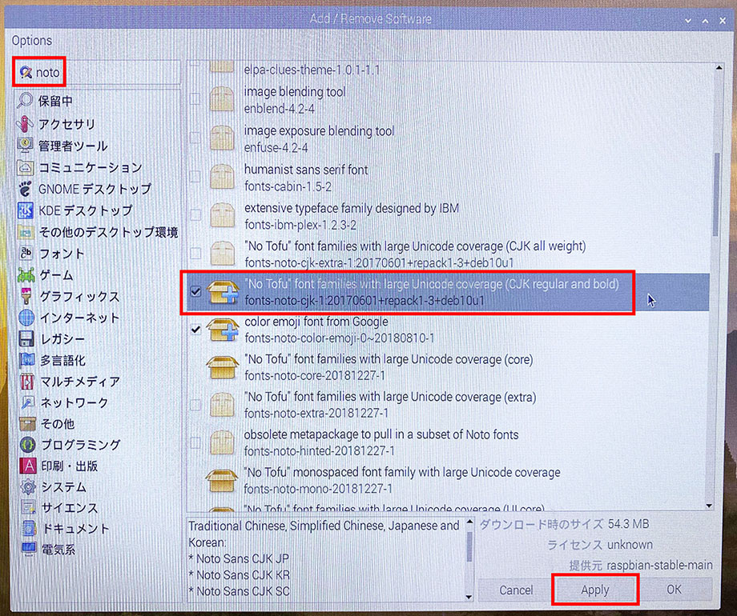

ウィンドウが開いたら左上の検索窓から_「noto」_などと検索し、

- _"No Tofu" font families with large Unicode coverage (CJK regular and bold)_
  - `fonts-noto-cjk-【バージョン】`

パッケージを見つけてチェックを入れる。

スクショの1つ上に映っている `fonts-noto-cjk-extra-……` というのが、初期設定でエラーが出ていたパッケージだと思うが、どちらでもお好きに。

- color emoji font from Google
  - `fonts-noto-color-emoji`
- "No Tofu" monospaced font family with large Unicode coverage
  - `fonts-noto-mono`

など、Noto Fonts 系のメタパッケージは他にもあるので、お好みで選択しておく。

チェックを入れたら、画面右下の「Apply」ボタンを押してインストールする。

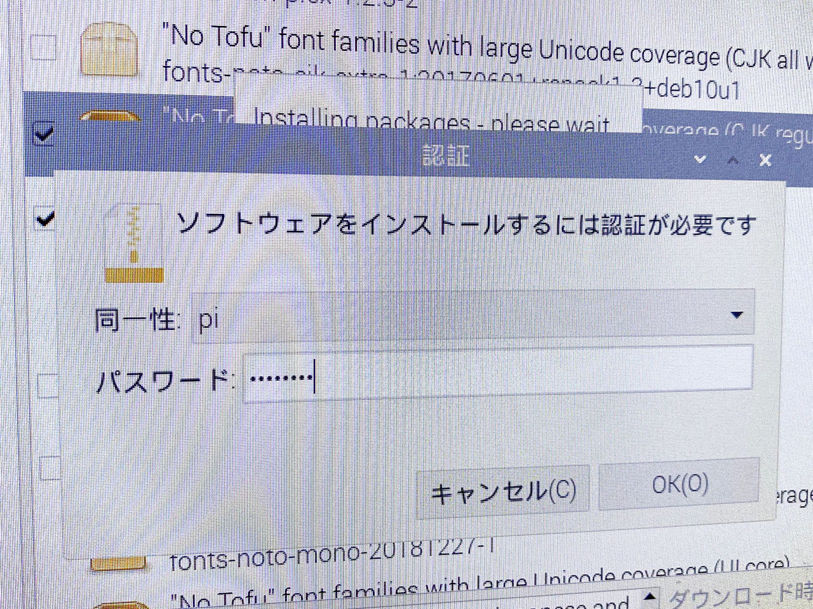

その際、「pi」ユーザのパスワードを問われるので、初期設定で指定したパスワードを入力する。コレでフォントがインストールできただろう。

まさに `sudo apt install` コマンドを実行している状態で、Ubuntu における「ソフトウェアセンター」に近いアプリである。

## 以上

初回起動時のセットアップはコレにて終了。とりあえずラズパイが起動し、日本語表示できるようになった。

実はこの時点だとまだ日本語入力ができないので、次回は日本語入力の手順を紹介していこう。
