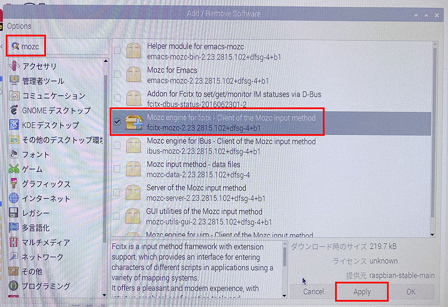
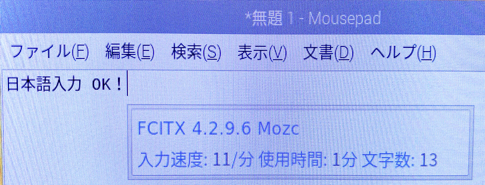

Raspberry Pi 4 を購入し、NOOBS による Raspbian OS 環境をセットアップした。

とりあえず起動して動くようになったので、今回は Fcitx と Mozc を使って日本語入力環境を構築する。

## 目次

## Fcitx-Mozc とは

Fcitx と Mozc という組合せは、過去に Ubuntu 環境を構築した時にも紹介しているが、ココでも改めて。

*Fcitx* は入力メソッド切り替えのためのツール。「無変換」を押したら IME を切って、「変換」を押したら ON にする、みたいな動作を担うモノ。自分は普段 US キーボードを使っていて、どの OS でも*「左右の Alt キーの空打ち」*で IME の ON / OFF を切り替えている。Fcitx はこの設定がやりやすいので気に入っている。

**Mozc** は、「Google 日本語入力」のオープンソース版。自分は「Google 日本語入力」を好んで使っているので、Linux 環境では Mozc を選んでいるというワケだ。

これらは Fcitx-Mozc という単一パッケージでセットでインストールできる。

## Fcitx-Mozc をインストールする

それではインストールしていこう。

スタートメニュー → 「設定」 → 「Add / Remove Software」を選択し、「mozc」などと検索する。

- Mozc engine for fcitx - Client of the Mozc input method
  - `fcitx-mozc`

コレを見つけたらチェックを入れ、「Apply」ボタンを押す。pi ユーザのパスワードを聞かれたら入力し、インストールしたら再起動する。

再起動すると入力切替のインジケータが表示されるので、Fcitx および Mozc の設定ができるようになる。お好みで IME の ON / OFF 設定やキー設定を変更してやると、思ったように使えるであろう。

## 以上

日本語入力環境も整い、コレでラズパイ4をデスクトップライクに使えるようになっただろう。

- 参考：[Raspberry Piの日本語入力メソッドは、fcitx-mozcで決まり！│FABSHOP.JP -デジタルでものづくり！ ファブショップ ！](https://www.fabshop.jp/raspberrypi-fcitx-mozc/)
- 参考：[【STEP-10】日本語入力メソッド fcitx-mozc のインストール│FABSHOP.JP -デジタルでものづくり！ ファブショップ ！](https://www.fabshop.jp/%E3%80%90step-10%E3%80%91%E6%97%A5%E6%9C%AC%E8%AA%9E%E5%85%A5%E5%8A%9B%E3%83%A1%E3%82%BD%E3%83%83%E3%83%89fcitx-mozc%E3%81%AE%E3%82%A4%E3%83%B3%E3%82%B9%E3%83%88%E3%83%BC%E3%83%AB/)
