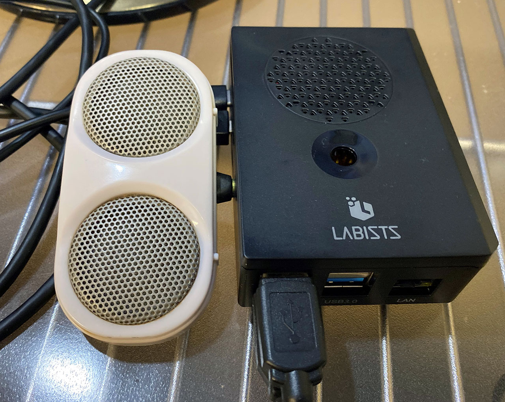
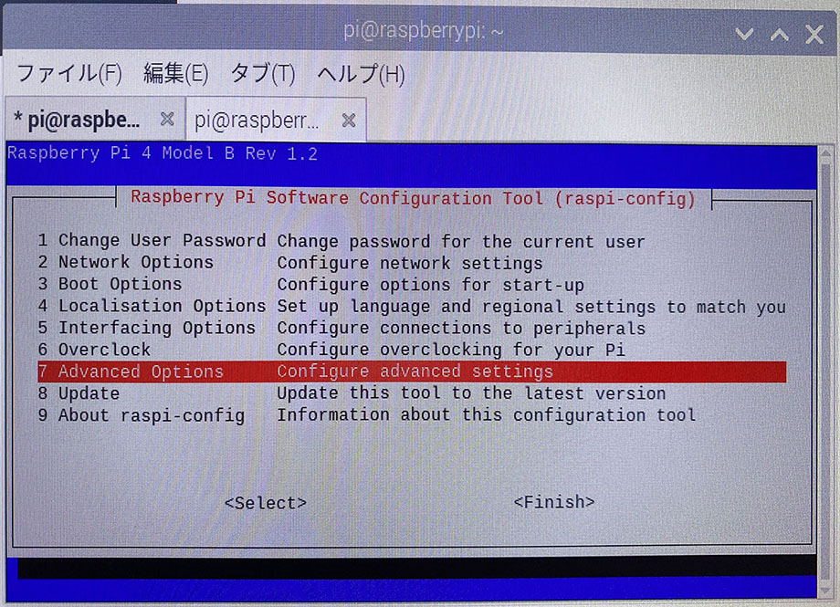
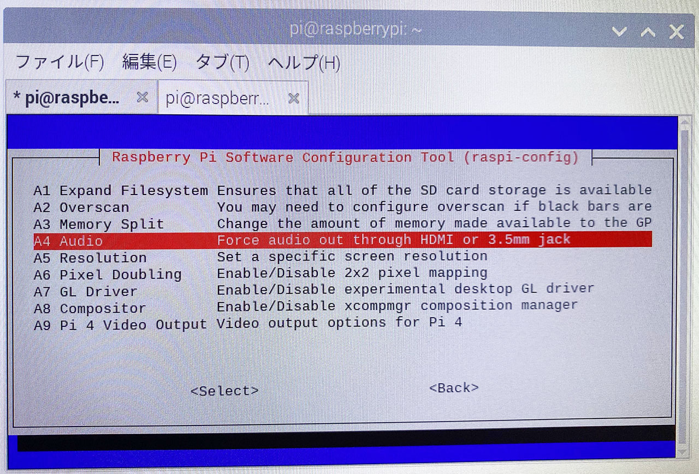
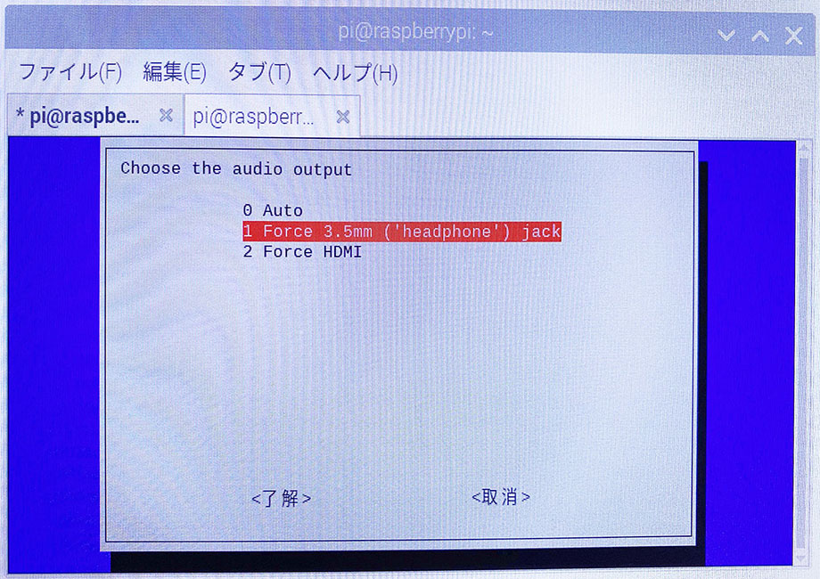
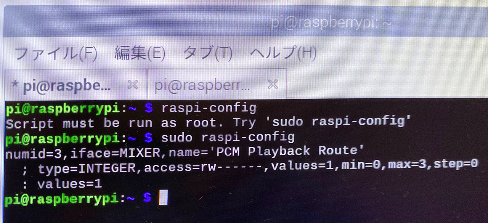

Raspberry Pi 4 の AUX Out (3.5mm イヤホンジャック) に、昔買った電源不要のスピーカーを繋いでみた。

そしたら、音が鳴らない。スピーカーが壊れているのかと思ったが、どうやら HDMI ケーブルを繋いでいる時に AUX Out に信号が行かない場合があるらしい。

解消法は簡単で、ターミナルから __`$ sudo raspi-config`__ コマンドを実行して設定する。

`$ sudo raspi-config` コマンドを叩くと上のような TUI のメニュー画面が開く。この中から

- `7 Advanced Options`

を選ぶ。

続いて

- `A4 Audio`

を選ぶ。

ココで、音声の出力先を指定できる。`0 Auto` だと HDMI の方に音声が流れてしまうようなので、

- `1 Force 3.5mm ('headphone') jack`

を選ぶ。

そうするとヘッドホンジャックから音が出るようになる。

ちなみに `raspi-config` は `sudo` 必須だ。

- 参考：[Raspberry Pi3 にてオーディオジャックから音声を出力する - Qiita](https://qiita.com/Higemal/items/950712475e18a4ae1997)
