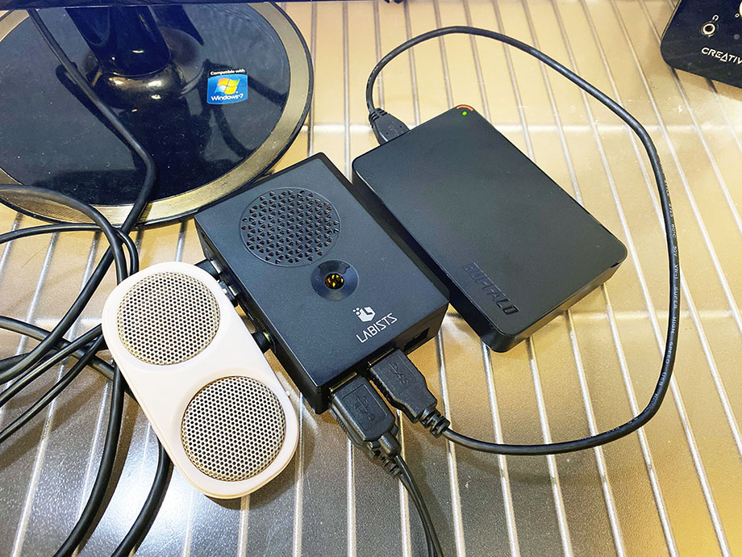

普段 Windows マシンに接続して使っている、NTFS 形式でフォーマットされた外付け HDD。コレをラズパイ4に繋いでみた。

Raspbian OS において NTFS フォーマットのドライブを認識させるには、**`ntfs-3g`** というパッケージをインストールする必要がある。

```bash
$ sudo apt install -y ntfs-3g
```

パッケージをインストール後、USB で接続すると、すぐに認識してくれた。ファイルの読み書きも正常に行えた。特にコレ以外の設定は必要なくて楽チンだった。



↑ 電源不要のミニスピーカーを左に挿し、右下の USB 3.0 ポートから外付け HDD を接続している。

- 参考 : [RaspberryPi 3 にUSBの外付けHDD（NTFSフォーマット）を接続する - min117の日記](http://min117.hatenablog.com/entry/2017/02/21/125825)
- 参考 : [Rapberry PiへNTFSの外付けHDDのマウント方法: ゆるガジェCHANNEL](http://yurugadge-channel.com/article/185114382.html)
- 参考 : [Raspberry Pi 4でPythonを勉強する環境を作る | 🌴 officeの杜 🥥](https://officeforest.org/wp/2020/03/15/raspberry-pi-4%E3%81%A7python%E3%82%92%E5%8B%89%E5%BC%B7%E3%81%99%E3%82%8B%E7%92%B0%E5%A2%83%E3%82%92%E4%BD%9C%E3%82%8B/)
