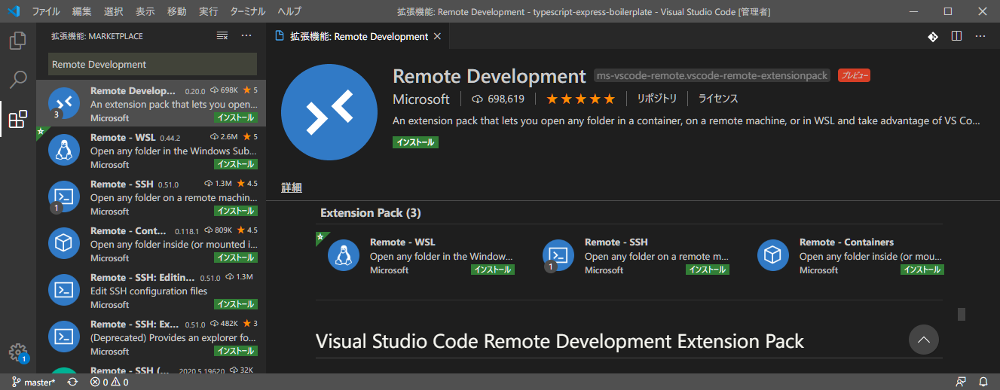
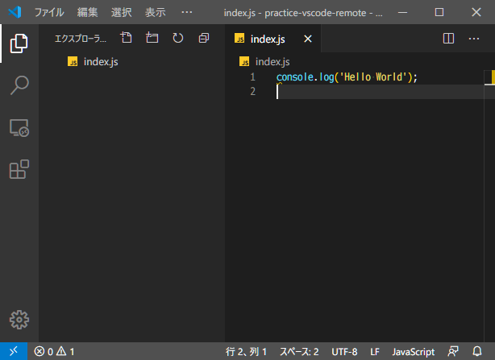
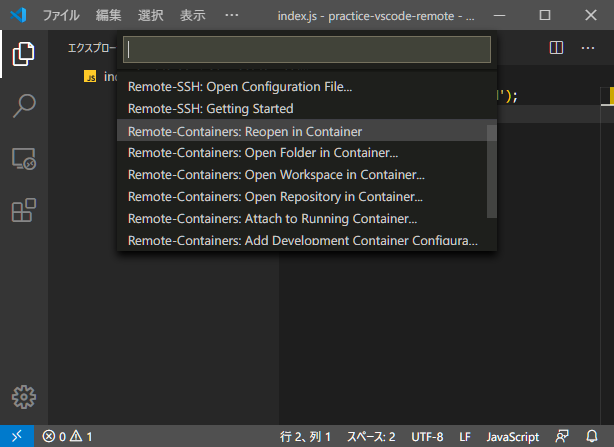
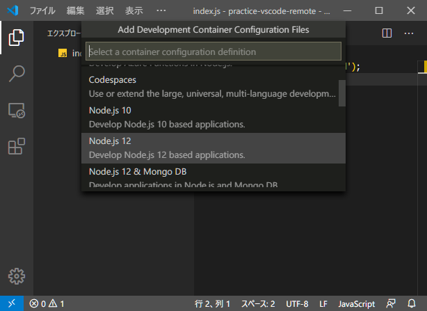
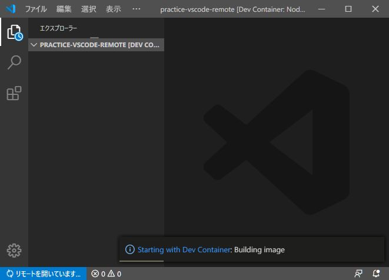
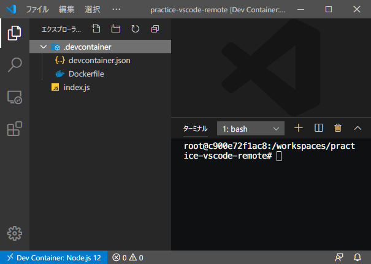
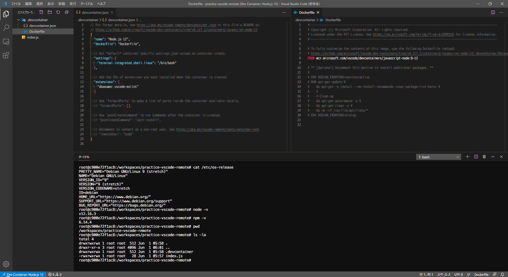
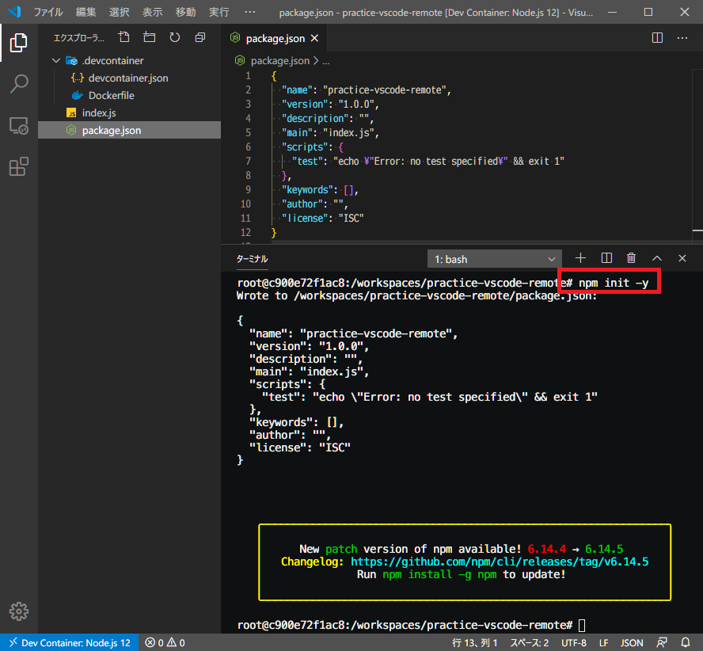
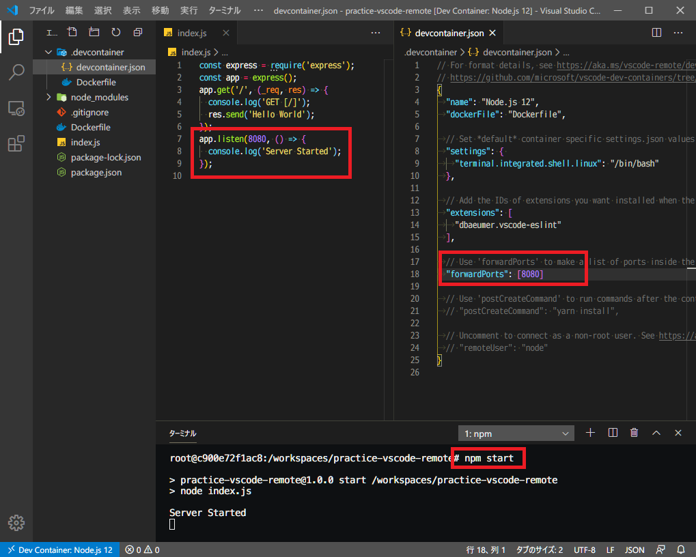
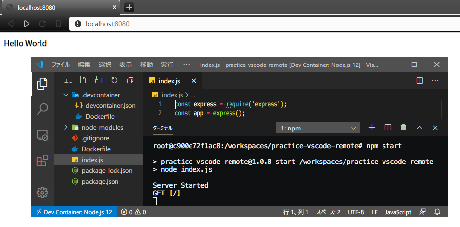

VSCode のワークスペースに対応する開発用の Docker コンテナを簡単に立ち上げられる拡張機能があるので試してみた。

## 目次

## VSCode Remote Development Extension Pack

Microsoft が提供している、*VSCode Remote Development* という拡張機能パックがある。コレには以下の拡張機能がセットになっている。

- **[Remote Development (`ms-vscode-remote.vscode-remote-extensionpack`)](https://marketplace.visualstudio.com/items?itemName=ms-vscode-remote.vscode-remote-extensionpack)**
  - *[Remote - Containers (`ms-vscode-remote.remote-containers`)](https://marketplace.visualstudio.com/items?itemName=ms-vscode-remote.remote-containers)*
  - [Remote - WSL (`ms-vscode-remote.remote-wsl`)](https://marketplace.visualstudio.com/items?itemName=ms-vscode-remote.remote-wsl)
  - [Remote - SSH (`ms-vscode-remote.remote-ssh`)](https://marketplace.visualstudio.com/items?itemName=ms-vscode-remote.remote-ssh)
      - [Remote - SSH: Editing Configuration Files (`ms-vscode-remote.remote-ssh-edit`)](https://marketplace.visualstudio.com/items?itemName=ms-vscode-remote.remote-ssh-edit)

今回紹介するのは「*Remote Containers*」という拡張機能だが、その他の拡張機能もそれぞれ便利なので、いっそのこと Remote Development でまるごとインストールしてしまえばいいかなと思う。

Remote Containers は Docker を使用するので、Docker を事前にインストールしておく必要がある。Windows 10 Home ユーザ向けの「Docker Toolbox」では動作しないので、Docker Desktop をインストールすること。

## Remote Containers を使うと何が良いのか

Remote Containers 拡張機能を使うと何が便利なのだろうか。

大きなメリットは、Docker コンテナ内に開発環境を作ることで、ホスト環境を汚さないことだ。Node.js や Python といった開発言語ごとのランタイムをホストにインストールすることなく使用できるし、npm や pip といったパッケージ管理ツール、そしてそれらのバージョンを管理する nvm や pipenv など、ホスト環境にインストールしてしまうと、複数のプロジェクトを渡り歩く時にどうしても管理が煩雑になることがある。

一方、Remote Containers を使ってワークスペースごとに Docker コンテナを用意すると、ホスト環境には何もインストールすることなく、プロジェクト単位に閉じた開発環境・実行環境が用意できるワケだ。

自分で開発環境用の Dockerfile を書いて叩いても似たような結果にはなるが、Remote Containers 拡張機能を使用すると、ホスト環境の VSCode とシームレスに繋がるので、より迅速に開発が進められるのだ。

## 実際に使ってみる

…とはいっても、この機能はまだ日本語情報が少なく、古い情報が混在していて分かりづらい。今回はさわりのさわりだけ使ってみることにする。

今回は Node.js ベースのアプリを開発するテイで Remote Containers を試してみる。ホスト環境は Windows 10 Pro。

まずは適当なディレクトリを作り、上のスクショのように適当に `index.js` を書いてみる。ホスト環境には Node.js がインストールされていないとして、コレを実行できるような Docker コンテナを立ち上げてみたい。

Remote Containers 拡張機能をインストールすると、ウィンドウ左下に**青い山カッコのアイコン**が表示されている。コレを押下すると *Remote Development* メニューを呼び出せる。

その中から「*Remote-Containers: Reopen in Container*」を選ぶ。コレで、現在開いているワークスペースをコンテナ環境で開き直すことができる。

「Select a container configuration definition」に移ると、雛形となるコンテナを選択できる。今回は Node.js ベースのプロジェクトにするので、「Node.js 12」を選択してみる。

するとウィンドウが開き直され、何やら「リモートを開いています…」という準備が始まる。初回は色々な Docker イメージをダウンロードしたりするので結構待たされる。

しばらく待つと開発コンテナ環境が立ち上がる。フォルダツリーを見ると、最初に作っていた `index.js` 以外に

- `.devcontainer/`
  - `devcontainer.json`
  - `Dockerfile`

といったファイルが自動生成されている。コレが Remote Containers で参照する開発用コンテナの設定となる。

さらにターミナルを開くと、普段とは異なるプロンプトが開いている。既に開発用コンテナの中に入っているようだ。

もう少し詳しく見てみたのが上のスクショ。`devcontainer.json` は開発用コンテナと VSCode との連携設定が記されている。`Dockerfile` は開発用の Node.js コンテナをベースにしているだけ。

一方ターミナルの方を見てみると、開発用コンテナは Debian 9 (Stretch) ベースで、`node` コマンドや `npm` コマンドが動作する状態だ。そしてワークスペースのディレクトリがマウント (フォルダ共有) されているので、VSCode のフォルダツリーと同じ内容がコンテナ内でも確認できていることが分かる。

ホスト環境には Node.js をインストールしていないというテイで話を進めると、Docker コンテナには Node.js 環境がセットアップされているので、ターミナルから `npm init` を叩けば `package.json` が生成できるし、開発を進めていけばコンテナ内でライブリロード開発ができたりする。

## ホストにポートフォワードする

続いて少し発展的なことをやってみる。

Docker コンテナ内で `$ npm install -S express` を実行し、Express をインストールする。そして `index.js` を書き換えて、8080番ポートで Express サーバを立ち上げるようなコードを書いてみる。

この状態で、コンテナ内で `$ npm start` を実行すれば Express サーバが起動するが、動作しているのは Docker コンテナ内なので、ホストマシンの `localhost:8080` を開いても何も表示されない。そのため、ポートフォワードの設定が必要となる。

`devcontainer.json` を開き、**`"forwardPorts": [8080]`** という設定を追加する。そしてこのワークスペースを開き直すと設定が反映され、ホストマシンの `localhost:8080` から、Docker コンテナ内の Express サーバに通信が転送されるようになる。

というワケで上のスクショのように、ホストマシンの Chrome で `http://localhost:8080` を開いて、「Hello World」なるレスポンスを受け取れた。

自前で Dockerfile を書いて `EXPOSE` したりするよりも格段に楽だろう。

リモート接続を終了する際は、左下のアイコンを押下してコマンドメニューから「リモート接続を終了する」を選べば良い。

## 今回はココまで

ホントにさわりしか試していないが、今日はココまで。

この拡張機能を使って開発すると、Docker イメージをバンバン使うので、ホストマシンのスペックは結構潤沢なモノが求められる。

しかし、ホスト環境を汚さず、それでいて VSCode と Docker はそこそこ高速に連携して動作してくれるので、新たな開発手法として一般化していくモノと思われる。

本番で使用する自前の Dockerfile と、Remote Containers が用意する開発用コンテナを上手くマージして Docker-Compose として動作させる方法もあったりする。本番環境とかなり近い環境で開発できることで、環境固有の不具合に遭遇したりすることを避けられるだろう。

- [VSCode + WSL 開発。Remote WSL 拡張機能を使ってみた](./22-01.html)
- [VSCode + SSH 開発。Remote SSH 拡張機能を使ってみた](./23-02.html)
