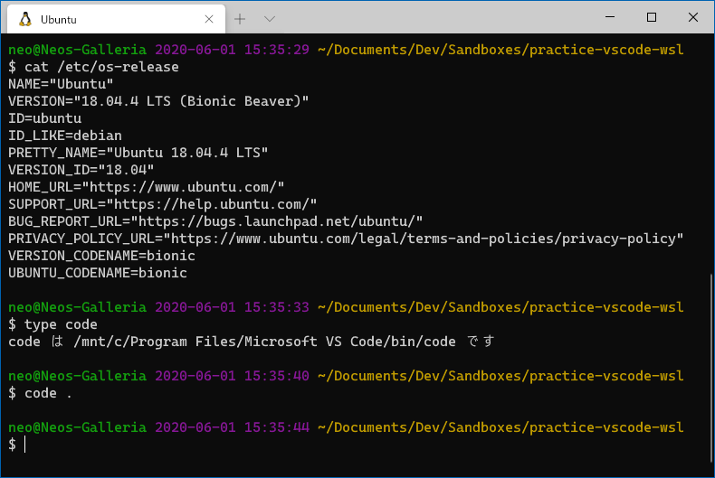
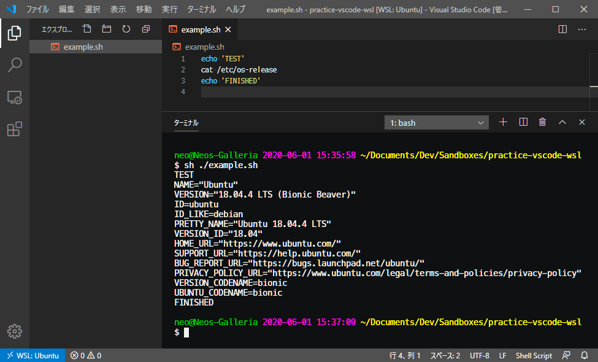
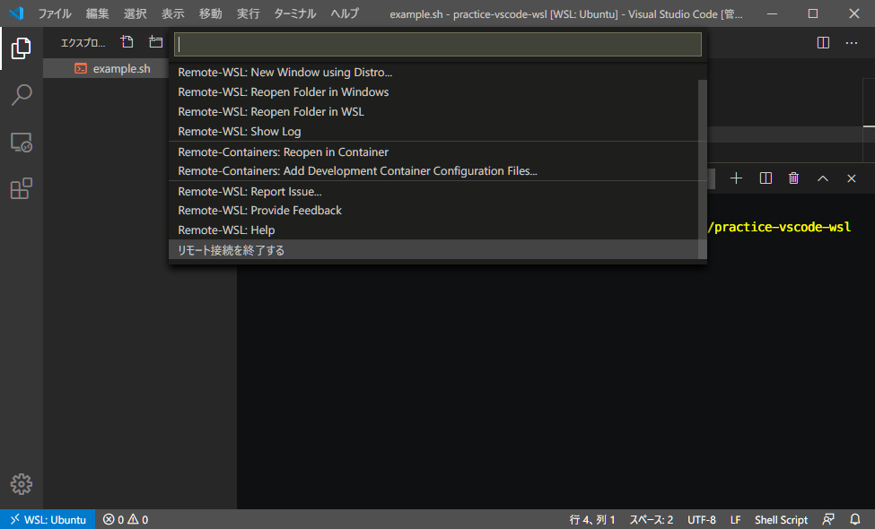
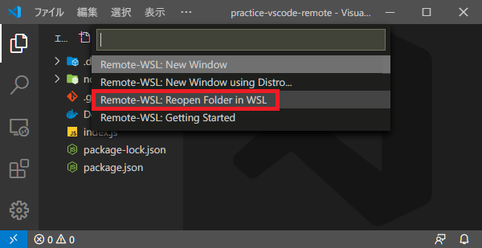
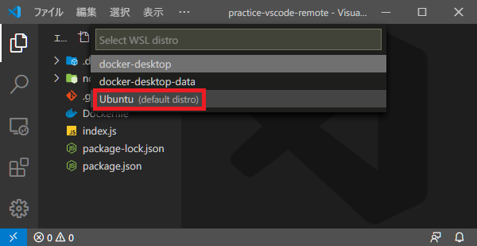
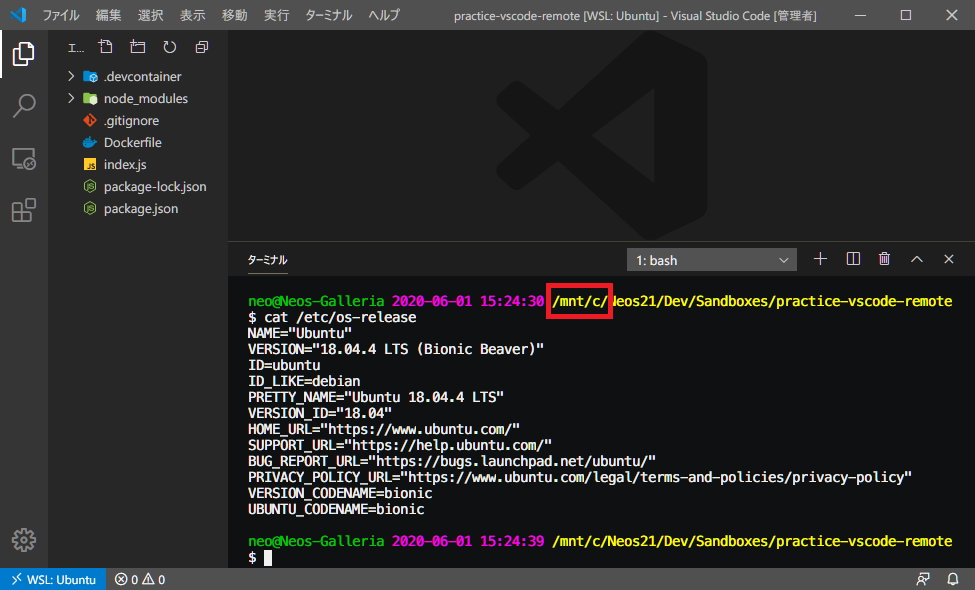

前回に引き続き、**VSCode Remote Development** 拡張機能パックのお話。

- [VSCode + Docker 開発。Remote Containers 拡張機能を使ってみた](./21-01.html)

今回は、WSL 内のディレクトリを Windows 側の VSCode で開ける、**Remote WSL** 拡張機能を使ってみる。

- [Remote - WSL - Visual Studio Marketplace](https://marketplace.visualstudio.com/items?itemName=ms-vscode-remote.remote-wsl)

## 目次

## Remote WSL を使うと何が良いのか

Windows OS に直接 Ruby や Python といった開発言語をインストールし、pyenv やら何やら環境をセットアップしていこうとすると、どうしても Linux 環境と同じようにセットアップできないところが出てくる。MacOS だと BSD ベースなのでまだマシなのだが、Windows は改行コードもエンコーディングも、フォルダパスの区切り文字も異なったりして、トラブルがとにかくおおい。

WSL が登場し、Windows 上で簡単に Linux 環境を扱えるようになった。WSL の中なら普通の Linux マシンと同じ感覚で開発言語やパッケージ管理ツールをインストールでき、OS の差異による影響を受けにくくなった。

しかし、WSL は CUI での利用が主で、GUI 環境を利用するのはなかなか難しい。WSL 側に Node.js やらをインストールしたが、VSCode は Windows 側にインストールしてあり、開発環境と実行環境を行き来するのが大変だと感じた人もいることだろう。

そこでこの *Remote WSL* 拡張機能の出番である。WSL と Windows ホストをシームレスに連携できるのがこの拡張機能だ。実際にどういう動きになるのかは、このあと見ていこう。

## 前提条件

前提条件というか、自分が検証した内容をまとめておく。

- OS : Windows 10 Pro
- WSL 2 で Ubuntu 18.04 をインストール済
- 次の VSCode 拡張機能をインストール済
  - **[Remote Development (`ms-vscode-remote.vscode-remote-extensionpack`)](https://marketplace.visualstudio.com/items?itemName=ms-vscode-remote.vscode-remote-extensionpack)** (拡張機能パック)
  - [Remote - WSL (`ms-vscode-remote.remote-wsl`)](https://marketplace.visualstudio.com/items?itemName=ms-vscode-remote.remote-wsl)

ちなみに、Remote WSL 拡張機能は MacOS なんかにインストールしても問題は起こらない。使い物にならないだけ。ｗ

## 実際に使ってみる

それでは実際に使ってみよう。

まずはターミナルで WSL にアクセスする。以下のスクショでは Windows Terminal を使い、WSL Ubuntu にアクセスしている。

そして WSL 内の開きたいディレクトリに移動したら、**`$ code .`** コマンドを叩いて VSCode を起動する。

すると VSCode が起動し、ウィンドウ左下に *WSL: Ubuntu* と表示される。Remote WSL 拡張機能によって、WSL の当該ディレクトリと接続できていることが分かる。

コレは開発用 Docker コンテナを立ち上げる「Remote Containers」拡張機能と同様の状態で、コンテナの代わりに WSL 環境が利用されているという感じ。

フォルダツリーで右クリックして「新しいファイル」を作れば WSL 内にファイルが作られ、VSCode ターミナルを開けば WSL が開く。上のスクショはシェルスクリプトを (Windows ホストの) VSCode で実装して、WSL 内で実行している様子だ。

接続を終了する場合は左下の青いアイコンを押下し、「リモート接続を終了する」を選べば良い。

## Windows 側のディレクトリを Remote WSL で開かない方が良い

基本的な使い方は以上のとおり。

ココまでの手順では WSL 内のディレクトリを Windows ホスト側で開いたが、逆に Windows ホスト側の任意ディレクトリを WSL 側で開くこともできる。

↑ こんな風に、Windows 側のワークスペースを WSL Ubuntu で開き直したりは、一応できる。

そしてこのとおり、パスとしては **`/mnt/c/`** で始まっており、Windows ホスト側のファイルを WSL で操作している状態になる。

このように `/mnt/c/` 配下の操作もできてしまうのだが、ファイルシステムの違い等から不具合が起こることがあるため、Microsoft 公式としては推奨していないそうだ。

というワケで、ランタイムのインストールも、ワークスペースの配置場所も、WSL 内に寄せておいて、VSCode だけホスト側に用意しておき Remote WSL 拡張機能で接続する、という使い方が安全であろう。

## 以上

WSL 環境をほとんどネイティブに利用できるようになる拡張機能だった。

まだまだ日本語文献も少なく、WSL 自体がまだ Experimental なところもあるが、コレからの Windows での開発手法として主流になりそうな拡張機能なので、今後も動向をチェックしていくとする。

- [VSCode + SSH 開発。Remote SSH 拡張機能を使ってみた](./23-02.html)
