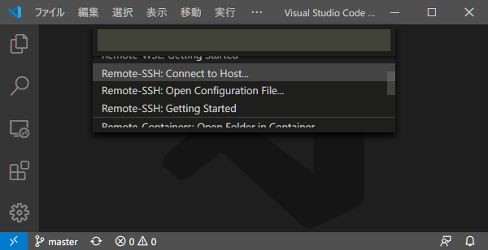
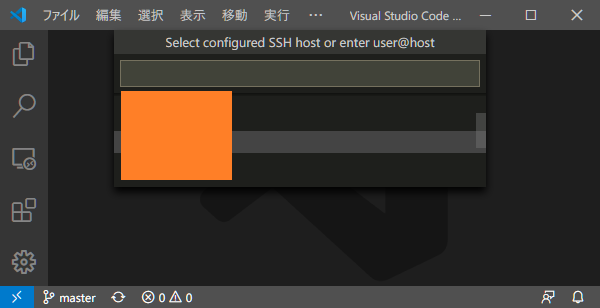
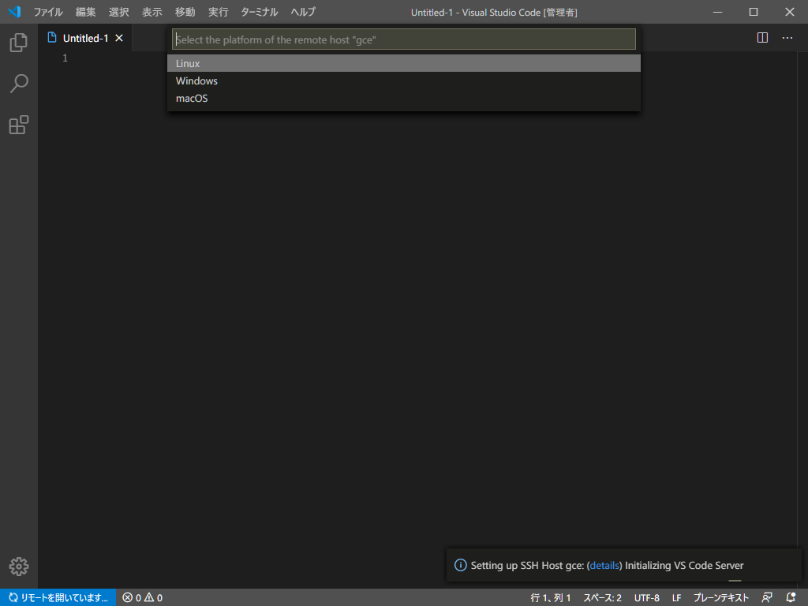
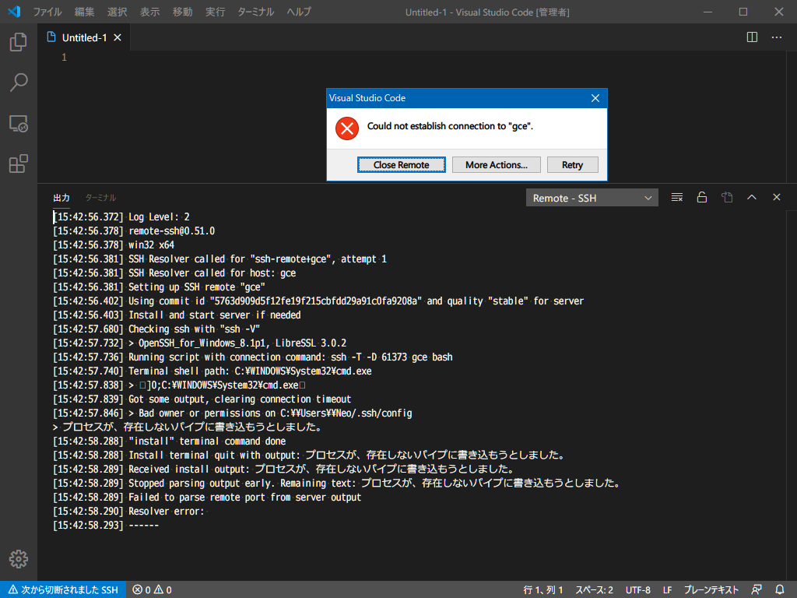
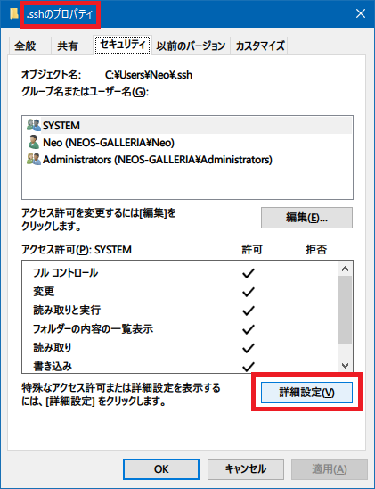
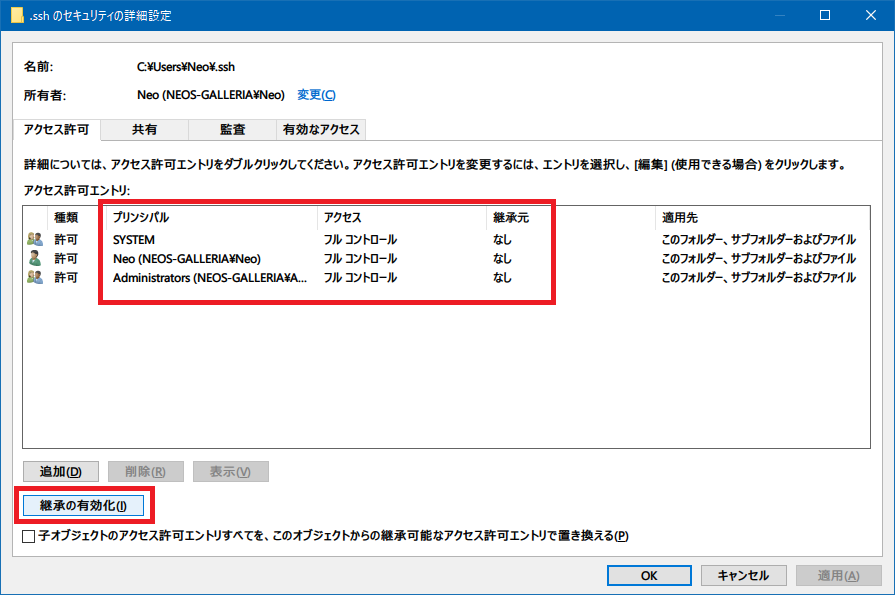
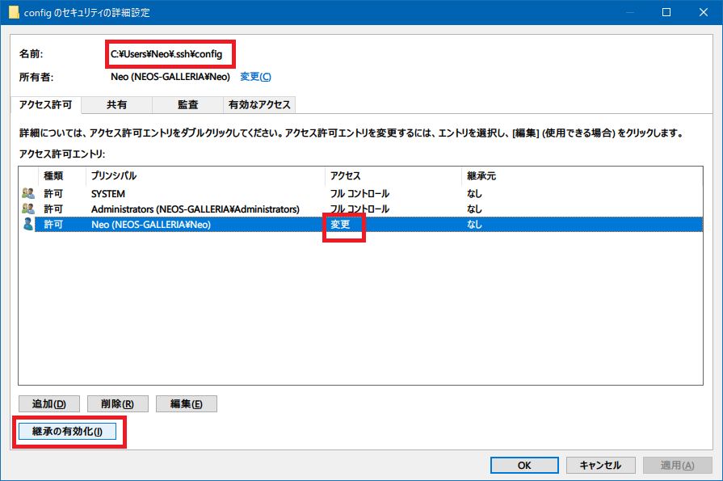
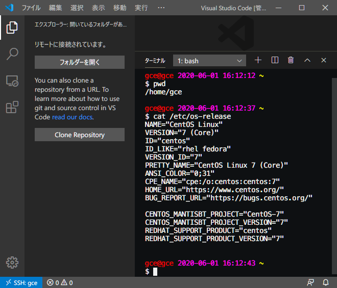
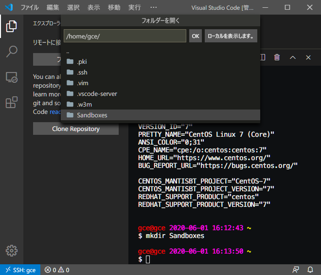
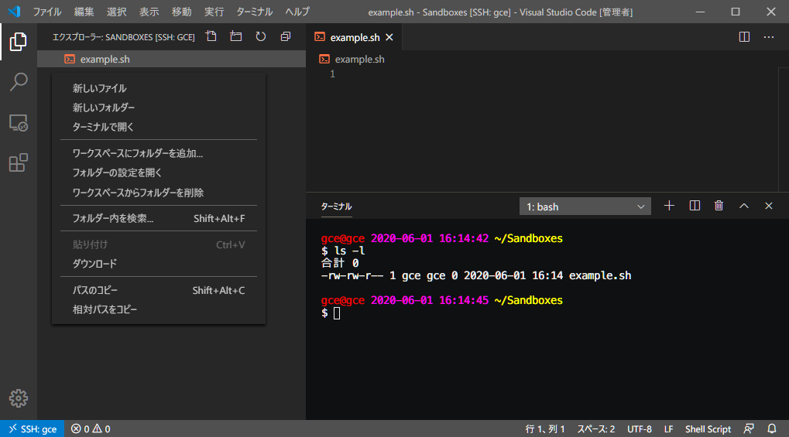

**VSCode Remote Development** Extension Pack 概説第3弾。

- 開発用の Docker コンテナを立ち上げる *Remote Containers*
  - [VSCode + Docker 開発。Remote Containers 拡張機能を使ってみた](./21-01.html)
- WSL 環境を VSCode で開く *Remote WSL*
  - [VSCode + WSL 開発。Remote WSL 拡張機能を使ってみた](./22-01.html)

そして今回は、**SSH 接続先サーバのディレクトリをホスト側の VSCode で開ける**という前代未聞の拡張機能、**Remote SSH** を紹介する。

- [Remote - SSH - Visual Studio Marketplace](https://marketplace.visualstudio.com/items?itemName=ms-vscode-remote.remote-ssh)

## 目次

## Remote SSH を使うと何が良いのか

Remote SSH 拡張機能は、SSH で接続したサーバの、任意のディレクトリを、ホスト側の VSCode で開けるというモノ。

SSH 接続先サーバが GUI を持たず、VSCode をインストールしていない状況でも、ホスト側の慣れ親しんだ VSCode 環境を使って、SSH 接続先を直接編集できるというワケだ。

この拡張機能により、AWS EC2 上で直接開発をしてみたり、本番稼動しているソースコードを読みやすい環境で読んだりすることができる。ホストマシンにアレコレインストールする必要がなくなるという意味でも便利だ。

## Windows で使おうとしたらエラー発生。アクセス権を編集する

早速使ってみるが、SSH 接続しようとしたところでエラーが発生した。事象の再現手順と解消方法を紹介していく。

まず VSCode のウィンドウ左下の青いアイコンを押下し、

- `Remote-SSH: Connect to Host...`

を選択する。

`~/.ssh/config` に定義した接続先のホスト名がリスト表示されるので、接続したいサーバを選択する。

ウィンドウが開き直され、「Select the platform of the remote host」という問が出てくる。接続先サーバは Linux マシンなので、「Linux」を選択する。

すると上のようなエラーが出た。

- `Bad owner or permissions on C:\\Users\\Neo/.ssh/config`
- `プロセスが、存在しないパイプに書き込もうとしました。`

こんな感じのエラーメッセージが出てしまった。ひとまず「Close Remote」ボタンを押して中止する。

対処法を色々調べたところ、次の記事で紹介されていた権限設定で直せた。

- 参考：[Windows10でvscodeからSSHできるようになるまで - Qiita](https://qiita.com/yumetodo/items/123cd1d91f913bf0e748)

まずはエクスプローラで次の SSH フォルダのプロパティを開く。

- `C:\Users\【ユーザ名】\.ssh`

「`.ssh` フォルダのプロパティ」で「セキュリティ」タブを選択し、「詳細設定」ボタンを押す。

そしたら上のスクショのようになるよう、アクセス許可を設定していく。

1. まずは下部の「**継承の無効化**」ボタンを押下する。確認ダイアログが表示されるので、「継承されたアクセス許可をこのオブジェクトの明示的なアクセス許可に変換します。」を選ぶ
2. 「Users」や「Authenticated Users」が存在したら「削除」し、一旦「Administrators」と「System」だけにしておく。これらは「アクセス：フルコントロール」「継承元：なし」となっていること
3. 「追加」ボタンを押下し、「プリンシパルの選択」を選ぶ
4. 自分の Windows ユーザ名を入力し、「名前の確認」ボタンを押下し、OK ボタンを押す
5. 「アクセス許可エントリ」は「フルコントロール」を選択し全てにチェックが入る状態にする

ということで、上のスクショのような状態にする。

続いて、SSH Config ファイルのアクセス権を調整する。

- `C:\Users\【ユーザ名】\.ssh\config`

コチラも、上のスクショのように設定を変更していく。`~/.ssh/` ディレクトリに設定した権限と一箇所だけ異なり、Windows ユーザに与えた権限は「フルコントロール」ではなく「*変更*」とすること。

1. 「**継承の無効化**」ボタンを押下。確認ダイアログは「継承されたアクセス許可をこのオブジェクトの明示的なアクセス許可に変換します。」を選ぶ
2. 「Users」や「Authenticated Users」が存在したら「削除」し、一旦「Administrators」と「System」だけにしておく。これらは「アクセス：フルコントロール」「継承元：なし」となっていること
3. 「追加」ボタンを押下し、「プリンシパルの選択」を選ぶ
4. 自分の Windows ユーザ名を入力し、「名前の確認」ボタンを押下し、OK ボタンを押す
5. 「アクセス許可エントリ」で、一旦「フルコントロール」を選択し全てにチェックを入れたら、「フルコントロール」のチェックだけ再度外すことで、アクセス許可が「*変更*」になるようにする

コレで上のスクショのようになるはず。

ココまでアクセス権を変更したら、今度は正しく SSH 接続できるようになっているはず。

## 再接続

前述のとおり、VSCode のコマンドパレットより

- `Remote-SSH: Connect to Host...`

を選択し、`~/.ssh/config` に記載されているホストから接続したいホストを選択する。

無事 SSH 接続ができると、次のスクショのようにウィンドウ左下が「SSH: 【ホスト名】」といった表示に切り替わっている。

VSCode ターミナルを開くと SSH 接続先サーバのプロンプトが開いていることが分かるだろう。

フォルダツリーから「フォルダーを開く」を選択すると、以下のように SSH 接続先のディレクトリが選べるようになる。

ディレクトリを選択するとそのディレクトリが VSCode で開かれる。

Remote Containers や Remote WSL 拡張機能と同様に、SSH 接続先サーバと同期した状態になっているので、VSCode 上で「新しいファイル」を作って保存してやると、SSH 接続先サーバにそのファイルが置かれているというワケ。裏で scp みたいなことしてるのかな。すごいな。

## 以上

ホストマシンの VSCode 環境から、任意のリモートサーバを開発環境・実行環境として利用できる Remote SSH。

前回、前々回に紹介した Remote Containers、Remote WSL とともに、リモート開発を促進していける拡張機能なので、今後もキャッチアップしていきたい。
