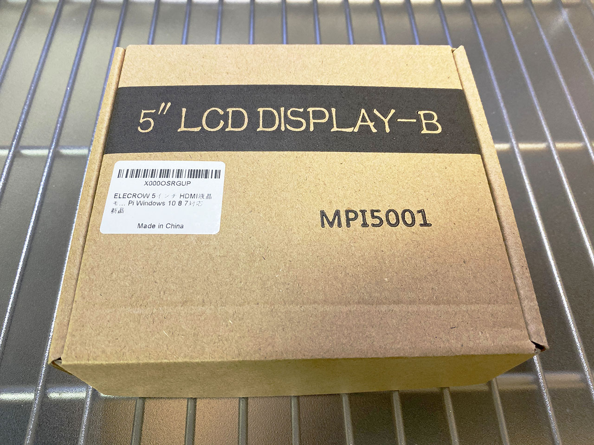
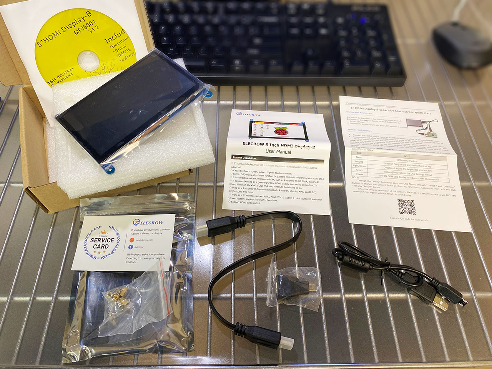
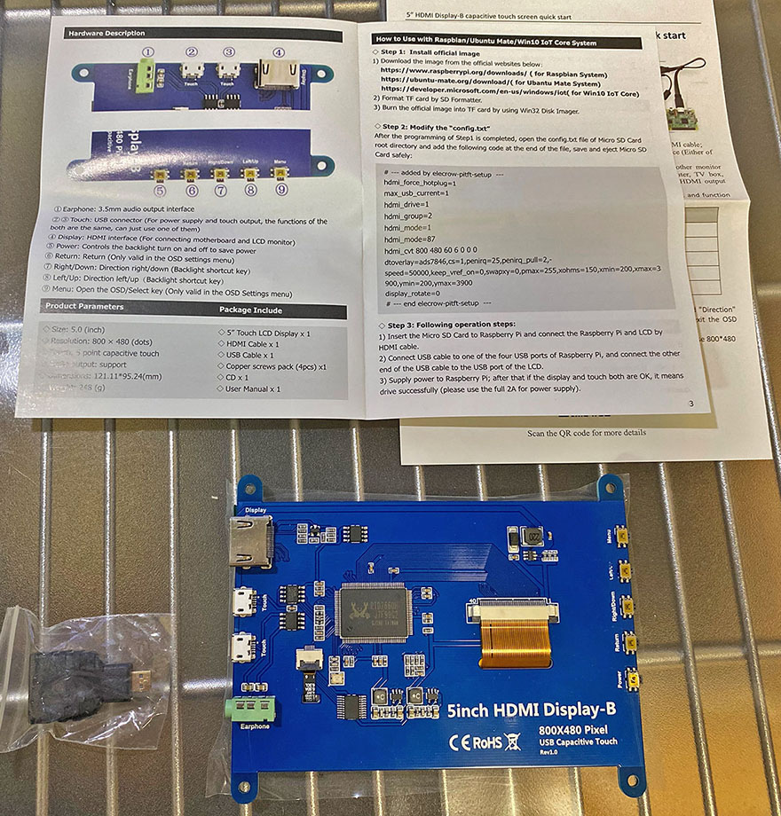
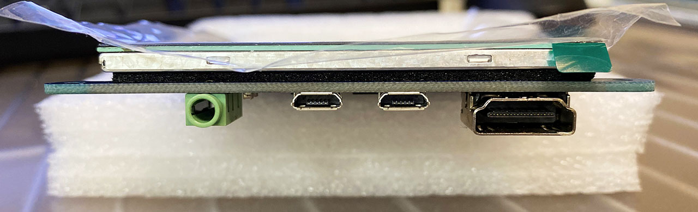
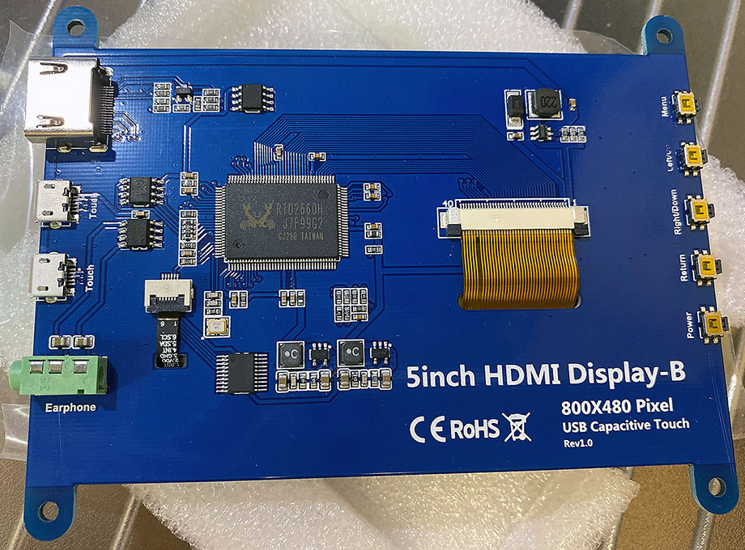
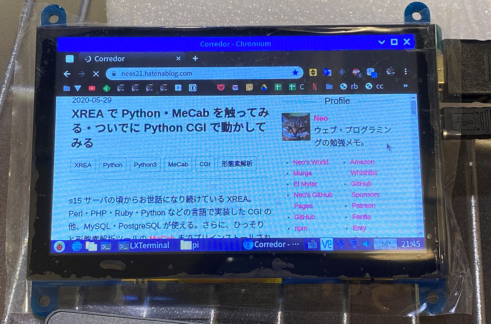
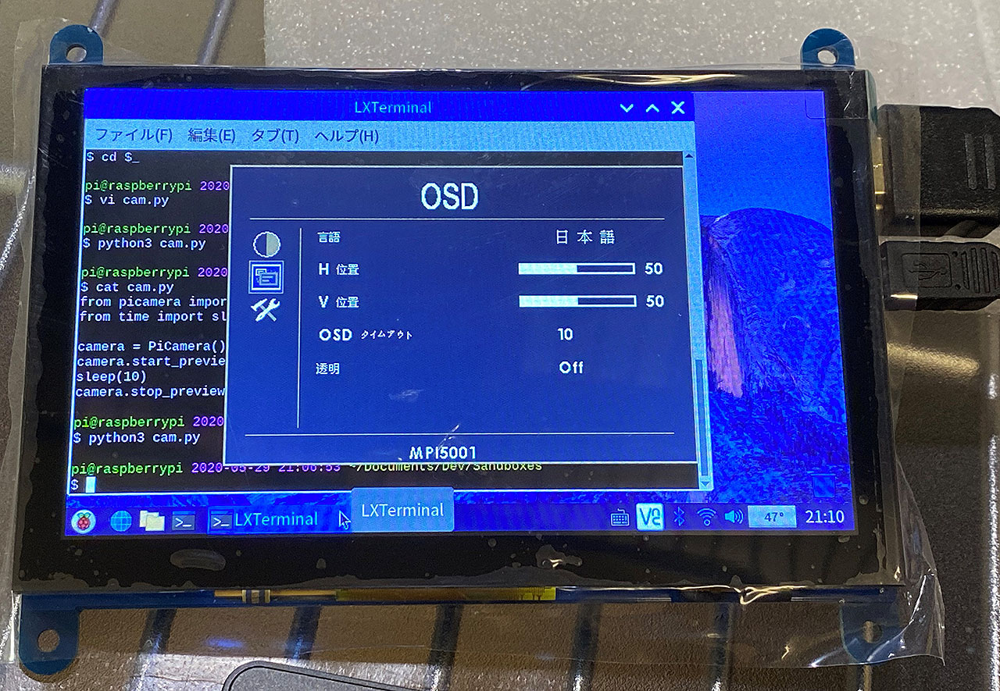
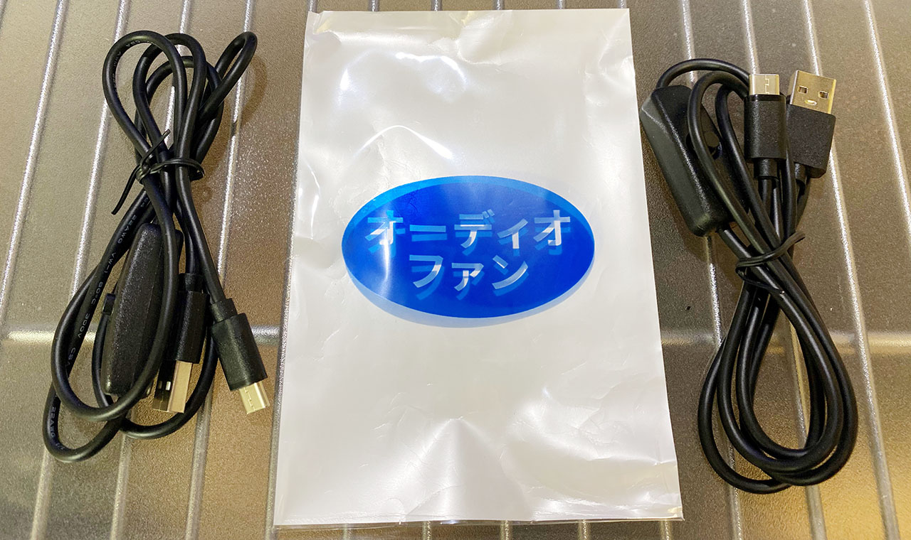
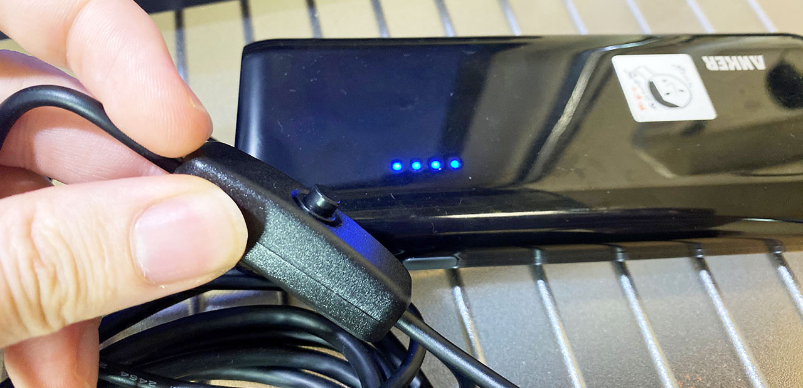
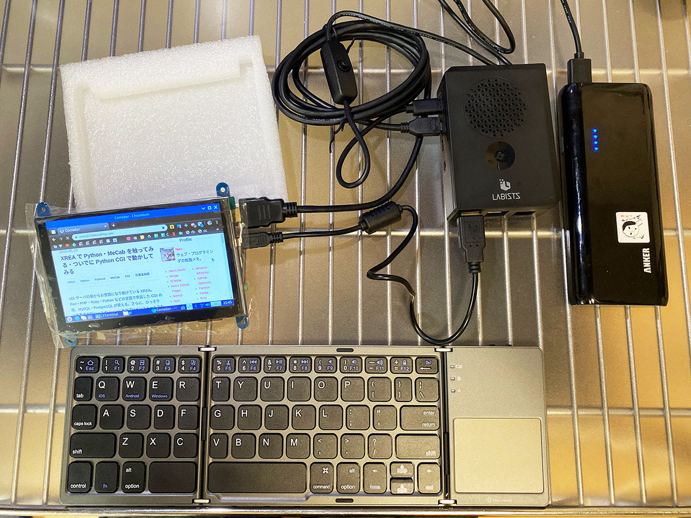

Raspberry Pi 4 用のディスプレイとして、**Elecrow** の5インチ液晶を買ってみたのでレポート。

  

    
  

  

    

      <a href="https://www.amazon.co.jp/dp/B07FDN3M8H?tag=neos21-22&amp;linkCode=osi&amp;th=1&amp;psc=1">ELECROW 5インチ モバイルモニター Raspberry Pi用 モバイルディスプレイ LCD ディスプレイ ポータブルモニター 800*480 HDMI端子 高画質タッチパネルモニター Raspberry Pi 4B 3B+ ゲーム機 Win PC用対応 ゲームモニター 安心保証１年付き</a>
    

  

  

    
  

  

    

      <a href="https://hb.afl.rakuten.co.jp/hgc/g00txbo2.waxyc853.g00txbo2.waxydeb5/?pc=https%3A%2F%2Fitem.rakuten.co.jp%2Fdaioustore%2Frmz9s8e2lkqd6j1w%2F&amp;m=http%3A%2F%2Fm.rakuten.co.jp%2Fdaioustore%2Fi%2F10142940%2F">ELECROW 5インチ モバイルモニター Raspberry Pi用 モバイルディスプレイ LCD ディスプレイ ポータブルモニター 800*480 HDMI端子 高画質タッチパネルモニター Raspberry Pi 4B 3B+ ゲーム機 Win PC用対応 ゲームモニター 安心保証1年付き</a>
    

    

      <a href="https://hb.afl.rakuten.co.jp/hgc/g00txbo2.waxyc853.g00txbo2.waxydeb5/?pc=https%3A%2F%2Fwww.rakuten.co.jp%2Fdaioustore%2F&amp;m=http%3A%2F%2Fm.rakuten.co.jp%2Fdaioustore%2F">DAIOU</a>
    

    
価格 : 9123円

  

## 目次

## スペック

購入したのは下の商品。

Elecrow 5インチスクリーンのスペックは以下のとおり。

- 物理解像度 : 800x480px。設定次第で 1920x1080px に縮小表示できるらしい
- HDMI 接続
- タッチパネル機能
- 電源供給およびタッチパネル機能は Micro USB 接続で実現

## 付属品

付属品は次のとおりだった。

- 5インチ液晶本体
- 説明書
- HDMI to HDMI ケーブル : ケーブル部分は平たい感じ
- HDMI to Micro HDMI 変換コネクタ : ラズパイ4にも対応している
- Micro USB-B to USB-A ケーブル : 電源供給とタッチパネル用
- ドライバの DVD
- ネジ4本

## 本体を確認

ディスプレイ本体は基板が剥き出しなので、自分で何らかのケースを用意しないと心もとない感じ。

裏を向けると、左側に

- HDMI 端子
- Micro USB 端子2つ
- 3.5mm イヤホン端子

がある。

右側には

- Menu
- Left / Up
- Right / Down
- Return
- Power

と書かれたスイッチが並んでいる。

## ラズパイ4に接続してみる

まずは何も考えず、ラズパイ4に接続してみる。

液晶に HDMI ケーブルと Micro USB ケーブルを挿し、ラズパイ4側に Micro HDMI と USB-A (2.0) を挿す。

ラズパイ4本体に供給する電源は、ひとまず AC 電源で供給してみる。

電源を入れるとディスプレイが映り、ちゃんとデスクトップが表示された。さらに、何の設定もせずに*タッチ機能*も動作した。

本体側面の「Menu」スイッチなどを押すと、画面の明るさ・バックライド・コントラスト・彩度などが変更できる。訳が怪しいが、メニューを日本語化することもできる。

## モバイルバッテリー駆動でも動作した

Micro USB で給電とタッチ機能を実現している本ディスプレイだが、モバイルバッテリーでは駆動するのだろうか。

今回は、少々古い商品ではあるが、5V / 3A 出力ができる **Anker Astro E5 第2世代**というモバイルバッテリーを使ってみた。なお、ラズパイ4本体のみであればこのモバブーで動作することは事前に確認済。

ついでに、モバブーの接続には「オーディオファン」製の電源スイッチ付き USB-C ⇔ USB-A ケーブルを使ってみる。

  

    
  

  

    

      <a href="https://www.amazon.co.jp/dp/B0849MF4F1?tag=neos21-22&amp;linkCode=osi&amp;th=1&amp;psc=1">オーディオファン Type C ケーブル 電源スイッチ付き 充電のみ データ通信不可 Raspberry Pi 4 電源ケーブル 1m 2本セット</a>
    

  

以下のように電源スイッチが付いている。

ラズパイ4と Elecrow 液晶を接続し、Anker Astro E5 で電源供給してみると、**無事動作した。**明るさなどの設定変更やタッチパネルの動作にも影響はなく、問題なく動作していた。

USB ケーブルの電源スイッチも使えていてラズパイの起動制御がちゃんと出来ている。Bluetooth 接続のキーボードもちゃんと認識した。

イイカンジ！コレならポータブル・ラズパイが作れそう…！
