**Labists B01** という、ラズパイ用のカメラモジュールを購入した。Raspberry Pi 4 に接続して動作確認してみたのでレポート。

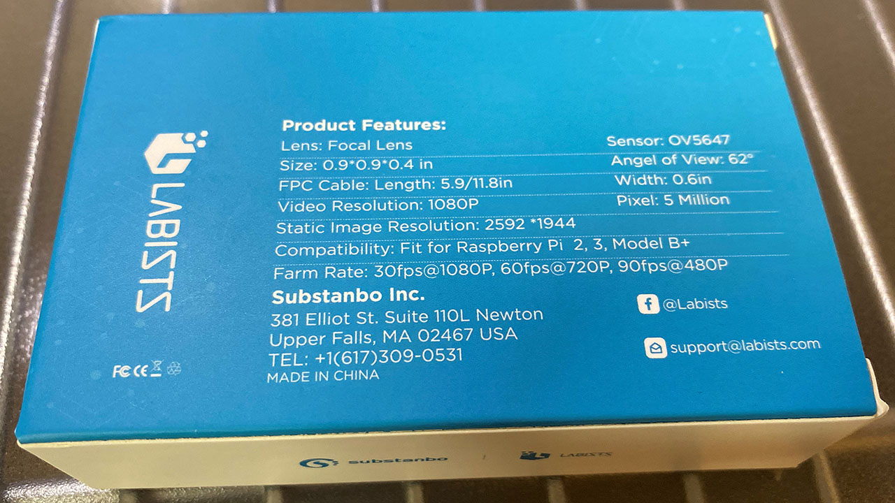

<div class="ad-amazon">
  <div class="ad-amazon-image">
    <a href="https://www.amazon.co.jp/dp/B083XDJ8SP?tag=neos21-22&amp;linkCode=osi&amp;th=1&amp;psc=1">
      
    </a>
  </div>
  <div class="ad-amazon-info">
    <div class="ad-amazon-title">
      <a href="https://www.amazon.co.jp/dp/B083XDJ8SP?tag=neos21-22&amp;linkCode=osi&amp;th=1&amp;psc=1">LABISTS Raspberry Piカメラモジュール 1080P 5M OV5647センサー ケース付き Raspberry Pi Model 2B、3B、3B+、4Bに適用</a>
    </div>
  </div>
</div>

## 目次

## スペック

**Labists B01** カメラモジュールのスペックは次のとおり。

- センサー : OV5647
- 解像度 : 500万画素
- 動画 : 1080p・30fps、720p・60fps、640x480p・90fps に対応
- CSI コネクタに接続するフレックスケーブル 10cm と 15cm
  - 10cm 長のケーブルがカメラ本体に接続済
- クリアケース
- ドライバー (Labists Raspberry Pi 4 スターターキットに付属していたモノと同じ)
- 説明書 : 日本語ページもアリ
- 価格 : **1,580円**

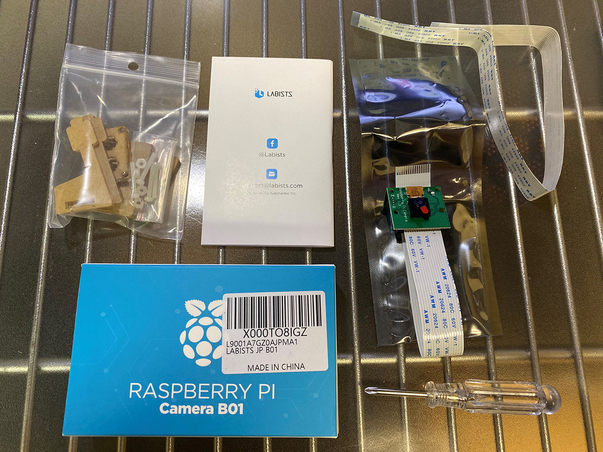

ドライバーはケース組み立て時に使うモノで、今回自分がやるように、ケースに実装する際は使用しない。

## ラズパイ4本体に接続・Labists ケースに実装する

自分が購入した Labists のスターターキットに付属するケースには、カメラモジュールが載せられるようになっている。スターターキット側の説明にも記載があるとおりの手順ではあるが、実際にやってみる。

まずはラズパイ4の基板上にある「CSI コネクタ (Camera Serial Interface)」の黒いタブを持ち上げる。

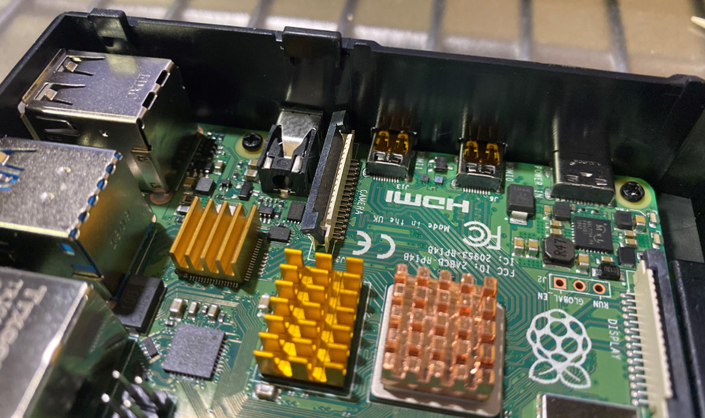

そこにカメラモジュールのフレックスケーブルを差し込んでいく。_HDMI 端子に近い方がケーブルの白い面になる方向で挿す。_正しく差し込んでいくと、カチッとハマった抵抗感があるので分かるはず。

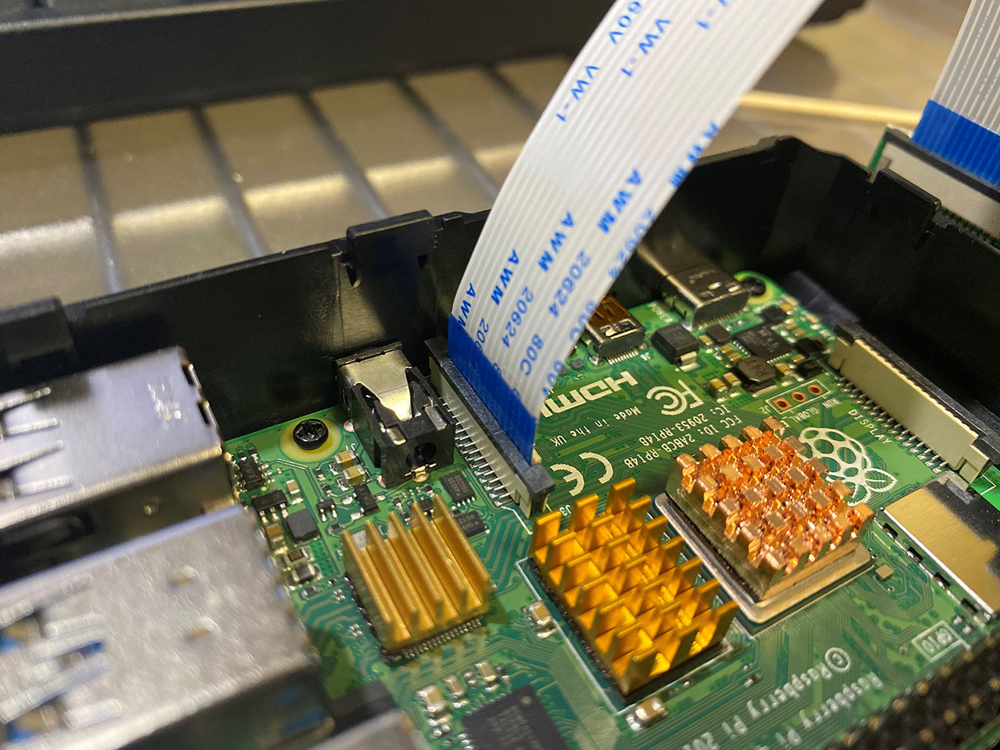

ケーブルを奥まで差し込んだら、黒いタブを押し下げて固定する。

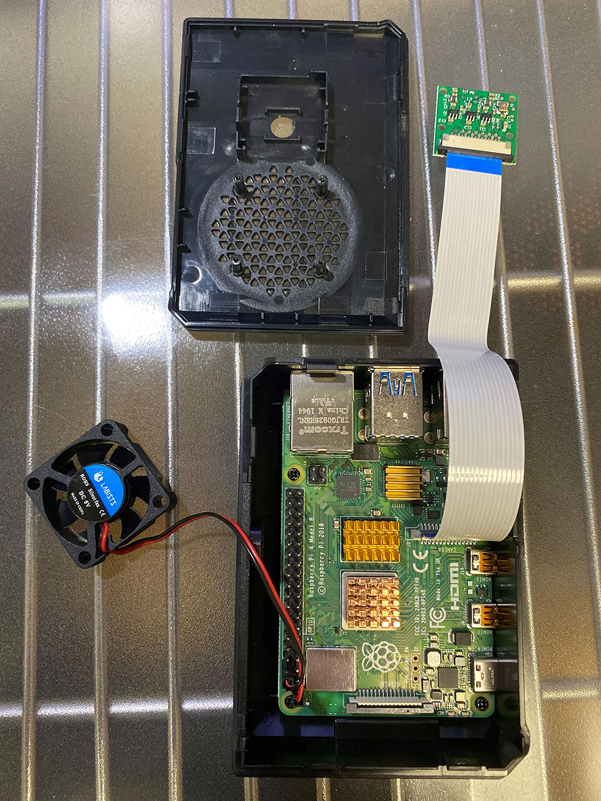

Labists 製本体ケースのフタ部分には、押し込んでハメるだけ。ネジ止めは不要。CPU ファンとの位置はギリギリになる。

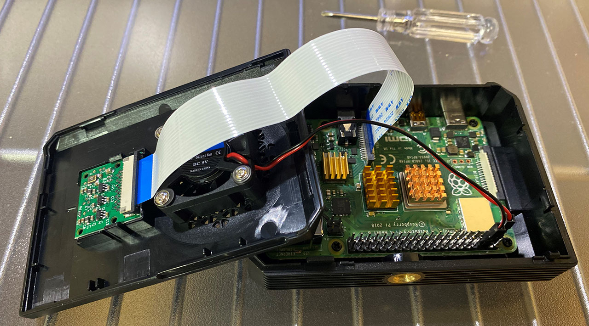

コレでフタを閉めるのだが、その際**フレックスケーブルはケース内で180度ねじれる**ことになる。気に食わないがこういう向きの仕様みたいなので、仕方なし。

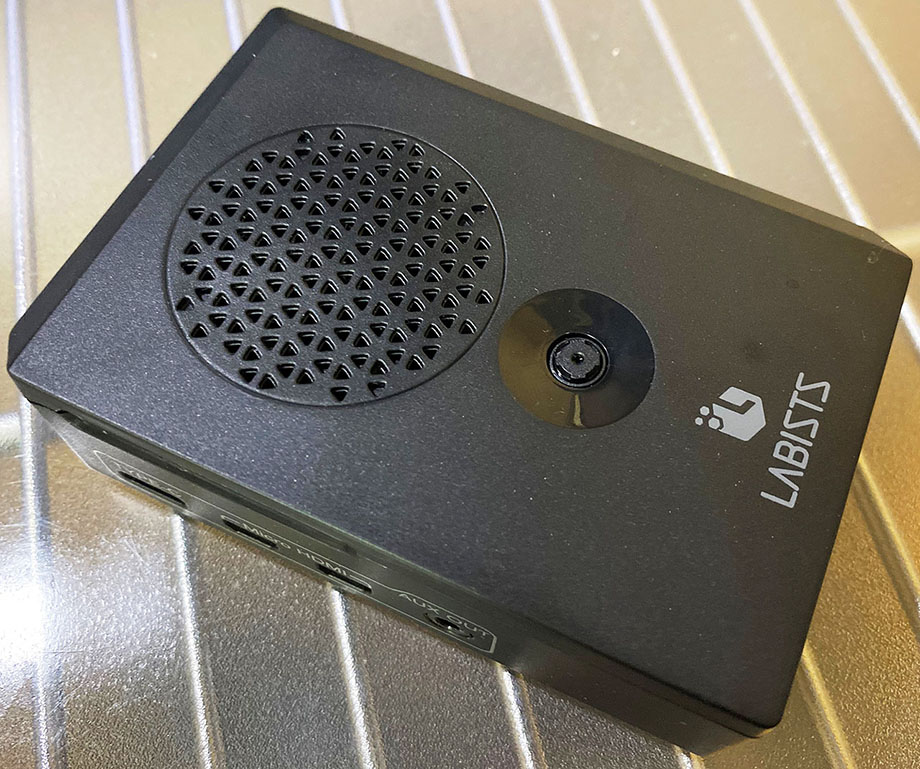

↑ こんな風に、ケースの上部にカメラモジュールのレンズが出てくるようになる。

## 動作確認

ケースにカメラモジュールを実装できたら、ラズパイ4の電源を入れてみる。

多分最初からカメラ機能は有効になっていると思うが、念のため、「設定」→「Raspberry Pi の設定」→「インターフェイス」タブと進んで、「カメラ」が「有効」になっているか確認する。

そしたら動作確認のため、次のようなコードを書いてみる。内容は説明書の受け売り。

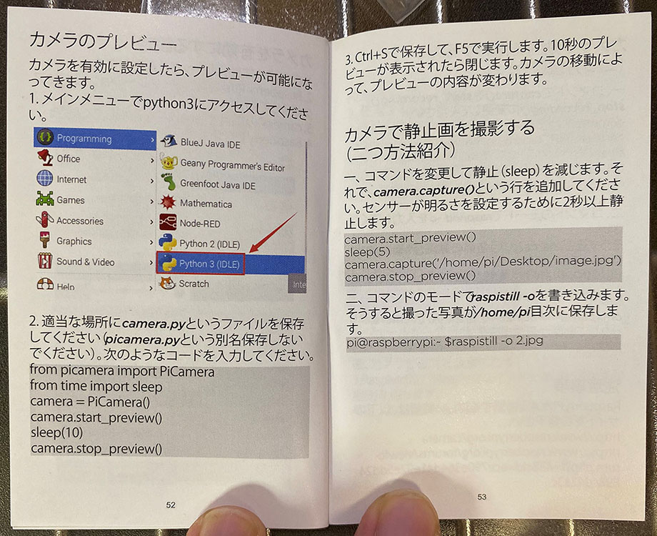

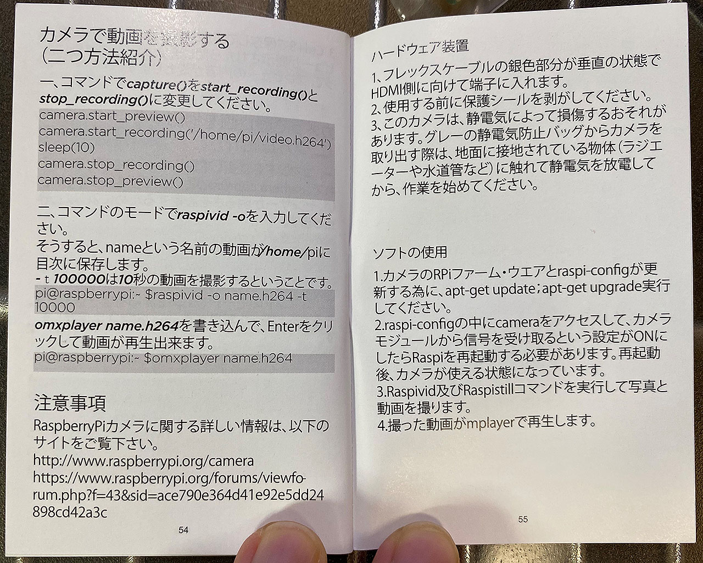

ターミナルで適当にファイルを作る。

```bash
$ vi cam.py
```

次のように書く。

```python
from picamera import PiCamera
from time import sleep

camera = PiCamera()
camera.start_preview()
sleep(10)
camera.stop_preview()
```

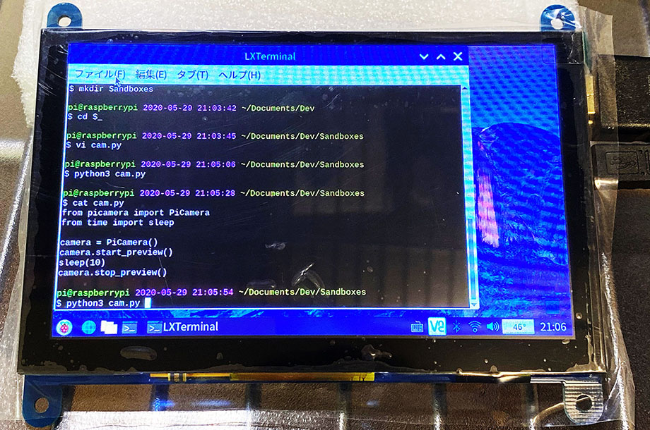

コーディングできたら、次のように実行する。

```bash
$ python3 cam.py
```

すると_カメラプレビューが全画面表示_される。このプレビューが10秒間表示された後、プログラムが終了するようになっている。

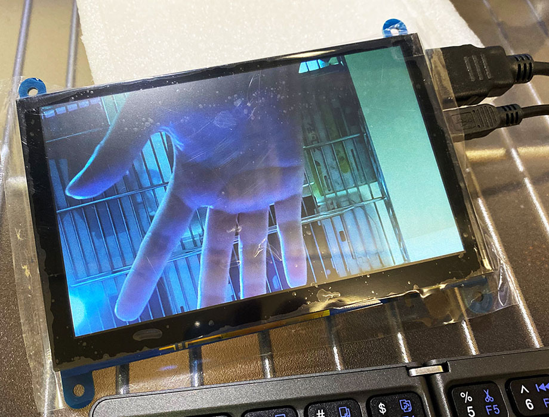

**カメラをフレックスケーブルで接続するだけで、無事カメラ機能が使用できた。**

## 以上

画質もそこそこキレイで、スペック的にもコレで1,580円なら十分だと思う。

Labists 製のケースに内蔵しても良いし、付属のクリアケースに載せても良い。使い方も自由度が高く、それでいて接続さえすればカメラのハンドリングは簡単にできるのも良かった。

ラズパイを買った人は、ぜひ一緒に購入して遊んでみて欲しい。
