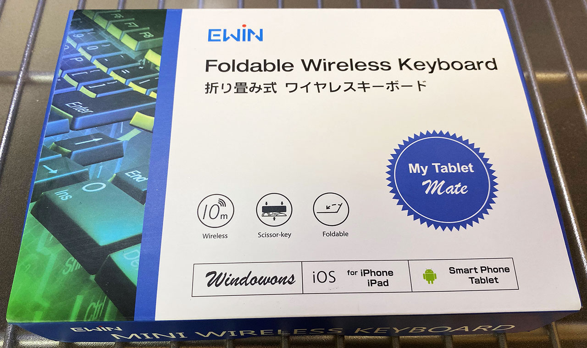
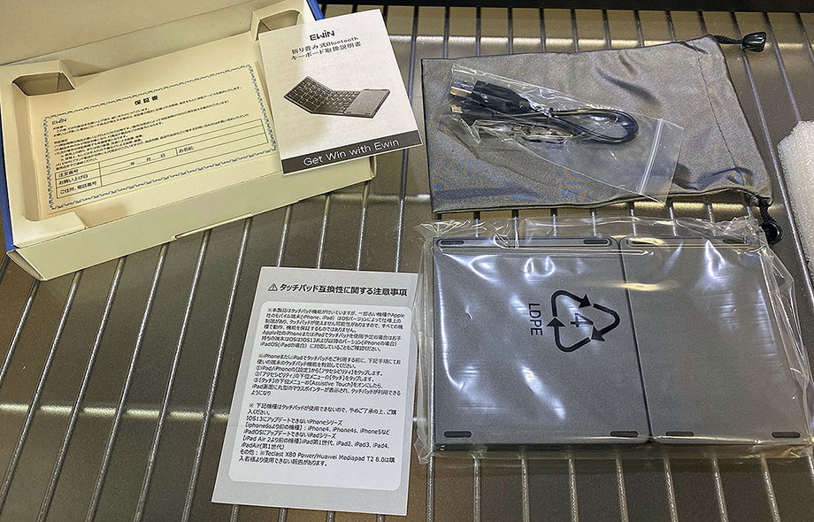

ラズパイ4を操作するための入力デバイスとして、**Ewin** というメーカの折りたたみ式キーボードを購入した。

## 目次

## 本体と付属品を確認

購入したのは以下のリンクで見られる商品。本稿執筆時点で在庫切れみたい。

- [Ewin 折りたたみ式 Bluetooth キーボード タッチパッド搭載 超薄い型 ミニキーボード Windows、Android、iOS、Mac、各 OS に対応 ブラック EW-RW21](https://www.amazon.co.jp/gp/product/B07988PMJW)

  

    
  

  

    

      <a href="https://www.amazon.co.jp/dp/B08BJZ54XM?tag=neos21-22&amp;linkCode=osi&amp;th=1&amp;psc=1">Ewin 日本語配列 Bluetooth キーボード 折りたたみ式 タッチパッド搭載 超薄型 JIS配列 ワイヤレスキーボード ipad キーボード 3台までのデバイス同時に接続可能 ファンクションキー付き ポータブル 軽量 USB充電式 Android/Windows/Mac/iOS 対応 日本語説明書付き</a>
    

  

  

    
  

  

    

      <a href="https://hb.afl.rakuten.co.jp/hgc/g00s7ms2.waxyc83e.g00s7ms2.waxyde87/?pc=https%3A%2F%2Fitem.rakuten.co.jp%2Fewin%2F100455%2F&amp;m=http%3A%2F%2Fm.rakuten.co.jp%2Fewin%2Fi%2F10000637%2F">キーボード ワイヤレス ipad Bluetooth タッチパッド搭載 折りたたみ 無線 コンパクト 無線キーボード 超薄 iphone Windows、Android iOS Mac 各OSに対応 出張 カッコイイ 便利</a>
    

    

      <a href="https://hb.afl.rakuten.co.jp/hgc/g00s7ms2.waxyc83e.g00s7ms2.waxyde87/?pc=https%3A%2F%2Fwww.rakuten.co.jp%2Fewin%2F&amp;m=http%3A%2F%2Fm.rakuten.co.jp%2Fewin%2F">Ewin</a>
    

    
価格 : 4980円

  

このキーボードはトラックパッドも搭載されており、Bluetooth 接続できるスグレモノ。値段は*4,000円程度*だった。

付属品はこんな感じ。充電用の Micro USB ⇔ USB ケーブル、ソフトケース、日本語の説明書などが付属。

対応 OS は Windows、Mac、iOS、Android と、ひととおり対応している。「iOS でトラックパッドが使えない」とされていたが、iOS 13 ならトラックパッドにも対応しているので、iOS アップデートすれば OK。

充電中は赤い LED が付き、Bluetooth の接続状況は青い LED で示される。

## 使用感をレビュー

Windows、MacBook (MacOS)、iPhone 11 Pro Max (iOS)、Raspberry Pi 4 に接続して検証した。

全体的な質感は値段相応か。悪くはないかな。ただ、**折りたたみのヒンジ部分はヤワい印象で、危なっかしい**。開いた部分含めて平たい所に置いて使わないと、すぐにヒンジが折れそうな気がする。不安。ｗ

トラックパッドの精度は悪くない。ただ、カーソル移動以外の操作が敏感すぎるかな。タップでクリック扱いになったり、2本指スライドでスクロールしたりするのだが、この感度が良すぎるせいで誤ってクリックしてしまったり、スクロールのつもりでピンチ操作とみなされてしまったりする。慣れが必要か。

iPhone (iOS) でトラックパッドを有効にするには、「設定」→「アクセシビリティ」と進み、「*AssistiveTouch*」を ON にするだけ。不自由なく使えている。

キーボード部分も、ちゃんと入力できる。全体的なピッチが狭い他、ヒンジ部分周辺のキーはより小さくなっているので、コチラも慣れが必要。ファンクションキーは `fn` キーと同時押しになるが、一応使える。Esc キーが `fn` 同時押しになるのはちょっと面倒くさいかな。

スペースキー左に Control と Alt、スペースキー右に Command と Alt キーがある。**左右に Alt キーがあるので、Windows と Linux では Alt キーの空打ちによる IME 切り替えが操作できる。**

MacOS の場合、Cmd キーが右側にしかないので、Karabiner-Elements で実現していた*「左右 Cmd キー空打ちによる IME 切替」ができない。*Control + Space などで代替するしかない。また、Cmd キーが右側にしかないということで、コピペ操作は「右 Cmd + C」などとなり、不慣れな人が多いかも。

*Raspberry Pi 4 (Raspbian OS) にも、設定不要で接続できた。*Bluetooth 接続自体は問題なくできるが、接続が切れるのが若干早いかもしれない。`bluetoothctl` コマンドの `trust` で信頼設定しておくと良いだろう。

Micro USB ケーブルは充電専用で、パソコンと有線接続したからといって USB 駆動するワケではなかったのが残念。

## 類似品が多いので購入は注意

今回自分は「Ewin」というメーカの製品を買ったが、Amazon で調べると、ほぼ同一の画像を使用した商品が多数出品されている。

Ewin は4,000円程度で販売されていたが、他のメーカのモノは3,000円代のモノもあった。

Ewin は以下のサイトなど、実際の商品写真をアップしているレビュー記事がいくつか見つかったが、他のメーカの商品はそうした記事が見当たらず、信用できなかったので購入しなかった。

- 参考：[【レビュー】トラックパッド付きBluetoothキーボードでiPad miniをミニデスクトップ化！！折りたたみ式で持ち歩き可能【Ewin】 | GREENVIP](https://greenvip.jp/ewin-trackpad/)

他のメーカの類似製品がまともに使えるのかは分からない。Amazon で売っていた Ewin 製のモノであれば、今回自分が購入したように、一定のクオリティで実用できるので、値段だけ見ると割高に見えるかもしれないが、安心を買っても良いかもしれない。

## 以上

どんな OS でもサクッと接続でき、マウスとキーボードをセットで使えるようになる。

若干剛性が心配ではあるが、安いのでこんなもんかしら。
