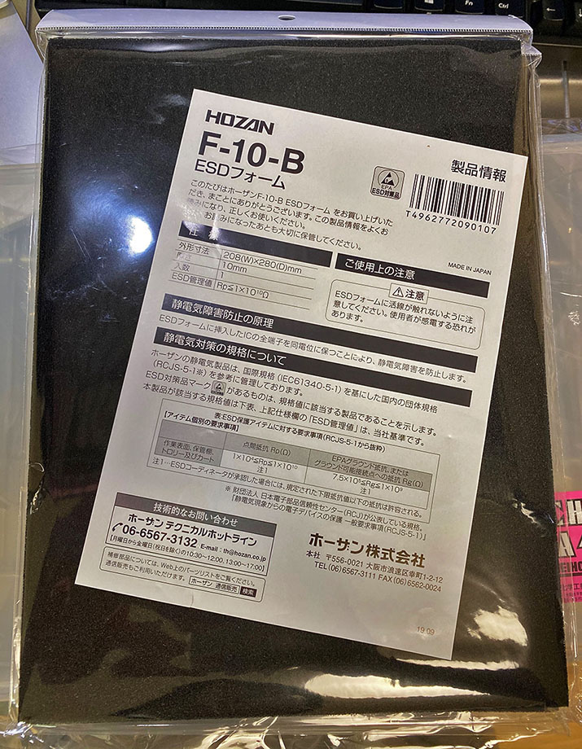
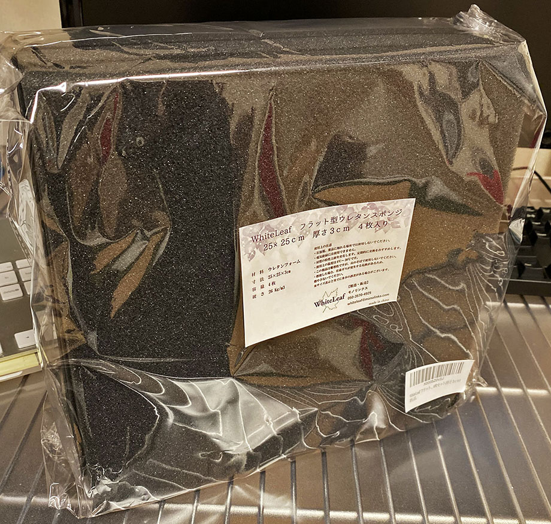

Raspberry Pi 4 を購入して、手持ちの有線マウス、有線キーボードを繋ぎ、普段デスクトップ PC で使っている液晶モニタに HDMI を接続し、コンセントから電源をとって遊んでいた。

…うーん、せっかくラズパイ本体がコンパクトなのに、機材構成がデスクトップ PC みたいだなぁ…。もう少しコンパクトに、ポータブル化できないものか。

調べてみると、ラズパイをモバイルバッテリーで駆動させ、ポータブル化している事例は結構見つかった。しかしそれはラズパイ 3B までの事例であることが多く、使用電力量が増えたラズパイ 4B での事例が少なかった。

そこで今回は、自分が試行錯誤した結果をお伝えし、最終的に構築した**ポータブル・ラズパイ4**を紹介する。

## 目次

## 情報収集

まずは色々と情報収集してみた。どうやってモバイルバッテリー駆動させるか、どうやったらコンパクトにまとめられそうか、など。

- 主な検索キーワード
  - _Portable_ Raspberry Pi
  - _Handheld_
  - **Cyberdeck**
  - Raspberry Pi _Laptop_
  - Raspberry Pi **Battery**
- コンパクトにする術
  - 短く・細く・差し込み部分が小さいケーブルで揃える
- キーボード、マウス
  - 余計なケーブルを省くため Bluetooth 無線機を選ぶ
  - 折りたたみキーボード
  - キーボードとトラックパッドがセットになった商品もある
- 液晶ディスプレイ
  - ラズパイ向けの3.5インチ ～ 7インチ程度のモニタは多く売られている
  - ラズパイの基板と同じくらいのサイズなのが3.5インチだが、ラズパイ4は CPU ファンを付けているので、液晶を重ねた配置はしづらい
  - 本体との接続方式は Micro HDMI か DSI (フレックス) ケーブルの方式がある
  - スクリーンへの給電方法は USB か GPIO で行う方式がある
- モバイルバッテリー
  - ラズパイ4の場合は 5V・3A 出力できるモバブーが良い (ただし殆どは大容量モデルになりコンパクトにはならない)
  - スキルがあれば、リチウムイオンバッテリーと電圧変換回路などを揃えて工作すると、よりコンパクトになる
- ポータブル・ラップトップ化の手法
  - エフェクターボードみたいな、B5 か A4 程度のスーツケース、アタッシュケースなどを使う
  - 段ボールや木材で自作する
  - ファイルケース、工具のパーツケースなどを利用する
  - ウレタンフォームを敷き詰め、両面テープで固定する
  - ラップトップらしくしたいなら、キーボード込みで寸法を測る
  - キーボードやマウスを利用時に外出しして良いなら、CPU ファンの位置だけ注意して、ラズパイ本体、液晶、モバブーの寸法を測り、配置を決める
  - ケースに入れたラズパイ本体で、高さ 4cm 程度となる。ケースの高さの内寸に注意する
  - キーボードを内側に入れる場合は、小さい製品を選んでも横幅 30cm くらいは必要そう

色々調べてみた結果、気を付ける点は上述のような感じだった。

## ポータブル化のために必要な周辺機器

ということで、まずは収めるケース抜きに、コンパクトにまとめられそうで、それなりに安く、それでいて自分がやりたいことはちゃんと出来そうな周辺機器類を購入してみた。

- ラズパイ本体 : _Labists Raspberry Pi 4 RAM 4GB スターターキット_
  - カメラを内蔵できるケース付きの本体を購入した
  - ケーブル類も付属していて、とりあえず使い始めることはできるものの、コンパクトではない

  

    
  

  

    

      <a href="https://www.amazon.co.jp/dp/B082VVJCPT?tag=neos21-22&amp;linkCode=osi&amp;th=1&amp;psc=1">LABISTS Raspberry Pi 4 4GB キット（技適マーク入）MicroSDHCカード32G/Raspbianシステムプリインストール/カードリーダ /5.1V/3A Type-C スイッチ付電源/MicroHDMI-to-HDMIケーブルライン/三つヒートシンク/簡単に取り付けケース/日本語取扱説明書（4GB RAM）</a>
    

  

- 液晶 : _Elecrow 5インチ・タッチスクリーン_
  - 常用に耐えるサイズは5インチくらいかなと思い選んだ
  - ラズパイ本体に USB・HDMI 接続するだけで、設定不要で認識した
  - タッチパネルも効くので、Bluetooth キーボードやマウスが効かなくなった時もフォールバックが効く

  

    
  

  

    

      <a href="https://www.amazon.co.jp/dp/B07FDN3M8H?tag=neos21-22&amp;linkCode=osi&amp;th=1&amp;psc=1">ELECROW 5インチ モバイルモニター Raspberry Pi用 モバイルディスプレイ LCD ディスプレイ ポータブルモニター 800*480 HDMI端子 高画質タッチパネルモニター Raspberry Pi 4B 3B+ ゲーム機 Win PC用対応 ゲームモニター 安心保証１年付き</a>
    

  

- キーボード・トラックパッド : _Ewin 折りたたみキーボード・トラックパッド_
  - 折りたたみができるタイプで選んだ。当然 Bluetooth 接続
  - 開くと幅 32cm 程度
  - コンパクトな割にキー配列が使いやすい商品

  

    
  

  

    

      <a href="https://www.amazon.co.jp/dp/B08CB77SBQ?tag=neos21-22&amp;linkCode=osi&amp;th=1&amp;psc=1">Ewin® 折りたたみ式 Bluetoothキーボード USBタッチパッド搭載 超薄型 ワイヤレスキーボード ipad キーボード ファンクションキー付き Android/Windows/Mac/iOS 対応</a>
    

  

- モバイルバッテリー : _Power Add Aries I_ (10,000mAh)
  - 5V・3A 出力ができる安いモノを適当に買った。電池残量を数値で表示できて良い
  - サイズは大きく、重量も重ため…。何時間か利用できそうだが、ポータブル感は低いかも…
  - 本製品で給電して、ラズパイ本体と Elecrow 5インチ液晶が動作することを確認した
  - 古い製品だが、手持ちの _Anker Astro E5 第2世代_でも、液晶込みで動作することを確認した。こちらの方がもう少しコンパクトに済みそうではある

  

    
  

  

    

      <a href="https://www.amazon.co.jp/dp/B078LZ1D5G?tag=neos21-22&amp;linkCode=osi&amp;th=1&amp;psc=1">モバイルバッテリー 10000mAh Poweradd Aries Ⅰ USB-C 充電器 TYPE-C/Micro USBポート LED残量表示 MacBook Zenbook Samsung Galaxy NexusなどiPhone &amp; Android各種対応 緊急用 防災グッズ（USB C-Cケーブル付き）</a>
    

  

周辺機器は上のとおり。

↑ 購入したモノ。

↑ とりあえずむき出しで繋いでみた。モバブーでの電力供給も大丈夫。良い感じで動いている。

## ケーブルをコンパクトにする

続いて、これらを接続するケーブルをよりコンパクトに収めるためのモノを購入した。

- 電源ケーブル : _オーディオファン 電源スイッチ付き USB-A ⇔ USB-C ケーブル_
  - 電源スイッチが付いているので、ケーブルを繋ぎっぱなしでも電源 OFF にできる
  - ケーブル長はそこそこあるが、束ねやすいので良しとする

  

    
  

  

    

      <a href="https://www.amazon.co.jp/dp/B07W4CVWS7?tag=neos21-22&amp;linkCode=osi&amp;th=1&amp;psc=1">LABISTS Raspberry Pi 4B TypeC電源ケーブル 5V 3A スイッチ付き PSE取得</a>
    

  

- Micro HDMI ⇔ HDMI ケーブル : _Duttek 30cm ケーブル_
  - 30cm 長で、コネクタ部分が小さめなモノを選んだ
  - 

  

    
  

  

    

      <a href="https://hb.afl.rakuten.co.jp/hgc/g00ts4h2.waxyc7e7.g00ts4h2.waxyd8a4/?pc=https%3A%2F%2Fitem.rakuten.co.jp%2Fenituor%2Fonejukca965fgt32%2F&amp;m=http%3A%2F%2Fm.rakuten.co.jp%2Fenituor%2Fi%2F10032722%2F">Duttek Micro-HDMI to HDMI 変換 ケーブル マイクロHDMI-HDMI オス-オス 4K 3DフルHD イーサネット対応 GoPro テレビ TV デジカメ ビデオ アクション カメラ (30cm micro HDMI)</a>
    

    

      <a href="https://hb.afl.rakuten.co.jp/hgc/g00ts4h2.waxyc7e7.g00ts4h2.waxyd8a4/?pc=https%3A%2F%2Fwww.rakuten.co.jp%2Fenituor%2F&amp;m=http%3A%2F%2Fm.rakuten.co.jp%2Fenituor%2F">ENITUOR</a>
    

    
価格 : 3249円

  

- Micro USB-B ⇔ USB-A ケーブル : _Rerii 右向き L 字ケーブル_
  - 液晶とラズパイを繋ぎ、液晶の給電とタッチ機能を実現するためのケーブル
  - コネクタ部分が L 字の、30cm 程度の長さのモノを選んだ。L 字の向きは配置に合わせて慎重に選ぶこと
  - 

  

    
  

  

    

      <a href="https://www.amazon.co.jp/dp/B072KH2MML?tag=neos21-22&amp;linkCode=osi&amp;th=1&amp;psc=1">Rerii 右向き両端L型 マイクロUSBケーブル L字 USB L字 MicroUSB l型 Micro USB充電ケーブル 25cm TV Stick 充電ケーブル 急速充電 データー転送 (右向き)</a>
    

  

  

    
  

  

    

      <a href="https://www.amazon.co.jp/dp/B071X6M13B?tag=neos21-22&amp;linkCode=osi&amp;th=1&amp;psc=1">Rerii 左向き両端L型 マイクロUSBケーブル L字 USB L字 MicroUSB l型 Micro USB充電ケーブル 25cm TV Stick 充電ケーブル 急速充電 データー転送 (左向き)</a>
    

  

配線してみるとこんな感じ。ゴチャゴチャが減ったかな。

## 収納するケースを決める

これらを用意してレイアウトを色々考えてみた結果、収めるケースのサイズ (内寸) は次のとおりとなった。

- 横幅 : 30cm 程度以上 (Ewin キーボードを広げたサイズが入るように)
- 縦幅 : 20cm 程度 (Elecrow 5インチ液晶と Ewin キーボードを縦に並べられる程度のサイズ)
- 高さ : 4cm 程度 (液晶・モバブー・キーボードとケース付き本体とで、一番高さがあったのはラズパイ本体だったので、それが収まる高さ)

キーボード込みで配置したかったので横幅が 30cm 程度になってしまった。こうした内寸を満たす、ラップトップっぽく開くケースというのがなかなか見つからなかった。縦横が良くても、高さが 3cm 未満でラズパイ本体が入らなさそうだったり、高さが程良くても横幅が足りなかったり…。

最終的に購入したのは、**メイホウ A4 クリアアタッシュケース**という商品。

  

    
  

  

    

      <a href="https://hb.afl.rakuten.co.jp/hgc/g00r3182.waxyc818.g00r3182.waxydc59/?pc=https%3A%2F%2Fitem.rakuten.co.jp%2Fdaishinshop%2F147-302463%2F&amp;m=http%3A%2F%2Fm.rakuten.co.jp%2Fdaishinshop%2Fi%2F10130136%2F">明邦化学 メイホー MEIHO アタッシュケース A4 ((12)) クリア [A230303]</a>
    

    

      <a href="https://hb.afl.rakuten.co.jp/hgc/g00r3182.waxyc818.g00r3182.waxydc59/?pc=https%3A%2F%2Fwww.rakuten.co.jp%2Fdaishinshop%2F&amp;m=http%3A%2F%2Fm.rakuten.co.jp%2Fdaishinshop%2F">DAISHIN工具箱　楽天市場店</a>
    

    
価格 : 719円

  

- 内寸
  - 横幅 : 32cm
  - 縦幅 : 23.4cm
  - 高さ : 8cm

高さが 8cm ほどあり、若干高すぎるが、そこはウレタンクッションで誤魔化すとしよう。ケースが余計に大きいと、総重量が増えてしまいがちなので、なるべく小さいケースを探したかったのだが…。なるべく安く済ませたかったので、今回はコレで妥協。

他に、ケース内の調整のために以下を購入した。

- _Hozan ホーザン F-10-B ESD フォーム_
  - 電子機器への静電気を防止できるウレタンっぽいフォーム
  - 寸法 : 横幅 28cm、縦幅 20.8cm、厚さ 1cm
  - 

  

    
  

  

    

      <a href="https://www.amazon.co.jp/dp/B000TGHA9Y?tag=neos21-22&amp;linkCode=osi&amp;th=1&amp;psc=1">ホーザン(HOZAN) ESDフォーム 導電性のウレタン製フォーム(硬質) 電子部品を静電気から守る 厚さ10mm F-10-B</a>
    

  

- 両面テープ付きのマジックテープ : _Latuna パワフルピタクロ_
  - ラズパイ本体とモバブーをケース底に貼り付けるために使用する
  - 幅 5cm、長さ 10cm の面ファスナーが15枚入っている
  - 

  

    
  

  

    

      <a href="https://www.amazon.co.jp/dp/B07XPLY6L8?tag=neos21-22&amp;linkCode=osi&amp;th=1&amp;psc=1">[Latuna] 面ファスナー 両面テープ パワフルピタクロ 超強力 5×10cm 15枚セット 防水 耐熱 防じん オス メス</a>
    

  

- ウレタンフォーム : _WhiteLeaf フラット型ウレタンスポンジ_
  - ケース内の高さ調整に使用する
  - 25cm 四方で厚さ 3cm のウレタンが4つ含まれている
  - 

  

    
  

  

    

      <a href="https://www.amazon.co.jp/dp/B07ZC65BWB?tag=neos21-22&amp;linkCode=osi&amp;th=1&amp;psc=1">WhiteLeaf フラット型 ウレタンフォーム スポンジ 緩衝材 クッション材 吸音材 密度26kg/m3 25cm×25cm 厚み3cm (4枚セット)</a>
    

  

## 組み込み

それでは、メイホウのアタッシュケースに組み込んでいく。

ラップトップっぽく、広げた上部に液晶、下部にキーボード、といったレイアウトにもしたかったのだが、アタッシュケースを90度くらいに広げた状態で固定できそうになかったので、今回は全部底面に配置することにした。

Elecrow の液晶はケースがないので、梱包に使用されていた発泡スチロールみたいなのを流用。両面テープでケースに固定した。

ホーザンの ESD フォームをカッターで切って、ラズパイ本体・液晶・モバブーの配置を決める。そしてさらに固定するため、本体とモバブーにはマジックテープを貼り付けた。

以下のように組み込めた。

折りたたみキーボードを右下に配置してみる。

折りたたみキーボードを開いてみた。

全景。

アタッシュケースを閉めて立て掛けたりした時、パーツが中で動かないようにするため、ウレタンフォームを挟んでやることにした。

フタを閉めるとこんな感じ。ウレタンのおかげで中の部品が動かなくなる。

## いくらかかった？

こんな感じで雑に完成。材料費は以下のとおり。

| 商品                                       | 価格     |
|--------------------------------------------|----------|
| Labists ラズパイ本体キット                 | 13,800円 |
| Elecrow 5インチ液晶                        | 5,399円  |
| Ewin キーボード・トラックパッド            | 4,280円  |
| Labists カメラ OV5647                      | 1,580円  |
| Power Add モバイルバッテリー               | 1,599円  |
| オーディオファン スイッチ付き USB ケーブル | 800円    |
| Duttek Micro HDMI ⇔ HDMI ケーブル         | 1,299円  |
| Rerii Micro USB-B ⇔ USB-A ケーブル        | 799円    |
| メイホウ A4 アタッシュケース               | 824円    |
| Hozan ESD フォーム × 2つ                  | 1,680円  |
| Latuna 両面テープ付きマジックテープ        | 980円    |
| WhiteLeaf ウレタンフォーム                 | 1,780円  |
| **合計金額**                               | 34,820円 |

…ということで、34,820円かかった。

ラズパイを最低限動かすだけなら、本体キット (13,800円) と HDMI ディスプレイ (5,399円)、それに安いマウスとキーボードがあれば良いので、2万円もあればラズパイ一式が動かせるだろう。

この中では Bluetooth のキーボード・トラックパッドがちょっと高く付いている方かな。

ポータブル化のために、モバブーやケーブル類が地味にかかってきている他、ウレタンフォームやプラスチックケースなどがちょこちょこかかっている。

## 総評

結局、手持ちの Asus ZenBook3、12インチ MacBook、Lenovo ThinkPad X250 のどれよりも大きく、重たい筐体になってしまった…。

ラズパイ本体が意外と高さを持っていた。USB 端子が場所を取りやすいので、上級者はハンダ作業を行って USB 端子を取り外したりしちゃうみたい。

モバブーも重たいので、リチウムバッテリーを使えるなら使いたいところ。

キーボードとトラックパッドがやはり鬼門だなぁ。寸法のほとんどをキーボードが決めてしまうので、あまり入力機器にこだわらないなら、さらに小型なキーボード製品を選ぶと良いだろう。

本気で小型化しようと思ったらもっと改良の余地はあるが、とりあえず当初やりたかったポータブル化は完成とする。ガワばっかイジってないでラズパイを触るとしよう。

アタッシュケースを開いた時の CyberDeck 感はワクワクするね。ｗ
