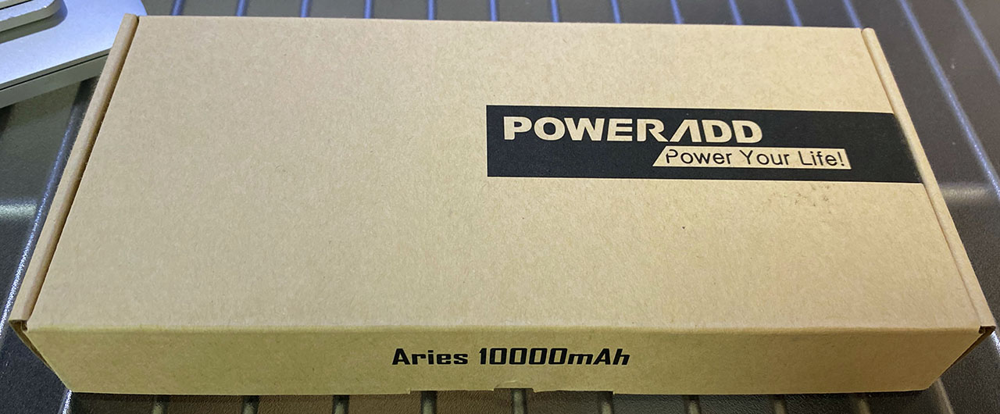
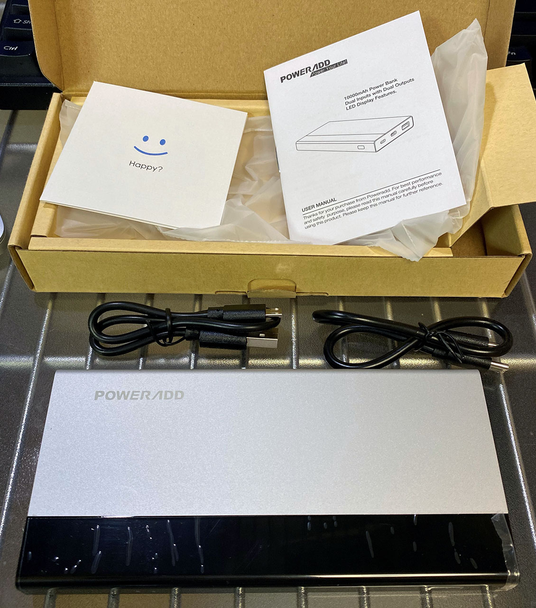
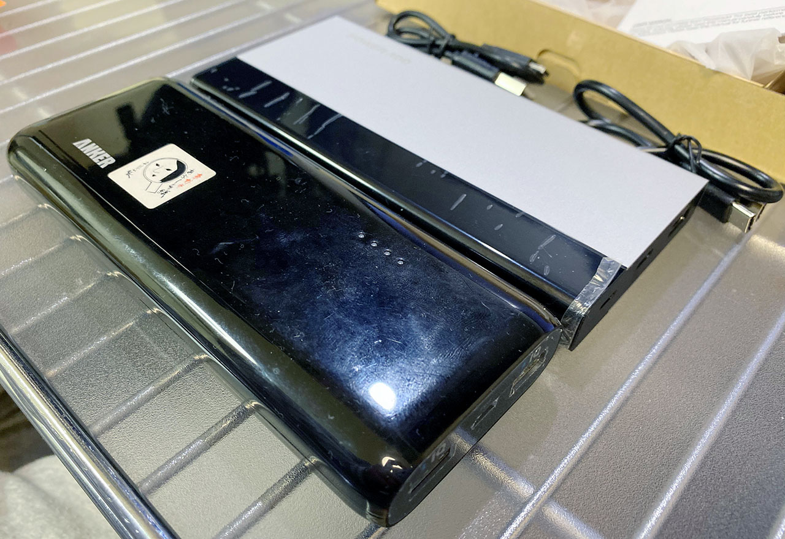
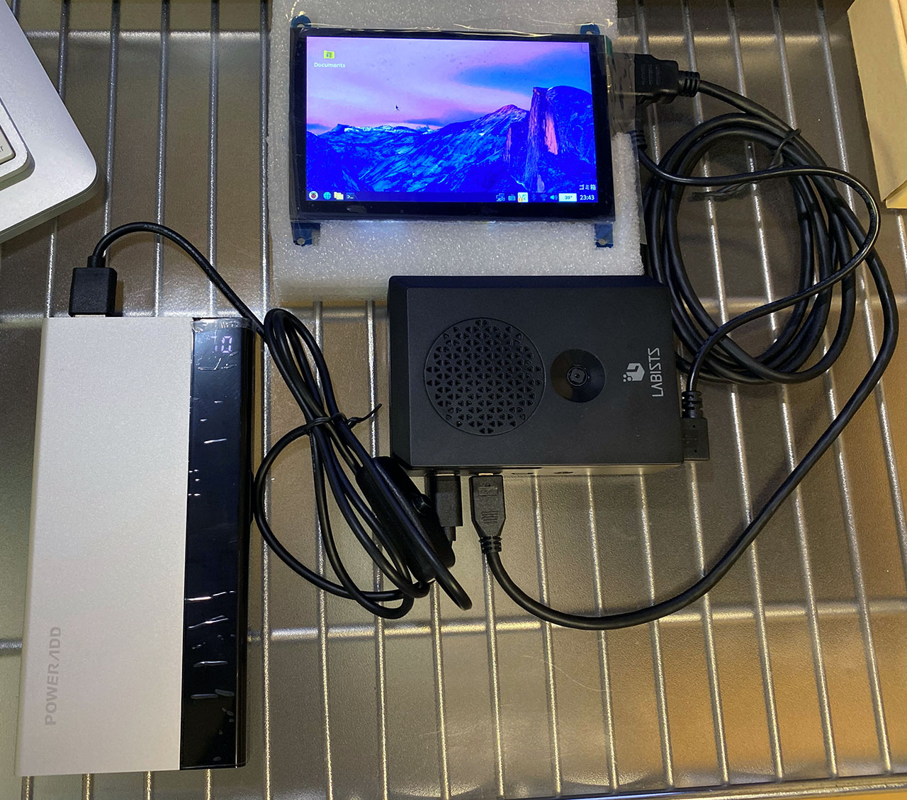

ラズパイ4をモバイルバッテリーで駆動させるため、モバイルバッテリーを買ってみた。

以前、*Anker Astro E5 第2世代*という古いモバブーを使って、ラズパイ4と Elecrow 5インチ液晶をバッテリー駆動させることができた。

この製品は 16,000mAh の大容量なのだが、重量が 296g あり、2014年発売の製品と若干古いので、ラズパイ専用のモバブーとして何か安いのを買ってみることにした。

ラズパイ4は 5V・3A で電源供給できれば動作するそうなので、モバイルバッテリーを選ぶ際は出力のスペックが 5V・3A のモノを選んだ。安いモノだと 5V・2.4A 出力しかなかったりして、コレだとラズパイ3系までにしか対応できず、ラズパイ4では正常に動作するか怪しいので避けること。

色々探して自分が選んだのは、**Power Add Aries I** という 10,000mAh のモノ。値段が安くて、*1,599円*だった。

  

    
  

  

    

      <a href="https://hb.afl.rakuten.co.jp/hgc/g00tk9q2.waxycb40.g00tk9q2.waxydfc7/?pc=https%3A%2F%2Fitem.rakuten.co.jp%2Fgishop2019%2F7qd3m9jpgc548zo6%2F&amp;m=http%3A%2F%2Fm.rakuten.co.jp%2Fgishop2019%2Fi%2F10241533%2F">モバイルバッテリー 10000mAh Poweradd Aries ? USB-C 充電器 TYPE-C/Micro USBポート LED残量表示 MacBook Zenbook Samsung Galaxy NexusなどiPhone &amp; Android各種対応 緊急用 防災グッズ（USB C-Cケーブル付き）</a>
    

    

      <a href="https://hb.afl.rakuten.co.jp/hgc/g00tk9q2.waxycb40.g00tk9q2.waxydfc7/?pc=https%3A%2F%2Fwww.rakuten.co.jp%2Fgishop2019%2F&amp;m=http%3A%2F%2Fm.rakuten.co.jp%2Fgishop2019%2F">GIショップ　楽天市場店</a>
    

    
価格 : 4656円

  

  

    
  

  

    

      <a href="https://www.amazon.co.jp/dp/B078LZ1D5G?tag=neos21-22&amp;linkCode=osi&amp;th=1&amp;psc=1">モバイルバッテリー 10000mAh Poweradd Aries Ⅰ USB-C 充電器 TYPE-C/Micro USBポート LED残量表示 MacBook Zenbook Samsung Galaxy NexusなどiPhone &amp; Android各種対応 緊急用 防災グッズ（USB C-Cケーブル付き）</a>
    

  

付属品はモバブーの充電に使用できる Micro USB-B ⇔ USB-A ケーブルと、USB-C ⇔ USB-C ケーブル。

USB-A ポートは 5V・3.1A 出力に対応していて、USB-C ポートは 5V・3A 出力とのこと。

見た目は角ばっていて格好良い。本体側面のスイッチを押すと、電池残量がパーセント値で確認できる。

Anker Astro E5 と比べてみたが、**本体サイズは Aries I の方が大きい**。重量は 399g ほどあるらしく、コンパクトさに欠ける。コレは完全に失敗した。安いだけで小さく・軽くなかった。

Aries I に、電源スイッチ付き USB-A → USB-C ケーブルを挿して、ラズパイ4に接続してみた。ラズパイ4の USB-A から、Elecrow の5インチ液晶の Micro USB-B ポートに接続し、液晶にも給電している。

**この状態で、動作は問題なく行えた**。Astro E5 より大きく・重たくて残念だが、ラズパイ4の駆動には使えたのが良かった。

---

安さで選ぶならこの商品は悪くない。10,000mAh という容量も十分だろう。これ以上容量を減らすと、5V・3A 出力に対応していない製品が多いので、製品選定の際は注意が必要。

もう少し高い商品なら、5V・3A に対応していて、200g を切るようなモバブーも売っているので、よりコンパクトにしたい場合は調べてみると良いだろう。
