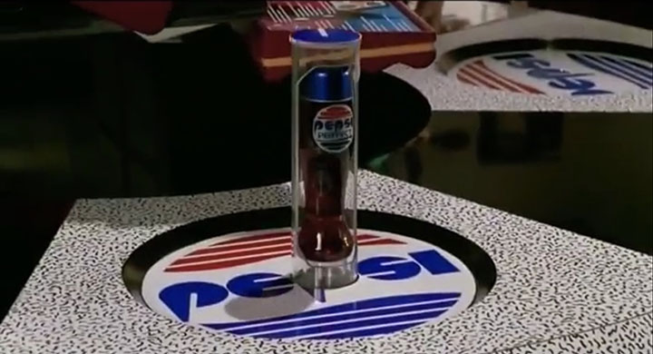
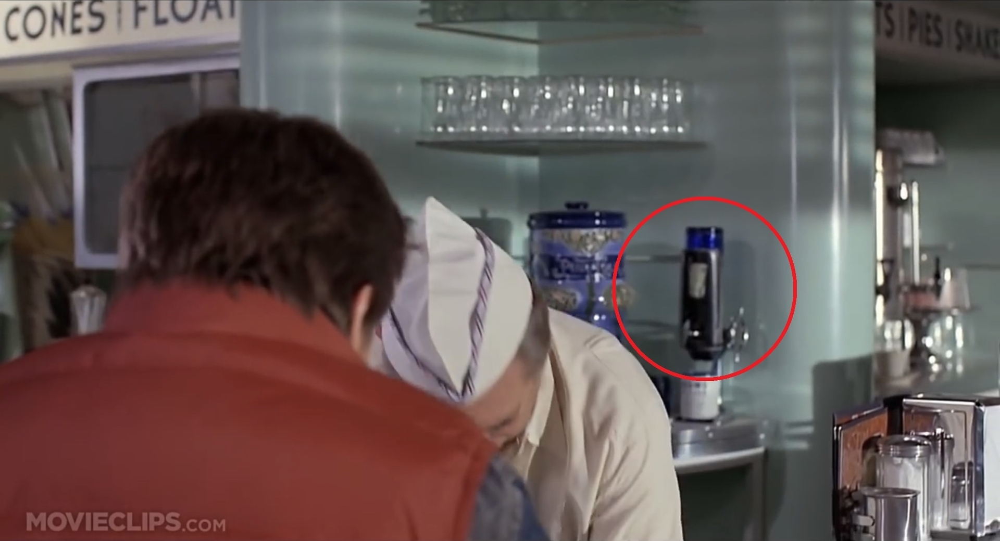

1989年の映画_「バック・トゥ・ザ・フューチャー Part 2」_の冒頭、__2015年__の「Cafe 80's」で登場する、独特なビン形状の__ペプシコーラ__。

一方、1985年の映画__「バック・トゥ・ザ・フューチャー Part 1」__で、_1955年_に迷い込んだ主人公マーティが訪れた「Lou's Cafe」の店内。

店主の後ろに置いてあるビンのようなモノを見ると、なんだか__「2015年のペプシ」っぽくないだろうか…？__

コレの正体は何なんですかね？

  

    
  

  

    

      <a href="https://www.amazon.co.jp/dp/B08FTGN345?tag=neos21-22&amp;linkCode=osi&amp;th=1&amp;psc=1">バック・トゥ・ザ・フューチャー トリロジー 35th アニバーサリー・エディション 4K Ultra HD + ブルーレイ[4K ULTRA HD + Blu-ray]</a>
    

  

  

    
  

  

    

      <a href="https://hb.afl.rakuten.co.jp/hgc/g00q0722.waxyc9ff.g00q0722.waxyd017/?pc=https%3A%2F%2Fitem.rakuten.co.jp%2Fbook%2F13363475%2F&amp;m=http%3A%2F%2Fm.rakuten.co.jp%2Fbook%2Fi%2F17571205%2F">バック・トゥ・ザ・フューチャー トリロジー 30thアニバーサリー・デラックス・エディション DVD-BOX [ マイケル・J.フォックス ]</a>
    

    

      <a href="https://hb.afl.rakuten.co.jp/hgc/g00q0722.waxyc9ff.g00q0722.waxyd017/?pc=https%3A%2F%2Fwww.rakuten.co.jp%2Fbook%2F&amp;m=http%3A%2F%2Fm.rakuten.co.jp%2Fbook%2F">楽天ブックス</a>
    

    
価格 : 2970円

  

