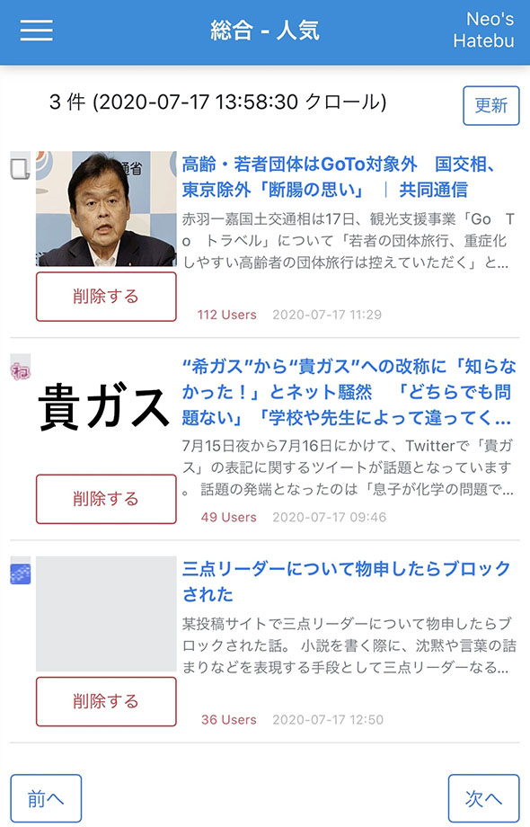
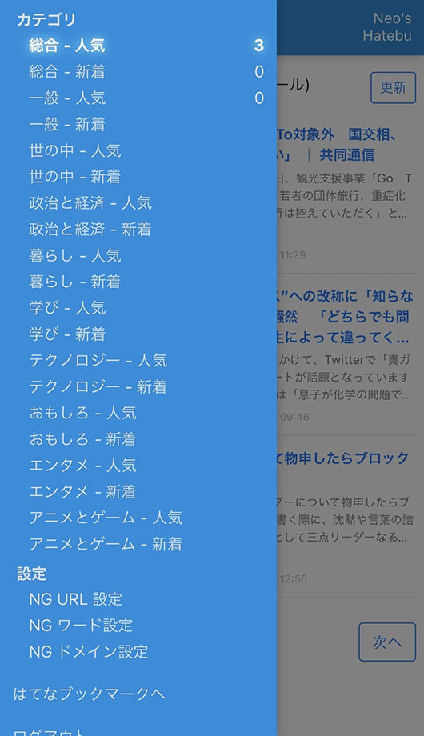
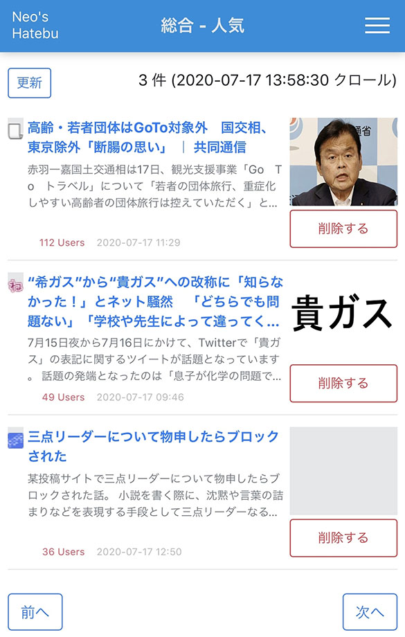
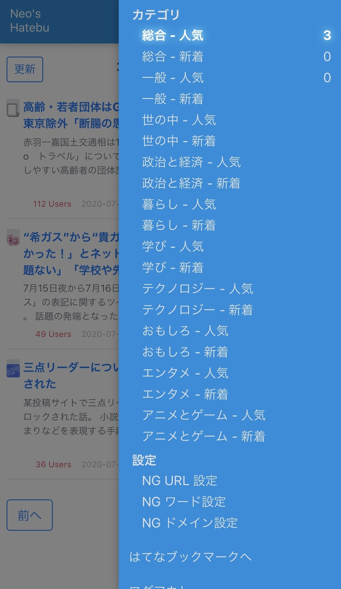
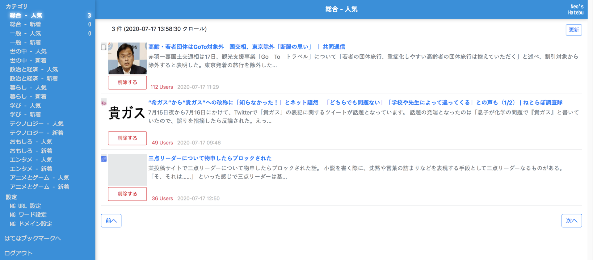
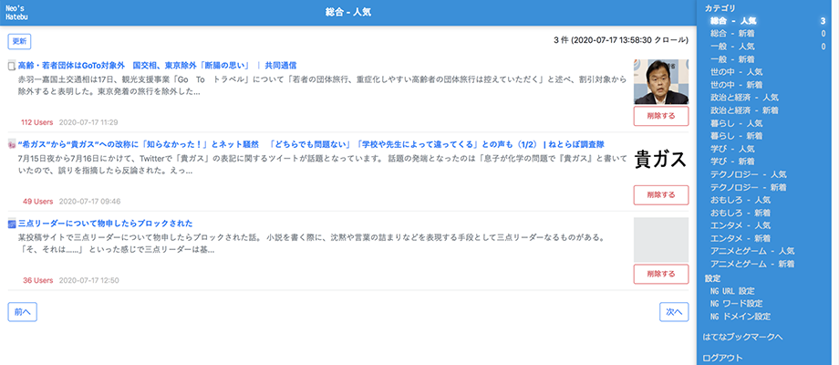

自分だけが使っている、オレオレはてなブックマーク閲覧アプリの **Neo's Hatebu**。

- [はてなブックマークにノイズが多いのでオレオレはてなブックマーク「Neo's Hatebu」を作った](/blog/2018/11/17-02.html)

久々に機能追加をしたので、紹介していなかった過去分と合わせて紹介する。コード全量は以下で確認できる。

- [Neos21/neos-hatebu](https://github.com/Neos21/neos-hatebu)

## 目次

## 利き手モード切り替え

アプリをスマホで表示した時に、画面右上にハンバーガーメニューがあるか、左上にあるか、みたいなレイアウトは、スマホを持つ手によって利便性が変わってくる。

自分は大抵左手でスマホを操作するのだが、どちらの手で持ってもボタンが押しやすいよう、レイアウトを左右入れ替える仕組みを作った。

画面上部のページタイトル部分をタップすると、`body` 要素に CSS クラスが適用される。コレを見て、下位のコンポーネントで CSS を調整するというワケ。

`body` 要素に CSS クラスを振ったり外したりする処理は以下のとおり (必要な部分を抜粋)。

```typescript
import { Component, Inject, Renderer2 } from '@angular/core';
import { DOCUMENT } from '@angular/common';

@Component({ /* 省略 */ })
export class AppComponent {
  /** 左利きモードか否か (true:左利きモード Default・false:右利きモード) */
  private isLeftHandMode: boolean = true;
  
  constructor(private renderer2: Renderer2, @Inject(DOCUMENT) private document: any) { }
  
  /** 利き手モードを切り替える */
  public toggleHand(): void {
    this.isLeftHandMode = !this.isLeftHandMode;
    this.renderer2[this.isLeftHandMode ? 'removeClass' : 'addClass'](this.document.body, 'right-hand-mode');
  }
}
```

- 参考 : [neos-hatebu/app.component.ts at master · Neos21/neos-hatebu · GitHub](https://github.com/Neos21/neos-hatebu/blob/master/client/app/app.component.ts)

CSS 側では `:host-context()` を使って判断すれば良い。

```scss
.menu {
  // 通常の右利きモードでは左側に配置するイメージ
  float: left;
  
  // 右利きモードの時は右側に配置するイメージ
  :host-context(.right-hand-mode) & {
    float: right;
  }
}
```

見た目がどう変わるかというと、こんな感じ。

- スマホ表示 : 左利きモード
  - 
  - 
- スマホ表示 : 右利きモード
  - 
  - 
- PC 表示 : 左利きモード
  - 
- PC 表示 : 右利きモード
  - 

メニューに見えている件数表示は後述。

## アクセスキーで前後のカテゴリに移動する

アクセスキーを利用した機能は以前紹介していて、1件目に表示されている記事の「削除」ボタンを押下するためのアクセスキーを作った。

- [Angular で accesskey 属性を使ってキーボードからボタンを押下する](/blog/2020/03/16-03.html)

アクセスキーによって `button` 要素の `click` イベントを発火させ、任意の処理を行う、という仕組みはコレまでどおり。

コレを応用して、メニューからカテゴリをクリックすることなく、閲覧中の前後のカテゴリに移動できる仕組みを作った。

`router.url` で現在閲覧中のページ URL を取得し、そこからカテゴリ ID を拾えたら、前後のページに `router.navigate()` すれば良いだけ。

一応、カテゴリ一覧の配列をチェックして、配列の最後まで到達したら最初のカテゴリに戻るとか、その逆とか、ループできるようにした。

あと、アクセスキーじゃなくて普通のボタンでも「前へ」「次へ」を用意した。内部的にはアクセスキーを設定したボタンとは別々に実装している。

## カテゴリ別のエントリ数を表示する

このアプリは、はてブからスクレイピングした記事一覧のデータに対し、削除ボタンを押した記事の URL や NG ワードなんかで `Array.filter()` をかけていき、未読のモノだけを表示するという仕組みになっている。

一応、閲覧中のカテゴリの表示件数はページ上部に出しているのだが、その内容をメニューにも表示することにした。

記事を表示する子コンポーネントから、メニューがあるルートコンポーネントへと値を送るために、コレまでも使ってきた `Subject` と `Observable` を使うことにした。

記事一覧の初期表示時と「削除」ボタン押下時に、表示件数が変わるので、その時に当該カテゴリのフィルタ後の記事件数を `Subject#next()` で送信する。

ルートコンポーネントはその Subject を `Observable#subscribe()` で定期購読しておき、値が届いたらメニューに表示する仕組み。

## 以上

ヘッドラインを眺めながら「削除」を押していって、当該カテゴリのエントリ数が0件になったら次のカテゴリへ…。といった操作を、アクセスキーのみで行えるようになった。具体的には `Alt + Shift + d` (Mac は `Control + Option + d`) で削除し、`s` (前のカテゴリ) か `f` で移動するので、キーボードの左手だけでほとんどの操作ができる。

スマホで見る際も、「前へ」「次へ」ボタンを用意したのでメニューを開く必要がなくなり、操作速度が向上した。

そしてメニューには閲覧したカテゴリの残エントリ件数が表示されるようになったので、全カテゴリの未読が「0」になったことを確認しやすくなった。

ちょっとした機能追加で便利になった。よきよき。
