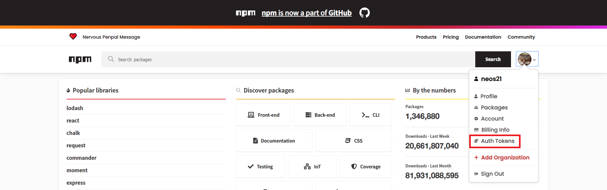
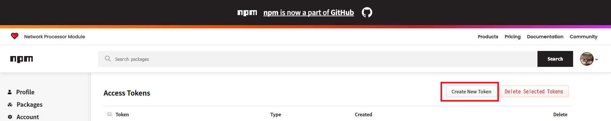
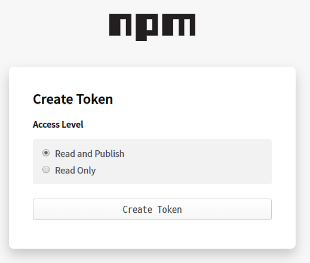
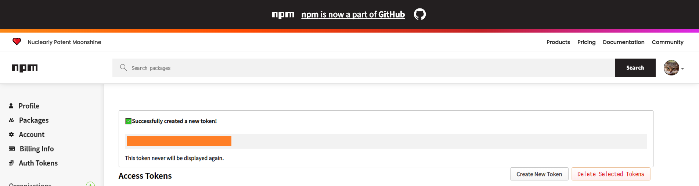

`npm publish` を自動で行う GitHub Actions を作ったので、その作り方を紹介する。

## 目次

## npm のトークンを取得する

GitHub Actions から `npm publish` を行うため、まずは npm のトークンを発行しておく。

`npmjs.com` にログインしたら、右上のユーザアイコンから「Auth Tokens」を選ぶ。



「Access Tokens」ページに移動したら「Create New Token」ボタンを押下する。



「Create Token」ページでは「Read and Publish」の Access Level を選択し、「Create Token」ボタンを押下する。



すると「Successfully created a new token!」というメッセージとともに、npm トークンが表示される。このトークン文字列は二度と再表示ができないので、ココで間違いなくコピーして控えておく。



## GitHub の Secrets に npm トークンを登録する

npm トークンを取得したら、それを GitHub リポジトリの Secrets として保存する。

GitHub のリポジトリページを開き、「Settings」ページに移動する。「Settings」ページの左メニューから「Secrets」を選択し、「New secret」ボタンを押下する。

「New secret」ページにて、次のように登録する。

- Name : `NODE_AUTH_TOKEN` とする
- Value : 先程コピーした npm トークン文字列 (前後に空白や改行を含まないよう、1行とする)

「Add secret」ボタンを押下したら Secret が登録できる。

## npm publish する GitHub Actions Workflow

Secret の用意ができたら、いよいよ Workflow の作成に移る。おおよそ以下のように書けば良い。

- `.github/workflows/publish-to-npm.yaml`

```yaml
name: Publish To npm
on:
  push:
    branches:
      - master
  workflow_dispatch:
jobs:
  publish-to-npm:
    runs-on: ubuntu-latest
    steps:
      - name: Checkout
        uses: actions/checkout@v1
      - name: Use Node.js And Setup .npmrc
        uses: actions/setup-node@v1
        with:
          node-version: '12.x'
          registry-url: 'https://registry.npmjs.org'
          # ↓ package.json の name に含めたスコープを指定しておく
          scope       : '@neos21'
          always-auth : true
        env :
          NODE_AUTH_TOKEN: ${{ secrets.NODE_AUTH_TOKEN }}
      - name: Can Publish
        run : npx can-npm-publish --verbose
        env :
          NODE_AUTH_TOKEN: ${{ secrets.NODE_AUTH_TOKEN }}
      - name: Install
        run : npm install
        env :
          NODE_AUTH_TOKEN: ${{ secrets.NODE_AUTH_TOKEN }}
      - name: Build
        run : npm run build --if-present
        env :
          NODE_AUTH_TOKEN: ${{ secrets.NODE_AUTH_TOKEN }}
      - name: Publish
        run : npm publish --access=public
        env :
          NODE_AUTH_TOKEN: ${{ secrets.NODE_AUTH_TOKEN }}
```

- `master` ブランチへの Push をトリガーに動作するようにした
  - `can-npm-publish` を使い、当該バージョンが公開済かどうかチェックしているので、`package.json` 内のバージョン番号を書き換えていない場合は `npm install` 以降の Step が動作しないことになる
- `actions/setup-node` 内の `scope` は自身の Owner 名に合わせて変更する
- Secrets に登録した `NODE_AUTH_TOKEN` を環境変数で渡し、npmjs のレジストリで認証できるようにしている
- `npm install`・`npm run build`・`npm publish` などは通常手作業で Publish する時と同じ
  - `npm install` は依存パッケージがなかったら何の影響もしない。この Workflow をそのまま汎用的に流用できるだろう
  - `--if-present` オプションにより、`npm run build` が存在しなくてもエラーにならない。コレにより、この Workflow を汎用的に流用できるだろう
  - `--access=public` オプションは、スコープパッケージを `npm publish` する場合は必須

前回紹介した GPR (GitHub Package Registry) への Publish を同時に行う場合は、一つの Workflow ファイルに2つの Job として記載しても良いし、二つの Workflow ファイルに分けていても良い。

1 Workflow・2 Jobs で記述した場合、片方の Job が失敗してももう片方の Job はそれに引きずられて中断されることはなく、ちゃんと最後まで終わるようだ。

2 Workflows で記述した場合は完全に別々に動くので気にすることなし。「Actions」タブでの表示も「npm 公開用」と「GPR 公開用」とで Workflow が別れて表示されるので、コチラの方が分かりやすいかも。

以上～。
