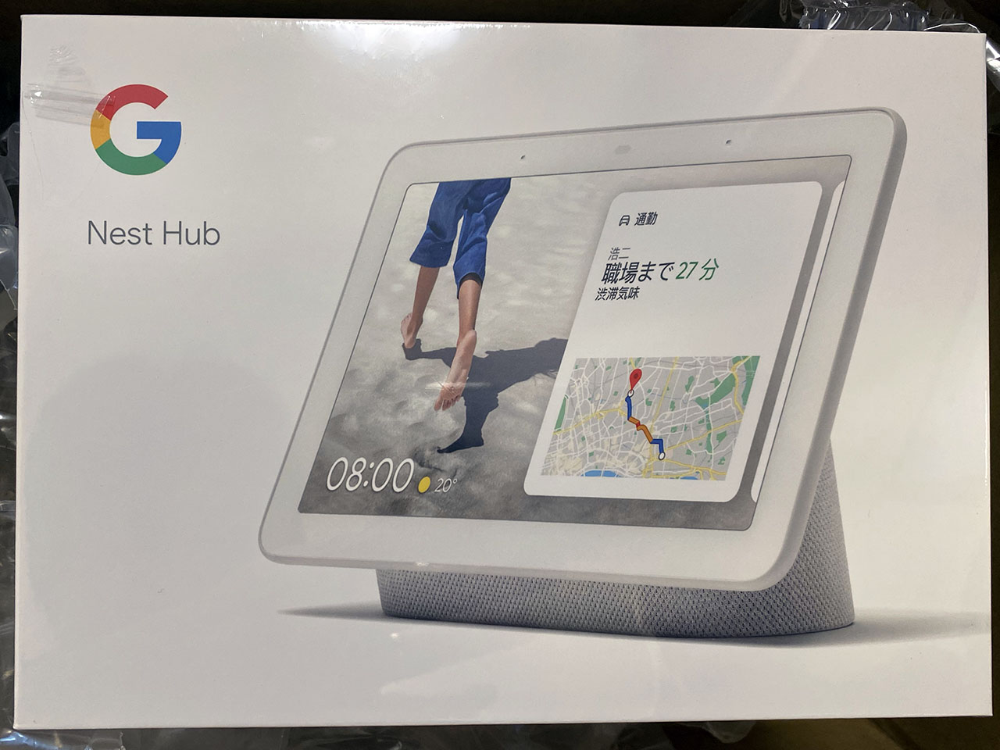
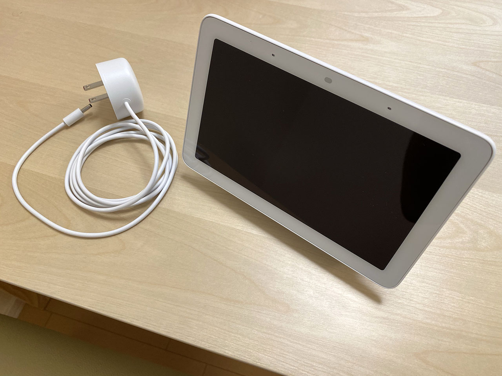
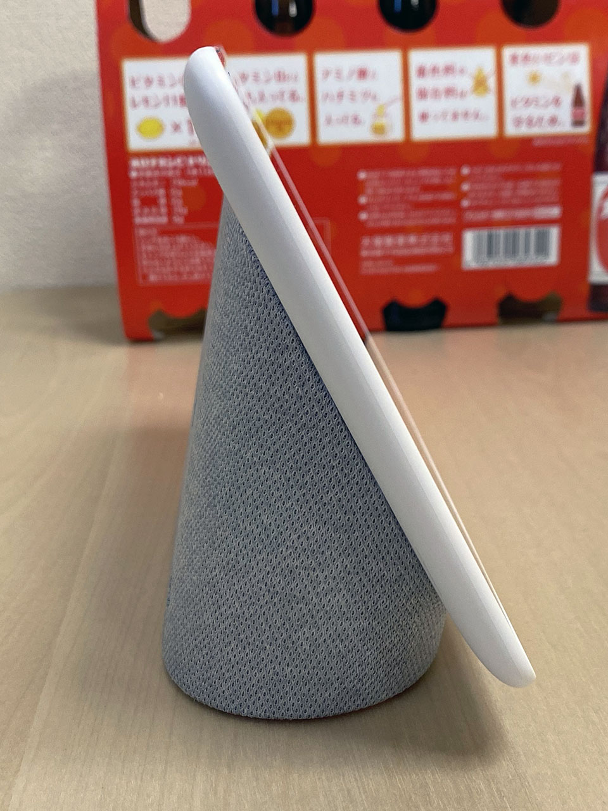
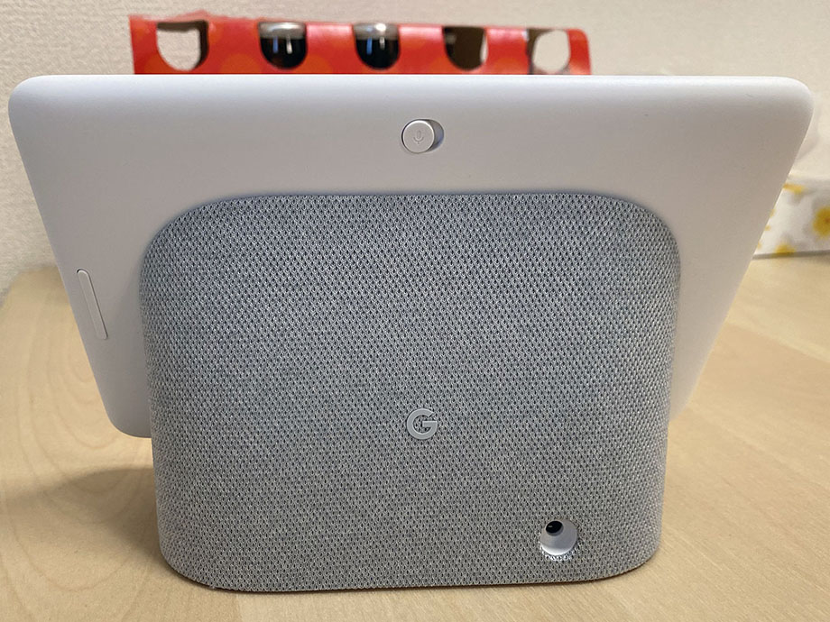
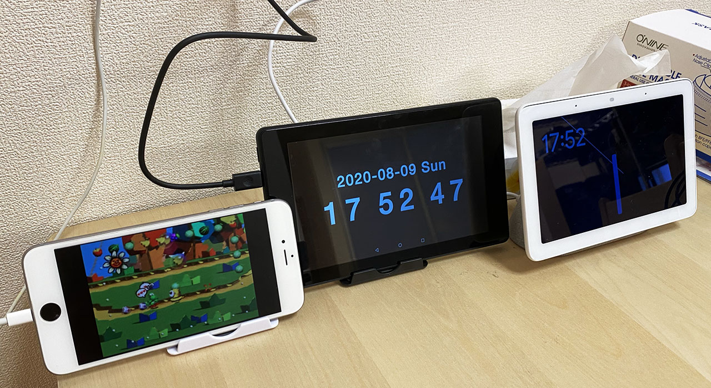

何かセールをやっていたので Google Nest Hub を買ってみた。

  

    
  

  

    

      <a href="https://www.amazon.co.jp/dp/B081B8QH9Q?tag=neos21-22&amp;linkCode=osi&amp;th=1&amp;psc=1">Google Nest-Chalk ホワイト</a>
    

  

## 目次

## 買ったモノ

今回買ったのは __Google Nest Hub__ という商品。定価9,900円のところ、セールで_8,910円_だった。Google Store で購入。カラーリングは Chalk (白) と Charcoal (黒) があるが、ベゼルはどちらも白いので違和感が少ない Chalk を購入。

- 参考：[Google Nest Hub - スマートディスプレイ - Google ストア](https://store.google.com/jp/product/google_nest_hub)

以前は Google Home Hub とか呼ばれていたモノで、7インチの_タッチディスプレイ_に台座が付いた状態の製品。カメラは付いていないので逆に安心。

上位版で、10インチ液晶にカメラ付きの Google Nest Hub Max という製品もあるが、値段が28,050円と途端に高くなるので、お試し感覚では買えない。

  

    
  

  

    

      <a href="https://hb.afl.rakuten.co.jp/hgc/g00q0722.waxyc9ff.g00q0722.waxyd017/?pc=https%3A%2F%2Fitem.rakuten.co.jp%2Fbook%2F16094843%2F&amp;m=http%3A%2F%2Fm.rakuten.co.jp%2Fbook%2Fi%2F19814442%2F">Google Nest Hub Max チャコール</a>
    

    

      <a href="https://hb.afl.rakuten.co.jp/hgc/g00q0722.waxyc9ff.g00q0722.waxyd017/?pc=https%3A%2F%2Fwww.rakuten.co.jp%2Fbook%2F&amp;m=http%3A%2F%2Fm.rakuten.co.jp%2Fbook%2F">楽天ブックス</a>
    

    
価格 : 22000円

  

一方、液晶がなくスピーカーのみの Nest Mini という製品もあり、コチラは6,050円と安いものの、液晶はないとさすがにつまんなくね？と思い却下。

## 外観を確認

外観を見てみると、意外と小さく、奥行きを取らない作り。ダイニングテーブルに置きっぱなしにしても大丈夫そう。

ボリューム、マイクオン・オフのボタンが背面にある。

電源ボタンなどはなく、3.5mm 径の DC 端子に電源ケーブルを挿したらすぐに起動する。本体にバッテリーは内蔵されておらず、電源ケーブルを抜くとその瞬間に電源が落ちてしまう。

## セットアップはスマホの「Google Home アプリ」が必須

Google Nest Hub だけではセットアップが進められない。スマホの「Google Home アプリ」での設定が必須である。自分は iPhone ユーザなので iOS 版の「Google Home アプリ」を使ったが、特に連携面での問題はなかった。

- 参考：[Google Nest Hub（画面付きのGoogle Home）を買ったのでレビュー。Wi-Fiの設定や便利機能の紹介。 - サンデーゲーマーのブログWP](https://sundaygamer.net/google-nest-hub/)

スマホアプリ側で Wi-Fi や Google アカウントを設定したりして、10分弱で設定完了。やたらとサービス連携させたり個人情報を求めてきたりするのが Dark Pattern... と思った。

## 雑多に感想

スマートスピーカーとしての音声認識は、Google アシスタントは Alexa や Siri よりも高精度だと思う。ほとんど誤認識や聞き漏れが発生しないのが凄いと思う。

ホーム画面は時計を大きく表示するか、アートギャラリーか、自分の Google フォトからアルバムを選択して表示させるか、を選べる。Google フォトで予め Nest Hub 用のアルバムを作っておくと、フォトアルバム的な使い方が捗りそう。

Android OS などではないので、ブラウザアプリもないし、「Google 検索して」とお願いして検索結果画面を閲覧するような使い方はできない。ただし、「Ok Google、○○は？」と質問した回答にリンクがある場合があって、そのリンクを押すと内部ブラウザが開くので、ウェブページを見る術が全くないワケではない。それでもスマホやタブレット的な使い方は出来ないので諦めよう。

無料の Spotify をアカウント連携して、「Casiopea をかけて」などとお願いすると、良い感じに曲を流してくれる。音量調整も「ボリュームを3にして」とか言うと認識するし、再生中に「この曲の曲名は？」と聞くと曲名を読み上げてくれる。

クックパッドなどの対応しているサービスで、料理のレシピを見たりできるのも良い。文字が大きく表示されて使いやすい。

## 画面の切り方

ホーム画面から左スワイプして時計を表示した状態で__「Ok Google、画面を切って」と指示すれば、画面表示を完全に切れる__。何か他の画面を表示している時に指示すると、画面の明るさを最も暗くした状態で、うっすら何かが映った状態で待機してたりする。

ついつい節電したくなっちゃって、画面を切りたくなるのだが、イチイチ声掛けしないと画面が切れないのは面倒臭く感じる。スリープボタンくらい欲しかった。

## タブレットとは思わないように使おう

まだスマートディスプレイというモノを買って間もないので、どうしてもスマホやタブレット的な使い方を求めてしまい、「キーボードで入力してぇ〜」とか思ってしまうのだが、その辺は慣れだろうか。

食事中にテレビを見ながらちょっとした疑問を解決したりするのには結構向いているので、買って損はなかったと思うが、果たして Nest Hub のポテンシャルを最大限引き出せるであろうか…。今後も活用していく。

↑ Alexa を有効にした Fire 7 タブレットと、Hey Siri を有効にした iPhone 6 Plus を置いてみている…。

  

    
  

  

    

      <a href="https://www.amazon.co.jp/dp/B07KD87NCM?tag=neos21-22&amp;linkCode=osi&amp;th=1&amp;psc=1">Echo Show 5 (エコーショー5) スマートディスプレイ with Alexa、チャコール</a>
    

  

