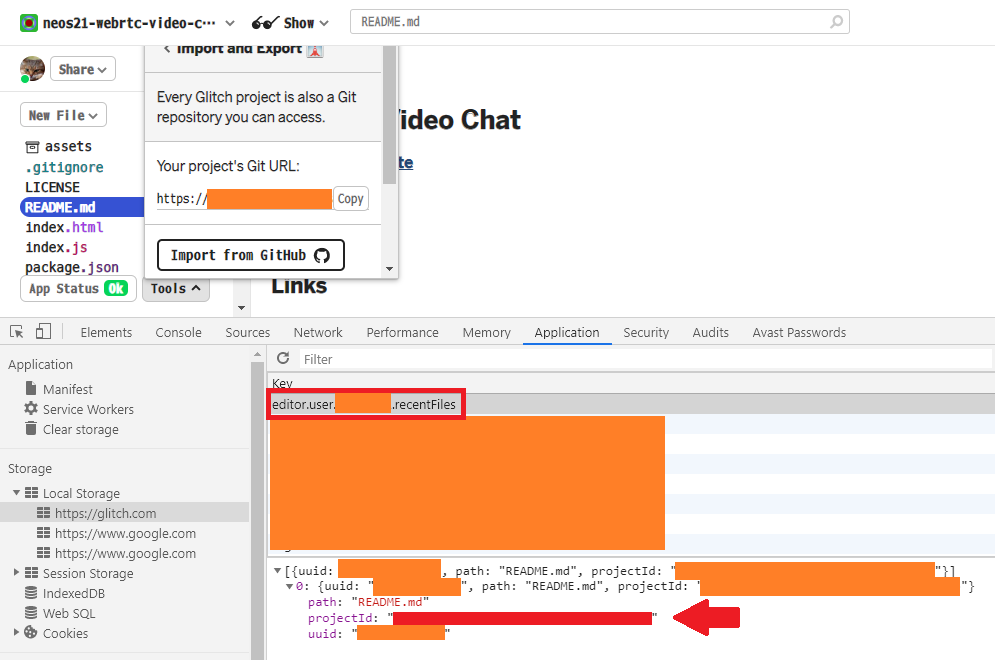
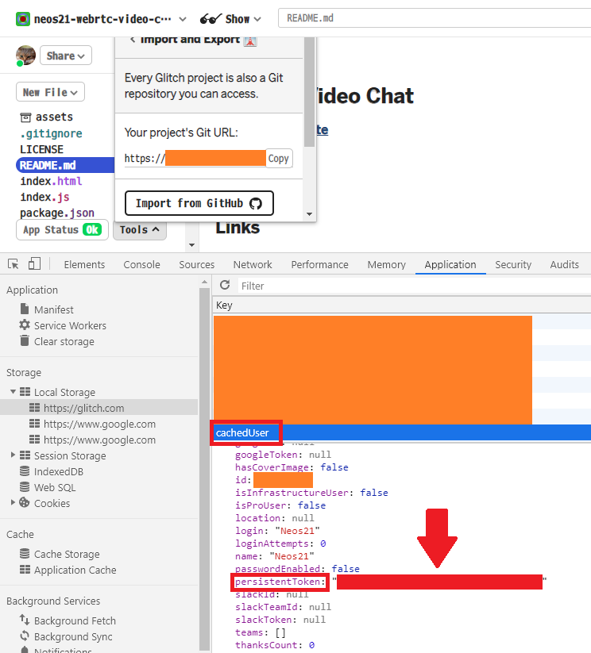

_Glitch_ という、Node.js アプリが動かせる Heroku みたいな PaaS がある。

Glitch は GitHub リポジトリからのインポート、および GitHub へのエクスポートは出来るが、自動的な同期には対応していない。

そこで、GitHub リポジトリへの Push をトリガーに、Glitch へ資材を自動転送する GitHub Actions を作った。

事前準備が若干複雑なので紹介。

## 目次

## Glitch のプロジェクト ID と Auth Token を取得する

Glitch への同期を行う際、Glitch API という API を使用するのだが、その時に_「プロジェクト ID」_と**「Auth Token」**が必要になる。

Glitch API はドキュメントが公開されておらず、トークンなどの情報についても一般的には取得できないので、少し特殊な操作が必要になる。

まず Glitch のアプリ画面に移動したら、左下の「Tools」を選択し、「Import and Export」から「Import from GitHub」を選ぶ。

GitHub のユーザ名とリポジトリ名を入力し、GitHub 連携と資材のインポートができたところで、**ブラウザの開発者ツールを開く。**

Chrome の場合、開発者ツールの「Application」タブから「Local Storage」を開き、次のキーを見ていく。

- プロジェクト ID : `editor.user.XXXXX.recentFiles`
  - 配下にある `projectId` キーの値



- Auth Token : `cachedUser`
  - `persistentToken` キーの値



これらを控えたら、それぞれ GitHub の Secret に登録する。

- 参考：[GitHub - jarvis394/glitch-api: Library for using Glitch API ⚙️](https://github.com/jarvis394/glitch-api)
- 参考：[How Can I Find Glitch API Project ID And Token - Glitch Help - Glitch Support](https://support.glitch.com/t/how-can-i-find-glitch-api-project-id-and-token/16901/5)

## GitHub Actions Workflow を実装する

ワークフローは単純な作りだ。次のとおり。

- `./.github/workflows/deploy-to-glitch.yaml`

```yaml
name: Deploy To Glitch
on:
  push:
    branches:
      - master
    workflow_dispatch:
jobs:
  deploy:
    runs-on: ubuntu-latest
    steps:
      - name: Deploy To Glitch
        uses: kanadgupta/glitch-sync@master
        with:
          project-id: '${{ secrets.PROJECT_ID }}'
          auth-token: '${{ secrets.AUTH_TOKEN }}'
```

コレで master ブランチへの Push 時に Glitch へ資材が自動転送される。

以上。

- 参考：[Glitch Project Sync · Actions · GitHub Marketplace · GitHub](https://github.com/marketplace/actions/glitch-project-sync)
