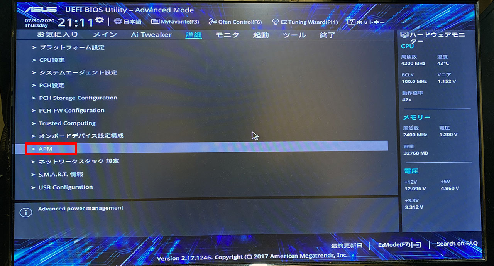
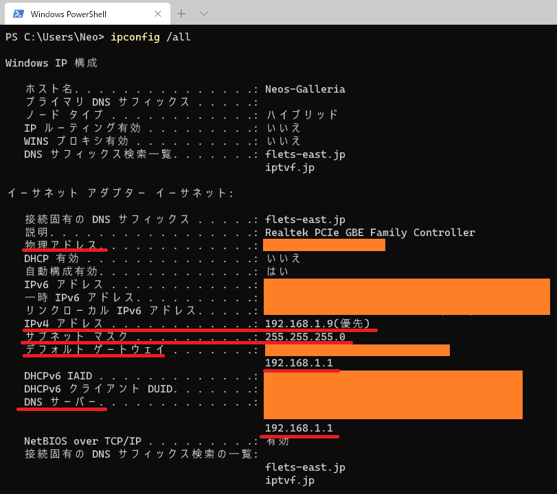

かねてよりやりたかった、**WoL (Wake on LAN)** および *WoW (Wake on WAN)* が実現できたので、やり方を紹介する。

## 目次

## WoL・WoW とは・何が実現できるのか

WoL は、マジックパケットと呼ばれる特殊な信号を送ることで、パソコンを遠隔で起動できる仕組みだ。

LAN 内で遠隔起動する場合は WoL、WAN (インターネット経由) から遠隔起動する場合は WoW と呼ぶが、やることは一緒。

設定が難解で、ルータごとに設定画面が異なるので、自分にあった解説がなかなか見つけづらい。今回なんとか WoW ができたので、自分が使っているルータの設定画面を実際に掲載しながら説明する。

今回自分が実現できた限りでは、

- スタンバイからの起動
- 休止状態からの起動
- 完全にマシンの電源を切った状態からの起動

のいずれも遠隔で行えた。

## 環境・前提条件

前提とする環境は次のとおり。

- NTT 東日本のルータ **RS-500KI** を使用している
  - ルータの設定画面はこの RS-500KI の設定画面で説明する
- ルータとパソコンは LAN ケーブルで有線接続している
  - LAN ケーブルの製品名は忘れたが、特にどれでも大丈夫なはず
  - 無線 LAN で WoL をやるにはさらに一工夫必要。自分も試していないし、今回は解説しない
- パソコンは Windows10 Pro
  - Home でも大丈夫なはず。Win7 など古い OS でも WoL は可能だが、設定画面の説明などは Win10 のモノで説明しているので読み替えが必要
- マンションなので Public IP は動的に変わる
  - 固定 IP ではないが WoW ができた
  - 何かの拍子に Public IP が変わった時に、自分で IP を調べ直さなくて良いように、Dynamic DNS (DDNS) の設定をしておく

今回、マシンを遠隔起動した後の遠隔操作については説明しないが、Google リモートデスクトップなり TeamViewer なりを入れておけば、起動後の操作はそちらで行えるであろう。

## BIOS 設定

BIOS の画面もパソコンによって異なるのでなんともいえないが、

- Wake on LAN

とかなんとかそういう文言の設定があるはずなので、BIOS で有効にしておく。

自分は以前設定を済ませていて、全て上手く行ったあとにこの記事を書くため再度 BIOS を開いたところ、画面 UI が変わってるわ、BIOS の設定上は Off になっているわで謎だった。自分はとりあえず設定は Off のまま変えないでおくことにした。

自分の PC (Galleria XG) のマザーボードは Asus PRIME H270-PLUS という型番。一応このマザボの BIOS 画面でいうところの説明を載せることにする。

ちなみにマザーボードの型番は

```powershell
PS1> wmic baseboard get product
```

というコマンドで調べられる。

- 参考 : [自分のPCのマザーボードの型番を確認する方法6選！ | Aprico](https://aprico-media.com/posts/2173)


PC を付けたら F2 か Delete キーを連打して BIOS に入る。押下するキーはメーカによって F8 や F12 だったりすることもある。


「Asus UEFI BIOS Utility - EZ Mode」という画面が開いた。右下の「Advanced Mode (F7)」を選択する。操作は有線接続されているキーボードかマウスで。


「Advanced Mode」画面に移ったら、「詳細」タブに移動する。



「詳細」タブに移動したら、「APM」を選択する (Enter キー)。


「APM」画面に移動したら、

- PCIE による電源 ON
- モデム受信による電源 ON

といった項目があると思うので、これらを有効にする。

設定を変更したら、設定を保存して終了する。

- 参考 : [Wake On LAN (WOL) を利用する際のBIOS設定｜テックウインド株式会社](https://www.tekwind.co.jp/ASU/faq/entry_164.php)

以降は Windows10 での設定。

## Windows10 に自動ログインできるようにしておく

WoL でマシンを遠隔起動しても、サインイン画面が表示されてしまっては、その後の遠隔操作ができない。ということで、マシン起動時にサインイン画面を表示せず、自動的にデスクトップが表示されるように設定しておこう。

以下の記事で紹介したとおり、**`control userpasswords2`** で自動ログイン設定ができる。詳細は以下の記事を参照のこと。

- [Windows10 で自動ログインを実現するには control userpasswords2 を使う](/blog/2020/06/10-01.html)

## 有線 LAN からの WoL が可能か確認する

PowerShell で次のコマンドを実行する。

```powershell
PS1> powercfg.exe /devicequery wake_programmable
```

一覧に「Realtek PCIe GBE Family Controller」が出ていれば、有線 LAN からの WoL ができる。


## ネットワークアダプタの設定で WoL を有効にする

コントロールパネル → デバイスマネージャー → ネットワークアダプター → 「Realtek PCIe GBE Family Controller」を右クリックして「プロパティ」を選択する。

### 「詳細設定」タブ

「詳細設定」タブで WoL を有効にする。主に以下の設定を有効にすれば OK。迷ったらとりあえず何でも有効化しとけ。


- Shutdown Wake-On-Lan : Enabled
- Wake on Magic Packet : Enabled
- Wake on pattern match : Enabled
- WOL & Shutdown Link Speed : 10 Mbps First

### 「電源の管理」タブ

「電源の管理」タブで3つともチェックを入れる。


- 電力の節約のために、コンピューターでこのデバイスの電源をオフにできるようにする
- このデバイスで、コンピューターのスタンバイ状態を解除できるようにする
- Magic Packet のみ、コンピューターのスタンバイ状態を解除できるようにする

「Magic Packet のみ…」のチェックを外さないと上手く行かなかった、という文献も見かけたが、自分は全部チェックで大丈夫だった。

## プライベート IP を固定する

WoL で起動したいパソコンを特定するための、プライベート IP アドレスを固定する。後のルータ設定時に、プライベート IP アドレスを指定する必要があるので、固定は必須。

現在自動的に割り当てられているプライベート IP をそのまま使って固定するのがシンプルだと思う。

コントロールパネル → ネットワークと共有センター → 「イーサネット」を押下する。


そしたら「イーサネットの状態」ウィンドウが開く。


### 「詳細」ボタン → 「ネットワーク接続の詳細」ウィンドウ

現状の設定を確認する。


- 物理アドレス : コレが *MAC アドレス*。ハイフン `-` をコロン `:` に直して使うのでコピーしておく
- IPv4 アドレス : 現在のローカル IP。コレをこのまま固定するので確認しておく。ココでは `192.168.1.9` だった
- IPv4 サブネットマスク : 後で参照するので確認しておく。`255.255.255.0`
- IPv4 デフォルトゲートウェイ : 後で参照するので確認しておく。`192.168.1.1`
- IPv4 DNS サーバー : 後で参照するので確認しておく。`192.168.1.1`

これらの内容は `PS1> ipconfig /all` でも確認できる。



### プライベート IP アドレスを固定する

「プロパティ」ボタン → 「イーサネットのプロパティ」ウィンドウ → 「インターネットプロトコルバージョン4 (TCP/IPv4)」を選択して「プロパティ」ボタンを押下する。


- 「次の IP アドレスを使う」にチェックを入れる
  - IP アドレス : 先程確認した「IPv4 アドレス」をそのまま入れる。`192.168.1.9`
  - サブネットマスク : 先程確認した「IPv4 サブネットマスク」。`255.255.255.0`
  - デフォルトゲートウェイ : 先程確認した「IPv4 デフォルトゲートウェイ」。`192.168.1.1`
- 「次の DNS サーバーのアドレスを使う」にチェックを入れる
  - 優先 DNS サーバー : 先程確認した「IPv4 DNS サーバー」。`192.168.1.1`


コレで OK。

## 高速スタートアップの無効化 … しなくても大丈夫だった

コントロールパネル → 電源オプション → 「電源ボタンの動作を選択する」を押下する。


- 「現在利用可能ではない設定を変更します」を押下して設定変更できるようにする
- 「高速スタートアップを有効にする」のチェックを外す


…と良いらしく、自分も以前無効化していたつもりだったが、よくよく確認したらチェックが付いていた。それでも WoL できているのでこのままにしておく。ｗ

## ルータでポートを開放する

ココがメチャクチャ分かりづらい。素人が脱落するところ。

簡単に仕組みを説明すると、ルータはインターネットからの余計な通信が入り込んで来ないように通信を塞いでいる (ファイアウォール)。Wake on LAN を実現する際はこの制限を解除して、マジック・パケットを受信できるようにする必要がある。

で、ルータが持つ機能によって設定方法が違ったり、画面や文言が違ってツライところなのだ。

今回は NTT の RS-500KI というルータの設定画面で説明する。

### 設定画面にログインする

まずは設定画面にログインする。RS-500KI の場合は「デフォルトゲートウェイ」や「DNS サーバ」のアドレスとして指定した `192.168.1.1` が管理画面になっているので、コレをブラウザで開く。

- `http://192.168.1.1/`

BASIC 認証が開くと思うので、この内容はプロバイダ契約時や初期設定時に設定したユーザ名・パスワードでログインする。

ログインできたら次のような画面が開くはず。


メインセッションを使っていることを確認しておく。

### 「静的 IP マスカレード設定」を行う

自分の場合、とりあえずコレを設定したが、**効いていない可能性が高い。**

「静的 IP マスカレード」というのがワケ分からんが、受信したポート番号とプロトコルが一致したら、指定のプライベート IP アドレスに対して通信を転送する*許可設定*である。

ルータ管理画面の左メニューの「詳細設定」→「静的 IP マスカレード設定」を押下する。


上のスクショでは「エントリ番号 : 1」に既に設定が書かれているが、何も設定したことがなければココも空欄なはず。1行目の右端の「編集」ボタンを押下する。

そしたら「エントリ編集」画面に移動するので、次のように入力する。


- 変換対象プロトコル : `UDP`
  - WoL のマジックパケットは UDP で送信されるので、UDP で受信した時の設定を書く
- 変換対象ポート : `9`
  - WoL のマジックパケットはポート番号 9 に投げるのが一般的だそうだ。変更しても良いが、今回はコレを使う
- 宛先 IP アドレス
  - 先程固定したプライベート IP アドレスを指定する。ココでは `192.168.1.9`
- 宛先ポート : `9`
  - 変換対象ポートと同じ

設定したら「設定」ボタンを押下する。

設定が追加されたら、1行目の左端にある「有効」チェックボックスにチェックを入れ、その上の「設定」ボタンを押下して設定を保存する。


### 簡易 DMZ 設定を行う

この設定が効いている可能性が高い。「簡易 DMZ」は、「静的 IP マスカレード」よりも緩く通信を許可する設定になる。

ルータ管理画面の左メニューより「静的 NAT 設定」を選択する。「簡易 DMZ 設定」項目を次のように設定していく。


- 外部からのパケットをすべて特定ホストに中継する (簡易 DMZ) : チェックを入れる
- 特定ホストの IP アドレス : 先程固定したプライベート IP アドレスを指定する。ココでは `192.168.1.9`

### UPnP 設定を無効化する

必要ないかもしれないが、無効化しないと上手くいかなかったという文献を見たのでやっておく。Universal Plug and Play の略。

ルータ管理画面の左メニューより「高度な設定」を選択する。

- 「UPnP 設定」項目の「使用する」チェックを外す

設定したら、画面下部の「設定」ボタンを押下する。

### WAN → LAN 中継設定を行う

「静的 IP マスカレード」と競合する設定なのだが、「*WAN → LAN 中継機能*」も設定しておく。多分コレか、「簡易 DMZ」のどちらか or 両方の設定が効果があって、「静的 IP マスカレード」設定は効果がないと思われる。細かいことは検証してない。

ルータ管理画面の左メニューより「高度な設定」を選択する。


- 「WAN → LAN 中継機能」の「使用する」チェックを入れる
- 接続先 : 「メインセッション」
- UDP ポート番号 : `9`
  - 先程設定したマジックパケット用のポート

設定したら、画面下部の「設定」ボタンを押下する。

## パブリック IP を確認する

最後に、インターネットからそのパソコンに到達するための、パブリック IP アドレスを調べる。

- [アクセス情報【使用中のIPアドレス確認】](https://www.cman.jp/network/support/go_access.cgi)

上のサイトにアクセスして確認したりしても良いし、PowerShell で調べたりもできる。

```powershell
PS1> (curl inet-ip.info/ip).Content
```


このワンライナーで Public IP だけが返ってくるので、メモしておく。

プロバイダの固定 IP などを契約していない限り、マンションタイプのルータなんかだと、ルータの再起動とかで Public IP はコロコロ変わってしまう。本来はコレをなんとかするためにダイナミック DNS を別途設定するのだが、ひとまずココで調べた Public IP で接続を試してみる。

## 一旦の設定は以上

設定はコレにて終了。ルータは再起動等の設定は要らない。パソコンは念のため一度再起動してプライベート IP が固定できているかなど確認しておこう。

問題なさそうなら、パソコンの電源を切って待機しておく。

## iPhone に RemoteBoot WOL をインストールする

以降は遠隔で起動するための端末での操作となる。今回は iPhone からマシンを遠隔起動する想定で説明する。

WoL を実現するアプリは多数あるが、完全無料で使えるのが「**RemoteBoot WOL**」というアプリ。コレをインストールする。

- 参考 : [「RemoteBoot WOL」をApp Storeで](https://apps.apple.com/jp/app/remoteboot-wol/id310369182)

アプリをインストールしたら、WoL の場合と WoW の場合とで、2つの設定を作る。

### WoL (同一 LAN 内からの起動) 設定

WoL、つまり同一 LAN 内に繋いでいる場合。もっと平たくいうと、起動したい PC と同じ家のルータに、iPhone が Wi-Fi 接続している状態だ。

同じ家にいるんだから遠隔起動できなくてもさほど困らないワケだが、LAN で動かなければ WAN からも起動できないので、とりあえず設定してみよう。


- Name or Hostname : 任意。設定には無関係
- MAC Address : 途中で調べた *MAC アドレス*を入力する。`10:XX:XX:XX:XX:XX` みたいに、コロンで区切る
- IP Address : LAN 内で流す場合は *`255.255.255.255`* として良い
  - プライベート IP アドレスを直接指定してだと上手くいかないと思う
- Port : ルータ設定でポート開放した `9` を指定する
- Broadcast : チェックを付けておく

iPhone を Wi-Fi 接続した状態で「Boot」ボタンを押下して、PC が起動できたら成功だ。

### WoW (インターネットからの起動) 設定

続いて、最終目標である、マシンをインターネットから起動する WoW 設定。iPhone が Wi-Fi ではなく 4G 接続している場合となる。

WoL の場合と設定が違うのは IP アドレス部分のみ。


- Name or Hostname : 任意。設定には無関係
- MAC Address : 途中で調べた MAC アドレスを入力する
- IP Address : 途中で調べた **Public IP アドレス** を指定する
- Port : ルータ設定でポート開放した `9` を指定する
- Broadcast : チェックを付けておく

この場合、PC と同じ Wi-Fi に iPhone が繋がっていると、PC を起動できない。iPhone 自身の Public IP アドレスが一致してしまい、自 IP にリクエストを送信するような形になるためだ。Wi-Fi 接続ではなく、4G 回線など別の方法でインターネット接続した状態で、「Boot」ボタンを押下してみよう。マシンが起動できれば WoW が実現できている。

## Public IP 直指定で WoW ができたら → DDNS 設定をする

Public IP アドレスを直接指定して WoW ができたら、Public IP が動的に変化しても対応できるようにするため、ダイナミック DNS を準備する。

ダイナミック DNS サービスとは、Public IP アドレスを解決するための独自 (サブ) ドメインが作れるサービス。日に1回ぐらい、自 PC の Public IP を自動チェックして、異なる Public IP に変わっていたら DDNS を更新することで対処できるというモノだ。

今回は **MyDNS.jp** という無料 DDNS サービスを使い、Public IP の変化チェックと自動更新は *DiCE* というフリーソフトを使う。

### MyDNS.jp に登録する

- [Free Dynamic DNS (DDNS) for Home Server and VPS etc | MyDNS.JP](https://www.mydns.jp/)

上のサイトにアクセスし、新規ユーザ登録を行う。氏名や住所などを入力させられるが、特に本人確認はない。

### ドメインを設定する

登録できたらログインし、左の「Welcome Administrator」メニューから「Domain Info」を選択する。

この画面で自分専用のドメインを作る。以下の要領で入力していけば良い。


- Domain
  - MyDNS.jp が提供するサブドメインを利用すれば良い
  - 自分は `XXXXX.mydns.jp` を使うことにした
- Mx
  - 空欄で OK
- Hostname, Type, Content, Delegateid or your id
  - 1行目の Hostname に `*` アスタリスクを入れる
  - Type は A (A レコード) そのまま
  - Delegateid は空欄そのまま
  - your id はセレクトボックスそのまま

このように入力して保存すれば、自分だけのドメイン `XXXXX.mydns.jp` ができたことになる。

このままでは、このドメインがどの IP アドレスに解決されるのか、という設定が何もされていない。まずは手作業で情報を入れることにする。

### IPv4・IPv6 アドレスを確認する

次のサイトで Public IP アドレスを確認する。以下のサイトは IPv4・IPv6 の両形式で Public IP が確認できる。

- [あなたの IPv6 をテストしましょう。](https://test-ipv6.com/index.html.ja_JP)


### DDNS に IP アドレスを登録する

MyDNS.jp の画面より「IP Addr Direct」画面に遷移する。

IPv4 と IPv6 のアドレスを入力する欄があるので、先程調べたアドレスを入れる。


### DiCE で更新作業を自動化する

以上で DDNS による Public IP アドレスの解決ができるようになった。

しかし、ルータが再起動したりすると Public IP が変わり、前述のような IP の確認と入力作業を毎度繰り返さないといけない。

そこで、コレを自動化するための DiCE というフリーソフトを導入する。

- [DiCE DynamicDNS Client (自宅でインターネットサーバー)](http://www.hi-ho.ne.jp/yoshihiro_e/dice/#DOWNLOAD)

上のサイトから DiCE (v1.59) をダウンロードし、インストールする。

インストール後、イベントを作成し次の要領で入力する。


- イベントタイプ : DNS 更新
- サービス : MyDNS.JP
- ホスト名 : MyDNS.jp に登録したサブドメイン部分 (`XXXXX.mydns.jp` を取得した場合は `XXXXX` 部分)
- ドメイン名 : 登録したドメイン部分 (`XXXXX.mydns.jp` を取得した場合は `mydns.jp` 部分)
- ユーザー名 : MyDNS.jp のユーザ名
- パスワード : MyDNS.jp のパスワード
- スケジュール : 毎日1回程度実行できるように設定するか、「起動時」なども設定できる

イベントが登録できたら、動作確認のためイベントを右クリックして「今すぐ実行」を押してみる。左下に「IP アドレスを更新しました」と表示されたら成功。DiCE は常駐させておいて、定期的に IP アドレスをチェック・DDNS を更新してもらおう。

### ドメイン経由で WoW してみる

それでは iPhone の RemoteBoot WOL アプリに戻り、登録した DDNS のドメインで WoW できるか試してみる。

次のような接続設定にする。


- Name or Hostname : **MyDNS.jp で登録したドメイン** (`XXXXX.mydns.jp`)
  - *右側にある「to IP」ボタンを押下すると、IP が解決され「IP Address」欄に自動入力される*
- MAC Address : 前述のモノと同じ
- Port : `9`
- Broadcast : チェックを付けておく

WoL ではなく WoW な接続なので、iPhone が対象 PC と同じ Wi-Fi に接続されていてはダメ。4G 回線で接続し、Boot ボタンを押下して、マシンが起動すれば OK。

Public IP が変わっていた場合は、DiCE が変更を検知して MyDNS.jp (DDNS) を更新する。RemoteBoot WOL アプリは DDNS を参照しているのではなく「to IP」ボタンを押下することで IP を拾い上げているので、IP が変わっていそうな場合は「to IP」ボタンを押下して更新を取得してやろう。

## 以上

BIOS や Windows での設定はなんとかなるのだが、ルータのポート開放と、指定のプライベート IP への通信転送許可が鬼門であろう。

自分はようやくコレで実現できたので、情報共有した次第。ご参考になれば幸い。

## 参考文献

- [iPadをモバイルPC化！ WoLANで、どこからでもPCに接続しよう | りんごロイド](https://appleroid.com/apple/ipad-mobile-4/)
- [RemoteBootWOLで、iPhoneから自宅のPCを遠隔起動する | ダイモンのブログ](http://bartlettjp.blog133.fc2.com/blog-entry-537.html)
- [WOL(Wake On Lan)のMagic Packetをルーター越えさせる方法。 - QWERTY.WORK](https://qwerty.work/blog/2008/12/wolwake-on-lanmagic-packet.php)
- [スマホアプリで外出先から自宅のPCを遠隔起動してみる「Wol Wake on Lan Wan」 - 自動化厨のプログラミングメモブログ│CODE-LIFE](https://code-life.hatenablog.com/entry/Wol-Wake-on-Lan-Wan)
- [リモートデスクトップを設定した（家庭内LAN） - モンキーに警告](http://h-monkey.hatenablog.com/entry/2015/02/07/143939)
- [Windows 10 IPアドレス固定方法 | インターネット接続解説ブログKAGEMARU-info](https://www.akakagemaru.info/port/windows10-ipaddress.html)
- [RT-500KI ポート開放設定の説明 | インターネット接続解説ブログKAGEMARU-info](https://www.akakagemaru.info/port/rt500ki-portfw.html)
- [パソコンのIPアドレス・デフォルトゲートウェイ・DNSサーバーアドレスの確認方法 | バッファロー](https://www.buffalo.jp/support/faq/detail/15844.html)
- [【リモートワーク自由自在】Windows 10 Wake On LAN（WoL）入門 (1/2) : WoLでPCを起動 - ＠IT](https://www.atmarkit.co.jp/ait/articles/2004/20/news021.html)
- [Wake On LANでコンピュータを起動する (2/2) : Tech TIPS - ＠IT](https://www.atmarkit.co.jp/ait/articles/0602/25/news014_2.html)
- [Wake on Lan で Windows 10 の PC を遠隔で起動する - Qiita](https://qiita.com/gam0022/items/4c2a3fdc29ac4977b51c)
- [NEC LAVIE公式サイト > サービス＆サポート > Q&A > Q&A番号 018214](https://faq.nec-lavie.jp/qasearch/1007/app/servlet/relatedqa?QID=018214)
- [外出先から自宅PCの電源を入力する方法 - Qiita](https://qiita.com/spazio-431/items/4cca31f92b736a70b923)
