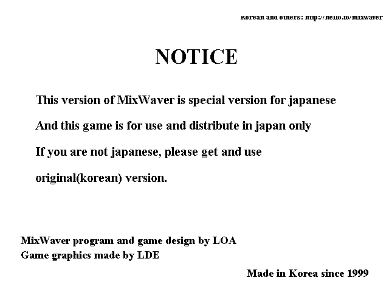
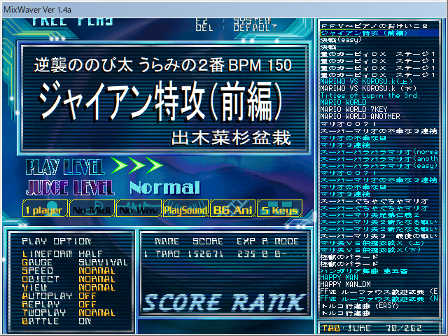
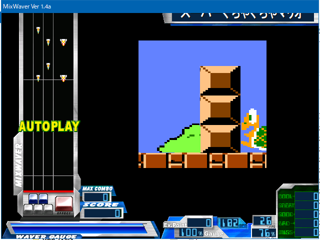

__MixWaver__ という PC 向けのフリーゲームがあった。ビートマニアを模した「BMS (Be-Music Source Script)」をプレイできる、「BM98」系のゲームだ。

当時小学生だった自分は、「こじさん」という友達から、その MixWaver と多数の楽曲が入った CD-R をもらった。

そんな CD-R をくれた「こじさん」は僕に色んなことを教えてくれて、僕の人生に多大な影響を与えた人物だ。今回は「こじさん」に教えてもらったモノを紹介する。

## 目次

## MixWaver

前述の MixWaver やそれに収録されているアングラな BMS 楽曲は、完全に「こじさん」から教わったモノだった。

収録曲はというと、

- スーパーマリ夫
- スーパーぐちゃぐちゃマリオ
- スネオ VS ジャイアン

など当時のアングラモノばっかりで、当時からお下劣だなーと思っていた。

今回 CD-R から中身をコピーして起動させてみた。MixWaver のバージョンは 1.4a だった。そのままでは起動しなくて、Windows 互換設定とか色数制限とかをしてやることでなんとか起動。楽曲を再生してみると、現代のマシンは高性能すぎるのか、挙動が若干変だった。それでも Auto Play ならほぼ当時と同じ音源・映像が再生されたので、軽く感動した。ｗ

## セガ・プレステ

「こじさん」はゲーマーだった。僕はスーファミ、ロクヨンぐらいしか持っていなかったのだが、「こじさん」は

- セガサターン
- ドリームキャスト
- プレイステーション

などを持っていて、「新作ゲームが出たら買って数日でクリアし、中古買取価格が高い内に売っている」と言っていた。僕は一度買ったゲームソフトを売ったことがなかったので、凄い遊び方だなぁと思っていた。

サターンのサクラ大戦とか、プレステの IQ だったかなんかとか、専用のデカいコントローラを繋いでプレイする音ゲーとか、なんやかんや色んなゲームを持っていたと記憶している。

自分ちにはない、知らないゲームが世には存在しているのだなぁ、プレステとかソフトが多くて面白そうだなぁ、と思っていたのを覚えている。

## Mac 信仰

「Mac がカッコイイ」というイメージは、僕の中では「こじさん」が植え付けたモノだと思う。

こじさんの家には、_グラファイトの Power Mac G4_ があった。こじさんは Adobe GoLive 6.0 と LiveMotion 2.0 が同梱されているアカデミックパックを持っていた。こじさんには年上の兄姉がいたので、その人達が使っていたのだと思うが、とにかく憧れた。

なんや Mac っていうのはオシャレでカッコイイんやなぁ、Mac OS 9 のウィンドウの閉じ方はよく分からないけど、自分ちにあるソーテックの9万9,800円パソコンよりはカッコイイよなー、なんて思ってた。

自分専用の PC として Dell Dimension 4500C を買ってもらった時も、Windows XP のテーマを差し替えるツールを導入して Mac OSX 風のデザインにしたりしていた。

結局、僕が Mac 端末を手にするのは2016年になってからだったが、当時感じていた憧れがずっとあったのは確かだ。

## Outside・オラエモン

当時は Flash 全盛期。「おもしろフラッシュ倉庫」と検索する術を教えてくれたのも「こじさん」だったと思う。

オウムが喋る Flash アニメ「Outside」は仲の良い友達間の合言葉になっていたし、「っていうかラサイト」に新作が上がる度にその話題で爆笑したものだった。

Outside に至っては僕がハマりすぎてパクリ Flash アニメを作り、軽ーく掲示板を荒らされてサイトを閉鎖したほどだった。ｗ

## Livly リヴリー

「こじさん」を含めた仲の良い友達数人とは、色んなネットゲームをやっていた。その一つがリヴリーだ。

当時は複数アカウント作って、自動巡回ツールを駆使してドゥードゥーを拾い集めていた。有料アカウントにはしなかったが、それなりに遊べた。

## PangYa! パンヤ

Livly のあと、ゴルフゲームの「パンヤ」なんかも遊んでいた。

コチラもチートツールが使える時代で、どこにめがけて打ってもホールインワンになるチートとかを仲間内で使ってゲーム内コインを爆稼ぎしていた。

当時の厨房はコレを使って他人との対戦でズルしようとかいう発想はなく、仲間内だけでバグった様子を眺めて笑うのが楽しみだったのだ。ゲーム内コインを稼いだところで、結局はリアル課金していないと入手できないモノもあって、ある領域に達すると打ち止め感があった。

僕はこの頃の遊び方の記憶が残っているので、チートとかは容認派なのだが、なかなかこの「他人には迷惑をかけない」線引きが出来る人、理解できる人、というのは少ないなと思っている。

## ゲームセンター CX

よゐこの有野がレトロゲームをやる「ゲームセンター CX」という番組の存在を教えてくれたのも「こじさん」だった。1st シーズンの最中に存在を教えてもらい、どうにかこうにかして見ていた。

## QMA クイズ・マジック・アカデミー

ゲーマーだった「こじさん」は、高校に入ったぐらいからゲーセンで QMA をよくやっていた。ちなみに「こじさん」とは高校生クイズに参加しようとしていたのだが、「こじさん」が遅刻して出られなかったことがあった (この表現には若干の脚色があるが、本人には伝わるはず)。

「こじさん」は頭が良かったので、QMA も得意だったし、その後難関大学に入ったと聞いている。

## 他にもあったかしら

他にも「こじさん」に教わったモノがあった気がする。こうした思い出も忘れかけてしまうくらい、年月が経ってしまった。

「こじさん」とは高3ぐらいを堺に会わなくなってしまったのだが、あの頃は「こじさん」のおかげで色々な世界を知れて、毎日が本当に楽しかった。

もし向こうがコチラのことを覚えていて、機会があったら、また話がしたいなと思っている。意図的に書かなかった話が3つほどあるが、それは本人に直接話そうと思う。「こじさん」がコレを見てくれていたら、連絡お待ちしてます。
