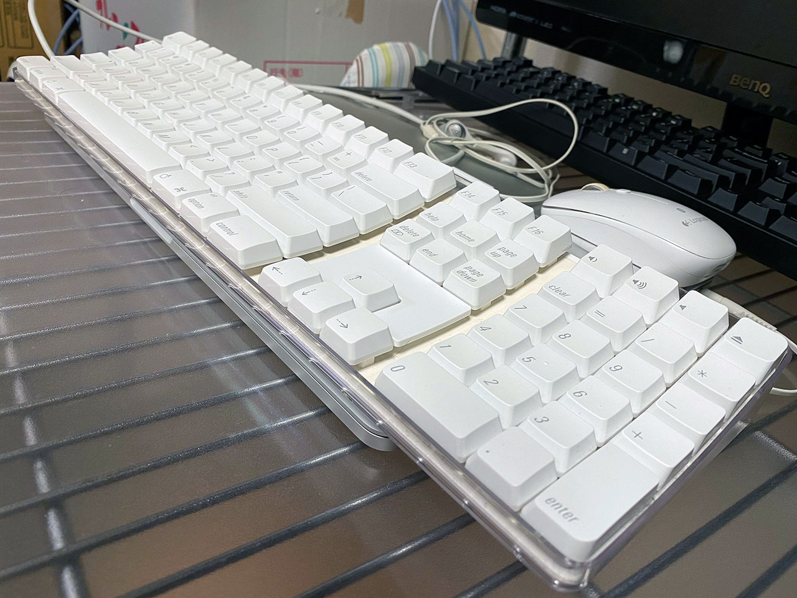
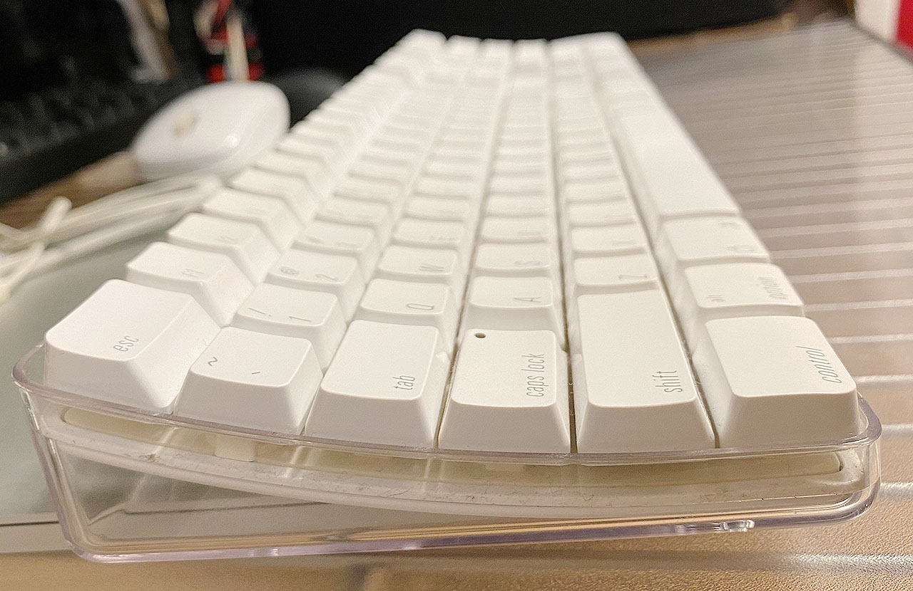

以前持っていた、A1016 M9270 という Apple 初のワイヤレスキーボードの、USB 版といえる __A1048 M9034__ を買った。

- [Apple Wireless Keyboard (A1016) M9270LL/A を買った - Corredor](https://neos21.hatenablog.com/entry/2017/03/05/002948)

上の A1016 をしばらく使っていたが、Bluetooth 接続がブチブチ切れるのと、乾電池駆動は辛すぎるので、USB 接続できる _ML110LL_ を買って使っていた。コチラは現行の Magic Keyboard の有線接続版といえる、一世代前のモノ。

- [Apple Keyboard ML110LL/B を買った・というか買って半年経った](/blog/2018/02/26-01.html)

中古だったが動作には問題なく、3年ほどガシガシ使っていたのだが、最近ついに壊れてしまった。Shift キーを押しながら特定のキーを入力できなかったり、突然半角の 9 を連打し続けたりするようになった。

仕方がないのでまた Mac 用のキーボードを買おう、しかし無線タイプはやっぱりないよな、ということで、中古を漁っていたらこの A1048 M9034 を見つけた次第。

  

    
  

  

    

      <a href="https://hb.afl.rakuten.co.jp/hgc/g00rye72.waxyc605.g00rye72.waxydb39/?pc=https%3A%2F%2Fitem.rakuten.co.jp%2Fpc-max-shop%2Fns-88%2F&amp;m=http%3A%2F%2Fm.rakuten.co.jp%2Fpc-max-shop%2Fi%2F10001940%2F">Apple 日本語キーボード(テンキー付き) マウス セット Keyboard A1243 Mighty Mouse A1152 USB接続 純正品</a>
    

    

      <a href="https://hb.afl.rakuten.co.jp/hgc/g00rye72.waxyc605.g00rye72.waxydb39/?pc=https%3A%2F%2Fwww.rakuten.co.jp%2Fpc-max-shop%2F&amp;m=http%3A%2F%2Fm.rakuten.co.jp%2Fpc-max-shop%2F">BTOパソコン専門店のPC-MAX</a>
    

    
価格 : 5999円

  

以前持っていた A1016 の個体より黄ばみがあるが、やっぱこのデザインが最高にカッコイイよなーと思う。友達が持っていた Power Mac G4 のキーボードも、コレの黒いバージョンで、カッコ良かったんだよなぁー。

打ち心地は ML110LL よりも深く、固い感じもするのだが、ぐにゃぐにゃでもあるという、独特な感じ。

一番ツラいのは右 Command キーの位置で、`>` キーと `?` キーの間くらいのところに位置している。コレが ML110LL だと `>` キーの真下に右 Cmd キーが位置していて、コチラの方が押しやすいのだ。A1016 や A1048 だと右手親指をかなり内側に折り込んで右 Cmd キーを押す必要があり、慣れが必要。

- [Apple Keyboards ⌨](http://xahlee.info/kbd/keyboards_Apple.html)

↑上のサイトでも文句が書かれている。

> Keyboards and mouses from Apple ever since the iMac in 1998 are usually the worst keyboards with respect to ergonomics.
> 
> Apple pro keyboard (A1048), year 2003
> 
> Note the distance of the right side's modifier keys. It is not possible, to use the right thumb to press the `option` key while the index finger remains on the `J`. It makes these keys essentially decorative in nature. (Apple did this to make the keys flush at the lower right corner; sacrificing function for esthetics.)

多分 Magic Keyboard より相当打ちづらいと思うんだけど、やっぱカッコイイからコレにした。ｗ

- [Mac用の有線キーボード＆マウスを大人買い | 1.5流](https://1105r.com/usb-keyboard-mouse-for-mac/)

同時期のマウスも透明でカッコイイのよね。

無線版の A1016 にはなかったのだが、この A1048 には2つの USB-A ポートが付いている。使っていないが、多分スマホ充電くらいならイケる…？ML110LL には本体左右から挿せる USB-A ポートが2つあったけど、コレは本体の後ろ側。

2003年モデルの中古品だが、元気に使えて良き良き。

  

    
  

  

    

      <a href="https://hb.afl.rakuten.co.jp/hgc/g00puug2.waxyc5cd.g00puug2.waxydac4/?pc=https%3A%2F%2Fitem.rakuten.co.jp%2Fkitcut%2F440446%2F&amp;m=http%3A%2F%2Fm.rakuten.co.jp%2Fkitcut%2Fi%2F10077539%2F">Matias Tactile Pro keyboard for Mac メカニカルキーボード USB A 3ポート付 US配列 # FK302 マティアス (キーボード)</a>
    

    

      <a href="https://hb.afl.rakuten.co.jp/hgc/g00puug2.waxyc5cd.g00puug2.waxydac4/?pc=https%3A%2F%2Fwww.rakuten.co.jp%2Fkitcut%2F&amp;m=http%3A%2F%2Fm.rakuten.co.jp%2Fkitcut%2F">Apple専門店 キットカット</a>
    

    
価格 : 13900円

  

