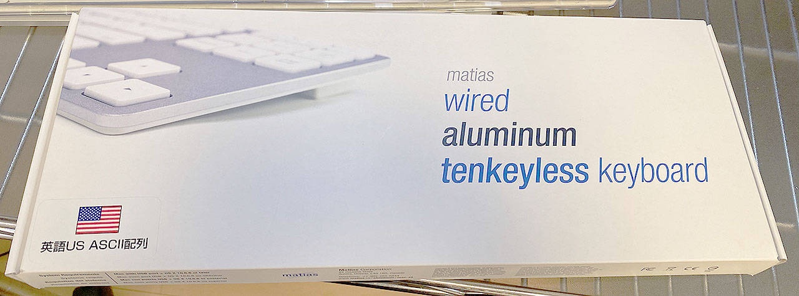
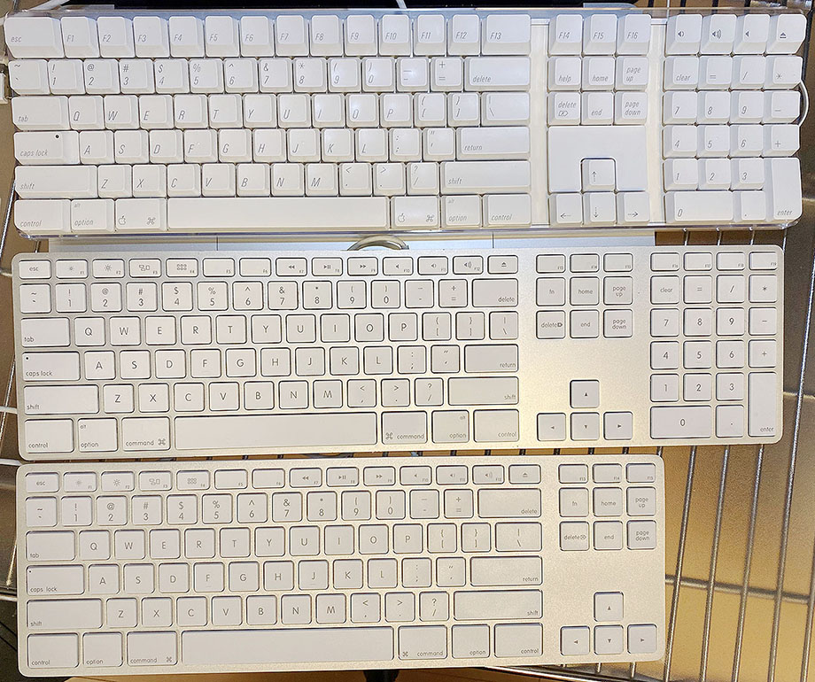
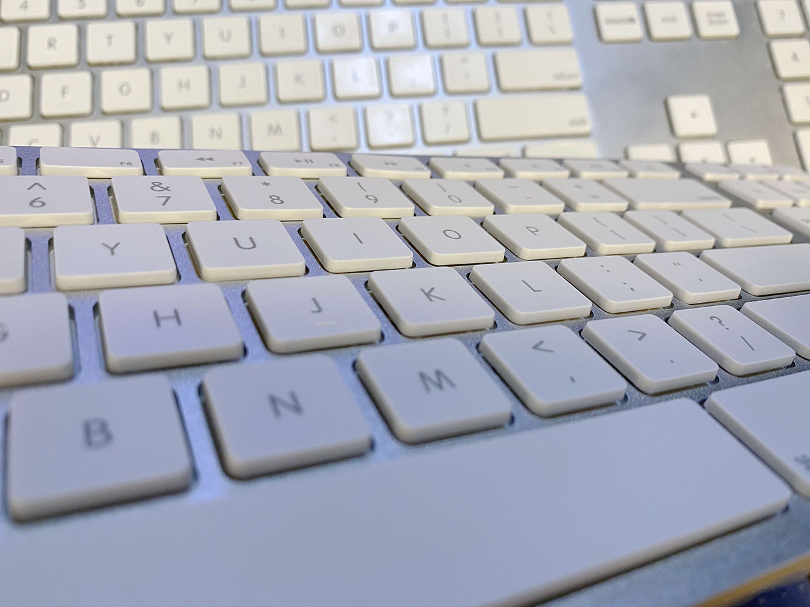
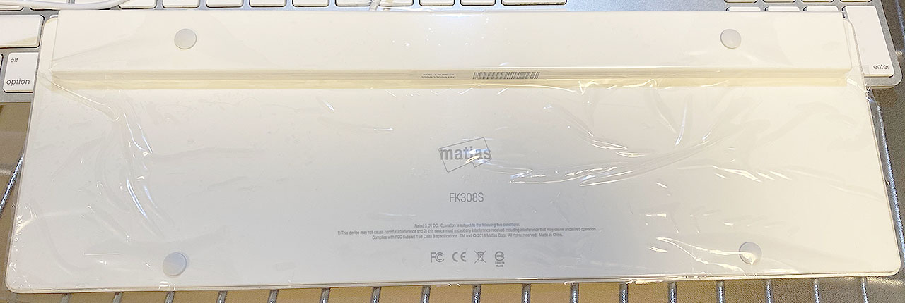

これまで使っていた Apple 製のキーボード ML110LL/B が壊れてしまい、新しいキーボードを買うことにした。昨日記事にしたとおり、Apple A1048 M9034 という有線のキーボードを買ったところではあるが、同時にもうひとつキーボードを買っていた。それが

**Matias Wired Aluminum Tenkeyless keyboard for Mac Silver FK308S**

である。値段は6,600円程度。

  

    
  

  

    

      <a href="https://www.amazon.co.jp/dp/B07NQ1PBDN?tag=neos21-22&amp;linkCode=osi&amp;th=1&amp;psc=1">MATIAS FK308S　Matias Wired Aluminum Tenkeyless Keyboard for Mac 有線キーボード [英語配列/シルバー] テンキーレスモデル</a>
    

  

- 参考：[MacにマッチするテンキーレスキーボードがMatiasから、アルミ筐体採用 - AKIBA PC Hotline!](https://akiba-pc.watch.impress.co.jp/docs/news/news/1172634.html)

見た目は現在の Magic Keyboard にも繋がる、Apple 純正の薄型キーボードにそっくりだが、Apple 純正には存在しない_テンキーレス_である。

Apple 純正はフルサイズキーボードか、MacBook 系と同様の配列のミニサイズの2種類しか存在しない。Matias のこのキーボードは、フルサイズだとテンキーが鬱陶しいが、右下のメタキーが省略されたり矢印キーが独立していなかったりするのは嫌、という人にうってつけの商品だ。

見た目の質感はかなり本家に近いが、キートップの質感が全然違う。打鍵音、打ち心地も全く異なり、Matias の方が若干安っぽい。キートップの角がトガっていて、実は丸く処理してある本家 Apple との差が出ている。

Amazon のレビューを見ると、効かないキーがあった、とかいうレビューも散見されたが、自分の個体は大丈夫だった。本家との感触が違うだけで、打ちにくいワケではなく、快適に打鍵できる。

本家と同様に、キーボードの左右に USB-A ポートが2つ付いている他、本家にはないボリュームダイヤルが後ろ側に用意されている。個人的には使い道がなさそうだが、とりあえず。

Mac のキーボードはやはり、右下にも Cmd・Option・Control キーが揃っていて欲しいし、矢印キーや PageUp・PageDown などは独立して存在していて欲しい。

無線接続だと Bluetooth の調子が悪くてペアリングが切れたり、チャタリングが起きやすかったりするので、あえて USB 接続を選びたくなる人にとっても、理想のキーボードだ。

  

    
  

  

    

      <a href="https://hb.afl.rakuten.co.jp/hgc/g00puug2.waxyc5cd.g00puug2.waxydac4/?pc=https%3A%2F%2Fitem.rakuten.co.jp%2Fkitcut%2F469584%2F&amp;m=http%3A%2F%2Fm.rakuten.co.jp%2Fkitcut%2Fi%2F10094788%2F">Matias Wired Aluminum Tenkeyless keyboard Mac用 有線キーボード Silver (英語配列) # FK308S マティアス (キーボード) US配列</a>
    

    

      <a href="https://hb.afl.rakuten.co.jp/hgc/g00puug2.waxyc5cd.g00puug2.waxydac4/?pc=https%3A%2F%2Fwww.rakuten.co.jp%2Fkitcut%2F&amp;m=http%3A%2F%2Fm.rakuten.co.jp%2Fkitcut%2F">Apple専門店 キットカット</a>
    

    
価格 : 7415円

  

