中国のせいで金を取られた！(乱暴な言い方)

## 目次

## 経緯

GCP で Always Free な IaaS (GCE) を立てて遊んでいる。無料だ無料だーと喜んでいたら、先月なぜか**1円課金**されていた。

請求書を見てみると、

- **Network Internet Egress from Americas to China**

という項目で 0.021 ギガバイトの通信が発生していたようである。

調べてみると、Compute Engine の Always Free 制限にこう書かれていた。

- 参考：[Google Cloud Free Tier  |  Google Cloud Platform Free Tier](https://cloud.google.com/free/docs/gcp-free-tier)

> 1 GB の北米から全リージョン宛ての下り（外向き）ネットワーク（1 か月あたり、**中国とオーストラリアを除く**）

ふむ、どうも中国からのアクセスに対してレスポンスしてしまったために、中国への下り通信が発生したようである。

今回は1円の課金で済んだし、設定していた請求アラートで1円課金された時点で気付けたから良いものの、コレ以上の意図しない課金は防ぎたい。そこで、_中国との通信をブロックして、今後課金されないようにする。_

## 中国の IP をファイアウォールでブロックする

- 参考：[GCP課金対象国からのアクセスを抑止する | 青星総合研究所](https://aoboshi.org/?p=829)

今回の作業は、上のサイトを参考に行った。

GCP のファイアウォール設定で、中国の Public IP からのアクセスを全部ブロックしてやれば、下りのアクセスも発生しなくて課金されないだろう、ということである。まぁまぁ手順が多いので覚悟せよ。ｗ

## 中国の Public IP 一覧ファイルを取得する

- [中華人民共和国cnに割り当てられたIPアドレスの一覧 : ipv4.fetus.jp](https://ipv4.fetus.jp/cn)

まずは上のサイトにアクセスし、右側の「Download」から「アクセス制御用ひな形」を押下する。プルダウンから「Nginx」を選択し、`cn.nginx.txt` をダウンロードする。

- <https://ipv4.fetus.jp/cn.nginx.txt>

本稿執筆時点で、5351件分の CIDR ブロックが記述されていると思う。これらは全て、中国からの Public IP を封じるための設定である。

## Public IP 一覧ファイルを JSON 形式に加工する

ダウンロードしたテキストファイルを開くと、次のような形式で記述されていると思う。

```
deny 1.0.1.0/24;
deny 1.0.2.0/23;
```

コレをテキストエディタで一括置換して、次のように書き換えていく。

```json
[
  "1.0.1.0/24",
  "1.0.2.0/23",
    … (中略、以下は最終行を示す)
  "223.255.252.0/23"
]
```

トップレベルが配列の JSON ファイルとしてパースできるようにするワケだ。このようなテキストを _`china-ip.json`_ というファイル名で保存したとする。

そしたら、この5351件の配列を**256件分ずつの配列**に分割する。

GCP のファイアウォールルールは、1ルールにつき CIDR ブロックを256件までしか設定できない。5351件分の CIDR をブロックするには、複数のルールを作らないといけないため、その下準備として配列を256件ずつに分解しようとしているのである。

今回は Node.js スクリプトを書いて、分割した JSON を吐いてやる。

- `script-chunk.js`

```javascript
const fs = require('fs');

// 元の JSON ファイルを require で読み込む
const chinaIp = require('./china-ip.json');

const arrayChunk = ([...array], size) => {
  return array.reduce((acc, value, index) => index % size ? acc : [...acc, array.slice(index, index + size)], []);
};

// 256件ずつに分割する
const chunks = arrayChunk(chinaIp, 256);
// ファイルに書き出す
fs.writeFileSync('./china-ip-chunk.json', JSON.stringify(chunks, null, '  '), 'utf-8');
```

このようなスクリプトを

```bash
$ node script-chunk.js
```

と実行してやると、`china-ip-chunk.json` が生成され、中身が次のようになっているはずである。

```json
[
  [
    "1.0.1.0/24",
    "1.0.2.0/23",
      … (中略)
    "43.225.224.0/20"
  ],
  [
    "43.225.240.0/21",
      … (以下略)
  ]
]
```

配列の配列になっている。子の配列には CIDR ブロックが256件ずつ格納されている状態だ。

## GCP の API Key を発行する

薄々気付いていると思うが、5351件もの CIDR を手作業でファイアウォールルールに追加していくのは大変だ。そこで、GCP の REST API を使って、一括登録してやろうと思う。

GCP の REST API を叩くには _API Key_ と **Access Token** が必要になる。API Key はすぐに発行できるのだが、Access Token の発行には OAuth Client ID というのをコネコネしてやらないといけなくて、若干面倒である。

とりあえず、まずは簡単に発行できる API Key を発行してしまおう。

- [Google Cloud Platform](https://console.developers.google.com/)

Google APIs Console にログインし、画面上部で対象プロジェクトを選択する。続いて左メニューから「認証情報」を開く。

画面上部の「+ 認証情報を作成」を押下し、「API キー」を選択する。

「API キーを作成しました」ダイアログが表示されたら、発行された API キーをコピーしておく。

## GCP の Access Token を発行する

続いて Access Token を発行するが、コレがちょっと分かりづらい。

- 参考：[Google APIのAccess Tokenをお手軽に取得する - Qiita](https://qiita.com/shin1ogawa/items/49a076f62e5f17f18fe5)

上のサイトを参考に、「OAuth クライアント ID」と「スコープ」を取得しておき、これらを元にして Access Token を作成する。

### OAuth クライアント ID を作成する

- [Google Cloud Platform](https://console.developers.google.com/)

Google APIs Console にログインし、画面上部で対象プロジェクトを選択する。続いて左メニューから「認証情報」を開く。

画面上部の「+ 認証情報を作成」を押下し、「OAuth クライアント ID」を選択する。

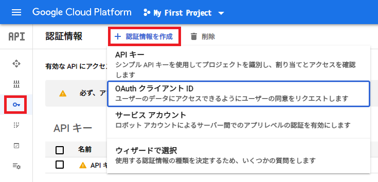

初回だと「OAuth クライアント ID を作成するには、まず同意画面でプロダクト名を設定する必要があります」と表示されていると思う。そこで「同意画面を設定」ボタンを押下する。

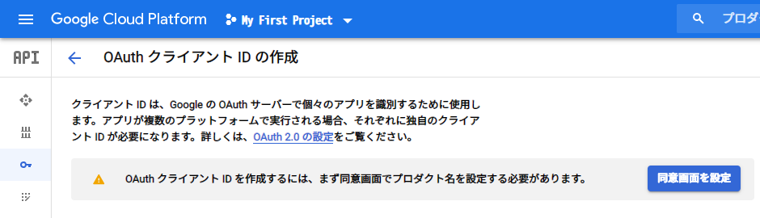

「OAuth 同意画面」に移動したら、「User Type」は「外部」を選択して「作成」ボタンを押下する。

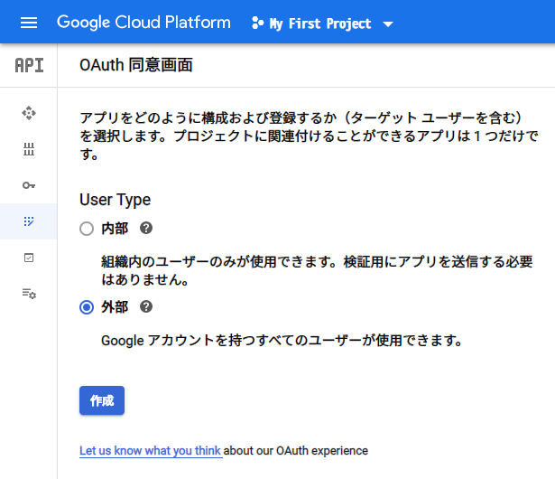

次の画面はとりあえず「アプリケーション名」だけ適当に入れておけば良い。画面下部の「保存」ボタンを押下する。

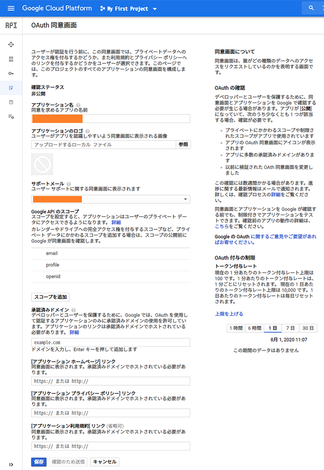

次のように「同意画面」が作れたと思う。

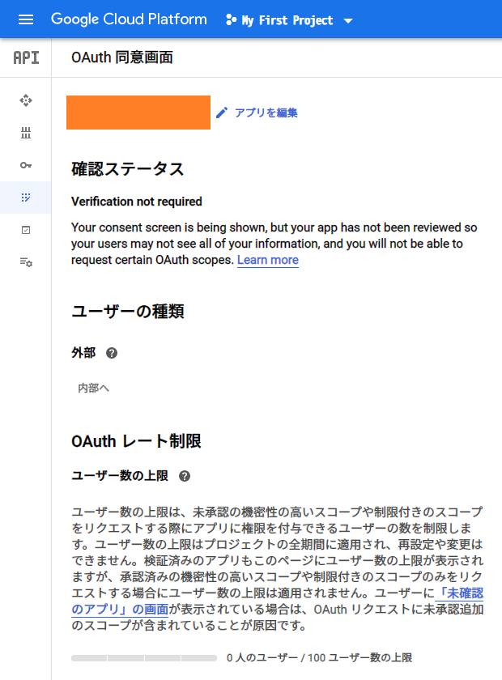

そしたらまた「+ 認証情報を作成」に戻る。今度は「OAuth クライアント ID の作成」画面でクライアント ID が作成できるようになっているはずだ。適当な名前を入力して「作成」ボタンを押下する。

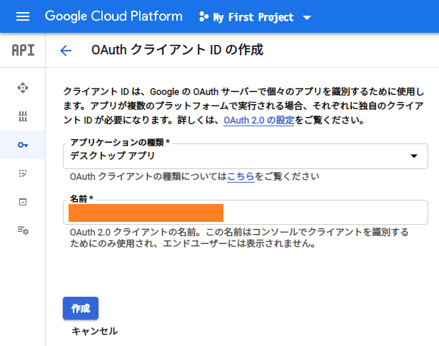

「OAuth クライアントを作成しました」ダイアログが表示されたら、クライアント ID とクライアントシークレットをコピーしておく。

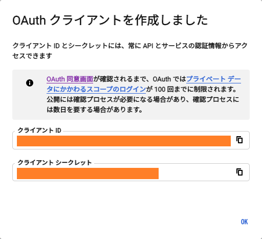

## スコープ情報を取得する

スコープというのは、作成する Access Token が操作できる Google Cloud のサービスを指定するモノみたい。一度作った Access Token で、あれもこれも設定変更できたりしないようにするようだ。

今回行いたい操作は、GCP における VPC のファイアウォール登録だ。リファレンスを探すと、次の REST API リファレンスが見つかる。

- [Method: firewalls.insert  |  Compute Engine Documentation  |  Google Cloud](https://cloud.google.com/compute/docs/reference/rest/v1/firewalls/insert)

この画面の右側に「Try this API」というペインがあり、その下部に「Google OAuth 2.0」という項目がある。ココの_「Show scopes」_を押下すると、

- `https://www.googleapis.com/auth/cloud-platform`
- `https://www.googleapis.com/auth/compute`

という2つの URL が表示される。この2つの URL をスコープとして定義してやれば良いようだ。

2つの URL をスペースで区切り、URI エンコードしてやることで、スコープ指定文字列として使えるようになる。今回はブラウザの開発者コンソールとかを使って、JavaScript で加工してやる。

```javascript
// 次のようにスペース区切りにする
const scopeUrls = 'https://www.googleapis.com/auth/cloud-platform https://www.googleapis.com/auth/compute';

// URI エンコードする
const scope = encodeURIComponent(scopeUrls);

// → https%3A%2F%2Fwww.googleapis.com%2Fauth%2Fcloud-platform%20https%3A%2F%2Fwww.googleapis.com%2Fauth%2Fcompute
// このような文字列が出力されるので、コレをコピーしておく
```

### Authorization Code を発行する

OAuth クライアント ID を発行したら、まずは Authorization Code というモノを発行する。ターミナルで次のようなコマンドを組み立てていく。

```bash
CLIENT_ID='【クライアント ID】'
CLIENT_SECRET='【クライアントシークレット】'
REDIRECT_URI='urn:ietf:wg:oauth:2.0:oob'
SCOPE='【さきほど作成した URI エンコードしたスコープの URL 文字列】'

echo "https://accounts.google.com/o/oauth2/v2/auth?response_type=code&client_id=${CLIENT_ID}&redirect_uri=${REDIRECT_URI}&scope=${SCOPE}&access_type=offline"
```

最後の `echo` で、URL が組み立てられて出力されるので、コレをコピーしてブラウザで開く。

すると次のような画面が表示されるので、「許可」を選んでいく。

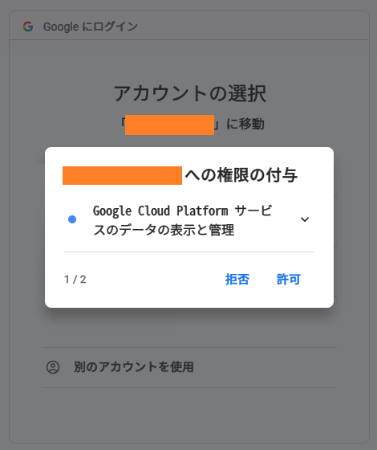

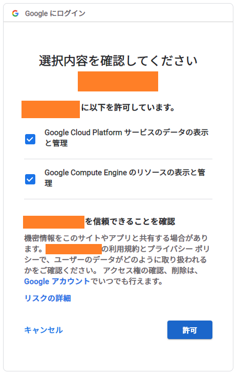

最後に Authorization Code が表示されるので、コピーしておく。

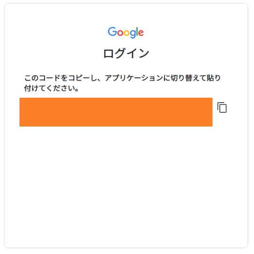

### Authorization Code を利用し Access Token を取得する

Authorization Code を発行したら、先程のターミナルに戻り、次のようにコマンドを流していく。

```bash
AUTHORIZATION_CODE='【Authorization Code】'
curl \
  'https://www.googleapis.com/oauth2/v4/token' \
  --data "code=${AUTHORIZATION_CODE}" \
  --data "client_id=${CLIENT_ID}" \
  --data "client_secret=${CLIENT_SECRET}" \
  --data "redirect_uri=${REDIRECT_URI}" \
  --data "grant_type=authorization_code" \
  --data "access_type=offline"
```

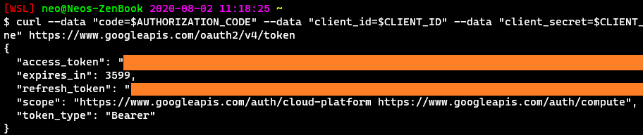

`curl` のレスポンスとして JSON が表示され、`access_token` および `refresh_token` が取得できるのでコピーしておく。

コレでようやく Access Token が取得できた。

## プロジェクト ID を確認する

最後にプロジェクト ID の確認。GCP 管理コンソールに移動して、プロジェクト選択欄でプロジェクト ID をコピーしておく。

- 参考：[初心者のためのGCPプロジェクト始め方入門 | apps-gcp.com](https://www.apps-gcp.com/gcp-startup/)

## REST API をコールするコマンドを構築していく

コレで API Key と Access Token が用意できた。GCP の REST API は `curl` でコールできるが、リクエストヘッダやパラメータを渡してやる必要があるので、`curl` コマンド一式を Node.js スクリプトで組み立ててやることにする。

- `script-generate-curl.js`

```javascript
const fs = require('fs');

// 256件ずつに分解した CIDR ブロック一覧の JSON ファイルを読み込む
const chinaIpChunk = require('./china-ip-chunk.json');

const projectId   = '【プロジェクト ID】';
const apiKey      = '【API Key】';
const accessToken = '【Access Token】';

// curl コマンド1つ分のテンプレート
const template = (projectId, apiKey, accessToken, firewallRuleName, ips) => `curl --request POST \
  "https://compute.googleapis.com/compute/v1/projects/${projectId}/global/firewalls?key=${apiKey}" \
  --header 'Authorization: Bearer ${accessToken}' \
  --header 'Accept: application/json' \
  --header 'Content-Type: application/json' \
  --data '{"name":"${firewallRuleName}","denied":[{"IPProtocol":"all"}],"description":"","direction":"INGRESS","disabled":false,"enableLogging":false,"kind":"compute#firewall","logConfig":{"enable":false},"network":"projects/${projectId}/global/networks/default","priority":100,"selfLink":"projects/${projectId}/global/firewalls/${firewallRuleName}","sourceRanges":${ips}}' \
  --compressed
`;

// curl コマンドを複数個組み立てていく
const script = chinaIpChunk.reduce((acc, ips, index) => {
  const num = `0${index + 1}`.slice(-2);
  const firewallRuleName = `china-${num}`;  // ファイアウォールのルール名は「china-00」(連番) とする
  const curl = template(projectId, apiKey, accessToken, firewallRuleName, JSON.stringify(ips));
  return acc + curl + '\n';
}, '');

// 組み立てた curl コマンドをファイルに書き出す
fs.writeFileSync('./exec.sh', script, 'utf-8');
```

コレを

```bash
$ node script-generate-curl.js
```

と実行すると、次のようなファイルが生成されるはずだ。

- `exec.sh`

```bash
curl --request POST \
  "https://compute.googleapis.com/compute/v1/projects/【プロジェクト ID】/global/firewalls?key=【API Key】" \
  --header 'Authorization: Bearer 【Access Token】' \
  --header 'Accept: application/json' \
  --header 'Content-Type: application/json' \
  --data '{"name":"china-01","denied":[{"IPProtocol":"all"}],"description":"","direction":"INGRESS","disabled":false,"enableLogging":false,"kind":"compute#firewall","logConfig":{"enable":false},"network":"projects/【プロジェクト ID】/global/networks/default","priority":100,"selfLink":"projects/【プロジェクト ID】/global/firewalls/china-01","sourceRanges":["1.0.1.0/24",【…中略…】,"43.225.224.0/20"]}' \
  --compressed

curl --request POST \
  "https://compute.googleapis.com/compute/v1/projects/【プロジェクト ID】/global/firewalls?key=【API Key】" \
  --header 'Authorization: Bearer 【Access Token】' \
  --header 'Accept: application/json' \
  --header 'Content-Type: application/json' \
  --data '{"name":"china-02","denied":[{"IPProtocol":"all"}],"description":"","direction":"INGRESS","disabled":false,"enableLogging":false,"kind":"compute#firewall","logConfig":{"enable":false},"network":"projects/【プロジェクト ID】/global/networks/default","priority":100,"selfLink":"projects/【プロジェクト ID】/global/firewalls/china-02","sourceRanges":["43.225.240.0/21",【…中略…】,"43.255.232.0/22"]}' \
  --compressed

# 全部で curl コマンドが21個分できているはず (5351件 / 256件 = 20.9 ≒ 21)
```

分かりづらいが、`--data` 内の `sourceRanges` 部分で、CIDR ブロックを256件ずつ指定している。ルールの優先度は `"priority":100` で指定しているので、変更したい場合は `script-generate-curl.js` に記載のテンプレート部分を調整してやる。

## REST API をコールする

こうして `exec.sh` が生成できたら、

```bash
$ sh ./exec.sh
```

で実行してやろう。ファイアウォールルールが生成されるはずだ。

スクリプトを流し終えたら、GCP 管理コンソールでもファイアウォールルールを見てみよう。ルールの優先度などが問題なければコレで完了。

## 以上

このルール設定によって本当に課金されなくなるのか、しばらく様子見してみる。

<ins class="ins-block">

2021-07-30：シドニーからの通信も課金されたので対応。

- [続・GCE 絶対無課金](/blog/2021/07/30-01.html)

2021-09-14：CPU バーストでも課金されたので GCE 自体使うの止めた。

- [Always Free なはずの GCE にどうしても金がかかるから停止した](/blog/2021/09/14-01.html)

</ins>
