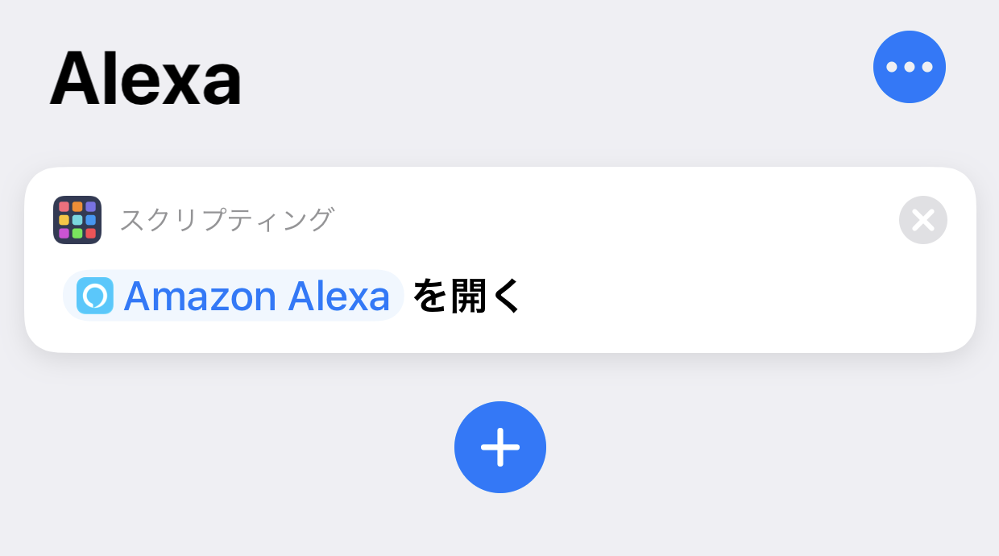

「Hey Siri」を最近使い始めた。音声でなんかしたいと思うことは少ないが、ずっと自宅勤務で周りの目も気にならないし、検索窓を開くまででもない簡単な作業なら使いやすいかと思い、機能を有効にした。

Fire タブレットを持っているので「Alexa」も試してみたが、コチラは音声認識の精度が悪く、出来ることも Amazon の有料サービスに誘導されがちで微妙。

一番柔軟性があるのは「Ok Google」で、Nest Hub を買ったのもその柔軟性をかってのことだった。

ところで「Alexa」と「Ok Google」は、それぞれ「Amazon Alexa」と「Google アシスタント」アプリを導入すれば、iPhone でも使用できる。ただし、該当アプリを開いた状態でないと音声認識してくれない。

そこで、「Hey Siri」で Siri に対象のアプリを開かせるようにしてみた。

## Google アシスタントの場合

Google アシスタントアプリの場合は、アプリの初期設定の時に「Siri ショートカットを追加」という項目が出てくるので、コレを有効にすれば OK。__「Hey Siri, Ok Google」__と呼びかけることで「Google アシスタント」を起動できるようになる。

ちなみに「Google アプリ」という検索用のアプリもあって、コチラもアプリ起動中の「Ok Google」に対応しているが、

- 「Google アプリ」の「Ok Google」は何でも Google 検索して検索結果画面を表示する
- 「Google アシスタント」の「Ok Google」はアシスタントとのチャット形式で回答を表示する

という挙動・機能の違いがある。

「Google アプリ」を呼び出す Siri ショートカットも存在するので、「Google アプリ」の設定から追加しておくと良いだろう。

- 参考：[「Google アシスタント」日本語でもSiriショートカットから呼び出し可能に - iPhone Mania](https://iphone-mania.jp/news-233683/)
- 参考：[ついにiPhoneのSiriからGoogleアシスタントが呼び出せるようになった！ | そうがわパソコンサポート](https://sougawa-pc.net/hey-siri-ok-google/)
- 参考：[音声はまさかの「Hey Siri,OK Google」。iPhoneのSiriからGoogleアシスタント起動が可能に - Engadget 日本版](https://japanese.engadget.com/jp-2018-11-21-hey-siri-ok-google-iphone-siri-google.html)

## Alexa の場合

Alexa はデフォルトでは Siri ショートカットを用意していない様子。

そこで、iOS ショートカットの「スクリプティング」→_「App を開く」_を使って「Amazon Alexa」アプリを指定し、その__ショートカット名を「Alexa」に__してやる。

すると__「Hey Siri, Alexa」__と呼びかけることで Amazon Alexa アプリが起動するようになる。

## そこまでして3つを併用しないかもｗ

とまぁやり方は紹介したものの、1つの iPhone で3つの音声アシスタントを併用することはないかな、と思う。ｗ
