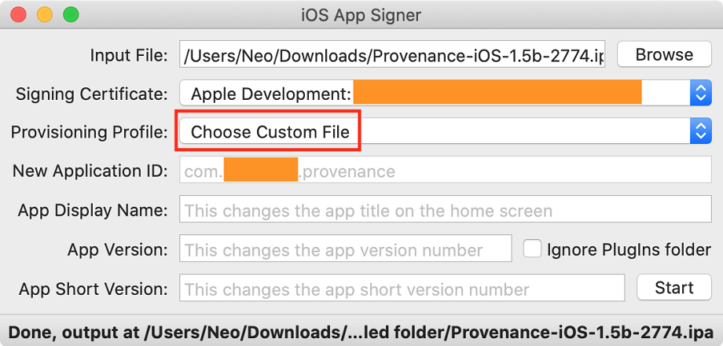
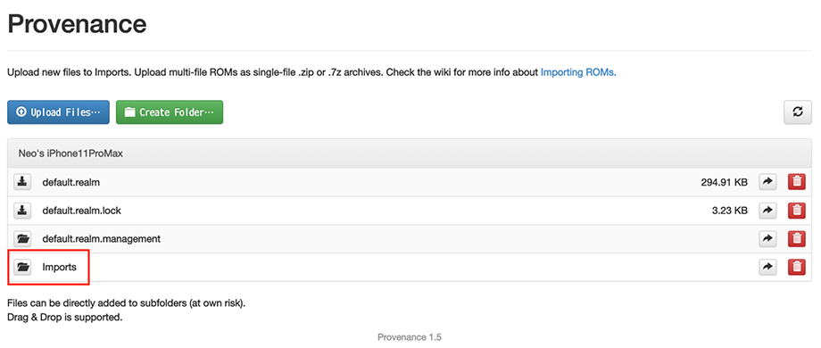

iOS を脱獄することなくエミュレータが導入できると聞いて、**Provenance** を試してみた。

- [Welcome - Provenance](https://wiki.provenance-emu.com/)
- [GitHub - Provenance-Emu/Provenance: iOS & tvOS multi-emulator frontend, supporting various Atari, Bandai, NEC, Nintendo, Sega, SNK and Sony console systems… Get Started: https://wiki.provenance-emu.com |](https://github.com/Provenance-Emu/Provenance)

## 目次

## 環境情報

- Provenance v1.5 Beta
- iPhone 11 Pro Max : iOS 14 Beta
- 12 Inch MacBook : MacOS Catalina
  - Xcode v11.4.1

以上の構成で検証した。

## インストール手順

今回試したのは、*Sideloading* というインストール手法。App Store からアプリをダウンロードするのではなく、「自作の開発中アプリ」のテイでインストールするというモノだ。

- 参考 : [sideloadingとは何？ Weblio辞書](https://www.weblio.jp/content/sideloading)

予め無料の Apple Developer アカウントを作成し、Xcode でサインインしておいて、自作の iOS アプリを7日間の期限付きで実機にインストールできるようにしておこう。

次のページから、Provenance v1.5b の `.ipa` ファイルをダウンロードする。

- [Sideloading - Provenance](https://wiki.provenance-emu.com/installation-and-usage/installing-provenance/sideloading)
  - `Provenance-iOS-1.5b-2774.ipa`

次に、*iOS App Signer* というアプリを落とす。コレは、ダウンロードした `.ipa` ファイルのプロビジョニング・プロファイル (ユーザ証明書) を書き換えるためのモノだ。

- 参考 : [iOS App Signer - Instructions](https://dantheman827.github.io/ios-app-signer/)

そしたら Xcode で適当な新規アプリを作り、**`com.neos21.provenance` のようなバンドル ID** を指定して、Auto Signing を利用して Provisioning Profile を自動生成する。

プロビジョニング・プロファイルが生成できたら、`$ open '~/Library/MobileDevice/Provisioning Profiles/'` でディレクトリを開き、その配下から先程作ったプロビジョニング・プロファイル `.mobileprovision` をコピーして拾っておく。ファイル名はランダムで分かりにくいので、ファイルの更新日時などで判断しよう。

iOS App Signer を開いたら、次のように指定する。

- 「Input File」 : Provenance の `.ipa` ファイルを指定する
- 「Provisioning Profile」 : 「Re-Sign Only」から「Choose Custom File」を選び、控えておいた `.mobileprovision` を選択する
- 「New Application ID」 : プロビジョニング・プロファイルを指定したら、先程決めたバンドル ID が自動入力されているはず

ココまで出来たら「Start」ボタンを押下し、新たに `.ipa` ファイルを生成する。この `.ipa` ファイルが、自分の無料 Apple Developer アカウントでサイニングした Provenance アプリとなる。

`.ipa` ファイルが生成できたら、iPhone を USB 接続する。

Xcode を開き、Window → Devices and Simulators を選択し、デバイスの中に自作アプリを追加する。先程生成した `.ipa` ファイルを指定すれば、ホーム画面にアプリアイコンが登場するはずだ。

インストール作業はコレで完了。

## 7日おきにプロビジョニング・プロファイルを更新・インストールする

iOS アプリの開発経験がある人ならご存知だと思うが、無料の Apple Developer アカウントだと、実機にインストールしたアプリは7日後に起動できなくなる。

- [無料の開発者アカウントで iPhone にインストールしたアプリの有効期限を更新する方法](/blog/2018/04/17-01.html)

前述の手順で Auto Signing によりプロビジョニング・プロファイルを用意したが、コレを7日おきに更新し、アプリを再インストールしてやることで、引き続き Provenance が動作する。本体からアプリをアンインストールしなければ、有効期限が切れたアプリの内部データは削除されずに残るので、取り込んだ ROM やデータなどは保持される。

## ROM を取り込む

iPhone にインストールした Provenance を起動すると、「*Import ROMs*」というリンクがあるはずなので、押下し Web Server を起動する。

Web サーバが起動すると、`http://192.168.1.10/` みたいなローカル IP アドレスが表示されるので、MacOS のブラウザでこのサイトにアクセスする。

Bootstrap 製のファイラ的なウェブ画面が開くので、その中の **`Imports/` ディレクトリ配下にゲームの ROM ファイルをアップロードしていく。**

ファイルアップロードが終わったら、アプリのトップ画面に戻る。すると、ファイルの拡張子から ROM の内容を自動判別して、ハード別のディレクトリに移動されていく。当方が試した限り、ファミコン (NES)、スーファミ (SNES)、Nintendo 64、ゲームボーイ、ゲームボーイカラー、ゲームボーイアドバンスの ROM を認識し、プレイできた。N64 の ROM に関しては、拡張子 `.v64` だと認識しなかったので、`.z64` にリネームしたらうまく認識された。

ゲームの内容が特定できると、どこぞの DB からサムネイルを引っ張ってきてくれて、一覧画面が分かりやすい。

サムネイルを選択するとゲームが起動する。ゲームボーイなどは使用できるエミュレータが複数あるので、いくつか試してみて、ちゃんと動作する、描画の再現度が高いエミュレータをデフォルトに設定しておくと良いだろう。

エミュレータの動作は快適で、N64 のゲームもかなりヌルヌル動く。SFC のゲームは実機以上に滑らかに動くくらいだ。

どのハードも、ゲーム画面とコントローラが iPhone 画面上に再現される。iPhone は縦向きでも横向きでも、うまくコントローラ UI を表示してくれる。ただ、画面タップで十字キーを操作するのはかなり難しい。N64 の 3D スティックのような微調整が効かないので、アクションゲームは難しいだろう。

設定画面を見ると、どうやら iPhone と何らかの方法で接続したコントローラ機器を認識して利用できるようだ。手元に使えそうなジョイパッドがないので試していない。

## やろうと思えば iPhone をゲーム機にできる

外部コントローラをなんとか接続しないとゲームプレイはままならない感があるが、ゲームボーイのポケモンのような、シビアな操作が求められないゲームなら全然やれる。

プロビジョニング・プロファイルを1週間おきに更新する必要があるのは面倒だが、スペック的には iPhone7 程度でも N64 が快適に動作しそうだったので、古いスマホをレトロゲー用の携帯ゲーム機に出来そうだ。

- 参考 : [(12/2現在可能)【Provenance 1.5】徹底解説！ 各種ゲーム（N64,PS1,SNES,etc)をiPhone(iPad)でプレイしよう！ | 見つける身つける](https://koulog.sakura.ne.jp/1234.html)
