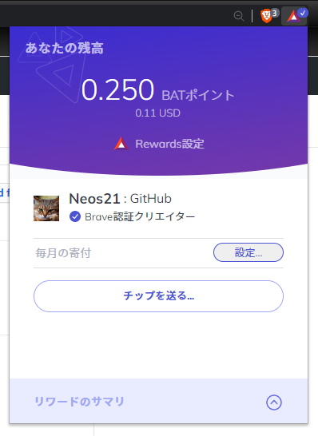
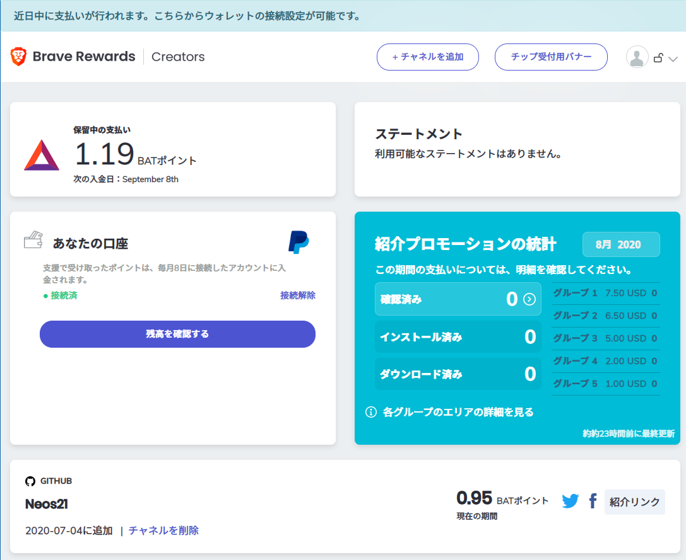
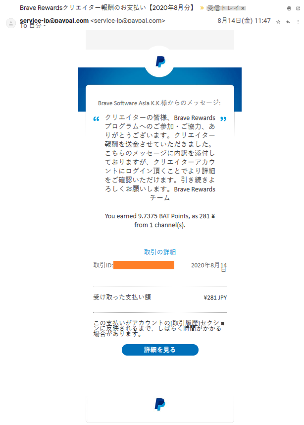

既存の広告をブロックし、ブラウジングにより BAT ポイント (BAP) を貯められる、Brave ブラウザ。海外では BAT (Basic Attention Token) という仮想通貨なのだが、日本では「BAT ポイント」というポイント扱いになっていて、BAT とは違いますよーと言われていた。

なんだよそれじゃあこのポイント集めても換金できないのかよ？と思っていたのだが、色々対応が進んでいて、なんやかんやで日本円に換金できたので、報告がてら紹介する。

## 目次

## Brave Creators に登録する

ブラウジング中に稼いだ BAP を、ウォレットから直接日本円に換金する方法はないっぽい。

一方、Brave Creators に登録し、クリエイターへの寄付として受け取った BAP は、PayPal に入金されることが分かった。

というワケで早速 Brave Creators に登録する。

- [Secure, Fast & Private Web Browser with Adblocker | Brave Browser](https://brave.com/neo604)

Brave Creators アカウントを作ったら、__PayPal アカウントを紐付ける__。

そして、Twitter か YouTube か GitHub あたりの、自分のアカウントをクリエイターページとして登録する。この認証には1日〜数日かかるので、認証が終わるまではしばらく待つ。

認証されると、Brave ブラウザでそのクリエイターページにアクセスした時に、Brave Rewards アイコンが活性化する。自分のアカウントの場合、GitHub のアカウントページなんかにアクセスしてもらうと、僕への寄付が出来るようなアイコンが出ているはずだ。

- [Neos21 (Neos21) · GitHub](https://github.com/Neos21)

## 自分自身に寄付する

Brave Creators は、基本は皆様から自分への寄付を募る仕組みなのだが、現状は「自分自身への寄付」も、特に制限されていないようだ。「Brave ブラウザの利用者」を特定するような仕組みがないので、今後もそういうものなのかもしれない。

というワケで、Brave ブラウザで自分の登録したクリエイターページにアクセスし、Brave Rewards アイコンから寄付をすれば、自分のアカウントに BAP が届く。

## 毎月8・9日頃に PayPal に入金される

0.5 BAP 以上の寄付が集まると、翌月の8日〜9日頃に、PayPal に日本円として入金された。若干ラグがあったのだが、気にせず待てば良い。入金されると、PayPal に登録したメールアドレスに次のような感じでメールが届く。

## 何にも難しいことはなかった

Brave Creators に登録し、PayPal アカウントを紐付けるだけ。後は寄付を待つなり、自分自身で寄付するなり。

ホントにコレだけで BAP が日本円に換金されるとは思わなんだ。

BAP 自体が稼ぎづらく、寄付もあまり期待できないので、ごくたまにワンコイン未満の金額が貯まる「かもしれない」ぐらいのつもりでいたいところだが、Brave ブラウザがやろうとしているのは面白い試みだと思うので、コレからもウォッチしていく。

(最近ようやく PC 版で Brave Sync v2 がリリースされて、ブクマ同期機能とかが復活したのが最高。この調子で iOS 版の Sync 復活も頼むぜ〜)
