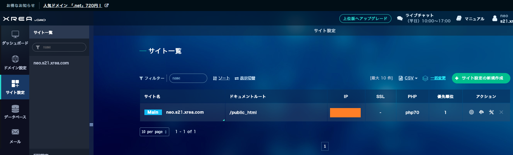
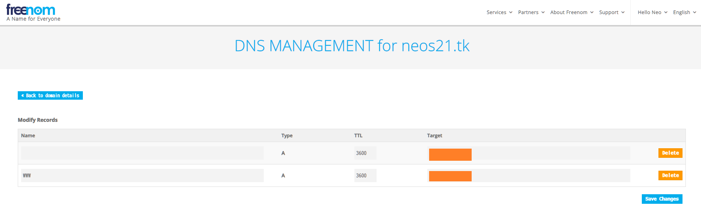
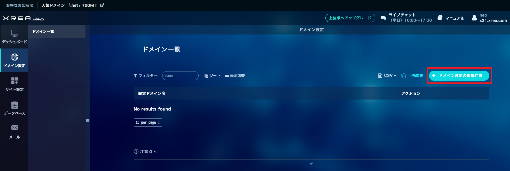
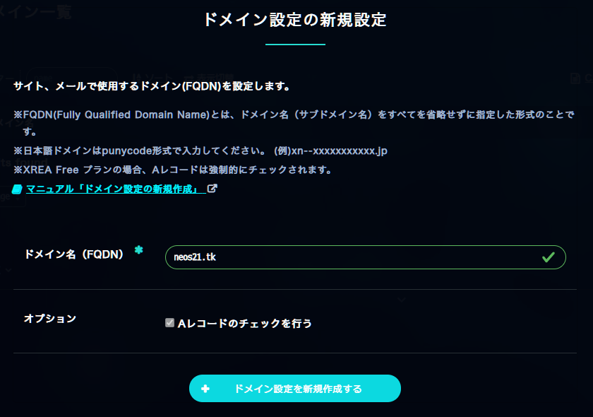
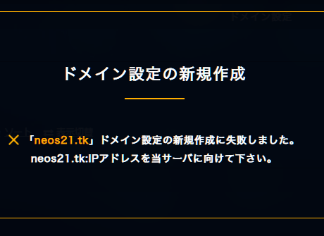
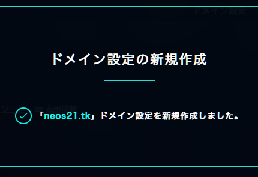
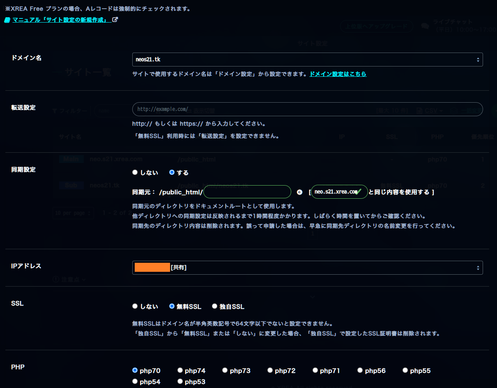
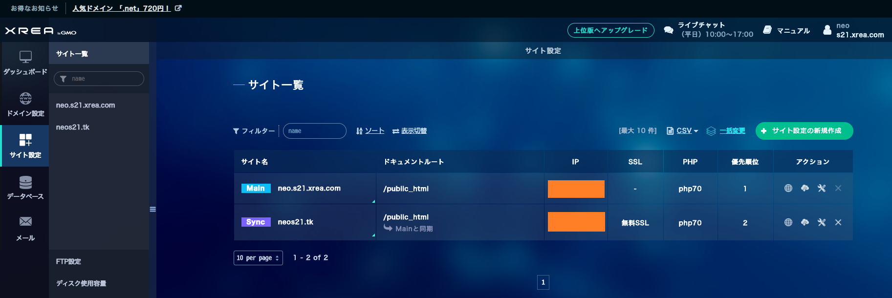

自分のメインサイト Neo's World (`http://neo.s21.xrea.com/`) は、XREA の無料プランで2002年から運営している。

XREA は Let's Encrypt を利用した無料 SSL を提供してくれていて、Value-Domain で取得したドメインを連携して XREA サイトを HTTPS 化して公開できたりする。

今回は Value-Domain は一切使わず、Freenom で無料独自ドメインを取得し、Freenom 側の DNS を利用して設定を行い、XREA のサイトを HTTPS 化してみる。

## 目次

## XREA の Public IP を確認する

まずは XREA の管理画面にログインする。

- [ログイン | XREA Control Panel](https://cp.xrea.com/account/login/)

「サイト設定」に移動し、「Main」サイトの「IP」欄を確認する。

## Freenom で独自ドメインを取得し、DNS を設定する

Freenom で独自ドメインを取得する。

- [Freenom - 誰でも利用できる名前](https://www.freenom.com/ja/index.html)

以下の記事も多少参考に。

- [完全無料。GCE で公開している HTTP サーバを Freenom 独自ドメイン + Let's Encrypt で HTTPS 化した](/blog/2020/06/15-01.html)

ドメインを登録できたら、上部メニュー Services → My Domains → 登録したドメインを選択する → 「Manage Domain」 → 「Manage Freenom DNS」タブ と進み、Freenom DNS の設定画面を開く。

そしたら次のようにレコードを登録する。

| Name   | Type | TTL  | Target                |
|--------|------|------|-----------------------|
| (空白) | A    | 3600 | 【XREA の Public IP】 |
| www    | A    | 3600 | 【XREA の Public IP】 |

## XREA 側にドメインを登録する

XREA の管理画面に戻り、「ドメイン設定」に移動する。

「ドメイン設定の新規作成」ボタンを押下し、登録した Freenom ドメインを登録する。

Freenom DNS の設定が反映されるのにしばらく時間がかかるようで、登録に失敗した、といったメッセージが出る場合がある。*10分くらい気長に待つ。*

Freenom DNS の設定が浸透したら登録できるようになる。

## 無料 SSL を使用したサイト設定を追加する

XREA 管理画面の「サイト設定」より、「サイト設定の新規作成」ボタンを押下し、次にように設定していく。

- ドメイン名 : 「ドメイン設定」画面で登録したドメインを選択する
- 転送設定 : 無視
- 同期設定 : する
  - 同期元 : `/public_html/(空欄)`
  - 「(Main サイト) と同じ内容を使用する」を選択する
- IP アドレス : そのまま (Main サイトと同じ IP が `[共有]` で選択されているはず)
- SSL : *無料 SSL* を選択する
- PHP : 適当に。`php70` で良い
- オプション : 「A レコードのチェックを行う」は XREA 無料プランだとチェックが付いたままなので放置

コレで登録する。次のようになれば OK。

ココまでできたら、

- <http://neos21.tk/>

という HTTP でアクセスすると、HTTPS にリダイレクトされ、

- <https://neos21.tk/>

でアクセスできるようになる。

`www.neos21.tk` といった `www` 付きだと「ドメインウェブの設定が見つかりません」という XREA のエラー画面に移動してしまい、`www` 付きでは上手く転送できていないみたい。まぁとりあえずいいや。

あと、自分のサイトだと XREA カウンタとかが HTTP リクエストで、混在コンテンツ警告により「保護されていない通信」扱いになってしまう。

- <https://neos21.tk/status.json>

など、混在コンテンツが発生しないような URL にアクセスしてみると、ちゃんと「この接続は保護されています」となるので、SSL 対応自体はちゃんとできている。

混在コンテンツをちゃんとなくさないといけないが、XREA カウンタも2002年から使っていて愛着があるし、使い続けたいなー。

とりあえずはコレで OK とする。

- 参考 : [無料SSLの新規設定 | サイト設定 | マニュアル | 無料から使える高機能・高品質レンタルサーバー | XREA（エクスリア）](https://www.xrea.com/support/manual/security/free/)
- 参考 : [XREAに無料SSL証明書を導入してみました | じょんからドットネット](https://jonkara.net/2017/08/11/ssl/)
- 参考 : [XREA 上の既存サイトに対して無料 SSL の設定をする - mimikakimemo](https://mimikakimemo.hatenablog.jp/entry/2018/07/14/185227)
- 参考 : [xreaに独自ドメイン設定（freenomドメインサービスのネームサーバー利用） - rokkonet](https://rasumus.hatenablog.com/entry/2019/07/13/113300)
- 参考 : [ロリポップからXREAにサーバ移設(ドメイン変更)。無料SSL、Let's Encrypt使用。 | 僕の痛みに金をくれ](https://rockrock.tk/2017/01/15/596/)
