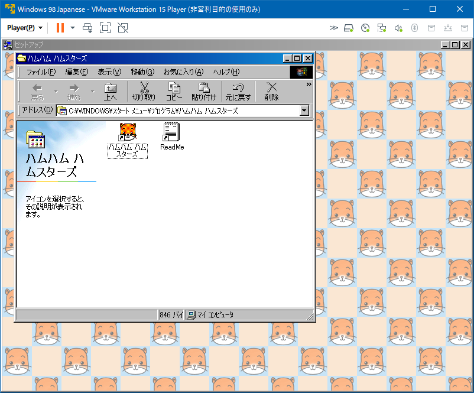

懐かしのゲームをまたプレイする。

## 目次

## Windows 10 で起動できない古いアプリ

20年以上前、「ハムハムハムスターズ」という PC ゲームで遊んでいた。ハムスターを飼育できるゲームで、ハム太郎人気よりも前の、1999年頃に発売された Windows ゲームだった。

2020年になって、ヤフオクでこの PC ゲームの CD-ROM を見つけたので、試しに買ってみた。

CD-ROM を入れて `setup.exe` を起動してみると、次のようなメッセージが表示された。

> このアプリはお使いの PC では使用できません
> 
> この PC で使用できるアプリのバージョンについては、ソフトウェア発行者に確認してください。

詳しいことは分からないが、古すぎる Windows アプリは「互換性設定」なども効かず、64-bit Windows 10 で動かせないようだ。

- 参考：[【解決】このアプリはお使いの PC では使用できません | Windows 10](http://tooljp.com/qa/this-app-cant-run-on-your-pc-F610.html)
- 参考：[「このアプリはお使いのPCでは実行できません」の原因と対処 – Windows10](https://itojisan.xyz/trouble/17619/)

それじゃあ、古い OS の仮想マシンを用意して動かしてみたらどうかな、と思い検証を始めることにする。

## Windows 98 の仮想マシンで動かしてみる

ハムハムハムスターズの推奨 OS は Windows 95 か Windows 98 らしい。ということで、Windows 98 の仮想マシンを動かすために、__VMware Workstation 15 Player__ をインストールする。

- [VMware Workstation Player のダウンロード | VMware | JP](https://www.vmware.com/jp/products/workstation-player/workstation-player-evaluation.html)

Windows 10 Pro 64-bit にササッとインストールする。インストールウィザードで Hyper-V が云々とか言われるが、黙って従っておけば良い。WSL2 との併存も問題なさそう。

## Windows 98 仮想イメージを用意する

Windows 98 の CD-ROM をアレコレして、VMware 用の仮想イメージを用意する。

- 参考：[Windows 98 Second Edition OEM (Japanese) : Microsoft : Free Download, Borrow, and Streaming : Internet Archive](https://archive.org/details/Win98SEOEMJapanese)
  - `B8MFR-CFTGQ-C9PBW-VHG3J-3R3YW`
  - `RW9MG-QR4G3-2WRR9-TG7BH-33GXB`
- 参考：[Windows 98 SE Japanese (VMware) : Microsoft : Free Download, Borrow, and Streaming : Internet Archive](https://archive.org/details/windows-98-se-japanese-vmware)
  - _`winworld : password`_
  - __`Windows 98 Japanese.vmx`__

## CD-ROM ドライブを IDE 接続する

VMware Workstation Player で Windows 98 が起動したら、ホストマシンの物理 CD-ROM ドライブを、VMware の仮想 IDE として接続する。

- ウィンドウ左上の「Player」→「取り外し可能デバイス」→「CD/DVD (IDE)」→「設定」と移動する
  - 
- 「仮想マシン設定」ウィンドウ → 「CD/DVD (IDE)」を選択する
- 「接続」で「物理ドライブを使用する」を選択する
  - 

ドライブが接続できると、AutoRun が起動してハムハムハムスターズのインストーラが起動した。

インストールが完了すると、無事ハムハムハムスターズが起動できた。

## 何か動作スピードが速い…

ハムスターを飼い始めてみると、何か動作スピードが物凄く速い…。記憶では、ゆっくりもぞもぞと動いていたはずのハムスターが、ケージの中で爆速で駆け回っている。カサカサとゴキブリみたいな速度で動いていて、明らかに記憶と違う。

原因は定かではないが、どうも当時のマシンスペックを前提にしたプログラムになっているみたいで、フレームレートの上限が決められていないっぽい。仮想マシンでも全くそのまんま動作するワケでもないのだな。

## インストール後のファイルをコピーすると Windows 10 でも動いた

インストールしたファイル群は、VMware の Windows 98 内の、

- `C:\Program Files\HIcorp\H_Ham`

というフォルダに置かれていた。

VMware 内のエクスプローラから、ウィンドウを飛び出して Windows 10 側にフォルダをドラッグしてみると、うまく VM・ホスト間でファイルをコピーしてくれた。

そしてホストマシン側にコピーされたファイルを開いてみると、Windows 10 でもハムハムハムスターズが起動した。インストーラだけが古すぎて対応していなかったようで、インストール後の実行ファイルは互換性設定もせずに起動できた。

ただしやはり、ゴキブリのように高速に動くハムスターの挙動は変わらず。

## とりあえずインストール・実行ができるようになった

VirtualBox や Docker とはまた違う、VMware Workstation Player を試してみた。

古い Windows アプリをインストールしたり、起動したりできることが確認でき、操作も簡単だった。
