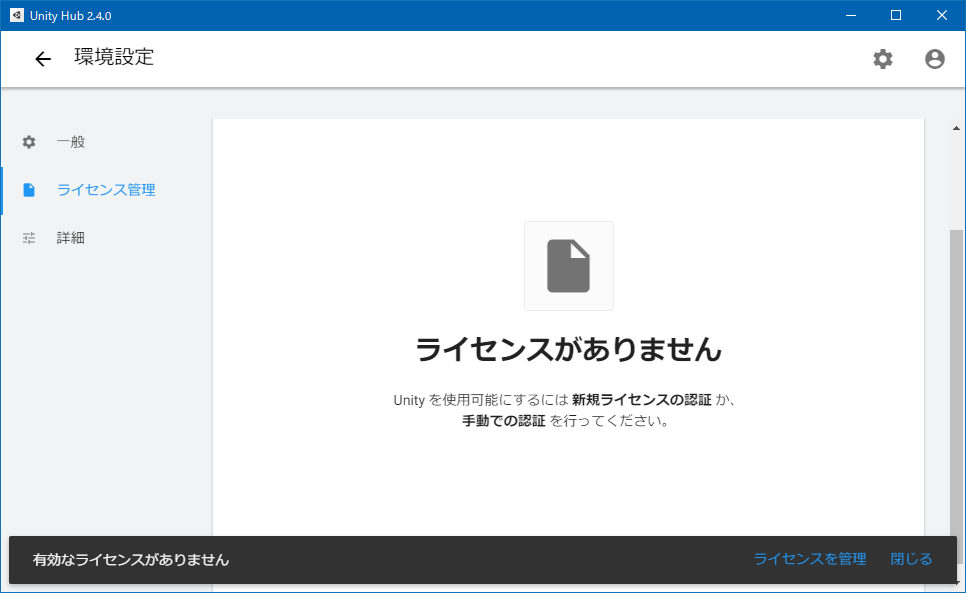
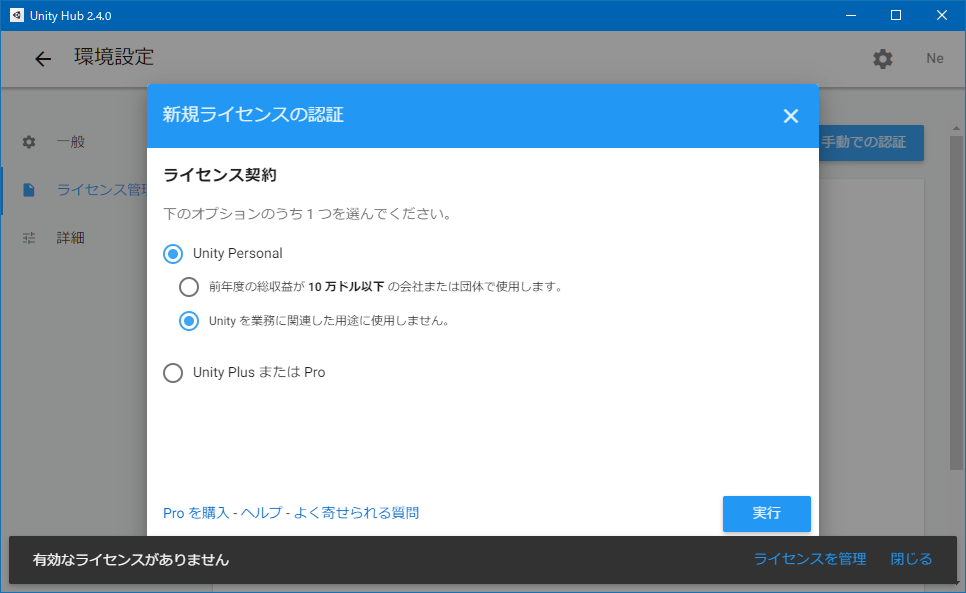

ふと思い立って Unity を始めてみることにした。今回は Windows 10 環境に Unity をインストールして、初回起動するところまでをやってみる。

## 目次

## Unity Hub をインストールする

Unity はバージョンごとに色々と差異があるようなので、複数のバージョンの Unity を管理できる _Unity Hub_ を使うのが良いらしい。

- [Download - Unity](https://unity3d.com/jp/get-unity/download)

`UnityHubSetup.exe` をダウンロードし、インストールする。

## サインアップ・サインインする

Unity を使うには、アカウント登録とライセンス認証が必要になる。といっても、個人で私的利用する分には、無料のライセンスで問題ない。

- Unity Hub を起動する
- 右上ユーザアイコン → サインイン → 「こちらで ID を作成」 → Google アカウントでサインイン
- 参考：[Unityアカウントの作成方法【初心者向け】 | ゲームの作り方！](https://dkrevel.com/makegame-beginner/make-unity-account/)

- 右上歯車アイコン → 左メニュー「ライセンス管理」 → 新規ライセンスの認証 → Unity Personal → 「Unity を業務に関連した用途に使用しません。」 → 「実行」
- 参考：[Unity Hubの使い方【初心者向け】 | ゲームの作り方！](https://dkrevel.com/makegame-beginner/unity-hub/)

## Unity をインストールする

アカウントとライセンスの準備ができたら、Unity 本体をインストールする。本稿執筆時点での最新の安定版である「Unity 2019.4.10f1 (LTS)」をインストールすることにしよう。

- 左上矢印「←」アイコンで戻る → 左メニュー「インストール」 → 右上「インストール」ボタン
- Unity 2019.4.10f1 (LTS) がデフォルト選択されているのでそのまま「次へ」ボタン
- モジュールを追加：
  - Dev tools：Microsoft Visual Studio Community 2019 … デフォルトでチェックされたまま
  - Platforms：今回は Web 向けに作るつもりで、「WebGL Build Support」をチェックする
  - Documentation：デフォルトでチェックされたまま
  - Language packs (Preview)：「日本語」をチェックしてみる

Platforms 部分は、自分の作りたいモノに合わせて選ぶ。

ダウンロードとインストールが始まるので待つ。ファイルサイズが重たくて、Unity 本体のインストールに1時間くらいかかった。

## 新規プロジェクトを作る

Unity をインストールしたら、Unity Hub の画面上から、プロジェクトの管理もできる。

- 左メニュー「プロジェクト」 → 「新規作成」ボタン → テンプレート「3D」

こんな感じでプロジェクトを作れば、Unity の開発画面が開く。

今回はココまで。

- 参考：[【Unity】素人が7日間クソゲーを作り続けてわかったこと | uinyan．com](https://uinyan.com/unity_7days_kusoge_challenge/)
- 参考：[【Unity】クソゲーを作って晒したら世界が変わった件 | uinyan．com](https://uinyan.com/unity_7days_challenge_after/)
