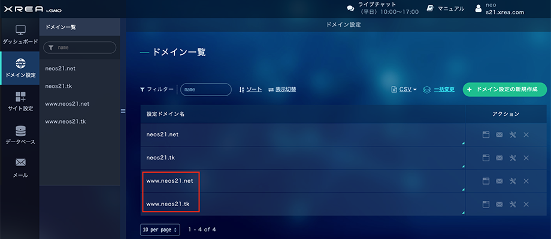

メインサイト [Neo's World](https://neos21.net/) で、長らく XREA サーバの無料プランを使ってきたが (`http://neo.s21.xrea.com/`)、2020年11月に Value-Domain で独自ドメイン `neos21.net` を取得した。

このサイトには Freenom で取得した無料の独自ドメイン `neos21.tk` も割り当ててあるのだが、`www` ありの場合に上手くページを表示できなかったので、原因を調べて対処した。

というワケで、

- Value Domain で取得したドメインの DNS 設定 → XREA サーバ側の設定
- Freenom で取得したドメインの DNS 設定 → XREA サーバ側の設定

の2パターンを一気に紹介し、当該ドメインに対して `www` ありでもなしでもアクセスできるようにする。

## 目次

## Freenom の DNS 設定

Freenom DNS の設定は、以前記事にしたとおりで良かった。

- [XREA の無料 SSL と Freenom 無料独自ドメインで XREA のサイトを HTTPS 化してみる](/blog/2020/10/08-01.html)

| Name   | Type | TTL  | Target                |
|--------|------|------|-----------------------|
| (空白) | A    | 3600 | 【XREA の Public IP】 |
| www    | A    | 3600 | 【XREA の Public IP】 |

このように設定できていれば OK。

## Value Domain の DNS 設定

Value Domain 管理画面の DNS 設定は、以下のように行う。XREA サーバと紐付ける場合は、自動設定をベースにすれば自動的に以下のようになるはずだ。オレンジ色の矩形でマスキングしているところが、XREA サーバの Public IP だ。

`www` に対して Public IP が割り当てられていれば、DNS 側は OK。

## XREA サーバの設定

XREA サーバ側の設定がキモだった。

コレまでは `www` なしのドメインのみ登録していたが、「ドメインの設定」で、**`www` ありのドメインも登録する。**

自分の場合は

- `neos21.net`
- `www.neos21.net`

のセットだったり、

- `neos21.tk`
- `www.neos21.tk`

のセットで登録しておく。

さらに、*「サイト設定」*の方も、`www` なし版と `www` あり版とで、同じように設定しておく。「設定優先順位」は登録した順で決まり、後から変更できないが、特に何も影響しない。

どちらのドメインも「無料 SSL」を使って SSL 化できたので、最終的に以下の URL バリエーションの全てで指定のサイトにアクセスできるようになった。

| URL                       | Registrar    | Protocol | www  |
|---------------------------|--------------|----------|------|
| <http://neos21.net/>      | Value Domain | HTTP     | 無   |
| <http://www.neos21.net/>  | Value Domain | HTTP     | アリ |
| <https://neos21.net/>     | Value Domain | HTTPS    | 無   |
| <https://www.neos21.net/> | Value Domain | HTTPS    | アリ |
| <http://neos21.tk/>       | Freenom      | HTTP     | 無   |
| <http://www.neos21.tk/>   | Freenom      | HTTP     | アリ |
| <https://neos21.tk/>      | Freenom      | HTTPS    | 無   |
| <https://www.neos21.tk/>  | Freenom      | HTTPS    | アリ |

以上。
