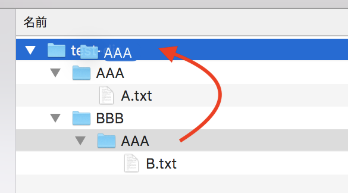
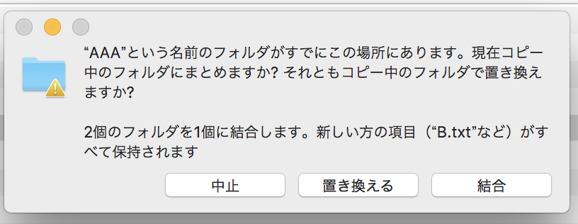

Mac Finder の「置き換える」の動作が危険だということに気付いたので記しておく。

## 目次

## テスト用のディレクトリ・ファイルを作る

今回説明したいことを検証するためのディレクトリとファイルを作る。

```bash
$ mkdir -p ./test-dir/AAA ./test-dir/BBB/AAA
$ echo 'Text A' > ./test-dir/AAA/A.txt
$ echo 'Text B' > ./test-dir/BBB/AAA/B.txt

$ tree ./test-dir
./test-dir
├── AAA
│  └── A.txt
└── BBB
    └── AAA
        └── B.txt
```

Finder で見ると次のようになっている。


ココから、**`./test-dir/BBB/AAA/` ディレクトリを選択して、`./test-dir/AAA/` に混ぜ込みたい**とする。

## 普通にドラッグして「置き換える」してみる

それでは、Finder で `./test-dir/BBB/AAA/` ディレクトリをドラッグして、`./test-dir/` に重ねてドロップしてみる。



次のようなダイアログが出るので、「置き換える」を選択してみる。

> "AAA" という名前の古い項目がすでにこの場所にあります。現在移動中の新しい項目で置き換えますか？


すると、次のようになる。


`./test-dir/AAA/` の下は **`A.txt` が消えて** `B.txt` のみになっている。`./test-dir/BBB/` の下には何もない。

ゴミ箱はと見てみると、何も入っていない。つまり、*`A.txt` がゴミ箱にも残らず完全消滅*してしまったのだ。

## Option キーを押下して「統合」してみる

Finder で **Option キーを押下したまま、**`./test-dir/BBB/AAA/` ディレクトリをドラッグして、`./test-dir/` に重ねてドロップしてみる。

Finder で Option キーを押下しながらファイルを操作すると、ファイルコピーの動作になる。そして既存ディレクトリと重ねた場合は、**「統合」という選択肢**が表示される。

> "AAA" という名前のフォルダがすでにこの場所にあります。現在コピー中のフォルダにまとめますか？それともコピー中のフォルダで置き換えますか？
> 
> 2個のフォルダを1個に結合します。新しい方の項目 ("B.txt" など) がすべて保持されます



ココで「置き換える」を選ぶと、やはり `A.txt` は消えてしまう。では「結合」を選ぶとどうなるか。


こうなる。*`A.txt` は消えずに残り、`B.txt` が同階層に配置される*。しかし、「移動」ではなく「コピー」の動作なので、`BBB/AAA/` ディレクトリは残ってしまっている。

*Windows エクスプローラにおける「切り取り」→「貼り付け」の動作と異なる挙動*なので、物凄く違和感がある。特に移動先にあったファイルたちがゴミ箱にすら残らず消滅してしまうのはとても危険だ。自分は Git 管理しているファイルが消滅しただけなので取り返せたが、皆様は十分注意してファイル操作して欲しい。
