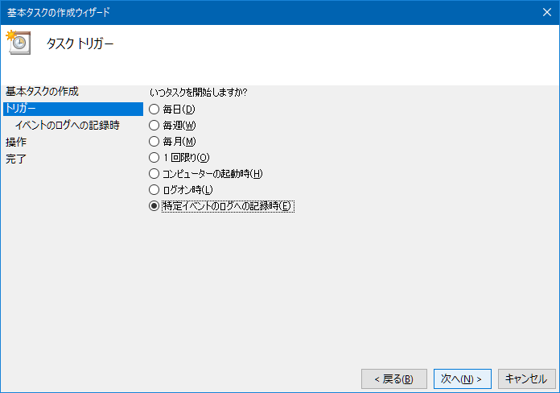
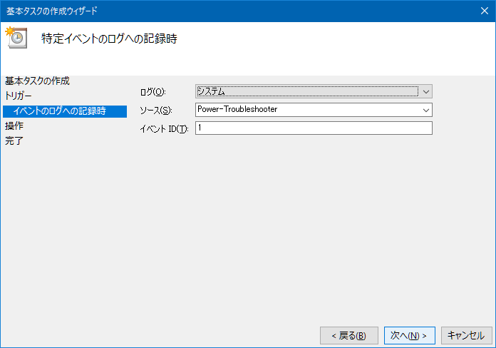
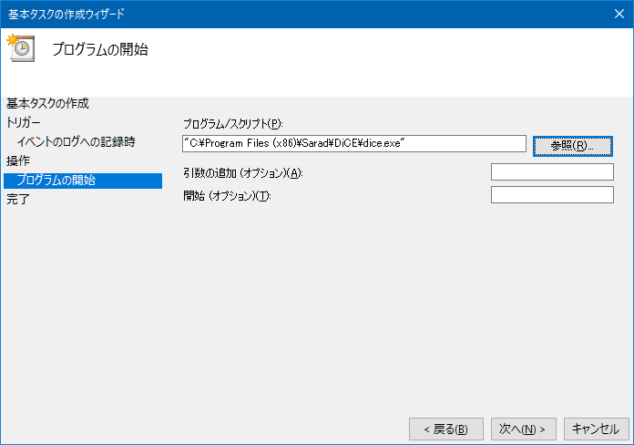

Windows10 で、スリープや休止状態から復帰した時に、任意のプログラムを実行したく、やり方を調べた。

「管理ツール」から「タスクスケジューラ」を開く。右ペインの「タスクスケジューラライブラリ」か、メニューバーの「操作」から「基本タスクの作成」を選ぶ。

するとウィザードが開く。最初の画面は名前なので適当に。

次に「トリガー」の指定。ココで_「特定イベントのログへの記録時」_を選択する。

次の画面で、以下のように指定する。

- ログ：「システム」を選択する
- ソース：**「Power-Troubleshooter」**を選択する
- イベント ID：**「1」**を入力する

「操作」は「プログラムの開始」を選択し、あとは任意のプログラムを実行するよう設定する。

コレで完了。
