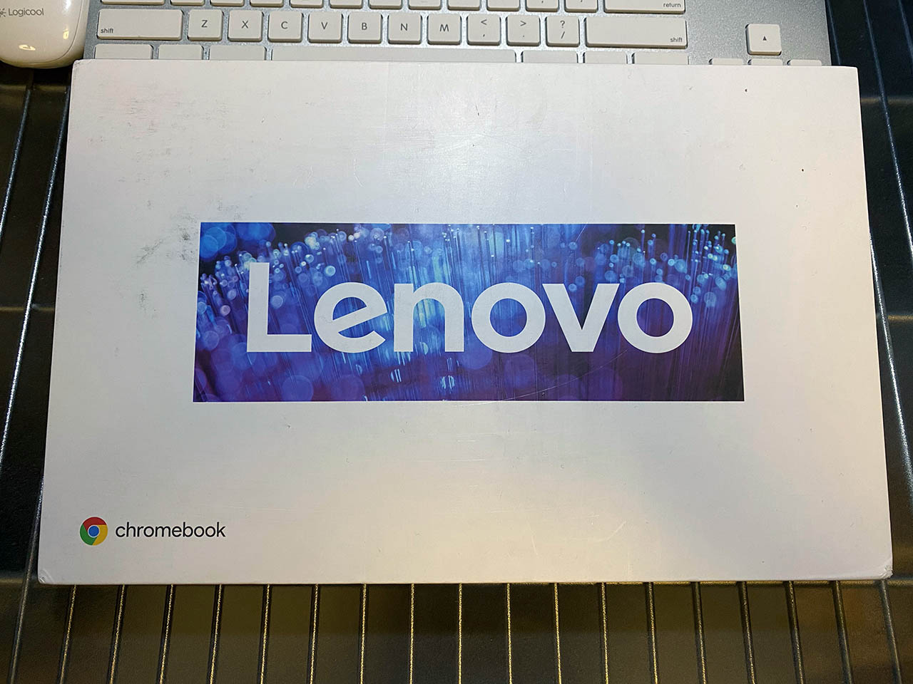
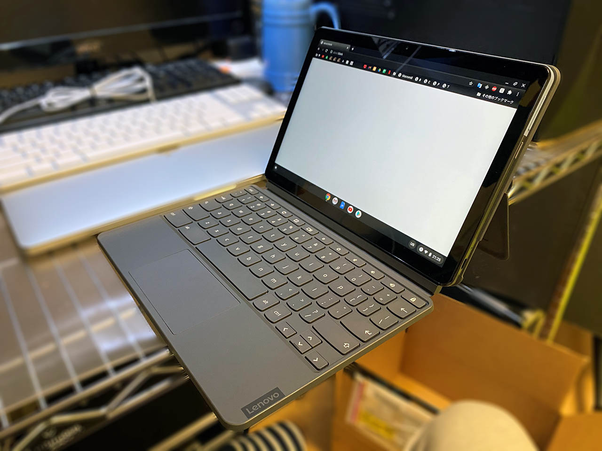
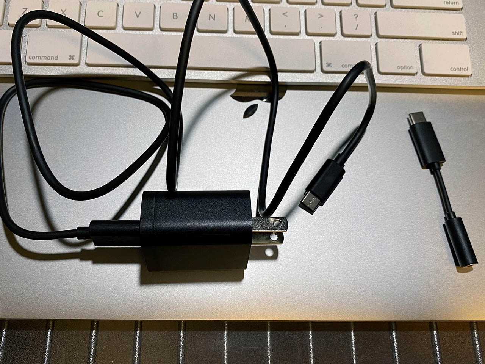
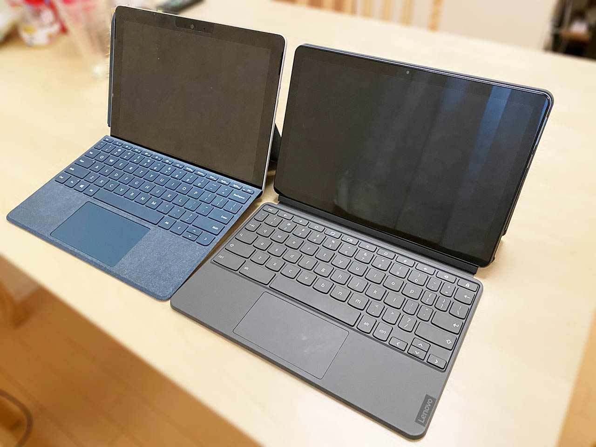
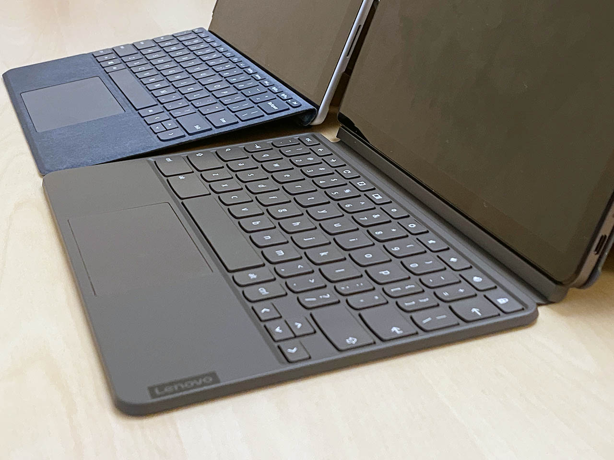

久々に Chromebook を買いました。

<div class="ad-amazon">
  <div class="ad-amazon-image">
    <a href="https://www.amazon.co.jp/dp/B0895WXXKL?tag=neos21-22&amp;linkCode=osi&amp;th=1&amp;psc=1">
      
    </a>
  </div>
  <div class="ad-amazon-info">
    <div class="ad-amazon-title">
      <a href="https://www.amazon.co.jp/dp/B0895WXXKL?tag=neos21-22&amp;linkCode=osi&amp;th=1&amp;psc=1">【Amazon.co.jp 限定】Google Chromebook Lenovo ノートパソコン Ideapad Duet 10.1インチ 日本語キーボード WUXGA MediaTek Helio P60T 4GBメモリ 限定スペック 64GB eMMC モデル</a>
    </div>
  </div>
</div>

## 目次

## 経緯

以前、Asus Chromebook Flip を持っていたが、ZenBook と MacBook を揃えてからは使わなくなってしまい、売ってしまった。タッチ液晶で 2 in 1 だったのだが、重さが 890g で ZenBook などとあまり変わらず、キーボードを裏に折り畳めるだけでタブレットとしての機動性に欠けていたためだ。

最近 Google Nest Hub を買って使っていたのだが、どうにも柔軟性がない。よく分からない問題は Google 検索してくれたらいいのだが、「よく分かりません」で逃げやがって、使い物にならん。最近は Android や ChromeOS で Google アシスタントが使えるらしいので、だったらタブレットを買って Google アシスタントを使っていた方が、ブラウザも使えて良いのではないかと考えていた。

当初、*Lenovo Yoga Smart Tab* という Androoid タブレットが気になっていた。3万円ぐらいで、スタンドの足を内蔵していて、Chrome アシスタントも使いやすいようであった。しかし、以下の比較記事を見て、IdeaPad Duet 良いな…となってきた。

- [Lenovo Duet vs Lenovo Yoga Smart Tab - OneTechStop](https://onetechstop.net/2020/07/12/lenovo-duet-vs-lenovo-yoga-smart-tab/)

<div class="ad-rakuten">
  <div class="ad-rakuten-image">
    <a href="https://hb.afl.rakuten.co.jp/hgc/g00r7ld2.waxycfeb.g00r7ld2.waxyddc5/?pc=https%3A%2F%2Fitem.rakuten.co.jp%2Fbiccamera%2F4580550674228%2F&amp;m=http%3A%2F%2Fm.rakuten.co.jp%2Fbiccamera%2Fi%2F12751778%2F">
      
    </a>
  </div>
  <div class="ad-rakuten-info">
    <div class="ad-rakuten-title">
      <a href="https://hb.afl.rakuten.co.jp/hgc/g00r7ld2.waxycfeb.g00r7ld2.waxyddc5/?pc=https%3A%2F%2Fitem.rakuten.co.jp%2Fbiccamera%2F4580550674228%2F&amp;m=http%3A%2F%2Fm.rakuten.co.jp%2Fbiccamera%2Fi%2F12751778%2F">レノボジャパン　Lenovo ZA3V0052JP Androidタブレット Yoga Smart Tab アイアングレー [10.1型ワイド /ストレージ：64GB /Wi-Fiモデル][タブレット 本体 10インチ wifi 新品][ZA3V0052JP]</a>
    </div>
    <div class="ad-rakuten-shop">
      <a href="https://hb.afl.rakuten.co.jp/hgc/g00r7ld2.waxycfeb.g00r7ld2.waxyddc5/?pc=https%3A%2F%2Fwww.rakuten.co.jp%2Fbiccamera%2F&amp;m=http%3A%2F%2Fm.rakuten.co.jp%2Fbiccamera%2F">楽天ビック（ビックカメラ×楽天）</a>
    </div>
    <div class="ad-rakuten-price">価格 : 30340円</div>
  </div>
</div>

<div class="ad-amazon">
  <div class="ad-amazon-image">
    <a href="https://www.amazon.co.jp/dp/B0826FMYNK?tag=neos21-22&amp;linkCode=osi&amp;th=1&amp;psc=1">
      
    </a>
  </div>
  <div class="ad-amazon-info">
    <div class="ad-amazon-title">
      <a href="https://www.amazon.co.jp/dp/B0826FMYNK?tag=neos21-22&amp;linkCode=osi&amp;th=1&amp;psc=1">Lenovo（レノボ） 10.1型タブレットパソコン Lenovo Yoga Smart Tab 64GBモデル ZA3V0052JP</a>
    </div>
  </div>
</div>

値段はそこまで変わらないが、ChromeOS の方が Android OS よりも高機能だし良いよね、というワケである。

そこで、US 配列のキーボードを手に入れるため、Amazon.com で **Lenovo IdeaPad Duet Chromebook** の 128GB モデルを購入した次第。送料込みで、日本で同モデルを買うのより若干安いぐらいに留まった。

- モデル名 : Lenovo IdeaPad Duet Chromebook
- 型番 : ZA6F0031US

<div class="ad-amazon">
  <div class="ad-amazon-image">
    <a href="https://www.amazon.co.jp/dp/B08CCWGJDY?tag=neos21-22&amp;linkCode=osi&amp;th=1&amp;psc=1">
      
    </a>
  </div>
  <div class="ad-amazon-info">
    <div class="ad-amazon-title">
      <a href="https://www.amazon.co.jp/dp/B08CCWGJDY?tag=neos21-22&amp;linkCode=osi&amp;th=1&amp;psc=1">Lenovo（レノボ） 10.1型 ノートパソコン Lenovo IdeaPad Duet Chromebook ZA6F0038JP(CHROME)</a>
    </div>
  </div>
</div>

<div class="ad-rakuten">
  <div class="ad-rakuten-image">
    <a href="https://hb.afl.rakuten.co.jp/hgc/g00pksh2.waxyc95f.g00pksh2.waxyd04b/?pc=https%3A%2F%2Fitem.rakuten.co.jp%2Febest%2F4580551077530%2F&amp;m=http%3A%2F%2Fm.rakuten.co.jp%2Febest%2Fi%2F12668706%2F">
      
    </a>
  </div>
  <div class="ad-rakuten-info">
    <div class="ad-rakuten-title">
      <a href="https://hb.afl.rakuten.co.jp/hgc/g00pksh2.waxyc95f.g00pksh2.waxyd04b/?pc=https%3A%2F%2Fitem.rakuten.co.jp%2Febest%2F4580551077530%2F&amp;m=http%3A%2F%2Fm.rakuten.co.jp%2Febest%2Fi%2F12668706%2F">Lenovo ZA6F0038JP Lenovo IdeaPad Duet Chromebook 10.1型 Helio P/4GB/128GB/WiFi</a>
    </div>
    <div class="ad-rakuten-shop">
      <a href="https://hb.afl.rakuten.co.jp/hgc/g00pksh2.waxyc95f.g00pksh2.waxyd04b/?pc=https%3A%2F%2Fwww.rakuten.co.jp%2Febest%2F&amp;m=http%3A%2F%2Fm.rakuten.co.jp%2Febest%2F">イーベストPC・家電館</a>
    </div>
    <div class="ad-rakuten-price">価格 : 45333円</div>
  </div>
</div>

## 開封



なんか外箱汚くないっすか…？コレでも一応新品。ｗ



キックスタンドなどを組み立てるとこんな感じ。Surface っぽいね〜

## 付属品

付属品は

- IdeaPad 本体 : タブレット型
- キックスタンド付きの背面カバー
- カバーを兼ねるキーボード
- USB-A・USB-C ケーブル
- AC 電源
- USB-C → イヤホンジャックの変換コネクタ

ぐらい。キックスタンド型で、Surface っぽい。今のところ Chromebook でキックスタンド型なのはこの製品ぐらいなようだ。



↑ ケーブル類。

## スペック

- CPU : MediaTek Helio P60T (8コア)
- GPU : CPU 内蔵 (Arm Mali-G72 MP3)
- RAM : 4GB LPDDR4X
- Storage : 128GB eMMC
- 液晶 : 10.1インチ・1920x1200 WUXGA

スペックはこんな感じ。今日び 4GB RAM って、PC としてはどうなの…と思ったが、ChromeOS は Windows ほど重くないし、そもそも Google アシスタント代わりのブラウジング専用マシンぐらいのつもりでいたので、コレでも問題ないだろう。

## Surface Go との比較



<ins datetime="2021-03-26T00:00Z">元</ins>妻が所有する Surface Go (左) と並べてみた。Surface Go はキーボードが斜めになって使いやすさは優る。



また、Surface Go はキックスタンドが本体の一部になっているが、Chromebook Duet はキックスタンド付きの背面カバーを付けることになる。このカバーは強力なマグネットでくっ付く仕組みだ。重量には Duet に分があるので、以下にまとめてみる。

| -      | IdeaPad Duet | Surface Go |
|--------|--------------|------------|
| 本体   | **450g**     | 522g       |
| カバー | 470g         | *245g*     |
| 合計   | 920g         | *767g*     |

カバーを取り外して本体のみでタブレットとして運用することを考えると、IdeaPad Duet の軽さは魅力的だ。

## キーボード

Lenovo は通常のキーのピッチを重視しすぎて、右端の記号キーを小さくしがちだ。僕はコレが気に入らない。プログラミングする際は記号キーこそが重要になってくるので、ハイフンやブレースなんかが押しづらいのは致命的なのだ。

JIS 配列のキーボードになるとコレが顕著で、ありえないほど使いづらそうだったので、今回も Amazon.com から US 配列のモデルを輸入した次第。まぁまぁマシにはなったが、やはり10インチサイズだとキーは押しづらい。この点は Surface Go の US 配列キーボードの方が断然優秀。

US 配列の場合、IME 切り替えは `Ctrl + Space` になる。後述の Linux 環境で Fcitx-Mozc を入れると Alt 空打ち切り替えもできるようになるのだが、それは Linux 環境のアプリのみで、ChromeOS 上のアプリでは Ctrl + Spacee でしか切替できない。

## ChromeOS の使い勝手

ChromeOS 自体は初めてではないので特に問題なし。ただ、数年経って色々と進化しているようだった。

### Google アシスタントが使える

最近の Android スマホ・タブレットや ChromeOS マシンは、ほとんどの機種で Google アシスタントが使えるようである。つまり、「Ok Google」の呼びかけで調べ物をしたりできるワケだ。

しかしコレには一つ落とし穴があって、**ChromeOS にログインしているユーザの声でないと Google アシスタントを起動できない**のだ。Google アシスタントを使うには最初に「VoiceMatch」という音声認識をセットアップする必要があり、コレは1アカウントにつき1人分の声しか登録できないのである。

よくよく思い出すと、Google Nest Hub も同じ仕組みになっていて、Nest Hub と各々のスマホを連携して VoiceMatch をしているので、僕と<ins datetime="2021-03-26T00:00Z">元</ins>妻の声が両方認識される仕組みになっているワケだ。

一方、Chromebook は原則、複数人が同時利用することはない。だからログイン中のユーザ (に紐付く VoiceMatch) のみ音声認識するワケである。他の人が勝手に音声で他人のマシンを操作できては困るし、この制御は仕方ないか、と思うが、家族で共用する Nest Hub の代わりにしたかった自分としては惜しい仕様だ。

一応、画面タッチやキーボード上の「検索」キーを押下することで、Google アシスタントを起動することはできるので、ココだけ手動操作してから話しかければ、誰の声でも Google アシスタントを使うことはできる。

### Android アプリが動く

Android 用のアプリが Play ストアからインストールできるようになっていた。もしかしたら以前から出来たのかもしれないが、Asus Chromebook Flip 時代には使ったことがなかった。微妙にエミュレータで動いているのか、アプリによっては動作が不自然なところもあったが、概ね問題なく使えている。

完全なエミュレートでもなく、微妙に ChromeOS と統合されていたりいなかったりする。ChromeOS 設定とは別に Android 設定が機能したりしていて、よく分からないところもある。おまけに、同じ名前のアプリが複数パターン存在する場合があり混乱する。「スプレッドシート」アプリなんかが良い例だ。

- ChromeOS デフォルトでシェルフに登録されているヤツ
  - 選択すると Chrome ブラウザ上で当該サービスのウェブページが開く
  - 恐らく Chrome ブラウザそのページを開いている時に「アプリをインストール」すると登録できる、ブックマークリンク的なモノ
- Chrome アプリ
  - Google 製品はほとんどが非推奨になっている形式
  - PWA 的な感じで、Chrome とは別のウィンドウが開くものの、中身は Chrome でウェブページを開いた時と同じモノ
- Android アプリ
  - Play ストアからインストールできる Android ネイティブアプリ
  - ほとんど自然に使えるが、ChromeOS 専用設計ではないので時々バグった挙動になる時がある

イチイチ迷うのも嫌だし、Chromebook だけ操作性が異なるのも嫌なので、自分は一切のアプリをインストールせず、Chrome ブラウザのブックマークから「スプレッドシート」等を開いてブラウザ上で操作するように統一している。

ChromeOS 上の Chrome ブラウザは、PC 版のブラウザと同じく拡張機能が使えるので使いやすい。一方、Play ストアからインストールできる Firefox や Brave ブラウザは Android 版なワケなので、Chrome ブラウザで使えているはずの一部フォントが使えていなかったりして、やはりちょっと使いづらい。なるべく Chrome ブラウザ上で済むモノは Chrome ブラウザで済ませるように使う方が、ChromeOS は使い勝手が良さそうだ。

### Linux が動く

Chromebook Flip の頃は、*Crouton* というツールを使って、ChromeOS から Xubuntu のデスクトップを起動して動かしていた。コレでも一応動いていたのだが、デュアルブート状態で、使い勝手は良くなかった。Windows 上で VirtualBox を使って Linux デスクトップを全画面表示しているような、そんな感じであった。

最近の ChromeOS は「設定」の中に「**Linux (ベータ版)**」の項目があり、ココからすぐに Linxu 環境をインストールできる。インストールされたのは Debian 10 Buster で、`apt` で好きなアプリをインストールできる。

デフォルトのターミナルは Chrome ブラウザ上で動作する。*Ctrl + 画面右クリック*で設定画面を出せるので、ココからカラースキームを調整したりできる。

Linux にインストールされた GUI アプリは、X Window System の設定をすることなく、ChromeOS 上で起動できる。しかし、日本語入力については対応していないので、別途 Fcitx および Mozc をインストールする必要がある。このあたりは、WSL Ubuntu にインストールしたアプリを VcXsrv で開いた時なんかと同じで、Linux 側に IME がないといけないワケである。次のように設定してやろう。

```bash
$ sudo apt update
$ sudo apt upgrade -y
$ sudo apt dist-upgrade -y
$ sudo apt autoremove -y

# よく使うツールとか
$ sudo apt install -y git tig tmux jq tree

# Fcitx-Mozc を入れる
$ sudo apt install -y fcitx fcitx-mozc
# シェルフに Fcitx が追加されているので選ぶ・コレだけでは何も表示されないが、次のコマンドを叩くと設定画面が開く
$ fcitx-configtool
# Input Method タブで「+ (追加)」を選び、リストから「Mozc (右端に Japanese)」を選ぶ。あとは適宜設定…

# Fcitx を起動するには以下
$ fcitx-autostart
```

Debian 上に Node.js を入れてみた。Nodebrew だとインストールは成功するのだが `node` コマンドが動作せず上手く行かなかったので、**nvm** を使って導入した。

```bash
$ curl -o- https://raw.githubusercontent.com/nvm-sh/nvm/v0.37.2/install.sh | bash
# ターミナルを再起動する
$ nvm install 14.15.1
# コレだけで Node.js・npm が使えるようになる
```

- 参考：[ChromebookのLinux環境上にNode.jsをnvmを使って導入する - Androidのメモとか](https://relativelayout.hatenablog.com/entry/2019/12/27/061526)
- 参考：[Chromebook C101PA に Node.js をインストールした - モノラルログ](https://matsuoshi.hatenablog.com/entry/2019/03/15/000000)

VSCode も、Linux 用をインストールすることで使えるようになる。[公式サイト](https://code.visualstudio.com/#alt-downloads)から AMD 64 用のインストーラ (`code_1.52.0-1607640253_arm64.deb`) をダウンロードしてインストールするだけ。パッケージファイルを選択して開くと「Linux (ベータ版) でのアプリのインストール」というウィンドウが開いて、うまいこと Linux 環境にインストールされた。シェルフには「Linux アプリ」のくくりで VSCode のアイコンが追加されていた。

VSCode 統合ターミナルから開発サーバを起動すると、Chrome ブラウザの `localhost:3000` が参照できたりして、さながら WSL みたいな使い心地である。

ほとんど素の Debian Linux が動作していて、デスクトップ統合もデフォルトで上手いことやってくれているので、「ChromeOS だからあのアプリが使えない」といった困りごとがなく、素晴らしい。Android アプリと Linux 環境があれば、ほとんどのことはなんとかなるだろう。

ただし、VSCode の動作スピードは、若干劣る。タイプした文字の描画はわずかに遅延し、ChromeOS 上のメモ帳アプリなんかで文字入力している時のようなスムーズさがない。メモリ・CPU ともにハイエンドマシンではないので、あまりスペックを要する作業はできない。それでも、手元で VSCode や Node.js が動作するのは頼もしい限りだ。

Docker も動かせたりするんだろうか？あんまりガッツリ開発環境を構築するつもりはないので、とりあえず VSCode と Node.js が動けば良いのだが、技術的に可能なのか、興味はある。

### タブレットとしての運用

キーボードカバーを取り外し、背面カバーのみ付けておけば、タブレットを立て掛けて置いておくような運用ができる。雰囲気 Google Nest Hub だ。僕の声にしか反応しないが、Google アシスタントが使える。

キーボードを外したり背面に回したりするとタブレットモードになり、Android 風に使えるようになる。Netflix を見たり、Instagram なんかをのんびりダラ見する時はカバーを外して本体だけにしてやると軽くて持ちやすい。

スピーカーは、PC モードで配置した時の上部に存在し、音質はあまり良くない。音が「散る」(指向性が低い) ので、音声を聞き取るのに余計に音量を上げないといけない印象。低音が出にくく、シャカシャカと中高音域がうるさいヤツ。諦めて USB-C ポートからイヤホン繋いだ方が良いかもね。

ただ、ダラ見にはちょうど良い。Play ストアからインストールした Netflix アプリで映画も見られるし、コスパは良いだろう。

それでも音質にこだわるなら、Lenovo なら冒頭で名前を出した Yoga Smart Tab を選ぶのも一つだ。スタンドが内蔵されている部分が少し太くなっていて握りやすく、そこがスピーカーになっている。音質は IdeaPad Duet よりも良いはずだ。

## 高いコスパで普段遣いには十分

ChromeOS は Android アプリが入れられるので、一般ユーザがスマホの他に持つタブレット端末としても問題なく使える。

また、Linux (Debian) 環境も公式の導線ですんなりインストールできるので、開発用のサブマシンとして簡単な開発環境を構築しておくこともできる。やはりネットワークに繋がずにオフラインでも動作する実行環境は、あると便利なモノだ。

重量、サイズ感ともに申し分なく、3万円前後で買えるマシンとしてはオススメである。設定に利用者のスキルを多少要するが、Windows や Mac しか使ったことがない人でも、安価に快適なサブマシンを持ちたい場合、ChromeOS は最高の選択肢になるだろう。
