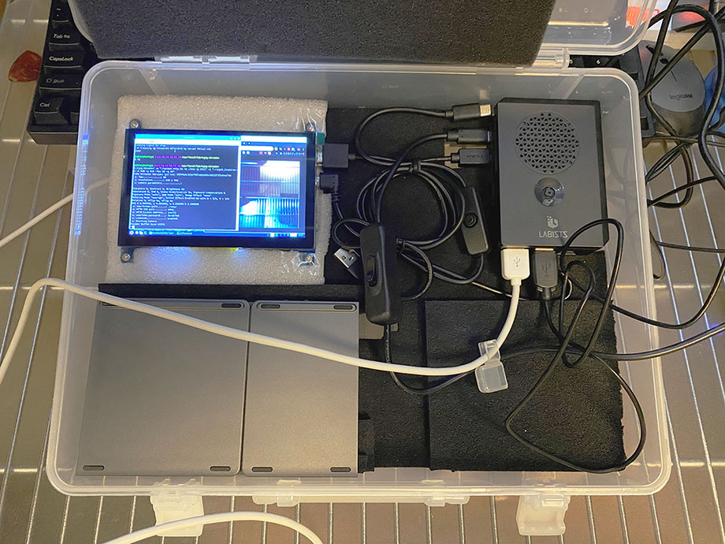
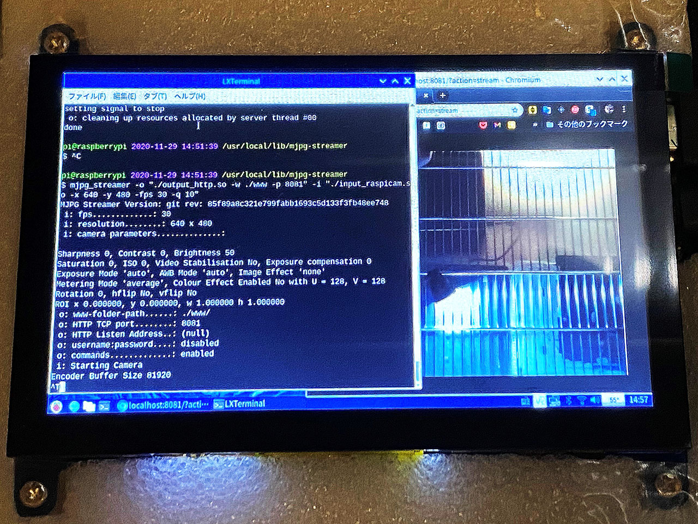

Raspberry Pi 4 にカメラモジュールを CSI 接続したものの、はて、このカメラで何をしようかなーと思っていた。というか、カメラの映像が外から確認できないことには使い勝手悪いよなー。ウェブ配信できるといいなー。

そう思って調べたところ、**mjpg-streamer** というツールで配信ができるらしいので、試してみた。

## 目次

## mjpg-streamer をインストールする

インストールする mjpg-streamer は、ラズパイに対応した以下の Fork 版を使う。

- [GitHub - jacksonliam/mjpg-streamer: Fork of http://sourceforge.net/projects/mjpg-streamer/](https://github.com/jacksonliam/mjpg-streamer)

```bash
# 依存モジュールを先にインストールしておく
$ sudo apt-get install -y cmake libv4l-dev libjpeg-dev imagemagick

# Git リポジトリを Clone する
$ git clone https://github.com/jacksonliam/mjpg-streamer.git

# 以下のディレクトリに移動する
$ cd mjpg-streamer/mjpg-streamer-experimental

# make してインストールする
$ make
$ sudo make install

# 以下にインストールされている
$ cd /usr/local/lib/mjpg-streamer
$ ls -l
-rw-r--r-- 1 root root 17928 2020-11-29 14:49 input_file.so
-rw-r--r-- 1 root root 18604 2020-11-29 14:49 input_http.so
-rw-r--r-- 1 root root 39248 2020-11-29 14:49 input_raspicam.so
-rw-r--r-- 1 root root 50844 2020-11-29 14:49 input_uvc.so
-rw-r--r-- 1 root root 18752 2020-11-29 14:49 output_file.so
-rw-r--r-- 1 root root 35892 2020-11-29 14:49 output_http.so
-rw-r--r-- 1 root root 13264 2020-11-29 14:49 output_rtsp.so
-rw-r--r-- 1 root root 13656 2020-11-29 14:49 output_udp.so
```

こんな感じ。

## mjpg-streamer を実行する

mjpg-streamer を実行する時は以下のように叩く。

```bash
$ cd /usr/local/lib/mjpg-streamer
$ mjpg_streamer -o './output_http.so -w ./www -p 8080' -i './input_raspicam.so -x 640 -y 480 -fps 30 -q 10'
```

なんとなく分かると思うが、`-i` オプションでラズパイに接続されているカメラを取得して、解像度や画質を指定している。`-o` は HTTP サーバを `8080` ポートで起動して、そこに出力している、ということ。

出力されているページを見るには、ブラウザで以下の URL を開く。クエリパラメータが必要なので注意。

- `http://localhost:8080/?action=stream`

ほとんどラグなく表示されている。





ラズパイ以外の PC から参照する時は、`localhost` 部分をラズパイの Private IP に変えてやれば良い。ローカルネットワーク内であれば、目立った遅延もなく、ほぼほぼ 30fps を維持している。以下の動画で実際の挙動を見ていただける。

- [【Neo's Channel】Raspberry Pi 4 + mjpg-streamer でウェブカメラ配信する](https://youtube.com/watch?v=IX1vX1PagUo)

自分は今のところ LAN 内で見えていれば良いので試さなかったが、ルータからラズパイへのポートを開放するか、ngrok 等でトンネルを作ってやれば、インターネット公開もできるだろう。

- 参考：[Raspberry Pi 3 の標準カメラで撮影した動画をブラウザに配信する方法まとめ - Qiita](https://qiita.com/okaxaki/items/72226a0b0f5fab0ec9e9)
- 参考：[Raspberry Piで室内カメラを作る① - Qiita](https://qiita.com/henjiganai/items/b491e498d7d367306cd5)
