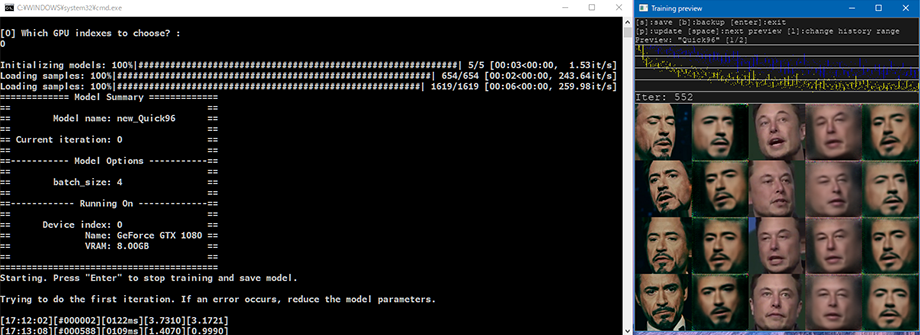
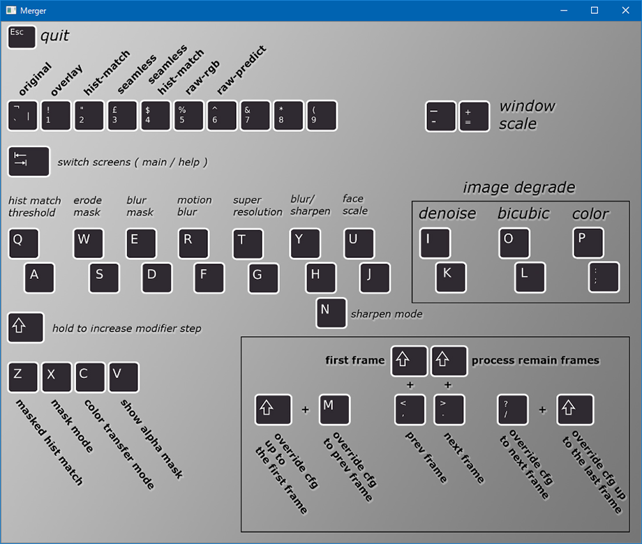
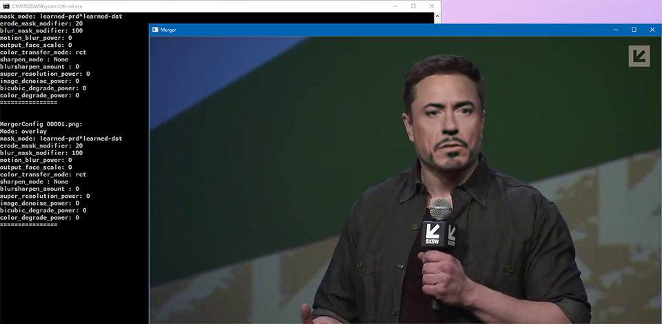

ディープフェイク動画が自分でも作れると聞いて、**DeepFaceLab** というツールを試してみた。

## 目次

## 検証環境

検証に使用したのは、自分のメインマシンである Galleria XG。

- Core i7-7700K
- 32GB RAM
- GTX 1080 (8GB)

といったスペックのマシンである。GPU がそれなりに良いヤツなので、処理が速く進みそうで期待している。

## DeepFaceLab をダウンロードする

- [GitHub - iperov/DeepFaceLab: DeepFaceLab is the leading software for creating deepfakes.](https://github.com/iperov/DeepFaceLab)

上の公式 GitHub より、以下の Magnet Link が紹介されている。コレを BitTorrent クライアントでダウンロードする。

- <https://tinyurl.com/y6npm2su>
  - `DeepFaceLab_NVIDIA_build_08_02_2020.exe` が落とせた
  - ファイルサイズは約 2.9GB

`.exe` 形式なのでその場で解凍する。すると `DeepFaceLab_NVIDIA` というフォルダができる。配下のファイル・フォルダ構成は以下のとおり。

```
DeepFaceLab_NVIDIA/
├ .bat ファイルがいっぱい
├ _internal/
│ └ 特に気にしなくて良い
└ workspace/
   ├ data_src.mp4
   ├ data_dst.mp4
   ├ data_src/
   │ └ aligned/
   │    └ 中身は空
   ├ data_dst/
   │ └ aligned/
   │    └ 中身は空
   └ model/
      └ 中身は空
```

この中で重要なのは `workspace/` フォルダ配下にあるサンプルの動画ファイル2つ。

サンプルで用意されている *`data_src.mp4`* は、映画「アイアンマン」からロバート・ダウニー・Jr. の動画 (1920x1080px)。**`data_dst.mp4`** は、イーロン・マスクの動画 (1280x720px) だ。

*`data_src.mp4`* に映る人物の顔を、**`data_dst.mp4`** に合成することになる。つまり、イーロン・マスクの身体にロバート・ダウニー・Jr. の顔が合成された動画が生成されることになる。コレを任意の動画ファイルに差し替えれば好きな動画が作れるワケだが、ファイル名はこの規則を守っておく必要がある。今回はこのサンプル動画ファイルで試してみる。

## 動画から静止画ファイルに切り出す

それでは早速ディープフェイク動画の作成に入ろう。多くのバッチファイルが手順に沿って用意されているので、基本はコレを叩いていくだけで良い。まずは動画ファイルから静止画ファイルを切り出すバッチを動かす。

- `2) extract images from video data_src.bat`

上のファイル名のバッチファイルを実行する。インタラクティブに質問されるが、*何も入力せず Enter で進めるだけで良い。*

```batch
[0] Enter FPS ( ?:help ) :
0
[png] Output image format ( png/jpg ?:help ) :
png

Rem …FFmpeg のコンソール出力。30秒くらい処理される…

Done.
続行するには何かキーを押してください . . .
```

すると、`workspace/data_src/` 配下に連番の PNG ファイルができる。アイアンマンの動画から画像ファイルが切り出された。

同様の処理をイーロン・マスクの動画でも行う。次は以下のバッチファイルを実行する。

- `3) extract images from video data_dst FULL FPS.bat`

```batch
[png] Output image format ( png/jpg ?:help ) :
png

Rem …FFmpeg のコンソール出力。1分くらい処理される…

Done.
続行するには何かキーを押してください . . .
```

今度は `workspace/data_dst/` 配下に連番の PNG ができた。

## 静止画から人の顔を切り出す

以上のバッチは動画のコマを画像に切り出しただけ。次はこの画像ファイルから人の顔を自動的に特定してもらう。

- `4) data_src faceset extract.bat`

↑このバッチファイルを叩くと、アイアンマンの画像ファイルからロバート・ダウニー・Jr. の顔を切り出す。コレも Enter で進めていくだけで良い。デフォルトの選択肢が最適なモノになっている。

```batch
Choose one or several GPU idxs (separated by comma).

[CPU] : CPU
  [0] : GeForce GTX 1080

[0] Which GPU indexes to choose? :
0

[wf] Face type ( f/wf/head ?:help ) :
wf
[0] Max number of faces from image ( ?:help ) :
0
[512] Image size ( 256-2048 ?:help ) :
512
[90] Jpeg quality ( 1-100 ?:help ) :
90
[n] Write debug images to aligned_debug? ( y/n ) :
n
Extracting faces...
Caching GPU kernels...
Running on GeForce GTX 1080

Rem …処理開始。4分くらい処理される…

100%|#############################################################################| 655/655 [03:53<00:00,  2.81it/s]
-------------------------
Images found:        655
Faces detected:      654
-------------------------
Done.
続行するには何かキーを押してください . . .
```

4分ほどで処理が完了。`workspace/data_src/aligned/` 配下に連番の JPG ファイルができる。アイアンマンの動画から画像ファイルが切り出された。顔だけが切り出されている。

続いてイーロン・マスクの画像でも同様の作業を行う。

- `5) data_dst faceset extract.bat`

このバッチファイルを起動する。

```batch
Choose one or several GPU idxs (separated by comma).

[CPU] : CPU
  [0] : GeForce GTX 1080

[0] Which GPU indexes to choose? :
0

[wf] Face type ( f/wf/head ?:help ) :
wf
[512] Image size ( 256-2048 ?:help ) :
512
[90] Jpeg quality ( 1-100 ?:help ) :
90
Extracting faces...
Running on GeForce GTX 1080

Rem …10分くらい処理される…

100%|###########################################################################| 1619/1619 [10:21<00:00,  2.60it/s]
-------------------------
Images found:        1619
Faces detected:      1619
-------------------------
Done.
続行するには何かキーを押してください . . .
```

コマ数なのか、解像度なのか分からないが、適用先であるイーロン・マスクの動画の方が若干時間がかかった。

## AI をトレーニングする

下準備ができたので、いよいよ AI のトレーニングに入る。以下のバッチを起動しよう。

- `6) train Quick96.bat`

```batch
Running trainer.

[new] No saved models found. Enter a name of a new model :
new

Model first run.

Choose one or several GPU idxs (separated by comma).

[CPU] : CPU
  [0] : GeForce GTX 1080

[0] Which GPU indexes to choose? :
0

Initializing models: 100%|############################################################| 5/5 [00:03<00:00,  1.53it/s]
Loading samples: 100%|###########################################################| 654/654 [00:02<00:00, 243.64it/s]
Loading samples: 100%|#########################################################| 1619/1619 [00:06<00:00, 259.98it/s]
============= Model Summary =============
==                                     ==
==        Model name: new_Quick96      ==
==                                     ==
== Current iteration: 0                ==
==                                     ==
==----------- Model Options -----------==
==                                     ==
==        batch_size: 4                ==
==                                     ==
==------------ Running On -------------==
==                                     ==
==      Device index: 0                ==
==              Name: GeForce GTX 1080 ==
==              VRAM: 8.00GB           ==
==                                     ==
=========================================
Starting. Press "Enter" to stop training and save model.

Trying to do the first iteration. If an error occurs, reduce the model parameters.

[17:12:02][#000002][0122ms][3.7310][3.1721]
[17:14:20][#001213][0107ms][0.7664][0.4422]
```

このようなコンソール出力まで辿り着くと、「Training Preview」という別ウィンドウが開き、AI トレーニングが開始される。コマンドプロンプトの窓は放置して、「Training Preview」ウィンドウをアクティブにして、`P` キーを押し続けてみよう。プレビューが更新され、トレーニング状況が分かる。



↑コレはトレーニング開始から1分後、500回ほどトレーニングしたところ。黄色と青のグラフが、学習の精度を表しているようだ。グラフが低い位置に達しているほど精度が上がっている。

5列×4行の顔面のサムネイルが見えているが、コレの一番右の列が、合成したところのプレビューだ。この右端の画像の出来栄えを見て、トレーニングを続けるか止めるか判断する。


↑コレはトレーニングを始めて10分ほど放置したところ。5,300回以上のイテレーションが行われており、先程のプレビューよりも輪郭のシャープさが上がっていることが分かるかと思う。

トレーニングを保存して終了するには、「Training Preview」ウィンドウで `Enter` を押下すれば良い。トレーニングは後で再開することもできる。

```batch
Rem … Enter でトレーニングを保存して終了する…

Done.
続行するには何かキーを押してください . . .
```

今回は10分強・約5,500回のイテレーションでトレーニングを終了させた。コレでどの程度のモノが出来上がるのだろうか…？

## トレーニング結果を合成して動画を作る

それでは、トレーニング結果を実際に反映して、動画を書き出してもらおう。

- `7) merge Quick96.bat`

↑このバッチファイルを実行する。

```batch
Running merger.

Choose one of saved models, or enter a name to create a new model.
[r] : rename
[d] : delete

[0] : new - latest
 :
0
Loading new_Quick96 model...

Choose one or several GPU idxs (separated by comma).

[CPU] : CPU
  [0] : GeForce GTX 1080

[0] Which GPU indexes to choose? :
0

Initializing models: 100%|############################################################| 4/4 [00:00<00:00,  8.62it/s]
============= Model Summary =============
==                                     ==
==        Model name: new_Quick96      ==
==                                     ==
== Current iteration: 5490             ==
==                                     ==
==----------- Model Options -----------==
==                                     ==
==        batch_size: 4                ==
==                                     ==
==------------ Running On -------------==
==                                     ==
==      Device index: 0                ==
==              Name: GeForce GTX 1080 ==
==              VRAM: 8.00GB           ==
==                                     ==
=========================================
[y] Use interactive merger? ( y/n ) :
y
[8] Number of workers? ( 1-8 ?:help ) :
8
Collecting alignments: 100%|###################################################| 1619/1619 [00:03<00:00, 538.31it/s]
Computing motion vectors: 100%|###############################################| 1619/1619 [00:01<00:00, 1474.86it/s]
Running on CPU0.
Running on CPU1.
Running on CPU2.
Running on CPU4.
Running on CPU3.
Running on CPU5.
Running on CPU6.
Running on CPU7.
Merging:   0%|                                                                             | 0/1619 [00:00<?, ?it/s]

MergerConfig 00001.png:
Mode: overlay
mask_mode: learned-prd*learned-dst
erode_mask_modifier: 0
blur_mask_modifier: 0
motion_blur_power: 0
output_face_scale: 0
color_transfer_mode: rct
sharpen_mode : None
blursharpen_amount : 0
super_resolution_power: 0
image_denoise_power: 0
bicubic_degrade_power: 0
color_degrade_power: 0
================
```

このようなコンソール出力まで辿り着くと、「*Merger*」という別ウィンドウが立ち上がる。合成の塩梅を手動で調整するためのツールだ。



キーボードで操作していくので、操作方法を確認する。恐らく US 配列前提で書かれているので、JIS 配列の人は適宜キーを読み替えること。

まずは `Tab` キーを押下すると、プレビュー画面が表示される。以降はコマンドプロンプトの出力も参考に、パラメータを調整していく。


↑デフォルトの1コマ目。まだ顔が「浮いて」しまっている。

このプレビューの状態で、*`W` か `S`* を押下していく。するとコマンドプロンプトでは `erode_mask_modifier:` の値が変わるはずだ。コレで合成する輪郭の度合いを調整する。大体 `20` くらいにすると良いだろう。

次に、**`E` か `D`** キーを押下していく。今度は `blur_mask_modifier:` の値が変わる。輪郭をどの程度ボカすかの値なのだが、コレは `100` くらいにすると自然に馴染む。

この辺は様子を見ながら自分の塩梅で調整していけば良い。他のキーも試してみよう。



次のコマを確認する場合は `.` (`>`) キーを押下する。以降のコマ全てに同じ設定を適用するなら、`Shift + . (>)` キーを押す。

```batch
Rem …「Shift + .」キーでボカし度合いなどを後続の全フレームに反映する…

================
Merging: 100%|##################################################################| 1619/1619 [04:45<00:00,  5.67it/s]

Rem …5分弱で全処理が終わった…
```

このバッチだけ、最後に何も表示されないが、`Merging: 100%` まで行ったら、「Merger」ウィンドウとこのコマンドプロンプトを閉じて良い。

## MP4 ファイルに書き出して完成

コレで合成作業は完了。`data_dst/` フォルダの配下に、`aligned_debug/`・`merged/`・`merged_mask/` フォルダができている。

見てみると分かるが、合成済みのコマ画像が大量にできていたり、マスクの白黒画像が出力されていたりする。`merged_mask` は、動画編集ソフトで細かい調整を行う時なんかに使えるだろう。

あとはこのコマ画像を MP4 動画に書き出してもらおう。以下のバッチファイルを起動する。

- `8) merged to mp4.bat`

コレも Enter 押下で進めていけば良い。

```batch
[16] Bitrate of output file in MB/s :
16
ffmpeg version 4.2.1 Copyright (c) 2000-2019 the FFmpeg developers

Done.
続行するには何かキーを押してください . . .
```

数分で動画の書き出しが終わった。`workspace/result.mp4` が合成されたファイルだ。`result_mask.mp4` はマスクの動画。

出来上がった動画の1コマをスクショしてみたのが以下。


うーん、どうだろう。輪郭がボケていて、いかにも「ディープフェイク動画を素人が作りました」感がある…。

ただ、**この程度の品質であれば、初見の人間が1時間ちょうどで作成できる**ことが証明できた。

## ワークスペースをキレイにする

- `1) clear workspace.bat`

というバッチファイルを起動して、*Space キー* を押下すると、`workspace/` フォルダ配下のファイルが削除される。別の動画を作る時はコレでワークスペースをキレイにしてやると良いだろう。

`data_src.mp4`・`data_dst.mp4`・`result.mp4`・`result_mask.mp4` の動画ファイルだけは残されるので、適宜移動する。

## 以上

マグネットリンクで DeepFaceLab のファイルをダウンロードし始めてから、最終的な動画ファイルを書き出したところまでで、ちょうど1時間で検証できた。

より品質をあげようと思うと、ソースとする動画の品質や量だったり、適用先の動画が合成しやすいシンプルなモノだったり、といった素材のチョイスが問われそうだ。そして当然、トレーニング量をもっと増やしてやらないといけないし、今回使用しなかったその他のバッチファイル等を駆使して、パラメータチューニングをしていかないと高画質な動画は作れないだろう。

- 参考 : [DFL train入力設定 - 顔入替ソフト使用例](https://seesaawiki.jp/dfl/d/DFL%20train%C6%FE%CE%CF%C0%DF%C4%EA)
  - トレーニングのノウハウなど

> 通常、120k回の反復で明確になります

と記載があり、反復を*12万回*くらいやらないとシャープにならないようだ。GTX1080 では1分間に大体500回反復できたので、12万回というと4時間くらいか。4時間くらいトレーニングをブン回せば多少は画質が上がるんだろうか…。大変だ…。

自動で任せられるところが多いので簡単に始められる一方、高品質なモノを作り出すには、やはり AI を**使いこなす人間側のスキル**が必要になる。AI をコントロールできる人間でいたい…。

- 参考 : [DeepFaceLabでDeepfake動画を作る方法｜2020最新 - TopTen.ai](https://topten.ai/ja/how-to-make-deepfake-videos-with-deepfacelab-ja/)
- 参考 : [DeepFaceLab 2.0のインストール/使い方【フェイク動画をつくる】 | 趣味ブログ](https://mmm-ssss.com/2020/04/14/deepfacelab2-0%E3%81%AEinstall-%E4%BD%BF%E3%81%84%E6%96%B9%E3%83%95%E3%82%A7%E3%82%A4%E3%82%AF%E5%8B%95%E7%94%BB%E3%82%92%E3%81%A4%E3%81%8F%E3%82%8B/)
