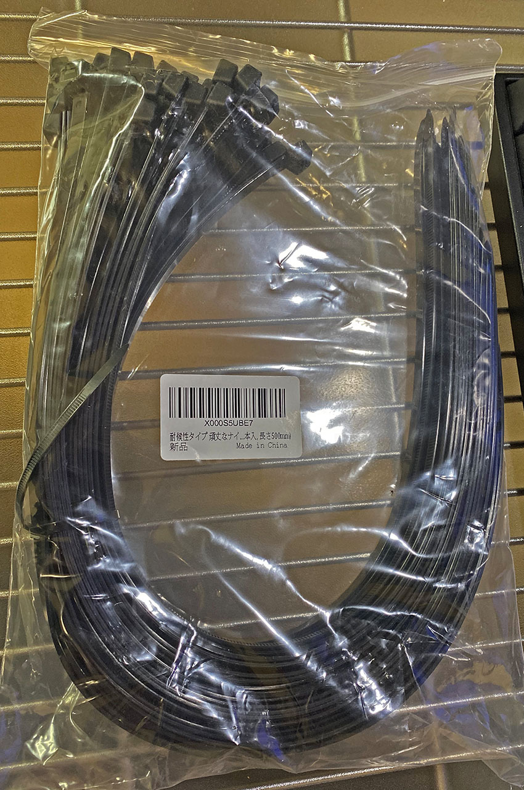
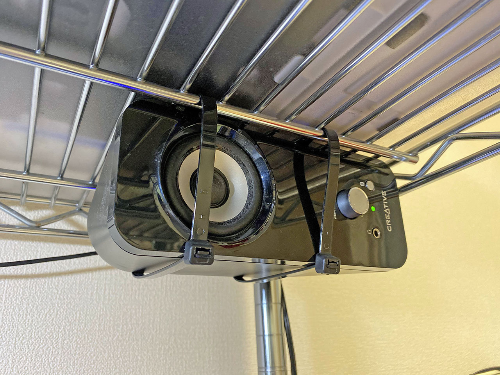
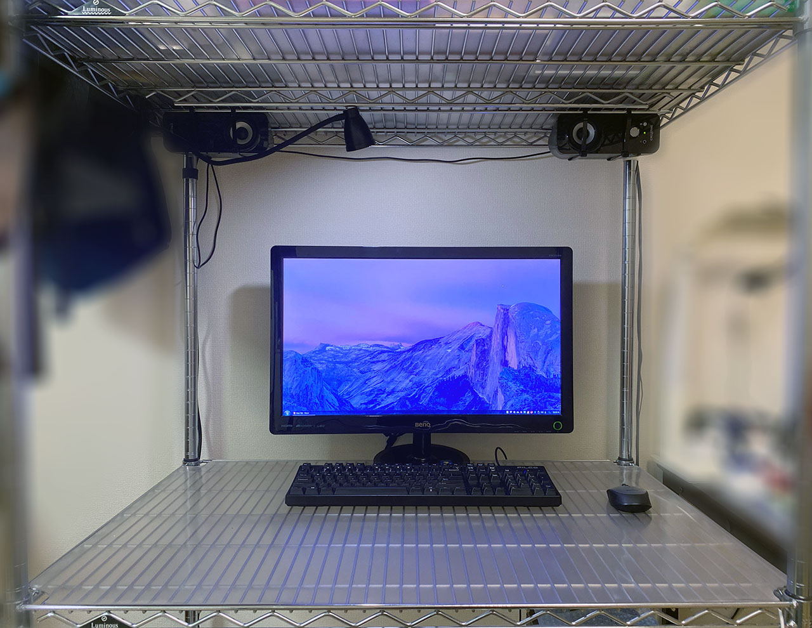

デスクトップ PC に接続している、_Creative T12_ というスピーカー。時々左スピーカーからノイズ音が小さく聞こえる症状が発生したり、なんだか左右の音量差があるように感じてきたりしているが、安物を騙し騙し使い続けている。

ここ数ヶ月ほど、自宅で降るリモート勤務になっており、デスクには会社貸与のノート PC を置くようになった。デスクトップ PC のモニタ、キーボード、マウス、そしてスピーカーが机の上にある中で、15インチのノート PC まで机に置こうとすると、結構スペースが狭くなってしまう。

そこで、スピーカーをメタルラックの上部に吊るすことにした。

どうやるかというと、_長さ 40cm_ という長めの__結束バンド__を利用し、縛り上げるだけ。

使用した結束バンドは以下。

スピーカー片方につき2本の結束バンドを使い、メタルラックの上部に通してやる。

縛り上げたらチョキン。

反対側も。

スピーカーが卓上からなくなったことでスペースができ、物を置いたり配置を変えたりしやすくなった。

こんな環境でブログ書いてます。
