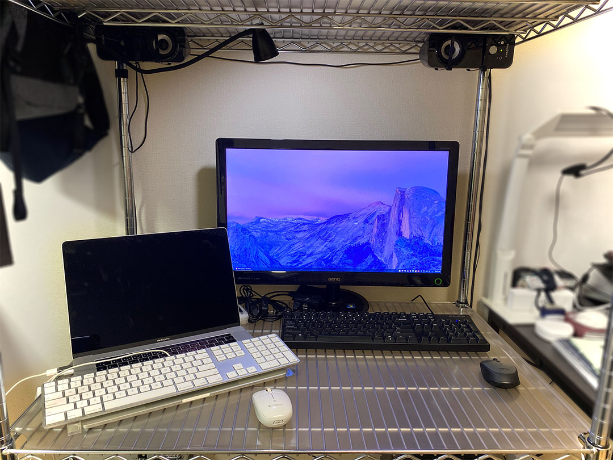

2018年4月に、「私のブログ環境」という記事を書いた。

- [いつの間にか月間10万 PV 突破していた #わたしのブログ環境 を語る - El Mylar](https://neos21.hateblo.jp/entry/2018/04/29/225511)

あれから2年あまりが経過。当時の住居から引っ越し、2020年3月頃からは在宅勤務も始めて、若干デスクトップが変わっているので、その様子をご紹介する。

## 目次

## 私のデスク

私のデスクは、以前から同じメタルラック。

右隣は妻のデスクなのでボカシ。

### 1段目 … 床

下の方から見ていくと、収納スペースがなく行き場を失ったエフェクターケースが左下に2つある。ギターは押し入れにしまっている。

右下は母艦の __Galleria XG__。最近電源ユニットが壊れたので修理をし、内蔵 HDD と SSD を増設した。さらに Buffalo の外付け HDD を付けていて、全容量は次のとおり。

- SSD : 500GB (内蔵・既存のシステムドライブ)
- SSD : 500GB (内蔵・増設)
- HDD : 2TB (内蔵・既存)
- HDD : 3TB (内蔵・増設)
- HDD : 4TB (内蔵・増設)
- HDD : 4TB (Buffalo 外付け)
- 合計 : 14TB

壁コンセントから電源タップを取り、PC 本体、モニタ、スピーカーなどのコンセントにしている。配線の整理はマジックテープと結束バンドでテキトーに。

### 2段目 … デスク

2段目がデスクになっている。機材は大きくは変わっていない。

- ディスプレイ : BenQ VW2424H … 24インチ
- スピーカー : Creative T12 Wireless … Bluetooth 接続もできるが音切れが回避できず有線接続中
- マウス : Logicool M336 … Bluetooth 接続
  - [デスクトップ PC の周辺機器を無線化して配線を整理した - El Mylar](https://neos21.hateblo.jp/entry/2019/02/06/205544)
- キーボード : Filco Majestouch 2 Convertible フルサイズ US 配列・赤軸 FKBC104MRL/EB2 … Bluetooth 接続もできるがチャタリングが酷いので有線接続中
  - [Filco Majestouch Convertible 2 テンキーあり版を買い直した - El Mylar](https://neos21.hateblo.jp/entry/2019/08/09/113000)

Bluetooth アダプタの精度が悪いのか、位置関係が悪いのか分からないが、スピーカーやキーボードを Bluetooth 接続すると調子が良くないので有線接続にしている。無線接続しているのはマウスのみ。

スピーカーを上部に吊るしたのでデスクトップが広くなった。

デスクライトを USB 給電のちっちゃいヤツに変えた。ほどよい。

### 3段目 … 主にラップトップ置き場

3段目には、タコ足電源タップ、ノート PC 類、プリンタを置いている。

- 電源タップ・充電器
  - Elecom Flecc Barra … 6個口の電源タップ。デスクライト、充電器類、プリンタの電源に使用
  - RAVPower RP-PC028 … USB-A 6ポート。最近充電しているのは Anker Zolo Liberty (ワイヤレスイヤホン) ぐらい
      - [USB 充電したい機器が増えてきたので RAVPower USB 充電器 (6ポート) を買ってみた - El Mylar](https://neos21.hateblo.jp/entry/2018/11/07/113000)
  - Anker PowerPort Atom PD 4 … USB-C 2ポートをノート PC 用に使用。リコール問題があった製品だが返品せず使い続けている
      - [Anker PowerPort Atom PD 4 を買った - El Mylar](https://neos21.hateblo.jp/entry/2019/06/03/214732)
- ノート PC
  - Asus ZenBook3 UX390UA-512GP
      - [Asus ZenBook3 UX390UA-512GP を買いました - Corredor](https://neos21.hatenablog.com/entry/2017/12/06/080000)
  - Apple MacBook 12インチ 2017年モデル
      - [12インチ MacBook 2017年モデルを買ってしまった…！ - El Mylar](https://neos21.hateblo.jp/entry/2018/09/05/113000)
  - Lenovo ThinkPad X250 … 2台目。Ubuntu と Windows 10 のデュアルブート
      - [ThinkPad X250 が壊れたので ThinkPad X250 を買った - El Mylar](https://neos21.hateblo.jp/entry/2020/04/04/113000)
  - Raspberry Pi 4 … 4GB RAM モデル
- プリンタ
  - Epson Colorio EP-710A
      - [エプソンのカラリオプリンタ「Epson Colorio EP-710A」を買った - El Mylar](https://neos21.hateblo.jp/entry/2019/03/04/224132)

ノート PC は ZenBook も MacBook も、元気よく使い続けている。Ubuntu 機として ThinkPad を買ったり、IoT 遊びのためにラズパイを買ったりして多少増えたモノはあるが、大きくは変わっていない。

### 4段目 … カメラ、小物置き場

4段目は高さを低めにしている。カメラ類を置いたり、小物入れに隠せるモノを隠したりしている。ガジェット系でいくとこんな感じ。

- Nikon D5600 … 色々レンズを買ったものの、結局ダブルレンズキットのレンズ2つに落ち着いている
  - [Nikon D5600 ダブルレンズキットを買った - El Mylar](https://neos21.hateblo.jp/entry/2017/01/02/212029)
- Olympus OM-D E-M10 Mark II … レンズは Panasonic Lumix G Vario 14-140mm F3.5-5.6 ASPH./POWER O.I.S. を使用
  - [Olympus OM-D E-M10 Mark II と Panasonic Lumix G Vario 14-140mm F3.5-5.6 ASPH./POWER O.I.S. を手に入れた - El Mylar](https://neos21.hateblo.jp/entry/2019/03/28/223012)
- GoPro Hero 7 Black
  - [GoPro7 Black を手に入れた - El Mylar](https://neos21.hateblo.jp/entry/2019/03/21/220505)
- Korg microKEY Air-49 … MIDI キーボード
  - [MIDI キーボード「Korg microKEY Air-49」を買った - El Mylar](https://neos21.hateblo.jp/entry/2020/02/21/113000)

比較的最近増えたのが MIDI キーボードかな。乾電池で駆動し、Bluetooth 無線でも接続できるので、Windows PC でも MacBook でも iPhone でも、対象を選ばず接続して遊べている。

無印良品の小物入れを3つ使っていて、普段やらないゲーム機をしまったり、雑多なモノを押し込んだりしている。

### 5段目 … 天井

一番上の段は主に空き箱を置いているだけ。特筆することも、したいこともない。

## リモートワーク時の様子

最近自分は在宅勤務になっているのだが、その場合のスタイルはこんな感じ。

会社貸与の MacBookPro をデスクの左側に配置し、AC 電源と LAN、キーボードを接続している。

- キーボードは中古で買った US 配列のモノ
  - [Apple Keyboard ML110LL/B を買った・というか買って半年経った - El Mylar](https://neos21.hateblo.jp/entry/2018/02/26/203600)
- 無線マウスはずっと使っている M558
  - [MacBookPro 用に Logicool M558 Bluetooth マウスを買った - Corredor](https://neos21.hatenablog.com/entry/2017/03/11/175215)

会社の MBP を触りながら、母艦の Galleria XG を触ったり、電力が気になる時は何らかのラップトップを横に置いて YouTube や Netflix をつけながら仕事をしている。

## その他 : スマホ … iPhone 11 Pro Max にアップデート

この記事は「わたしのブログ環境」のアップデートだったので、その他にブログ執筆に関わる機材としてスマホのアップデートを紹介しておこう。スマホは iPhone 7 Plus から _iPhone 11 Pro Max_ にアップデートしている。

- [iPhone 11 Pro Max を買った・使えた液晶ガラスフィルム・レンズ保護フィルム・ケースの話も - El Mylar](https://neos21.hateblo.jp/entry/2019/09/22/192122)

電池の持ちが良く、モバブーを持ち歩かなくなった。超広角レンズも楽しくてよく使っているが、欲をいえば手ブレ補正が欲しいかな。

現役引退となった iPhone 7 Plus の方は、お風呂用スマホとして使っていたり、「YouTube 動画を見ながらネットサーフィン」をしたりするため、11 Pro Max とテザリングしながら、7 Plus の方で YouTube を再生したりと、2台持ちで使うこともある。さすがにかさばるけど…ｗ

買った当初はホームボタンがなくなったことや、強化ガラスを貼ったことによる感触の変化を感じていたが、最近は完全に慣れた。

## 自分のスタイルが定まってきた

こうしてみると、自分はひととおり欲しい機材を揃えてしまい、スタイル的にも落ち着いてきたかなと感じる。ここ2・3年で大幅なアップデートはない感がある。

ThinkPad やラズパイは Linux や IoT の領域を学習するために買ったが、コレもメインのつもりではない。MIDI キーボードは大きな変化かもしれないが、今から専業で打ち込みをやったりするワケでもなく、あくまで遊びの種類が一つ増えただけ。

ブログ執筆、プログラミング環境としては自分のスタイルを確立できたといって良い。あと数年は、マシン側が壊れない限りはこれらの機材で戦っていけると感じている。

在宅勤務になり、MBP を置くとデスクが少し狭く感じるのがつらいところか。フルサイズの US キーボードを使いたがるので、もう少しだけデスクに横幅があると嬉しい。まぁもうコレ以上机が広くなることはないだろうけど～。

というワケで、大きな変化はなく、自分の中で安定の構成が実現できていて、不満なし。快適な日々である。
