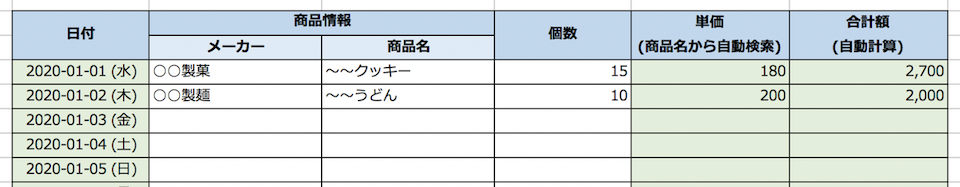

Excel やスプレッドシードが分かりにくい人の特徴として、

- _「使う色の数が多い」_
- __「色分けに意味がない」__

ことがよく見られる。

表の見出しだけでなく、データ行も何やら列ごとにカラフルな背景色が塗ったくってあって、区切り線のように挿入された結合セル行もまた別の色が付いている。

カラフルな色で何を表現しているのかというと何の意味もなくて、見た目だけでは

- どこが見出しでどこがデータなのか分かりにくい
- 数式が埋め込まれているセルと手入力する必要のあるセルの区別が付かない

といった問題が生じて、「分かりにくい」「使いにくい」という感想になるワケである。

---

自分が Excel でセル背景色を使うのは_「見出し行」_と__「数式を埋め込んだセル」__のみにしている。色を使う箇所を減らし、使う色数も少なくすると、スッキリして見えるのだ。また、色を使っている箇所にはそれぞれ意味があるので、その意味に応じた色を使うようにする。

## 見出し行のスタイリング

見出し行のスタイリングは、HTML における `th` 要素のつもりで考える。

見出し行のセル背景色は、Excel のカラーパレットでいうと_2番目に薄い色_をよく使う。大抵は薄い青一色。文字色は白色にせず黒色のまま、太字・中央揃えにするのみ。

列項目が長い時は、意味合いに応じてカラーパレットの隣の色を使って、虹色っぽい配色になるような順番で並べたりもする。一番薄い色・2番目に薄い色あたりでグラデーションを作り、大項目・小項目を表現するのが限度。

それ以上にカラーリングが必要だと思った時は、何のために色を分けたいのかをよく考え直す。大抵は別々の事柄を1つのシートで表現しようとしていて無理が出ているので、シート分割を検討するべき。

## 数式を埋め込んだセルのカラーリング

SUM 関数による計算だったり、セル参照による自動入力だったり、日付や行番号をテンプレート的に入力しておいたりするセルは、__ユーザが更新しない場所__だ。ユーザが更新する必要のない・ユーザが更新してはいけないセルには、特定の背景色を付けると良い。

自分の中での慣例ではあるが、自分は「薄い緑色」を使うことが多い。見出しに薄い青色を使うことが多いので、それとは違う色で、補色よりは同系色の方がうるさくないと思い、薄緑色が多い。

重要なのは、_「自動入力されるセル」には全て同じ1色のみを使うこと_である。色に関する特段の説明がなくとも、セルの中身を見ていればなんとなく「金額なんかの自動計算セルは色が付いてるんだなー」と察してもらいやすい。

## こんな表をよく作ります (スクショ)

というワケで、自分がセル背景色を使うのは、見出しと数式セルのみ。内容はデタラメだが、表の雰囲気としては以下のようなモノをよく作る。

- 見出しは水色
- 数式などで自動入力されるセル (= ユーザが入力しなくて良い・触らなくて良いセル) は緑色

で表現している。

やたらと色を使い、スタイリングに凝ってしまうと、行の追加・削除時に調整するための手間がかかってしまう。他人の資料を編集する場合なんかは特に、凝った作りにしていると同じ書式に揃えきれなかったりもする。

だから自分は、使う色数を少なくし、決まった箇所に決まった意味の色を使うことで、見た目もシンプルにし、編集の労力も小さく済むようにしている。

細かなやり方は真似しなくて結構だが、見た人が分かりやすいことを心がけ、何かを伝える際に「付け足す」のではなく「減らす」ことを考えて欲しい。
