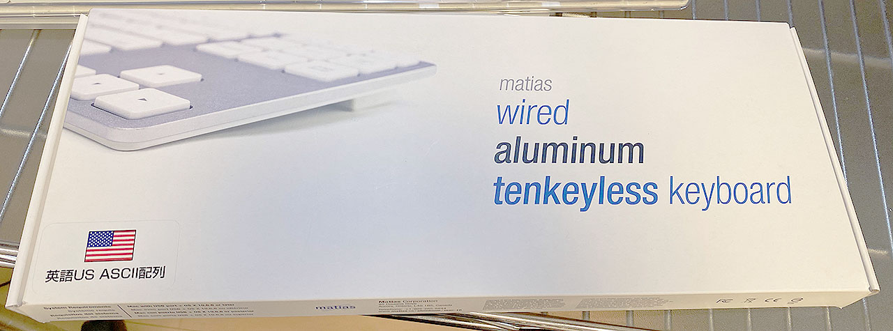
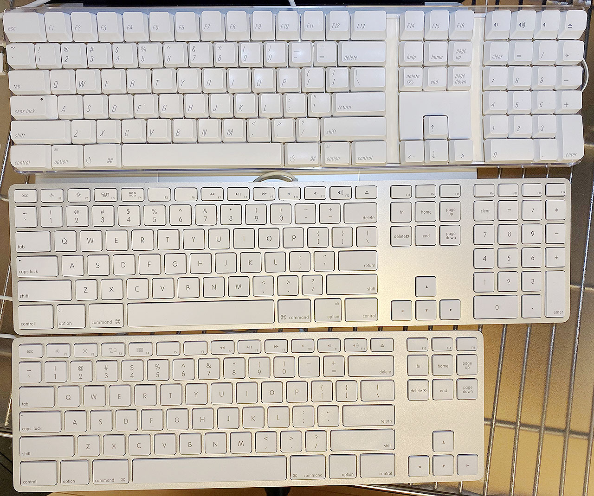
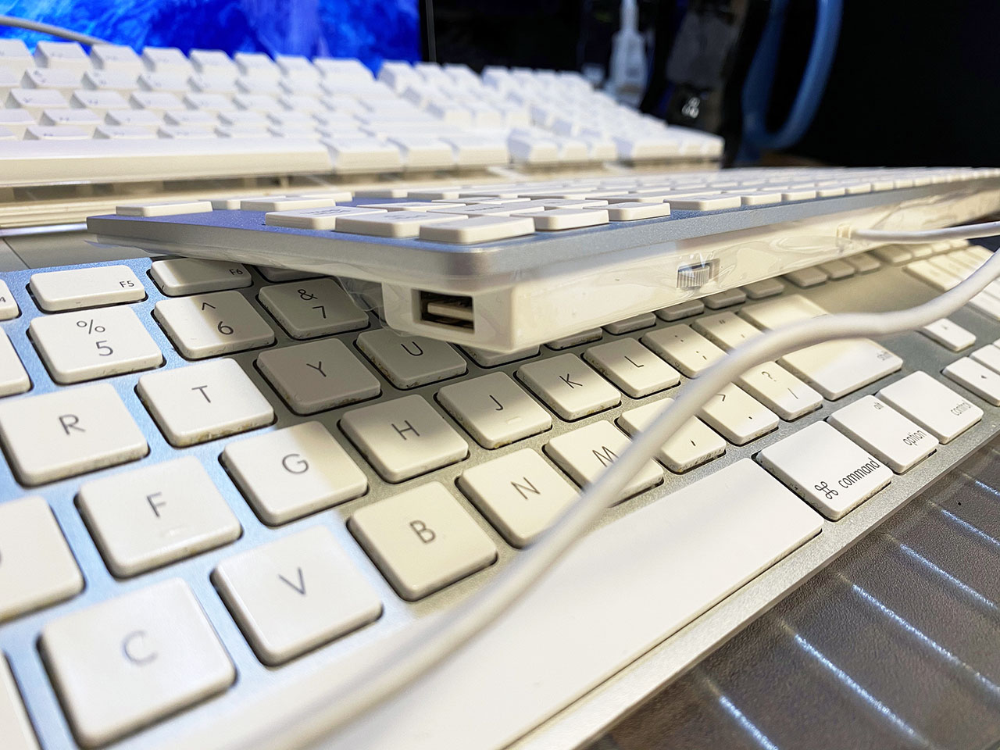

これまで使っていた Apple 製のキーボード ML110LL/B が壊れてしまい、新しいキーボードを買うことにした。昨日記事にしたとおり、Apple A1048 M9034 という有線のキーボードを買ったところではあるが、同時にもうひとつキーボードを買っていた。それが

__Matias Wired Aluminum Tenkeyless keyboard for Mac Silver FK308S__

である。値段は6,600円程度。

- 参考：[MacにマッチするテンキーレスキーボードがMatiasから、アルミ筐体採用 - AKIBA PC Hotline!](https://akiba-pc.watch.impress.co.jp/docs/news/news/1172634.html)

見た目は現在の Magic Keyboard にも繋がる、Apple 純正の薄型キーボードにそっくりだが、Apple 純正には存在しない_テンキーレス_である。

Apple 純正はフルサイズキーボードか、MacBook 系と同様の配列のミニサイズの2種類しか存在しない。Matias のこのキーボードは、フルサイズだとテンキーが鬱陶しいが、右下のメタキーが省略されたり矢印キーが独立していなかったりするのは嫌、という人にうってつけの商品だ。

見た目の質感はかなり本家に近いが、キートップの質感が全然違う。打鍵音、打ち心地も全く異なり、Matias の方が若干安っぽい。キートップの角がトガっていて、実は丸く処理してある本家 Apple との差が出ている。

Amazon のレビューを見ると、効かないキーがあった、とかいうレビューも散見されたが、自分の個体は大丈夫だった。本家との感触が違うだけで、打ちにくいワケではなく、快適に打鍵できる。

本家と同様に、キーボードの左右に USB-A ポートが2つ付いている他、本家にはないボリュームダイヤルが後ろ側に用意されている。個人的には使い道がなさそうだが、とりあえず。

Mac のキーボードはやはり、右下にも Cmd・Option・Control キーが揃っていて欲しいし、矢印キーや PageUp・PageDown などは独立して存在していて欲しい。

無線接続だと Bluetooth の調子が悪くてペアリングが切れたり、チャタリングが起きやすかったりするので、あえて USB 接続を選びたくなる人にとっても、理想のキーボードだ。
