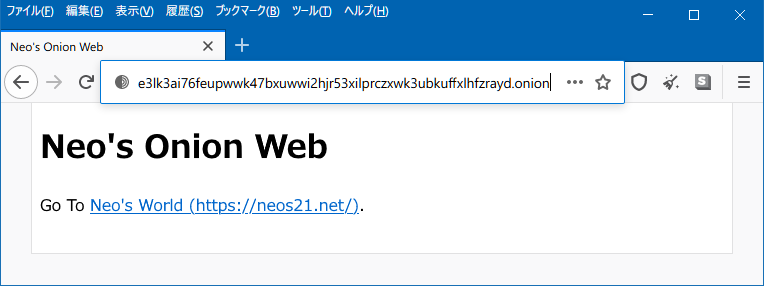

Tor ブラウザでのみ見られる、_`.onion` ドメイン_のウェブサイト。素人でも簡単に立ち上げられるらしいので、試してみた。

<div class="ad-rakuten">
  <div class="ad-rakuten-image">
    <a href="https://hb.afl.rakuten.co.jp/hgc/g00q0722.waxyc9ff.g00q0722.waxyd017/?pc=https%3A%2F%2Fitem.rakuten.co.jp%2Fbook%2F16047464%2F&amp;m=http%3A%2F%2Fm.rakuten.co.jp%2Fbook%2Fi%2F19763713%2F">
      
    </a>
  </div>
  <div class="ad-rakuten-info">
    <div class="ad-rakuten-title">
      <a href="https://hb.afl.rakuten.co.jp/hgc/g00q0722.waxyc9ff.g00q0722.waxyd017/?pc=https%3A%2F%2Fitem.rakuten.co.jp%2Fbook%2F16047464%2F&amp;m=http%3A%2F%2Fm.rakuten.co.jp%2Fbook%2Fi%2F19763713%2F">ダークウェブの教科書 匿名化ツールの実践 （ハッカーの技術書） [ Cheena ]</a>
    </div>
    <div class="ad-rakuten-shop">
      <a href="https://hb.afl.rakuten.co.jp/hgc/g00q0722.waxyc9ff.g00q0722.waxyd017/?pc=https%3A%2F%2Fwww.rakuten.co.jp%2Fbook%2F&amp;m=http%3A%2F%2Fm.rakuten.co.jp%2Fbook%2F">楽天ブックス</a>
    </div>
    <div class="ad-rakuten-price">価格 : 3080円</div>
  </div>
</div>

環境は、OCI (Oracle Cloud Infrastructure) で借りている Ubuntu 18.04 のインスタンスにて。全て `root` ユーザで実行する。

まずは `tor` コマンドをインストールする。

```bash
$ vi /etc/apt/sources.list
```

ファイルの末尾に以下2行を追加する。

- `/etc/apt/sources.list`

```
deb https://deb.torproject.org/torproject.org bionic main
deb-src https://deb.torproject.org/torproject.org bionic main
```

リポジトリを追加したらインストールする。

```bash
$ curl https://deb.torproject.org/torproject.org/A3C4F0F979CAA22CDBA8F512EE8CBC9E886DDD89.asc | gpg --import
$ gpg --export A3C4F0F979CAA22CDBA8F512EE8CBC9E886DDD89 | apt-key add -

$ apt update
$ apt install -y tor deb.torproject.org-keyring

$ tor --version
Tor version 0.4.5.7.
```

続いて、Tor の設定ファイルを変更し、Onion サイトとして公開するポートを選択する。

```bash
$ vi /etc/tor/torrc
```

70行目付近に `HiddenServiceDir`・`HiddenServicePort` という項目がコメントアウトされている場所があると思うので、それをアンコメントする。

- `/etc/tor/torrc`

```
# アンコメントしながら 8099 ポートを指定する
HiddenServiceDir /var/lib/tor/hidden_service/
HiddenServicePort 80 127.0.0.1:8099
```

今回は、ローカルの `8099` ポートで動かしているウェブサーバを Onion サイトとして公開することにする。

配信するサイト、ウェブサーバは Python なんかで作っても良い。自分は慣れている Node.js で、超簡単なウェブサーバを作ってみる。

```bash
$ node -v
v14.8.0

# 適当な作業ディレクトリを作る
$ mkdir ~/onion-site && cd $_

# 8099 ポートで、固定の HTML を返すサーバを立てる
$ cat << EOL > index.js
const http = require('http');

const server = http.createServer((request, response) => {
  response.writeHead(200, { 'Content-Type': 'text/html; charset=UTF-8' });
  response.end(`<!DOCTYPE html>
<html lang="ja">
  <head>
    <meta charset="UTF-8">
    <title>Neo's Onion Web</title>
  </head>
  <body>
    <h1>Neo's Onion Web</h1>
    <p>Go To <a href="https://neos21.net/">Neo's World (https://neos21.net/)</a>.</p>
  </body>
</html>
`);
});

server.listen(8099);
EOL

# ウェブサーバをバックグラウンドで起動する
$ nohup node ./index.js &

# 8099 ポートでウェブサーバが公開できているか念のため確認する
$ curl http://localhost:8099/
```

コレで良い感じ。

それではいよいよ、Tor を起動する。参考文献では `systemctl` や `service` で制御しているところもあったのだが、自分が試した限りだと `systemctl` での操作では上手くいかなかった。直接 `tor` コマンドを叩くことにする。

```bash
# Tor をバックグラウンドで起動する
$ nohup tor &
```

初回起動時に、`HiddenServiceDir` で指定したディレクトリ配下に、鍵ペアやホスト名を記したファイルなどが生成される。自分の Onion サイトがどんなドメインで公開されているか調べるには次のように叩く。

```bash
$ cat /var/lib/tor/hidden_service/hostname
e3lk3ai76feupwwk47bxuwwi2hjr53xilprczxwk3ubkuffxlhfzrayd.onion
```

ランダムな文字列で、末尾が `.onion` となっている。ちなみに Facebook の Onion 版なんかは、鍵ペアをブルートフォースで生成しまくって、`facebook` な綴りが登場するドメインをなんとか作り上げてることでも有名。

サーバサイドでの作業はココまで。

続いて、クライアントからこの Onion サイトを見てみる。Chocolatey を使って、Windows マシンに Tor ブラウザをインストールしてみた。

```powershell
# Tor Browser をインストールして検証する
PS> choco install tor-browser -y
```

Tor ブラウザは Firefox ベースで、使い心地は普通。先程確認したドメインにアクセスしてみよう。

- <http://e3lk3ai76feupwwk47bxuwwi2hjr53xilprczxwk3ubkuffxlhfzrayd.onion/>
  - 実際に上の作業で公開している自分の Onion サイト。何も内容はないし、いつか消すかも



ちゃんとアクセスできた。

なお、クラウドサービスのファイアウォール設定 (Security List とか Security Group とか) で、8099 ポートは開放しなくて良い。IP 直打ちではアクセスできないことを確認。ちゃんと Hidden Service を経由していて、Tor でのみ閲覧できるサイトになった。

<div class="ad-amazon">
  <div class="ad-amazon-image">
    <a href="https://www.amazon.co.jp/dp/4781702414?tag=neos21-22&amp;linkCode=osi&amp;th=1&amp;psc=1">
      
    </a>
  </div>
  <div class="ad-amazon-info">
    <div class="ad-amazon-title">
      <a href="https://www.amazon.co.jp/dp/4781702414?tag=neos21-22&amp;linkCode=osi&amp;th=1&amp;psc=1">ダークウェブの教科書 匿名化ツールの実践 (ハッカーの技術書)</a>
    </div>
  </div>
</div>

- 参考：[Host Your Own Tor Hidden Service with an Onion Address Tutorial - YouTube](https://www.youtube.com/watch?v=GVMjk9pj2Cw)
- 参考：[【ダークウェブ構築】EC2のUbuntuでtor Hidden Service (.onion) サイトを構築する | SEの道標](https://milestone-of-se.nesuke.com/product/oss/construct-tor-site-with-ubuntu/amp/)
- 参考：[onionドメインのサーバを建ててみた - Qiita](https://qiita.com/charichuma_hack/items/ba3fc74f73f1929ef50b)
- 参考：[onionアドレスの生成 - 断片](http://epcnt19.hatenablog.com/entry/2017/04/16/200745)
- 参考：[Tor Project: Debian/Ubuntu Instructions](https://2019.www.torproject.org/docs/debian.html.en)
