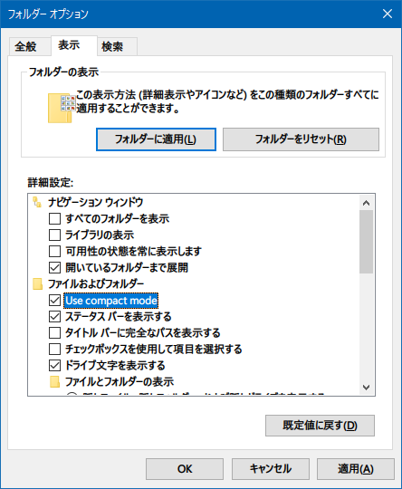

Windows10 を Windows Update したら、突然エクスプローラの表示が変わってしまった。ファイル項目と項目の行間が広く開いてしまった。

自分は普段「詳細」表示しかしていないので、「一覧」表示か何かに切り替わってしまったのか？と思ったけど、どうやらそうでもないみたい。

調べてみたら、**「コンパクトモード」**なる新機能がリリースされていたようだ。

- [プレビュー版「コンパクトモード」から見るエクスプローラーの進化 - 阿久津良和のWindows Weekly Report | マイナビニュース](https://news.mynavi.jp/article/20210321-windows10report/)

というか、今までの行間が詰まった表示が「コンパクトモード」となって、通常モードが行間の開いた状態になったようだ。どうもタブレットモードでの扱いを良くするためとからしい。

でも、自分としては今までどおりの表示が良いので、戻すことにする。

エクスプローラのメニューから「_フォルダーオプション_」を開いて、「表示」タブ → 「ファイルおよびフォルダー」内にある、**「Use compact mode」**にチェックを入れてやれば、今までどおりの表示に戻せる。

こういう変更点に対する案内って、なんかカジュアルに表示してくれないもんかねぇ…。要らないポップアップは出るのに、こういう UI の大きな変更には何の通知もない…。

  

    
  

  

    

      <a href="https://www.amazon.co.jp/dp/4866732253?tag=neos21-22&amp;linkCode=osi&amp;th=1&amp;psc=1">Windows10完全使いこなし大全 (三才ムック)</a>
    

  

  

    
  

  

    

      <a href="https://hb.afl.rakuten.co.jp/hgc/g00q0722.waxyc9ff.g00q0722.waxyd017/?pc=https%3A%2F%2Fitem.rakuten.co.jp%2Fbook%2F16495339%2F&amp;m=http%3A%2F%2Fm.rakuten.co.jp%2Fbook%2Fi%2F20163252%2F">Windows10完全使いこなし大全</a>
    

    

      <a href="https://hb.afl.rakuten.co.jp/hgc/g00q0722.waxyc9ff.g00q0722.waxyd017/?pc=https%3A%2F%2Fwww.rakuten.co.jp%2Fbook%2F&amp;m=http%3A%2F%2Fm.rakuten.co.jp%2Fbook%2F">楽天ブックス</a>
    

    
価格 : 1760円

  

