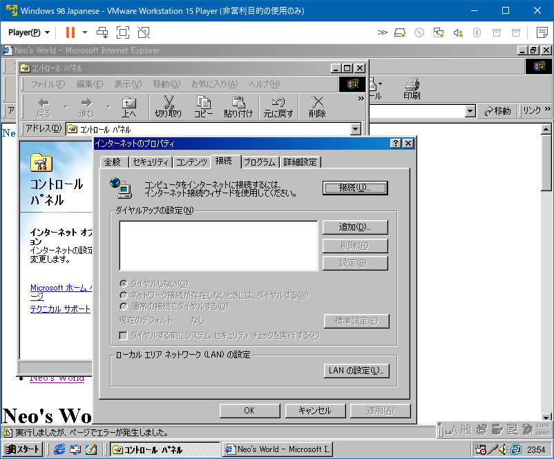
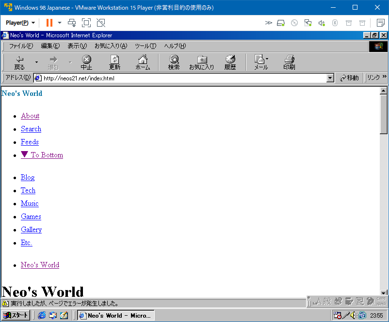
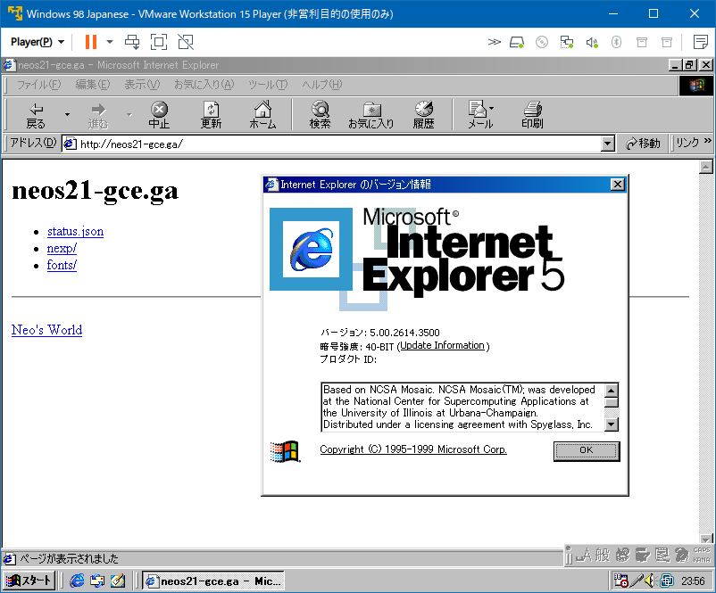
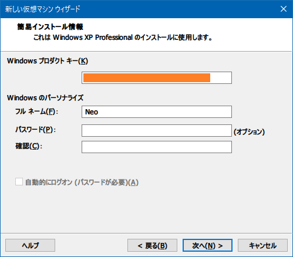
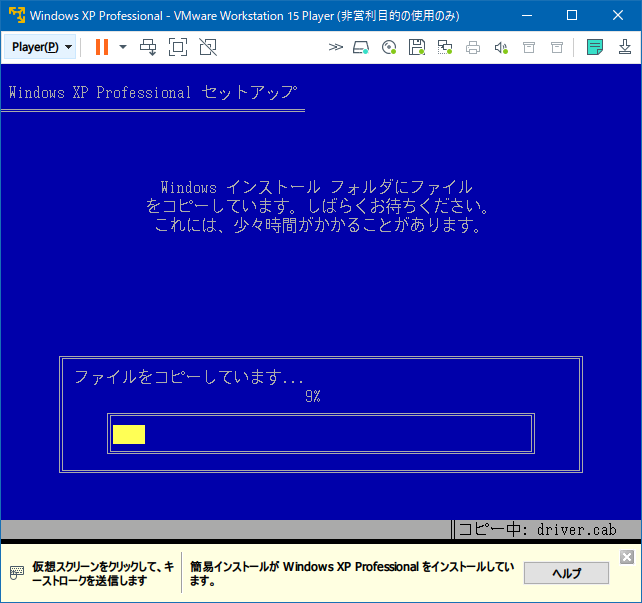
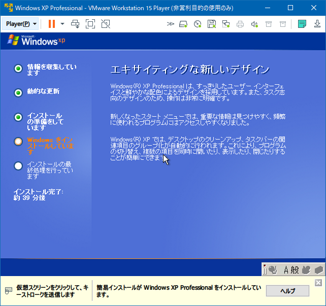
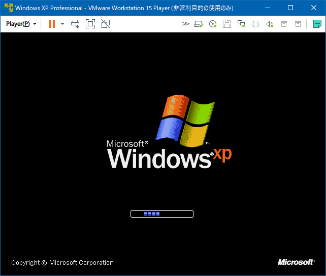
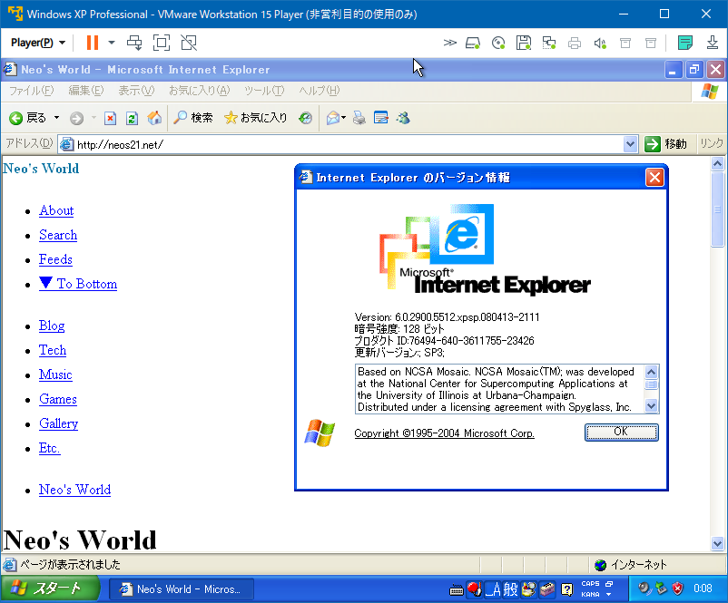
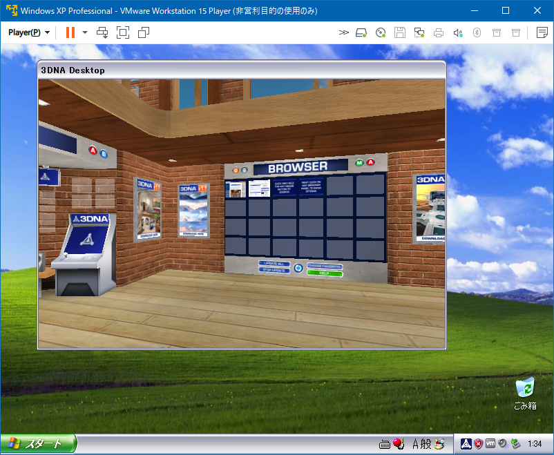

個人的には2003～2005年頃によく遊んでいた、__3DNA__ というフリーソフトがある。3D CG のバーチャル・デスクトップを歩き回れるというアプリだった。当時解説ページを作っていて、2019年に Archive.org よりサルベージしている。

- [3DNA で遊んでみよう](/etc/3dna.html)

このゲーム、当時 Windows XP 環境で遊んでいたのだが、その時点で開発が終了したようで、OS が Windows 7 にアップデートすると「互換モード」でないと上手く動かなくなっていた。そして Windows 10 では「互換モード」でも動かず、遊べなくなっていた。

最近、_VMware Workstation 15 Player_ という仮想化ソフトを使って Windows 98 を動かした。VirtualBox みたいなアプリだ。

- [古い Windows アプリを動かすために VMware で Windows 98 環境を構築する](/blog/2020/10/21-01.html)

今回は同じ VMware で Windows XP の仮想環境を作って、3DNA を動かせないか試してみようと思う。

## 目次

## …その前に Windows 98 でもうちょっとだけ遊ぶ

以前の記事で Windows 98 環境を作ったが、あの時は CD-ROM からゲームソフトをインストールして動かすだけだった。せっかく IE5 という化石ブラウザが積まれているので、コレで自分のサイトを開いてみる。

コントロールパネルからインターネットオプションに進み、「接続」タブにある「接続」ボタンを押してウィザードを開き、LAN 接続を選んでいけばセットアップできた。

この当時はダイヤルアップ接続がほぼ前提で、いきなり IE を開こうとすると「MSN Internet Access」という、プロバイダを選べみたいな画面が出てきてしまい、うまく LAN 接続を選べなかった。

- 参考：[launch internet explorer without msn - Web Browsing/Email and Other Internet Applications](https://www.bleepingcomputer.com/forums/t/306912/launch-internet-explorer-without-msn/)

自分のサイトを開いてみると、こんな感じ。CSS はほとんど効いていない。JS は Google AdSense のコードぐらいしか入ってないと思うけど、エラーが出ている。

あと、`https://` で接続しようとするとエラーになるのは、ルート認証局の情報が古いからかしら。`http://` でならアクセスできた。

## Windows XP 環境を作る

それじゃ、Windows XP 環境を作るとしよう。

- 参考：[Windows XP Professional SP3 (Japanese) : Microsoft : Free Download, Borrow, and Streaming : Internet Archive](https://archive.org/details/WinXPProSP3Japanese)
  - `VGXCP-PVWXV-9W68W-CHG22-JRM28`

「新規仮想マシンの作成」から「新規仮想マシンウィザード」を開き、「インストーラディスクイメージファイル」を選択して ISO ファイルを選ぶ。

プロダクトキーを入力したら、ユーザ名だけ入れる。パスワード欄を空欄にしておくと、パスワードが要らなくなる。

ウィザードを進めていくと、OS のインストールが始まる。まっさらな PC に、OS のインストール CD-ROM を挿入したあの頃を思い出す。

当時は激遅の CPU・RAM・HDD だったから、OS のインストールって1・2時間はかかるものだったけど、数分で終わる。

懐かしい…。

起動したので、IE6 で遊んでみる。やっぱり CSS 死んでるｗ。でも JS のエラーは出なくなっているな。

## 3DNA をインストールする

3DNA は公式サイトが併催しているが、v1.0 と v1.1 が、以下のサイトからダウンロードできる。

- [WinWorld: 3DNA 1.0](https://winworldpc.com/product/3dna/10)
  - ISO 形式
- [WinWorld: 3DNA 1.1](https://winworldpc.com/product/3dna/11)
  - 素の Exe ファイル `d3DNA_Loft_110.exe` が入っていてこちらの方が扱いやすい

ホストマシンでこのファイルを DL したので、VMware 側には「共有フォルダ」設定で移したい。

- 参考：[Windows 7上にWindows XP環境を構築「共有フォルダ編」：おじさんブログ：SSブログ](https://kazunori-ohmori.blog.ss-blog.jp/2013-11-19)
  - > フォルダ共有設定が現れるので「常に有効」をチェックし、「Windowsゲストのネットワークドライブとしてマップする」にチェックを入れること。
- 参考：[VMware Playerで共有フォルダ　Windows同士で - へりくつ気味](https://jiroz.blog.fc2.com/blog-entry-739.html)
  - > うちの場合はFドライブ丸ごとと  
    > ここの設定はゲストOSインストール後でもいいと思う　というか自分はそうした  
    > あと共有フォルダを使うために　OSインストール後にVMware Toolsも入れておくこと
    > 
    > スタートなどから　マイ ネットワーク　→　ネットワーク プレースの追加　→  
    > 適当に進めて　vmware-host先の共有フォルダを追加

「管理」→「仮想マシン設定」→「オプション」タブで「共有フォルダ」の設定ができるのだが、VMware Tools とかいうオプションのツールを、ゲスト OS 側に入れる必要があるらしい。

「管理」→「VMware Tools のインストール」という項目はあるのだが、ココがなぜかグレーアウトされていて選択できない。仮想マシンを停止させたりしても変わらず。

- 参考：[VMWare Toolsがグレーアウトして インストールできないときの原因と対処方法 | 仮想マシンソフト](https://aresei-note.com/2137)
  - > __原因はフロッピーの設定の問題です。__

「仮想マシン設定」→「ハードウェア」タブの「フロッピー」を選択し、

- 起動時に接続：チェックを外す
- 物理ドライブを使用する：自動検出

に変更する。

こうすれば「VMware Tools のインストール」が選べるようになる。

ゲスト OS (Windows XP) の中では、`\\vmware-host\Shared Folders\` というパスで、ネットワークドライブとしてホスト側のファイルにアクセスできるようになる。

こうしてファイルを持ち込んだので、3DNA v1.1 の Exe をインストールしてみた。インストールは出来たのだが、起動しようとすると、真っ黒な画面のまま、起動に物凄く時間がかかる。15分とか放置していると、3DNA の画面が一コマだけ描画されて、そのままフリーズ状態だった。

↑ この状態で VMware ごとフリーズしている。全然遊べなかった。

- [White Tiger - VMWare Workstationで3D アクセラレーションを有効にする方法](http://www7b.biglobe.ne.jp/~whitetiger/win/vm001.html)

GPU などの性能を仮想環境に与えられていないのかなぁと思い、CPU コア数も、メモリも、3D アクセラレーションなどグラフィック関連のスペックも、潤沢に XP 環境に与えてみたけど、結局動作は変わらず。

VMware が分かっていなくて、設定が足りていない・効いていないところもあるのかもしれないが、まだどうにも解消できていない。誰かヘルプぷり～ず。

  

    
  

  

    

      <a href="https://www.amazon.co.jp/dp/429501107X?tag=neos21-22&amp;linkCode=osi&amp;th=1&amp;psc=1">VMware vSphere7 インテグレーションガイド (impress top gearシリーズ)</a>
    

  

  

    
  

  

    

      <a href="https://hb.afl.rakuten.co.jp/hgc/g00q0722.waxyc9ff.g00q0722.waxyd017/?pc=https%3A%2F%2Fitem.rakuten.co.jp%2Fbook%2F16613411%2F&amp;m=http%3A%2F%2Fm.rakuten.co.jp%2Fbook%2Fi%2F20261115%2F">VMware vSphere7インテグレーションガイド （TopGear） [ 今井 悟志 ]</a>
    

    

      <a href="https://hb.afl.rakuten.co.jp/hgc/g00q0722.waxyc9ff.g00q0722.waxyd017/?pc=https%3A%2F%2Fwww.rakuten.co.jp%2Fbook%2F&amp;m=http%3A%2F%2Fm.rakuten.co.jp%2Fbook%2F">楽天ブックス</a>
    

    
価格 : 4180円

  

