生活が崩壊してましてね。楽しいことが何もなかったので、何か楽しくならないかなーと思って新たな Windows マシンを買いましたよ…。

## 目次

## 自分の Windows 遍歴

自分は Windows 3.1、95 辺りからパソコンに触れ始めたので、一番身体に馴染むネイティブな OS は Windows だ。プログラマになってからは Mac や Linux に触れて、逆に Windows が使いづらいと感じる部分もあったりするが、最近は WSL も馴染んできて、やっぱり Windows を触りたいなと思うことが多い。

自分が現在持っている Windows マシンは以下のとおり。

- 2017-07-29 ～ : [ドスパラ Galleria XG](/blog/2017/08/08-03.html) … 母艦のデスクトップマシン
- 2017-11-25 ～ : [Asus ZenBook3 UX390UA-512GP](/blog/2017/12/06-01.html) … 12インチノート
- 2020-03-15 ～ : [Lenovo ThinkPad X250](/blog/2020/04/04-01.html) … Linux とのデュアルブート

母艦のガレリアくんに沢山 HDD を載せていて、データは全てココで管理しているので、ガレリアくんの環境が自分の全てのベースにある。もう4年目のマシンになるワケだが、GPU も良いヤツ積んでるし性能的に不便したことはない。

持ち運ぶマシンとしては、[12インチ MacBook (2018-08-26 ～)](/blog/2018/09/05-01.html) や [Lenovo IdeaPad Duet Chromebook (2020-12-08 ～)](/blog/2020/12/28-01.html) も持っているが、Windows マシンでいうと ZenBook くん。まれに液晶の描画がバグったりして、いつ壊れるか不安ではあるが、使い心地やスペック的には申し分ないので、このまま使い切りたい。

ThinkPad X250 は Linux 専用マシンとして中古を購入したのだが、たまたま M.2 SSD が増設されていて、そちらに Windows 環境が入っていたので放置している。物理的にドライブが別れた、Linux と Windows のデュアルブートマシンとなっているのでカッコイイが、ほぼ使っていない。使っていないモノでいうと、[Raspberry Pi 4B RAM 4GB (2020-05-16 ～)](/blog/2020/06/16-01.html) も持っていたりするな。コレで PC 系は全部か。

## キー配列がキレイな UMPC が欲しい

最後にちょっとだけ触れたラズパイなんかがそうだが、自分はずっと UMPC に憧れていた。12インチ MacBook や、そのクローンといえるスペックの ZenBook を選んだのも、12インチ、1kg 未満というコンパクトさを望んで選んだものだった。

以前持っていた Asus Chromebook Flip や、現所有の IdeaPad Duet は10インチ。自分は US 配列キーボードを好むが、日本語配列よりもキー数が少ない US 配列でも、筐体が10インチを切ると、さすがに変則的なキー配列のモノが多くなってくる。

変則的なキー配列はどうしても嫌なので、コレまで様々な UMPC が発表されても、キー配列を見ては「はい、ナシ。」と購入せずに来ていた。

また、UMPC はスペック的にもイマイチなモノが多く、買ったところで何に使えるんだ、と思うような低スペックマシンばかりであった。自分が購入するマシンはほぼ全て Core i7・RAM 16GB を基準にしてきたので、Atom だとか Celeron だとか、RAM 4GB だとか言われても、Windows マシンとしては無理があるだろうと思って選ばなかった。

「買ったところで何をするんだ」というそもそも論もあって。キー配列にこだわるということはキー入力も多用するつもりでいるので、ゴロ寝 PC というつもりでもない。それなら Chromebook をタブレットスタイルで使えばやれることだし。でも、ちょこっとだけ Windows 環境を触りたい時に、ガレリアを立ち上げるのも億劫だし、12インチの ZenBook でも少々大仰だったりすることもあって。というか所有機が多すぎて全てを常には充電していないので、電池がなくなってることもあったりする。

UMPC が欲しい動機自体が希薄なのだが、求めるスペックには妙なこだわりが強く、コレまで自分が望むような UMPC がなかったので、特に買うこともなく現在まで至った。

## GPD Win 2 の2019年モデル

何となく UMPC 関連の動画を YouTube で漁っていたら、_GPD Win 2_ というマシンを見つけた。

  

    
  

  

    

      <a href="https://hb.afl.rakuten.co.jp/hgc/g00rx942.waxyc3b8.g00rx942.waxyd03e/?pc=https%3A%2F%2Fitem.rakuten.co.jp%2Fecodirect%2Fa6970787920003%2F&amp;m=http%3A%2F%2Fm.rakuten.co.jp%2Fecodirect%2Fi%2F10059784%2F">GPD WIN2 GPD (分類：ノートパソコン)</a>
    

    

      <a href="https://hb.afl.rakuten.co.jp/hgc/g00rx942.waxyc3b8.g00rx942.waxyd03e/?pc=https%3A%2F%2Fwww.rakuten.co.jp%2Fecodirect%2F&amp;m=http%3A%2F%2Fm.rakuten.co.jp%2Fecodirect%2F">ECOダイレクト</a>
    

    
価格 : 77500円

  

元は2018年に発売された Core m3-7Y30 搭載機だったが、2019年モデル以降は Core m3-8100Y になったようだ。2021年にはマザーボードがちょっと変わって、底面がメタルカバーになって排熱性能が向上したらしい。

- [GPD WIN2 | 株式会社リンクスインターナショナル](https://www.links.co.jp/item/gpd-win2/)
  - 2018年モデルをベースとした説明
- [Core m3-8100Y/256GB SSD搭載になった「GPD WIN 2」が発売 ～基板刷新で放熱性、オーディオ音質が向上 - PC Watch](https://pc.watch.impress.co.jp/docs/news/1196561.html)
  - 2019年モデルの比較
- [GPD WIN2 – GPDダイレクト](https://gpd-direct.jp/pages/gpd-win2)
  - 2021年モデルの情報あり

ほんで今回、2019年モデルの中古を見つけたので、試しに買ってみた次第。

## 外観

外箱。

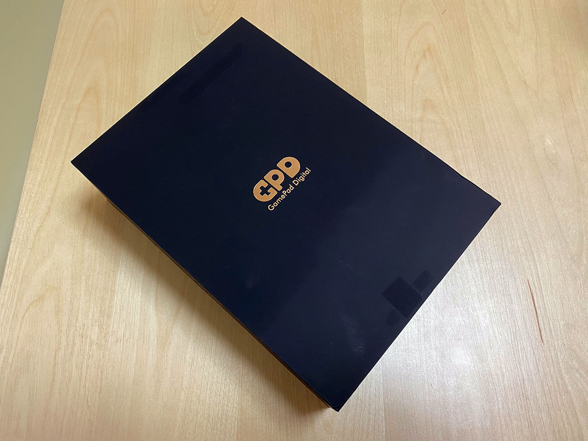

付属品は USB-C ケーブルと AC 電源。FC53 というモデルで、GPD 純正らしい。一応 USB-PD 対応で、5V / 3A、9V / 2.67A、12V / 2A 対応みたい。

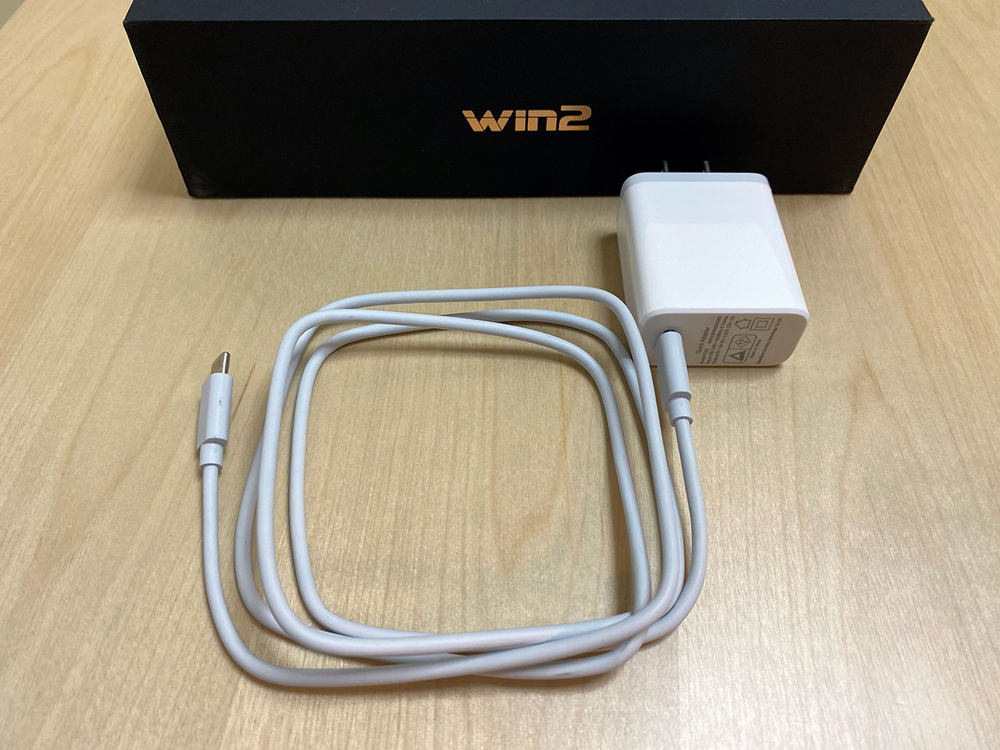

見た目。

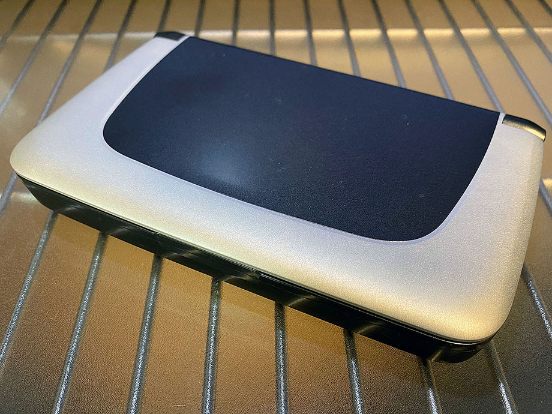

開いたところ。

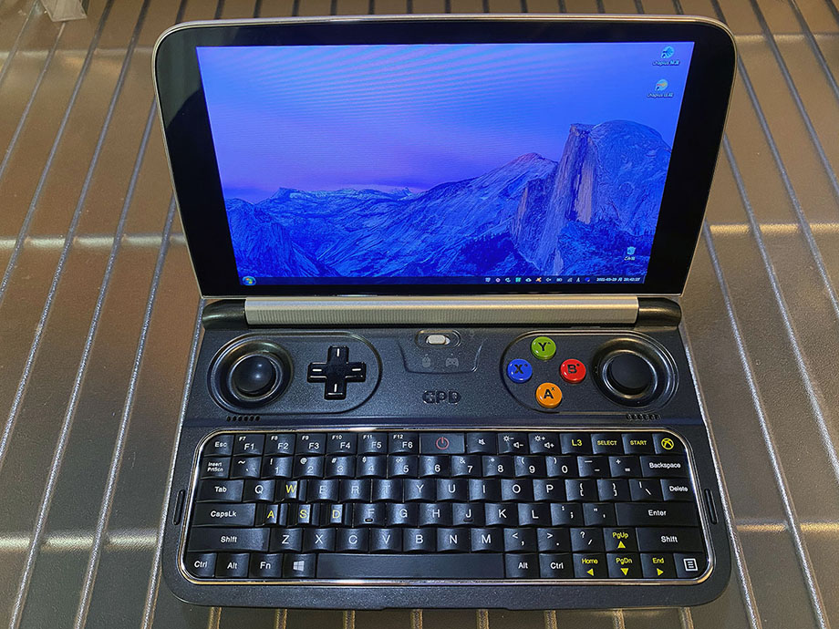

閉じた時の幅・奥行きを、手元にあった iPhone7 Plus (幅158.2mm・幅77.9mm) と何となく比較。GPD Win2 は幅162mm × 奥行99mm なので、長辺はかなり近い。

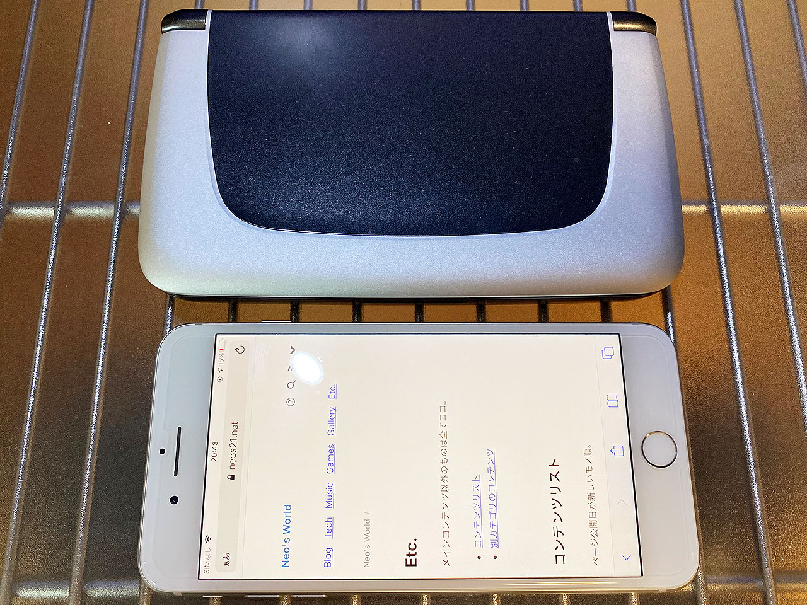

厚さを比較。iPhone7 Plus は 7.1mm、GPD Win2 は 25mm なので、さすがに GPD Win2 の方が厚い。背面のボタンやインターフェースもお分かりいただけるだろうか。

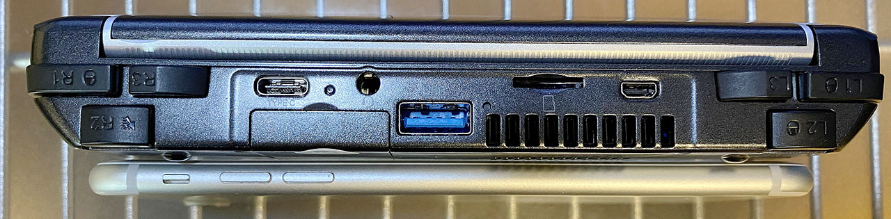

背面。ソフマップの中古品を買ったのでソフマップのシールあり。ファンの通気口と、SSD へアクセスできるところがある。2021年モデルは背面がメタルカバーになっていて銀色で、通気口も広いのだが、コレは2019年モデルなので黒い。

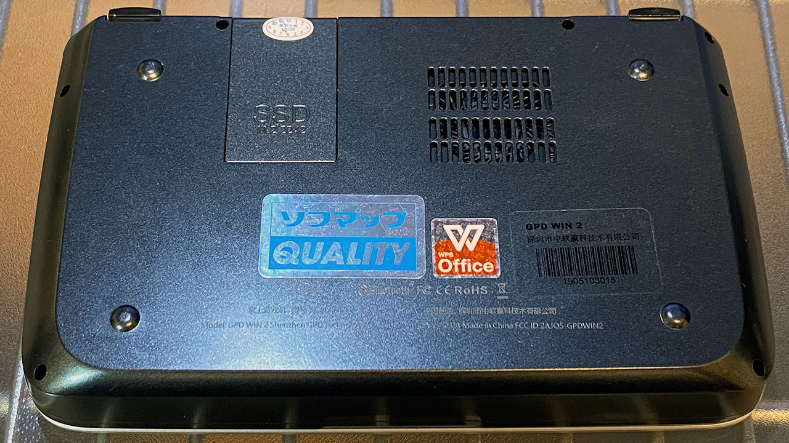

## スペック

購入した GPD Win 2 のスペックは以下のとおり。

- CPU：Core m3-8100Y Amber Lake 1.1GHz ～ 3.4GHz
- GPU：Intel UHD Graphics 615
- RAM：8GB
- SSD：256GB M.2 2242
- 液晶：6インチ・タッチパネル・1280x720px
- 重量：460g
- サイズ：幅162mm × 奥行99mm × 高さ25mm
- キー配列：US 配列
- インターフェイス：USB-A 3.0・USB-C 3.0・microSD・Micro HDMI・LAN・3.5mm イヤホンジャック

CPU と内蔵 GPU が、Core m3-8100Y・Intel UHD Graphics 615 にバージョンアップされているモデル。SSD も 256GB で十分。M.2 だから速い。メモリは LPDDR3-1866 らしいが、8GB 積まれていて、十分常用に足るスペックであろう。

6インチというコンパクトサイズ。CPU ファンがあるためか、本体の厚みはあるが、縦横の大きさは iPhone 11 Pro Max など、少し大きめのスマホ程度のフットプリントといった感じ。前述の写真のとおりだ。システム手帳でも握るかのように、片手で持ち歩けるぐらいのサイズだ。

重量は 460g。大変軽いはずなのだが、このサイズにしては重く感じる。ちょっとずっしりくるので、システム手帳みたいな軽やかさがちょっとないかもしれない…。ｗ

これだけ小さいのに、液晶はタッチパネルで、720p (HD) の解像度がある。Full HD (1920x1080) まで行っちゃうと文字が小さくなりすぎてしまうので、コレぐらいでちょうど良い感じ。ディスプレイは、キーボードと水平に寝るぐらいまでは倒せる。2-in-1 PC のように裏返すことはできないので、タブレット的な扱い方はできない。

以下は GPD Win2 で撮影したスクリーンショット。720p なのが分かるだろうか。

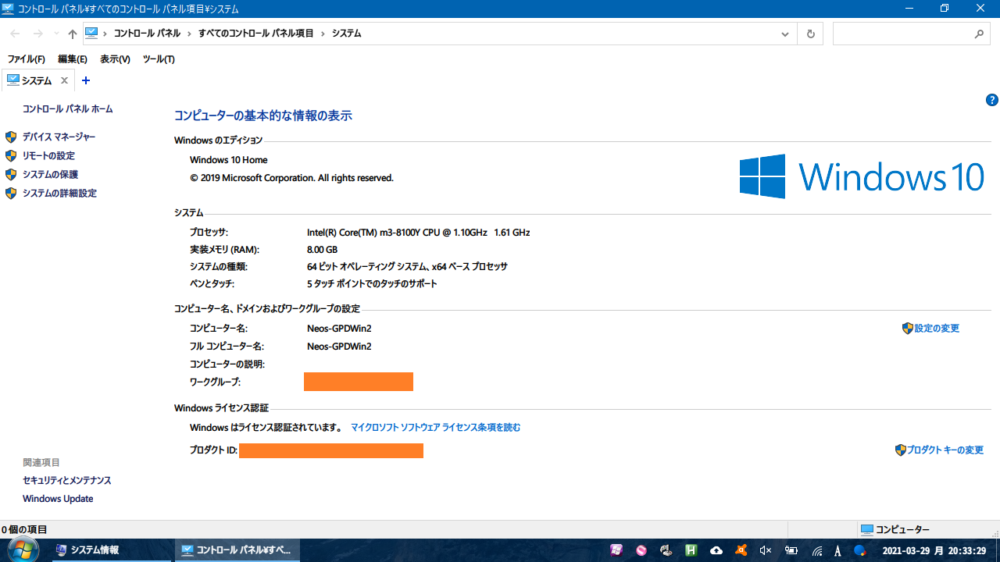

内蔵 GPU の情報。

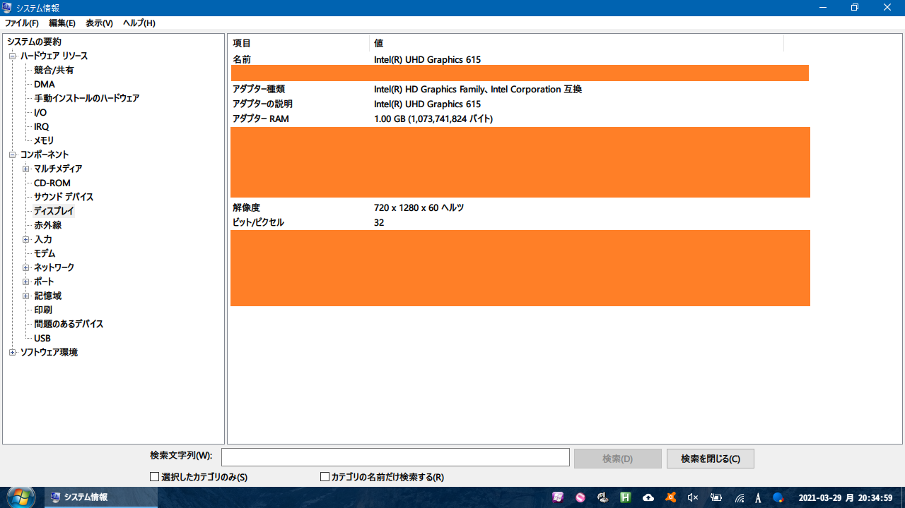

## ゲームボタンとキーボード

GPD Win 2 は Windows PC であるものの、携帯ゲーム機的なコンセプトのマシンなので、スティックや LR ボタンなんかが付いていたりする。搭載されているものは以下のとおり。

- 本体中央に「XInput ゲームパッドモード」と「マウスモード」を切り替えるスイッチがある。「マウスモード」にすると、スティックや LR キーがマウスとして使用できる
- 3D ジョイスティック：左右に2つ
  - 「マウスモード」では右のジョイスティックがマウス操作になる。左のジョイスティックは WASD キーを入力する
- D-Pad 十字キー：左側に1つ
  - 「マウスモード」では、上下がマウススクロール、左が PageDown、右が「←」キーの入力になる。ブラウザ操作がしやすくなる感じ
- ABXY ボタン
  - 「マウスモード」では上下左右の矢印キー入力になる
- L1・R1・L2・R2・L3・R3 ボタン：本体背面に位置する
  - 「マウスモード」では L1 が左クリック・R1 が右クリックになる
  - L2 はマウスのホイールクリックに相当
  - R2 は押している間、マウス操作が俊敏になる
  - L3 は End キー
  - R3 は「↓」キー
- キーボード：US 配列ベース
  - 基本のキーは US 配列どおりで、右端のキーも普通の位置にあって良い
  - F7～F12 キーが Fn キーとのコンボになっている
  - 音量・画面光量・L3・Select・Start・Xbox キーなどがある
  - 左右に Ctrl・Alt キーが1つずつある。左右 Alt を使った _Alt-IME-AHK なんかが使いやすい_
  - 「マウスモード」時のボタン類にアサインされたキーなども含めると、通常のキーボードと比べて存在しないのは、ScrollLock・Pause・NumLock・テンキー程度なので不自由しないだろう

「マウスモード」と「ゲームパッドモード」の切り替えができるのが面白い。Windows マシンとして普通に使う際は「マウスモード」にしておいて、右スティックでマウス操作、L1 キーでクリック、といった感じで、両手で握った形で使える。

個人的には左スティックでマウス操作ができたら良かったなーと思ったのだが、こちらは WASD キーがアサインされていて、ホントにゲーム向けなのだなーと思うなど。十字キーや ABXY キーなどにも色々とキーアサインされていて、覚えなくても使えるけど、覚えて使いこなせるとかなり Windows の操作が快適に行えて意外だった。

キーボードも変則的なところは少なくて良い。サイズ的に、10本の指でタッチタイピングすることは出来ないが、両手で本体を握って両手親指でポチポチ押していく際も、自然に操作できて良い。

## その他

Wi-Fi・Bluetooth も当然使える。ラズパイだと頻繁に Wi-Fi や Bluetooth が切れてしまい、無線での利用が難しかったのだが、GPD Win 2 だと Wi-Fi 経由で共有ドライブにアクセスして、数 GB の動画ファイルを比較的サクサク見たりできた。

USB-A と USB-C ポートが1つずつあって、この筐体サイズながら意外と色々繋げられる。充電は USB-C ポートから行える。このポートに USB-C ハブを繋いでみたら、充電しながらもう一つ USB-A 機器を繋ぐことができた。

スピーカーはそこそこ音量が出る。イヤホンジャックもあって、このサイズでもいたれりつくせり。

Micro HDMI 端子もあるので、あとは適当な USB ハブなんかを用意してやれば、外部のマウス・キーボード・液晶・スピーカーを接続して使うことだってできそうだ。

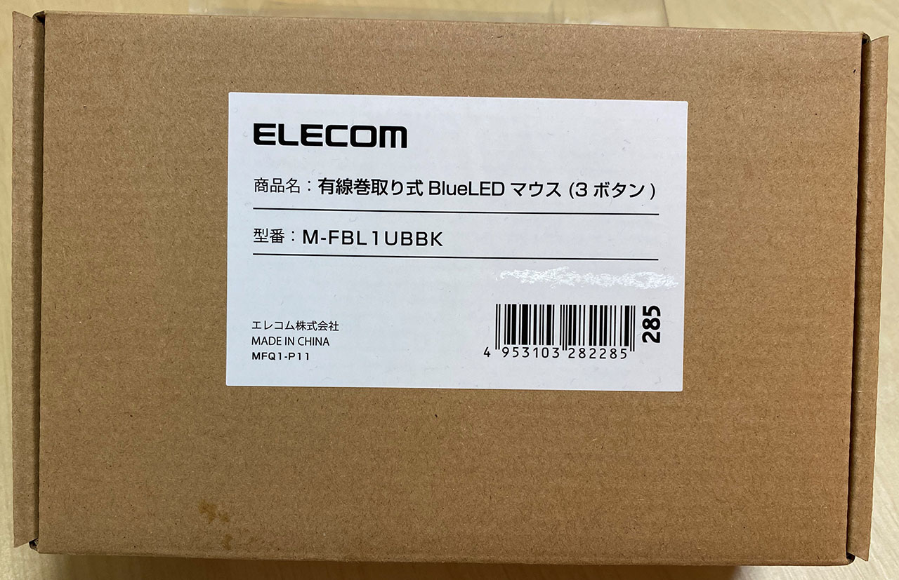

↑ Raspberry Pi 4 用に買ったミニマウス、Elecom M-FBL1UBBK。USB 接続でケーブルが巻取り式。コンパクトで使いやすい。

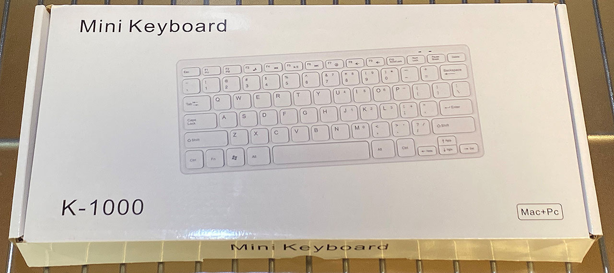

↑ コレも Raspberry Pi 4 用に買ったミニキーボード。メーカ不明の K-1000 というモノ。標準的な US 配列で問題なし。

Asus ZenBook3 に付属していた USB-C ドック (本体の左にある白いヤツ) を使って、充電ケーブル (USB-C) とキーボードの USB-A を接続。さらに、本体の USB-A ポートに直接ミニマウスを接続した。デスクトップマシンっぽく使える。ｗ

Micro HDMI 端子もあるので、Raspberry Pi 4 で使っているケーブルを流用して、外部モニタに接続しても良いかも。そしたらホントにミニ・デスクトップ PC みたいな使い方できるなぁ。

## CPU ファンは常に回っている・SSD が熱い

CPU ファンは、基本ずっと回っている。ZenBook3 もそうなのだが、この手の小さい筐体に載っている CPU ファンだと、キィーーンという高音が鳴るので、一度気にし始めるとずっと気になってしまうかもしれない。「電源オプション」の設定次第で多少緩和できるようではある。

M.2 SSD スロットは本体底面にあって、両手で握った時の右手が当たる位置にある。これが割とすぐ高音になるので、あんまり持って色んな操作をやる気にならない。

本体重量 460g というのは、意外とずっしりくる。携帯ゲーム機として扱うつもりでいると、ちょっと重たいかもしれない。Nintendo Switch はジョイコンが付いた状態で 398g、Wii U GamePad は 500g 程度だったらしいので、Switch より重く、WiiU GamePad ぐらいのつもりでいた方が良いかもしれない。

## Windows PC としての動作は快適

コレだけゲーム機としての利用を意識した GPD Win2 だが、自分はゲームをするつもりがなく、ブラウジングしながらちょこっと開発したり出来たらいいかなーなんて思いでいた。

OS をアップデートし、WSL2 を入れ、Node.js を入れてみたりしたが、その間の Git 操作や VSCode の操作なんかはかなり快適だった。Wi-Fi の通信速度も安定して速いし、CPU やメモリ不足もあまり感じなかった。

以下のように、所有機の CPU と比較すると、まぁまぁ数値は負けているところが多いのだが、ターボブースト時のクロック数が高いのと、Intel _UHD_ グラフィックスのおかげか、体感としてはあまり差を感じないぐらいだった。

- [Intel Core i7-5600U vs. Intel Core m3-8100Y - ベンチマークと技術データ](https://www.cpu-monkey.com/ja/compare_cpu-intel_core_i7_5600u-463-vs-intel_core_m3_8100y-1216)
  - ThinkPad X250 に搭載の i7-5600U との比較
- [Intel Core i7-7600U vs. Intel Core m3-8100Y - ベンチマークと技術データ](https://www.cpu-monkey.com/ja/compare_cpu-intel_core_i7_7600u-680-vs-intel_core_m3_8100y-1216)
  - ZenBook3 に搭載の i7-7600U との比較
- [Intel Core i7-7Y75 vs. Intel Core m3-8100Y - ベンチマークと技術データ](https://www.cpu-monkey.com/ja/compare_cpu-intel_core_i7_7y75-655-vs-intel_core_m3_8100y-1216)
  - 12インチ MacBook に搭載の i7-7Y75 との比較

数値的には、12インチ MacBook の2017年特盛モデルの CPU と良い勝負だろうか。でも、体感はかなり良い感じ。

Chocolatey でソフトをインストールしている時など、高負荷がかかる作業が長く続くと、CPU ファンがガンガン回り続けても排熱処理が追いつかず、若干処理スピードが落ちる感じがあった。しかしそれでも画面全体がカクカクになったり、他のウィンドウが開けないようなことはなく、動作は快適だ。

## 想像以上に快適な Windows マシン

GPD Win 2 は、排熱性能を向上させた2021年モデルが販売完了している。既に後継機の GPD Win 3 が登場しているが、重量は 551g にアップしているし、筐体のデザイン的な好みは、個人的にはこの GPD Win 2 だ。

できれば排熱処理が向上している2021年モデルの方が欲しかったぐらい、SSD の熱は気になるところがある。買ってみて気付いた点だった。

しかし、スティックでマウスを操作する面白さ、意外と打ちやすいキーボード、しっかり音が出るスピーカー、豊富なインターフェース、そして十分な処理性能が、460g に詰まっているというところが、ロマンのある商品だ。

最近はリモートワークが多くなったが、出勤する機会も時々あったりするし、遊びに行く際も一応持って行っておくと、スマホでは事足りず、ちょっとだけ Windows を触りたい、というニーズにピッタリ来ると思う。

  

    
  

  

    

      <a href="https://www.amazon.co.jp/dp/B07DSBGYK9?tag=neos21-22&amp;linkCode=osi&amp;th=1&amp;psc=1">GPD Win2</a>
    

  

