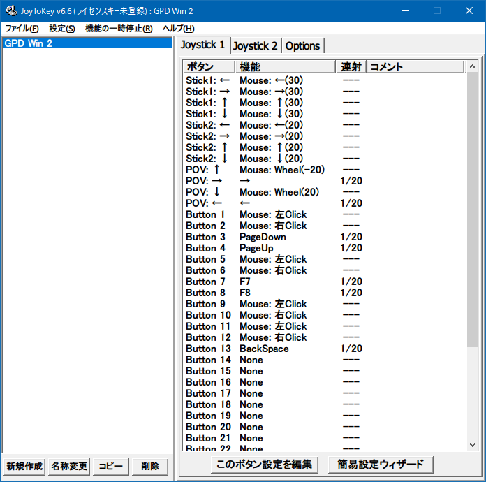

先日購入した GPD Win 2。スティック2つに十字キー、ABXY ボタンや LR ボタンなどなど、ゲーム機としての利用を想定したインターフェースが特徴的な UMPC だ。

  

    
  

  

    

      <a href="https://hb.afl.rakuten.co.jp/hgc/g00txt32.waxycffa.g00txt32.waxyd98b/?pc=https%3A%2F%2Fitem.rakuten.co.jp%2Ftrinitybalance%2F4940207276796%2F&amp;m=http%3A%2F%2Fm.rakuten.co.jp%2Ftrinitybalance%2Fi%2F10014568%2F">GPD Win2</a>
    

    

      <a href="https://hb.afl.rakuten.co.jp/hgc/g00txt32.waxycffa.g00txt32.waxyd98b/?pc=https%3A%2F%2Fwww.rakuten.co.jp%2Ftrinitybalance%2F&amp;m=http%3A%2F%2Fm.rakuten.co.jp%2Ftrinitybalance%2F">トリニティバランスショップ</a>
    

    
価格 : 74543円

  

「マウスモード」と「ゲームパッドモード」を切り替えるスイッチがあり、「マウスモード」にすると内部的にはマウスを接続した扱いになり、「ゲームパッドモード」にするとマウスが外れてジョイパッドが接続されたかのような挙動になっている。モード切替時は1・2秒ほど操作不能になるので、実際にデバイスの付け外しに近いことが行われているようだ。

そんなゲーミング UMPC だが、自分はゲームをする予定がなく、Windows としての使い勝手を向上させたい次第。自分が気になったのは、「マウスモード」時のキーアサインが変更できない点だ。

そこで、__JoyToKey__ というフリーソフトを利用して、「ゲームパッドモード」でマウス操作を設定することにする。

- [JoyToKey 公式ホームページ](https://joytokey.net/ja/)

## JoyToKey 設定時はマウスを繋いでおくと楽

JoyToKey で設定を行う間は「ゲームパッドモード」を使うので、マウス操作ができないことになる。一応、GPD Win 2 はタッチパネル液晶なのでタッチ操作しても良いのだが、画面が小さく操作性がシビアなので、設定の最中は適当なマウスを Bluetooth なり USB なりで繋いでおくと良いだろう。

## JoyToKey 設定

JoyToKey をインストールし、設定画面を見てみる。ゲームパッドモードに切り替えたら、JoyToKey の画面でジョイパッドとして認識させてやる。

キーアサイン変更のタブで実際にキー入力をしてみると、「Button 1」などの項目名の色が黄色く変わって、押下中のキーがどれなのかが確認できる。自分は以下のスクショのように設定した。

設定内容は次のとおり。

- 左右のスティックどちらでもマウス移動をできるようにした。左スティックの方がマウスの俊敏性が若干高めである
- L1〜L3・R1〜R3 は全て「左クリック」「右クリック」に変更した
- A・B ボタンを「左クリック」「右クリック」にした
- X・Y ボタンを「↑」「↓」キー入力にした
- 十字キーの左右は「←」「→」キー入力にした
- 十字キーの上下はマウススクロールのまま

要するに、

- 左手だけで持った時は左スティックと L ボタンで
- 右手だけで持った時は右スティックと A ボタンで

マウスの移動と左クリックが出来るように設定したワケだ。

一般的な操作なら、左右どちらの手でも片手操作ができるようになったので、とても扱いやすくなった。

## UWP アプリだと変な挙動になる

UWP アプリはゲームパッドによる操作に対応していて、コレが逆に迷惑なことになる。つまり、JoyToKey が処理する前の素のゲームパッドによる入力も解釈してしまい、その上で JoyToKey によるマウス操作等の再現が入力されて、二重に操作しているみたいなおかしな状態になるのだ。

一応、UWP アプリにも対応する方法はあるのだが、面倒そうなので辞めた。大人しくマウスモードにして使う。

- [GPD WIN 2に非公式ゲームパッドドライバを入れてWindowsの操作を少し良くする - eps_r](https://eps-r.hatenablog.com/entry/2019/03/23/gpdwin2-x360c)

以上。快適快適～。

  

    
  

  

    

      <a href="https://www.amazon.co.jp/dp/B07VB8Q6ZY?tag=neos21-22&amp;linkCode=osi&amp;th=1&amp;psc=1">GPD WIN2 最新バージョン＋おまけ6点セット(インテル第８世代Core m3-8100Y搭載/8GB/256GB SSD） 国内保証１年間</a>
    

  

  

    
  

  

    

      <a href="https://www.amazon.co.jp/dp/B07BVBS29R?tag=neos21-22&amp;linkCode=osi&amp;th=1&amp;psc=1">[セット品] GPD WIN2, 専用スリムハードポーチ,Three One®強化ガラス液晶保護フィルム,日本語オンラインマニュアル セット</a>
    

  

