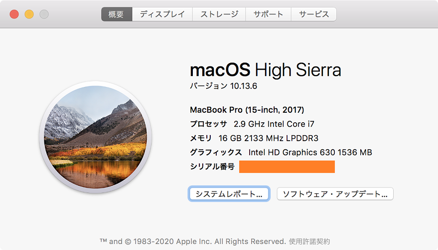

MacBook 外観比較シリーズ第5弾。過去の記事は以下。

- 2019-01-21 : [15インチ MacBookPro 2017 と 15インチ MacBookPro 2013 と 12インチ MacBook 2017 の外観を比較してみた](/blog/2019/01/21-01.html)
- 2018-06-10 : [MacBookPro 13インチ Early 2015 の US 配列モデルと JIS 配列モデルを比べてみた](/blog/2018/06/10-01.html)
- 2018-06-09 : [2015年モデルの MacBookPro の13インチと15インチを比較してみた](/blog/2018/06/09-02.html)
- 2017-11-26 : [MacBookAir 13インチ Early 2015 と MacBookPro 13インチ Early 2015 の外観を比べてみた](/blog/2017/11/26-02.html)

今回は MacBookPro 同士の比較。*2017年の15インチモデル*と、**2019年に初登場した16インチモデル**の外観を比較する。2017年モデルの外観は2016～2019年まで同じなので、大きく「15.4インチ vs 16インチ」と考えてもらって良いだろう。

ちなみに公式の技術仕様は以下。

- [MacBook Pro (16-inch, 2019) - 技術仕様](https://support.apple.com/kb/SP809?locale=ja_JP)
  - 16インチ最初のモデル。シザー構造の Magic Keyboard に変更。**今回の比較対象**
- [MacBook Pro (15-inch, 2019) - 技術仕様](https://support.apple.com/kb/SP794?viewlocale=ja_JP&amp;locale=ja_JP)
  - 第4世代のバタフライキーボード。15インチ最後のモデル
- [MacBook Pro (15-inch, 2018) - 技術仕様](https://support.apple.com/kb/SP776?viewlocale=ja_JP&amp;locale=ja_JP)
  - 第3世代のバタフライキーボード
- [MacBook Pro (15-inch, 2017) - 技術仕様](https://support.apple.com/kb/SP756?viewlocale=ja_JP&amp;locale=ja_JP)
  - 第2世代のバタフライキーボードを若干改良。*今回の比較対象*
- [MacBook Pro (15-inch, 2016) - 技術仕様](https://support.apple.com/kb/SP749?viewlocale=ja_JP&amp;locale=ja_JP)
  - USB-C ポート、Touch Bar に変わった最初のモデル。第2世代のバタフライキーボード
- [MacBook Pro (Retina, 15-inch, Mid 2015) - 技術仕様](https://support.apple.com/kb/SP719?viewlocale=ja_JP&amp;locale=ja_JP)
  - MagSafe2、USB-A ポートなどを持っていた最後のモデル
- [MacBook Pro (Retina, 15-inch, Mid 2014) - 技術仕様](https://support.apple.com/kb/SP704?viewlocale=ja_JP&amp;locale=ja_JP)
- [MacBook Pro (Retina, 15-inch, Late 2013) - 技術仕様](https://support.apple.com/kb/SP690?viewlocale=ja_JP&amp;locale=ja_JP)
- [MacBook Pro (Retina, 15-inch, Early 2013) - 技術仕様](https://support.apple.com/kb/SP669?viewlocale=ja_JP&amp;locale=ja_JP)
- [MacBook Pro (15-inch, Mid 2012) - 技術仕様](https://support.apple.com/kb/SP694?viewlocale=ja_JP&amp;locale=ja_JP)

それでは早速比較。

---

左が2019年・16インチ (3072x1920px・226dpi) のスペースグレイ。右が2017年・15.4インチ (2880x1800px・220dpi)。並べてみると一回り大きい感じはするね。

上から。左が15インチ・右が16インチ。

2台を重ねて左下を揃えてみた。右上の方に、16インチがはみ出て見えるだろう。15インチは幅34.93cm、奥行24.07cm で、16インチは幅35.79cm、奥行24.59cm。その差は、幅0.86cm、奥行0.52cm。サイズ差は 1cm 未満だった。

重ねて前面を確認。ディスプレイを開くための切り欠きの部分はわずかに大きくなってる。

本体右側のポート類。USB-C ポート2つとイヤホンジャックで同じ。

本体左側のポート類。USB-C ポート2つ。

後ろ。

厚さは15インチが 1.55cm、16インチが 1.62cm。0.07cm の差は意外と感じる。

背面。

向かい合わせて比較。トラックパッドも若干大きくなってるかな？

↑2017年・15インチの JIS キーボード。当然 TouchBar で、Esc もタッチ式。左右の矢印キーは大きいヤツ。

↑2019年・16インチの JIS キーボード。このモデルから TouchBar の作りが変わり、キーボード構造自体もバタフライからシザー構造に変わった。

Esc が物理キーになり、電源・兼・Touch ID が TouchBar と分離している。左右の矢印キーは2015年モデルまでの狭いタイプに戻った。

↑15インチの第2世代バタフライキーボード。2015年の12インチ MacBook より移行した、極薄のバタフライキーボードだが、ホコリが入って壊れやすいとクレームが相次ぎ、毎年マイナーチェンジを繰り返していた。2017年時点では、確かシリコンのカバーみたいなのが内部に装着されるようになったんだっけか？薄くてペチペチ言うんだけど、毎年のモデルを比較していると、少し静音化されて打ち心地が変わったかな、という感じ。

↑16インチのシザー構造キーボード。バタフライキーボードより厚みが出たのは勿論、個人的にはキーの端がより尖ったような印象を受ける。キートップが角ばっているというか。バタフライに慣れていたので、シザーに慣れるまでちょっと時間がかかった。Esc キーが物理キーになったのは嬉しい。

2台を並べて置いてみると、16インチ (写真奥) の方は少し液晶側が高くなるように傾いているようだった。MacBookAir みたいな感じというと分かりやすいだろうか。15インチ (写真手前) の方はほぼ水平になっている。

ベゼルが狭くなり、液晶サイズの割に本体サイズが抑えられている。

---

外観比較はココまで。以下はシステム設定のスクショ。

- 2017年・15インチモデル
  - 
  - 
  - 
- 2019年・16インチモデル
  - 
  - 
  - 

…見てもらったとおり。

  

    
  

  

    

      <a href="https://www.amazon.co.jp/dp/B081GH8ZXM?tag=neos21-22&amp;linkCode=osi&amp;th=1&amp;psc=1">最新 Apple MacBook Pro (16インチ, 16GB RAM, 512GBストレージ, 2.6GHz Intel Core i7プロセッサ) - スペースグレイ</a>
    

  

  

    
  

  

    

      <a href="https://www.amazon.co.jp/dp/B081G97LZG?tag=neos21-22&amp;linkCode=osi&amp;th=1&amp;psc=1">最新 Apple MacBook Pro (16インチ, 16GB RAM, 1TBストレージ, 2.3GHz Intel Core i9プロセッサ) - シルバー</a>
    

  

  

    
  

  

    

      <a href="https://hb.afl.rakuten.co.jp/hgc/g00rd002.waxyc382.g00rd002.waxyd188/?pc=https%3A%2F%2Fitem.rakuten.co.jp%2Fe-cutestyle%2Fp000000704742%2F&amp;m=http%3A%2F%2Fm.rakuten.co.jp%2Fe-cutestyle%2Fi%2F19743219%2F">★アップル / APPLE MacBook Pro Retinaディスプレイ 2600/16 MVVL2J/A [シルバー] 【Mac ノート(MacBook)】【送料無料】</a>
    

    

      <a href="https://hb.afl.rakuten.co.jp/hgc/g00rd002.waxyc382.g00rd002.waxyd188/?pc=https%3A%2F%2Fwww.rakuten.co.jp%2Fe-cutestyle%2F&amp;m=http%3A%2F%2Fm.rakuten.co.jp%2Fe-cutestyle%2F">ディーライズ2号店</a>
    

    
価格 : 246520円

  

- 参考 : [MacBook Pro - Wikipedia](https://ja.wikipedia.org/wiki/MacBook_Pro)
- 参考 : [MacBook Proのバタフライキーボード問題まとめ | misclog（ミスクログ）](https://misc-log.com/macbookpro-butterfly-keybord/)
